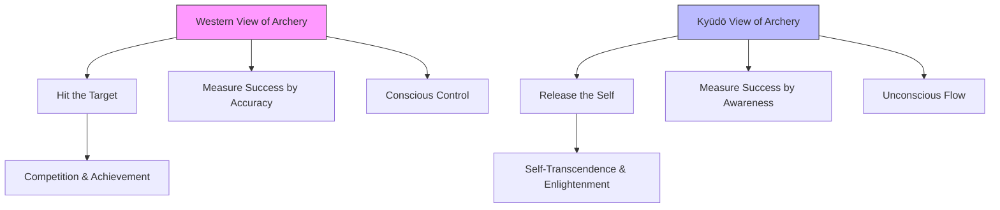
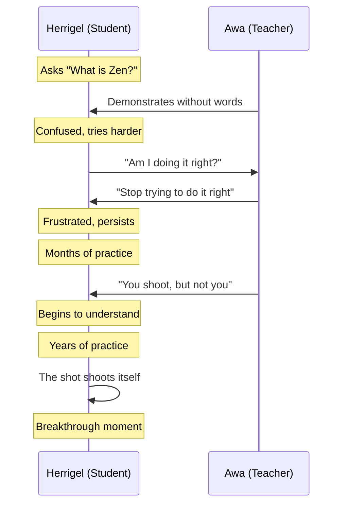
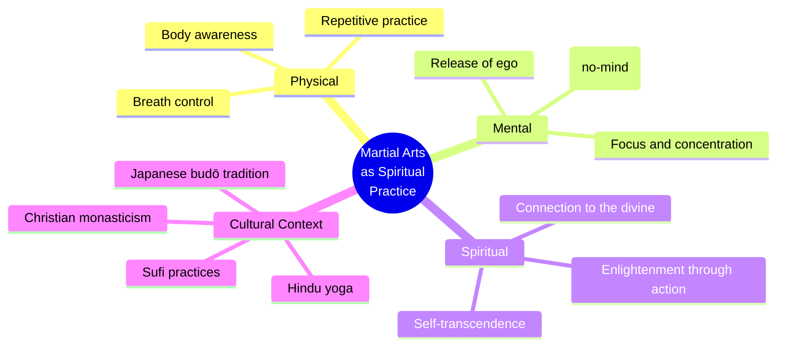

## The Path of Kyūdō: Archery as Spiritual Practice

Kyūdō, the Japanese art of archery, is not a sport in the Western sense. It has no competition format, no scoring system, no winners. The target exists not as a mark to be hit but as a mirror reflecting the archer's inner state. Herrigel's teacher, Awa Kenzō, made this distinction clear from the beginning: "The target is not the goal. The goal is to shoot without a self."

This inversion of purpose — where the activity becomes a vehicle for self-transcendence rather than achievement — is the foundation of Herrigel's account. It connects kyūdō to a broader tradition of Japanese martial arts (*budō*) in which the physical discipline serves as a path to spiritual awakening.

## Musubi: The Thread of Connection

One of the most profound concepts Herrigel encounters is *musubi* — a term his teacher uses to describe the invisible thread connecting archer, bow, arrow, and target. In Japanese culture, *musubi* has deep roots: it is the creative force of the universe in Shinto mythology, the power of tying and binding that generates life.

Awa Kenzō taught that when the archer achieves proper alignment — not just physical, but spiritual — *musubi* activates. The arrow does not fly from the bow; it is drawn to the target by a force that transcends the individual archer. This is not metaphor for Herrigel but lived experience:

> "I suddenly felt as if the bow and the arrow and I were all one. I had forgotten myself. I did not know whether the shot was mine or whether the bow was shooting of its own accord."

This experience of *musubi* anticipates modern understanding of flow states — what psychologist Mihaly Csikszentmihalyi would later describe as complete absorption in an activity where the sense of self dissolves.

| Concept | Western Equivalent | Herrigel's Description |
|---|---|---|
| Mushin (no-mind) | Flow state | "The archer ceases to be conscious of himself" |
| Musubi (connection) | Unified field of awareness | "The bow and arrow and I were all one" |
| Zanshin (remaining mind) | Post-action awareness | The state of alert emptiness after release |
| Ma (space/time) | Negative space | The pregnant pause between draw and release |

## The Teacher-Student Relationship

The relationship between Herrigel and Awa Kenzō follows the traditional Japanese model of *deshi* (apprentice) and *sensei* (teacher). This is not a pedagogical arrangement in the Western sense — Awa does not explain, analyze, or theorize. He demonstrates, corrects, and waits.

Awa's teaching method can be understood through three principles:

1. **Non-explanation**: When Herrigel asks "What is Zen?", Awa responds with a demonstration, not a definition. The question itself is seen as an obstacle — intellectual grasping that prevents direct experience.

2. **Controlled frustration**: Awa deliberately withholds approval. Herrigel describes months of being told his shots are wrong without being told what "right" would feel like. This is not cruelty but pedagogy — the frustration strips away the ego's defenses.

3. **Embodied transmission**: Zen is transmitted from body to body, not mind to mind. Awa's corrections are physical — adjusting Herrigel's grip, posture, breathing — because Zen lives in the body, not in concepts.

## Letting Go of Ego: The Central Paradox

The heart of Herrigel's account is the paradox at the core of Zen practice: to achieve something, you must stop trying to achieve it. To hit the target, you must stop caring whether you hit it. To shoot well, you must forget that you are the one shooting.

This paradox has a long history in Zen literature. The classic formulation is in the *Diamond Sutra*: "To produce the thought of no-self, of no being, of no living being, of no life." But Herrigel makes it visceral and personal. His frustration is real:

> "I was no longer able to distinguish whether it was I who loosened the bowstring or whether the bowstring had loosened itself. At last the Master said: 'Now the arrow shot itself!'"

The ego, in Herrigel's account, is not a thing to be destroyed but a habit to be released. The archer does not eliminate the self; the self dissolves naturally when the conditions are right — when practice has been deep enough, when the conscious mind has exhausted itself trying to control what it cannot control.

### The Three Stages of Mastery

| Stage | Herrigel's Experience | Zen Principle |
|---|---|---|
| **Conscious Incompetence** | Herrigel knows he cannot shoot; tries to learn through effort | *Shoshin* (beginner's mind) — the starting point |
| **Conscious Competence** | Herrigel can sometimes shoot well but must concentrate intensely | *Shū* (obey) — following the form precisely |
| **Unconscious Competence** | The shot happens without Herrigel's intervention | *Ha* (detach) and *Ri* (transcend) — surpassing the form |

## Japanese Aesthetics: Wabi-Sabi and the Beauty of Imperfection

Although Herrigel does not explicitly invoke *wabi-sabi* — the Japanese aesthetic of beauty in imperfection and impermanence — his account is steeped in it. The archer who misses the target is not a failure; the missed shot is as beautiful as the perfect one, because it reveals the truth of the moment.

In kyūdō, the bow itself is an object of aesthetic contemplation. The Japanese longbow (*yumi*) is asymmetric, with the grip placed one-third from the bottom — a design that requires the archer to surrender to the bow's nature rather than imposing his own. The act of shooting is choreographed: the raising of the bow, the turn of the head, the controlled breathing, the moment of stillness before release. This is not decoration but essence — the form carries the meaning.

Herrigel describes the bow as a living thing:

> "The bow was for him a divinity, and it was he who served it. He did not shoot; the bow shot. He did not hit; the bow hit. He did not even draw the bow; the bow drew itself."

This personification of the tool reflects the Japanese understanding that objects carry *ki* (life energy) and that the relationship between craftsman and material is reciprocal, not dominant.

## The Role of the Interpreter

One of the most controversial aspects of Herrigel's account, as Yamada Shōji and others have documented, is the role of the interpreter. Herrigel's Japanese was limited, and Awa spoke no German. The spiritual episodes that form the climax of the book — the moments of breakthrough and transcendence — occurred either without an interpreter present or through an interpreter who, by his own later testimony, liberally translated and sometimes invented meaning.

This linguistic gap raises profound questions about the nature of cross-cultural understanding. If Zen is transmitted through direct experience rather than verbal explanation, does the interpreter's accuracy matter? Or does the very act of interpretation — the filtering through language and culture — create something new that neither speaker nor listener intended?

The interpreter's testimony suggests that Awa's teachings were more mundane and less mystical than Herrigel portrayed. Awa may have been correcting Herrigel's physical technique while Herrigel was interpreting the corrections as spiritual instruction. This gap between what was said and what was heard is, in itself, a Zen teaching: we hear what we are ready to hear.

## Martial Arts as Spiritual Practice

The idea that combat disciplines can be paths to enlightenment is not unique to Zen. It appears in Hindu yoga (where physical postures prepare the body for meditation), in Sufi whirling (where spinning induces ecstatic states), and in Christian monasticism (where manual labor is a form of prayer).

What makes the Japanese martial arts distinctive is their explicit integration of physical technique with spiritual development. The *bushidō* code, the samurai tradition, and the later *budō* arts all frame combat as a context for self-cultivation. Herrigel's kyūdō fits this tradition: the archer is not preparing for war but for awakening.

## The Arrow That Shoots Itself

The most famous image from Herrigel's book is the arrow that shoots itself. This is not a metaphor for passivity but for a state of total alignment — where the archer's body, mind, and spirit are so attuned that the distinction between agent and action dissolves.

In modern terms, this might be described as a state of optimal arousal — the "zone" that athletes describe, where action feels effortless and time seems to slow. But Herrigel's account goes further than sports psychology. He is describing not just peak performance but a fundamental shift in consciousness: the realization that the self is not the doer of deeds but the space in which deeds happen.

This insight has implications far beyond archery. It suggests that the highest form of mastery in any domain — art, music, writing, leadership — involves a paradoxical surrender: the more completely you give up control, the more completely you control the outcome. The archer who stops trying to hit the target hits it every time.

## Conclusion: The Way Is Not the Goal

Herrigel's journey from intellectual curiosity to embodied understanding follows a pattern common to spiritual seekers across traditions. The mind grasps at concepts; the body knows what the mind cannot teach. The teacher points the way but cannot walk it for the student. The practice itself — not the theory of the practice — is the path.

The genius of Herrigel's book is that it makes this process visible to readers who may never hold a Japanese bow. The archery is a vehicle, not a destination. What matters is the universal human experience of struggling to transcend the limitations of the self — and the discovery that the transcendence comes not through effort but through the willingness to let go of effort itself.