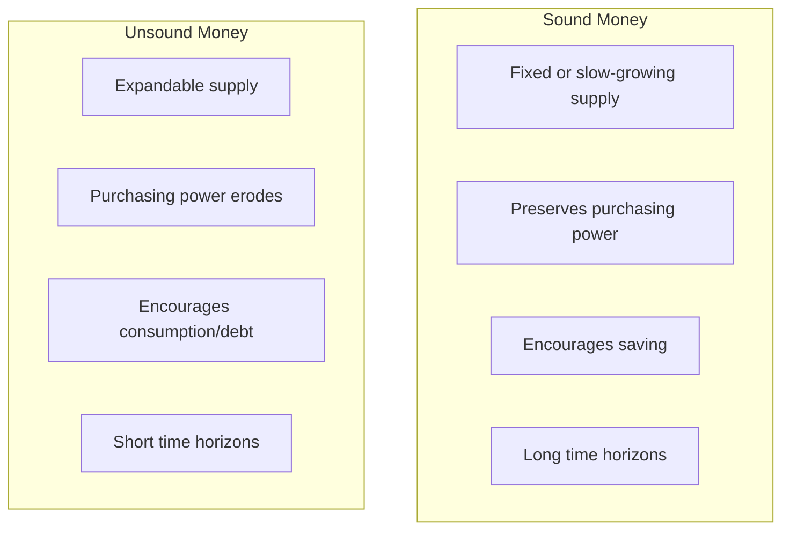
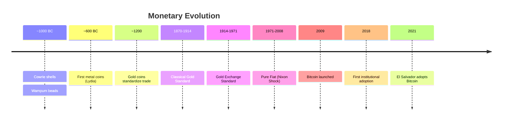

## Core Concepts

### What Is Money?

Ammous builds on Carl Menger's theory of the origin of money. Money
emerged not from government decree but from the spontaneous order of the
market. Individuals engaged in barter (direct exchange) found that some
goods were more _salable_ — easier to trade — than others. Over time,
the most salable good became the commonly accepted medium of indirect
exchange: money.


### The Three Dimensions of Salability

Ammous identifies three dimensions of salability that determine whether
a good becomes money:

| Dimension | Definition | Gold | Fiat | Bitcoin |
|-----------|------------|------|------|---------|
| Salability across space | Can it be transported and traded widely? | Heavy, costly to move | Very portable (digital ledger) | Instantly transferable globally |
| Salability across time | Does it hold value over long periods? | Excellent: chemically stable, scarce | Poor: inflation erodes purchasing power | Excellent: fixed supply, verifiable |
| Salability across scales | Can it be divided into small units? | Difficult with physical gold | Highly divisible | Divisible to 8 decimal places (satoshis) |

<Callout type="info">
  **The Key Insight**: Ammous argues that salability across time is the
  most critical dimension. Without it, a money cannot function as a store
  of value, and without being a store of value, it cannot serve as a
  reliable medium of exchange.
</Callout>

### Stock-to-Flow Ratio

The stock-to-flow (S2F) ratio measures the hardness of money:

> **S2F = Existing Stock / Annual Production**

A high S2F means new supply is negligible relative to existing stock,
making the money difficult to debase.

| Asset | S2F Ratio | Implication |
|-------|-----------|-------------|
| Gold | ~60 | 60 years of mining to double supply |
| Silver | ~22 | 22 years to double supply |
| Bitcoin (2018) | ~25 | Approaching gold after halvings |
| Bitcoin (post-2024) | ~56 | Effectively digital gold |
| Fiat currencies | ~0–5 | Supply can increase dramatically |

### Sound Money vs. Unsound Money



<Callout type="warning">
  **Ammous's Core Thesis**: The transition from the gold standard to fiat
  money was not an improvement but a regression. It replaced a
  market-based, apolitical monetary system with one controlled by
  politicians and central bankers who face incentives to inflate.
</Callout>

### Time Preference

Time preference is the degree to which people prefer present consumption
over future consumption. Ammous argues that sound money lowers time
preference by providing confidence that savings will retain value,
enabling long-term planning, capital accumulation, and civilization.

- **Low time preference** – Save more, invest in capital goods, think
  across generations, build cathedrals and universities
- **High time preference** – Consume now, borrow heavily, focus on short
  term, produce disposable culture

## Frameworks

### The Austrian Business Cycle Theory

Ammous applies Mises's Austrian Business Cycle Theory (ABCT) to explain
how central bank credit expansion causes economic booms and busts:

1. Central banks lower interest rates below the natural rate
2. Cheap credit encourages malinvestment — projects that seem
   profitable at artificially low rates but are not sustainable
3. The boom phase creates a false sense of prosperity
4. When the credit expansion stops (or inflation forces rates up),
   malinvestments are revealed, and the bust follows
5. The bust is the market's necessary correction — government
   intervention (bailouts, stimulus) only prolongs the pain

### The Cantillon Effect

<Callout type="key">
  New money enters the economy at specific points (banks, financial
  institutions) before it reaches the broader population. Those closest
  to the money creation benefit first, while those farthest — wage
  earners, savers — experience the price increases last but absorb the
  full loss of purchasing power. This is the Cantillon Effect.
</Callout>

This is why central bank money printing is not merely inflationary but
redistributive: it transfers wealth from the periphery to the center.

## Mental Models

### Money as a Technology for Moving Value Across Time and Space

The book's central metaphor: money is a technology, and different forms
of money have different technological properties. Gold is a reliable but
bulky technology. Fiat is expedient but corruptible. Bitcoin is the
first money engineered from first principles for the digital age.

### The Primitive Money Continuum

Ammous traces a through line from Rai stones (Yap Island) through
seashells (Wampum), salt (Roman soldiers), and metal coins. Each
primitive money succeeded because of its salability and failed when its
supply was suddenly expanded.



### The "Nixon Shock" as Pivot Point

August 15, 1971, when President Nixon closed the gold window, is the
pivotal event in modern monetary history. Every dollar in circulation
became pure fiat — backed by nothing but government decree. Ammous
argues this was the greatest theft in history, silently transferring
wealth from every holder of dollars to the government.

## Major Lessons

### 1. Hard Money Creates Civilizational Flourishing

Ammous draws historical correlations between sound money and human
achievement:

- Classical Greece and Rome used sound commodity money and produced
  enduring art, philosophy, and law
- The Islamic Golden Age used gold and silver dinars
- The Renaissance flourished under the gold-backed Florentine florin
- The Industrial Revolution coincided with the classical gold standard
- The 20th century's worst atrocities (world wars, hyperinflations)
  occurred under fiat regimes

<Callout type="warning">
  **Caveat**: Correlation is not causation. Critics argue that Ammous
  oversimplifies and cherry-picks historical examples to fit his
  narrative.
</Callout>

### 2. Bitcoin's Monetary Policy Is Perfectly Predictable

| Feature | Bitcoin | Central Bank Fiat |
|---------|---------|-------------------|
| Supply cap | 21 million | Unlimited |
| Issuance schedule | Halving every ~4 years | Discretionary |
| Governance | Code + consensus (apolitical) | Political committee |
| Counterparty risk | None (self-custody) | Bank failure, confiscation |
| Settlement finality | Probabilistic but irreversible | Reversible by authority |

### 3. Bitcoin Mining Is Not Wasteful

Ammous reframes Bitcoin mining as the market's most efficient mechanism
for creating trusted timestamped records without a central authority.
The energy spent is the cost of decentralization — the equivalent of
gold mining's energy expenditure, but with better properties:

- Gold mining: physically destructive, geographically concentrated,
  politically contentious
- Bitcoin mining: location-independent, no physical waste, can use
  stranded and renewable energy

## Practical Applications

### Thinking in Bitcoin Terms

Ammous encourages readers to shift from nominal thinking (measuring in
debased fiat units) to real thinking (measuring in hard money). This
means:

- Evaluating assets, debts, and income in terms of purchasing power
  rather than currency units
- Recognizing that cash in a bank account is a depreciating asset
- Understanding that real interest rates are often negative after inflation

### The S2F Framework for Asset Evaluation

Use the stock-to-flow ratio to evaluate any potential money:

1. What is the existing stockpile?
2. What is the annual new production (or inflation rate)?
3. How does the S2F compare to gold (~60) and Bitcoin (~56)?
4. Can the supply be changed by any authority?

### Identifying Monetary Regime Risk

Ask these questions about your exposure to any currency:

1. Who controls the supply?
2. What incentives do they face?
3. Can the supply be increased without your consent?
4. Can your access to the currency be blocked or restricted?

## Mermaid Summary Diagram

```mermaid
flowchart TB
  subgraph History["History of Money"]
    direction TB
    H1[Barter] --> H2[Commodity Money<br/>Rai stones, shells, salt]
    H2 --> H3[Precious Metals<br/>Gold & Silver]
    H3 --> H4[Gold Standard<br/>1870-1971]
    H4 --> H5[Fiat Currency<br/>1971-present]
  end

  subgraph Problem["The Fiat Problem"]
    P1[Unlimited supply]
    P2[Political control]
    P3[Cantillon Effect]
    P4[Business cycles]
  end

  subgraph Bitcoin["The Bitcoin Solution"]
    B1[Fixed supply: 21M]
    B2[Decentralized: no controller]
    B3[Permissionless: no gatekeeper]
    B4[Verifiable: open source]
  end

  History --> Problem
  Problem -->|"Ammous's<br/>thesis"| Bitcoin
  Bitcoin -->|"If adopted"| Outcome["Lower time preference<br/>Capital accumulation<br/>Individual sovereignty"]
