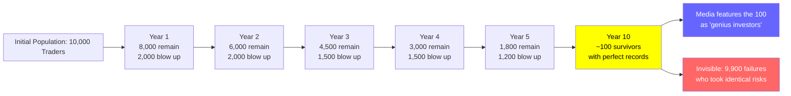
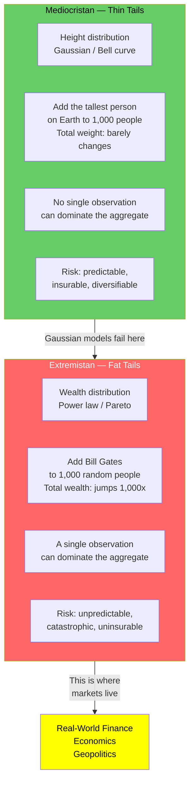
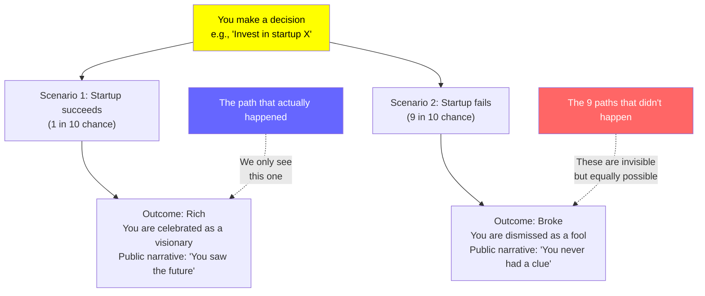
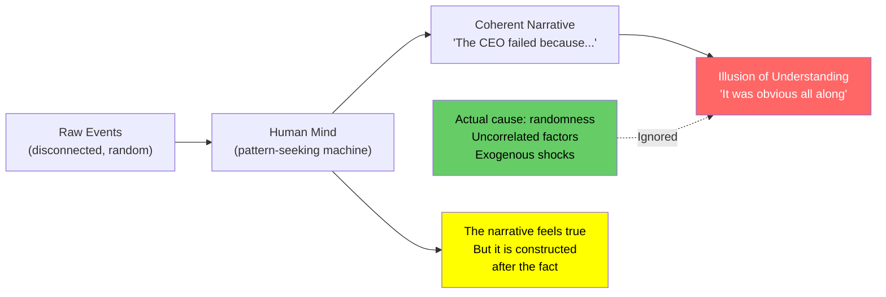
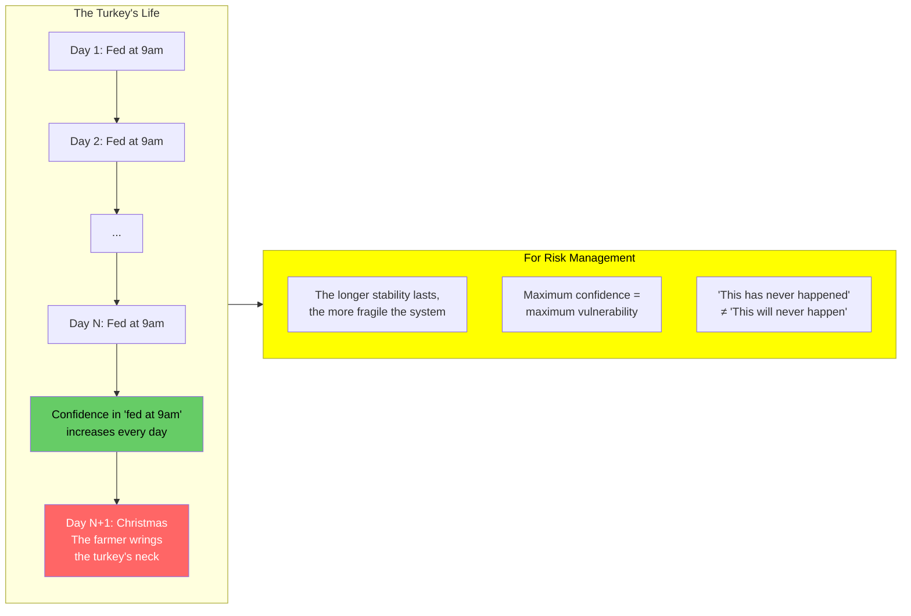
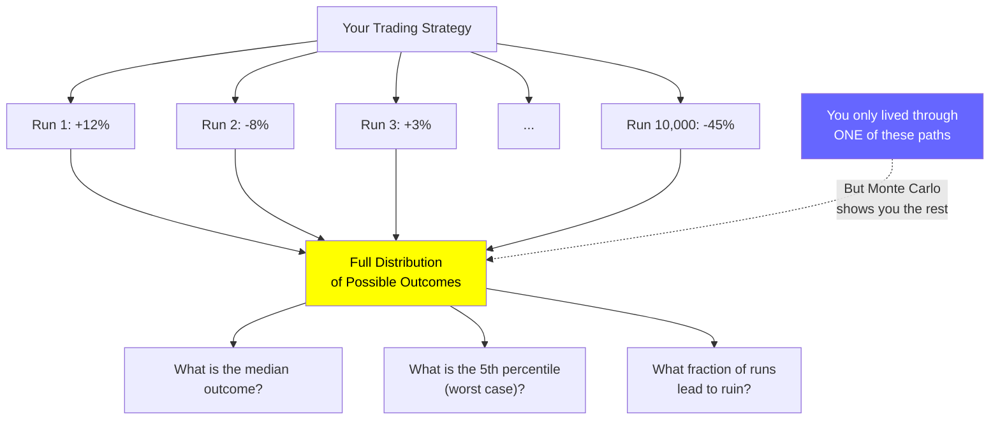

## Conceptual Diagrams

### Survivorship Bias — The Invisible Cemetery

Taleb's signature example: if 10,000 managers flip a coin annually,
after ten years roughly ten will have flipped heads every time. The
media profiles those ten as geniuses. The 9,990 who flipped tails
at some point are invisible. The only identifiable trait of the
survivors is luck — but we mistake it for skill.

---

### Mediocristan vs Extremistan

The bell curve works for physical measurements (height, weight,
errors-in-measurement) where no single observation can change the
total. It catastrophically fails for wealth, financial returns,
book sales, war casualties, and pandemic severity — where a single
observation can dominate everything. Taleb calls the first domain
Mediocristan and the second Extremistan.

---

### Alternative Histories — The Forking Paths

The single most useful mental model in the book. Across 1,000
alternative histories, what fraction would have produced a favorable
outcome? If the answer is 10% but you got lucky — you are not a
genius, you are a statistical outlier. Evaluate decisions by the
distribution of their possible outcomes, not the single realized one.

---

### The Narrative Fallacy — Pattern Seeking

After every crash, success, or failure, we construct a story that
makes the outcome feel inevitable. This narrative fallacy gives us the
illusion that we understand — and could have predicted — what happened.
In reality, the story is a post-hoc fabrication. The more compelling
the narrative, the more suspicious you should be.

---

### The Turkey Problem — Induction Failure

Taleb's adaptation of Bertrand Russell's classic induction problem. A
turkey is fed every morning at 9am. Each day of feeding increases its
confidence that it will be fed forever. On Christmas Eve, the farmer
wrings its neck — and the turkey's most confident prediction is
catastrophically wrong. The lesson: in fat-tailed environments,
inductive confidence is a measure of fragility, not safety.

---

### Monte Carlo Simulation — Re-Running History

Taleb advocates Monte Carlo reasoning as the antidote to narrative
bias. Instead of analyzing the single realized history, simulate the
process thousands of times and observe the full distribution of
outcomes. This is the only method that reveals the true risk profile
of a strategy — including the rare-but-catastrophic scenarios that
hindsight bias hides.

---

## Chapter Breakdown

Prologue — The Lucky Fool

Taleb introduces the character of the lucky fool — someone who
benefits from randomness but attributes success to skill. He
contrasts this with the unlucky genius who makes good decisions
but suffers bad outcomes. The book's purpose: to help the reader
distinguish between the two and avoid mistaking noise for signal.

Chapter 1 — If You're So Rich, Why Aren't You Smart?

Opens with a dinner-party conversation where a wealthy trader
dismisses a less wealthy but more intellectually rigorous
colleague. The chapter establishes the core tension: financial
success is weakly correlated with intelligence in high-noise
environments. Taleb introduces Monte Carlo reasoning as a mental
tool to separate luck from skill. Key metaphor: the Russian
roulette player who survives five rounds is not "skilled" — he is
lucky, and someone else is in the cemetery.

Chapter 2 — A Bizarre Accounting Method

Explores alternative histories — the counterfactual paths that
could have occurred but did not. Taleb argues we suffer from
hindsight bias because we see only one realized outcome. A good
decision can produce a bad outcome; a bad decision can produce a
good one. The quality of a decision must be evaluated against the
distribution of outcomes it could have generated.

Chapter 3 — A Mathematical Meditation on History

A deeper dive into survivorship bias. The winners write history,
and the losers disappear — taking their evidence with them. Taleb
calls this "silent evidence." We study billionaires to learn how
to get rich, but we do not study the equally talented people who
took identical risks and failed. The sample is censored, and the
censoring is correlated with the outcome we are trying to explain.

Chapter 4 — Randomness and the Internet Era

Applies survivorship bias to the dot-com bubble. Internet
entrepreneurs who succeeded during the boom were celebrated as
visionaries. Many used the same strategies as those who failed.
The difference was luck, not skill. Taleb warns that the next
boom will produce new "geniuses" who are equally undeserving of
the label.

Chapter 5 — The Problem of Induction

Draws on David Hume and Karl Popper to argue that we never truly
know anything — we can only fail to disprove it. The turkey
problem: a turkey fed for 1,000 days has more data than one fed
for 100 days, but its confidence is equally misplaced. In markets,
the more frequently a strategy has worked in the past, the more
dangerous it is — because the conditions that produced those
returns may be the very ones that are about to reverse.

Chapter 6 — The Overqualified Loser

Distinguishes between domains with high randomness (trading,
venture capital, entertainment) and low randomness (dentistry,
accounting, engineering). In low-randomness domains, skill
strongly predicts success. In high-randomness domains, luck
dominates — meaning the most skilled practitioners may fail while
the least skilled succeed by chance. Taleb advises: choose
professions where the signal-to-noise ratio is favorable.

Chapter 7 — The Problem with Gauss

Taleb's critique of the bell curve. Financial returns do not
follow a Gaussian distribution. Extreme events (crashes) happen
far more frequently than the Gaussian predicts — a 5-sigma move
should occur once every 7,000 years; in practice, it happens
every few years. Taleb traces the error to the ludic fallacy:
treating real markets like a casino where the rules and
probability distributions are known.

Chapter 8 — The Mandelbrotian Randomness

Introduces Benoit Mandelbrot's work on fractal geometry and
scalable distributions. Mandelbrot showed that cotton prices
exhibit the same statistical patterns across different time
scales — the distribution is self-similar. Taleb argues that
power-law distributions (Pareto, Levy-stable) are more
appropriate for financial markets than Gaussian, and that the
distinction between Mediocristan and Extremistan is the most
important concept for risk management.

Chapter 9 — The Illusion of the Gambler's Fallacy

Distinguishes between two types of randomness: the well-behaved
randomness of coin flips (where past outcomes do not affect future
ones) and the wild randomness of markets (where past outcomes can
generate cascading effects). Taleb argues that the gambler's
fallacy — believing that a long streak of heads makes tails more
likely — is less dangerous than the opposite error: assuming that
markets will mean-revert when they may in fact be entering a
regime shift.

Chapter 10 — The Loser Takes All

Taleb describes how he navigates a world of randomness: by
focusing on asymmetric bets where the downside is capped and the
upside is uncapped. He contrasts his approach with typical
traders who sell options (collecting small premiums but exposing
themselves to catastrophic tail risk). The chapter introduces the
barbell strategy — keep most of your wealth in extremely safe
assets and a small portion in highly speculative bets with huge
upside.

Chapter 11 — The Difficulty of Thinking about Randomness

Explores why even trained statisticians fall prey to the same
biases. Our brains evolved to seek patterns and tell stories,
not to calculate probabilities. Taleb argues that the only
defense is structural — build systems and habits that force you
to consider alternative hypotheses, even when they feel
implausible. Emotions are not the enemy; they are "lubricants of
reason." The goal is not to eliminate emotion but to design
environments where emotions do not destroy you.

Epilogue — To Be or Not to Be, That Is the Question

Taleb reflects on the human condition. Even knowing about
randomness, we cannot escape it. The Stoic approach — accept
what you cannot control, focus on what you can — is the closest
we can come to living wisely in an uncertain world. Taleb quotes
Cavafy's poem "The God Abandons Antony" and advises: when the
city falls, do not beg for it to be restored. Walk away with
dignity.

---

## Core Concepts in Depth

### Survivorship Bias (Silent Evidence)

The most pervasive cognitive error in finance and business. We
study the winners and extract lessons. We ignore the losers, who
are invisible — and whose existence would often disprove the
lessons we draw from the winners.

**Example:** If 100,000 traders start with $10,000 and trade
randomly, after ten years roughly 100 will have a perfect track
record. Those 100 will be featured on CNBC, write books, and
attract billions in capital. They are indistinguishable from
traders who actually have skill. The 99,900 who failed are
invisible. Their strategies were identical.

**Defense:** Always ask: what is the base rate of success in this
population? How many people attempted this path and failed? What
would the success story look like if we included the failures?

---

### Alternative Histories (Counterfactual Thinking)

The most useful mental model in the book. Every decision generates
a distribution of possible futures. We observe only one. Judging
decisions by their realized outcome — rather than by the quality
of the decision process across all possible futures — is the
fundamental error.

**Example:** A surgeon chooses to operate. The patient dies on the
table. Was it a bad decision? Not necessarily — if the survival
rate was 90% and the patient fell in the unlucky 10%, the decision
was correct even though the outcome was bad. Conversely, choosing
not to operate when the survival rate is 10% is correct even if
the patient would have survived.

**Defense:** Before evaluating a decision, mentally simulate 1,000
alternative histories. How many produce favorable outcomes? If the
answer is "most," then the sole fact that this one went badly is
not evidence of poor decision-making.

---

### Mediocristan vs Extremistan

The most important taxonomic distinction in the book.

| Property | Mediocristan | Extremistan |
|---|---|---|
| Distribution type | Gaussian (thin-tailed) | Power law (fat-tailed) |
| Examples | Height, weight, IQ | Wealth, market returns, book sales |
| Effect of extremes | Negligible on aggregate | Can dominate aggregate |
| Add the largest observation | Barely changes mean | Can completely change mean |
| Insurance possible? | Yes (law of large numbers) | No (catastrophe principle) |
| Statistics reliable? | Sample mean converges quickly | Sample mean is unstable |

**The catastrophe principle:** In Extremistan, ruin comes from a
single event, not a series of bad ones. This means diversification
fails as a risk management technique when the risk is in the
extreme tail.

---

### The Narrative Fallacy

The human mind is a story-making machine. We cannot tolerate
randomness, so we construct causal narratives after every
significant event. These narratives create the illusion that we
understand — and could have predicted — what happened.

**The problem:** The narrative is a post-hoc fabrication. It feels
true because it is coherent and emotionally satisfying, but it has
no predictive power. Every market crash generates hundreds of
explanatory narratives — none of which were offered beforehand.

**Defense:** Suspect any story that fits too neatly. Before
accepting an explanation, ask: was this explanation available
before the outcome was known?

---

### The Ludic Fallacy

Named after the Latin word for "game" (*ludus*). The ludic fallacy
is the mistake of treating real-world uncertainty as if it were a
game of chance with known rules and known probabilities.

**Example:** In a casino, every possible outcome and its
probability is known. Blackjack has defined decks. Roulette has 37
or 38 slots. In the real world, you do not know the distribution.
You do not even know all the possible outcomes. Financial models
(VaR, CAPM, MPT) commit the ludic fallacy by assuming Gaussian
distributions — they appear rigorous but are vulnerable to
exactly the rare events that matter most.

**Defense:** Never trust a precise probability estimate from a
model unless you are confident it captures the full distribution
of possible outcomes — including the ones the model cannot
imagine.
