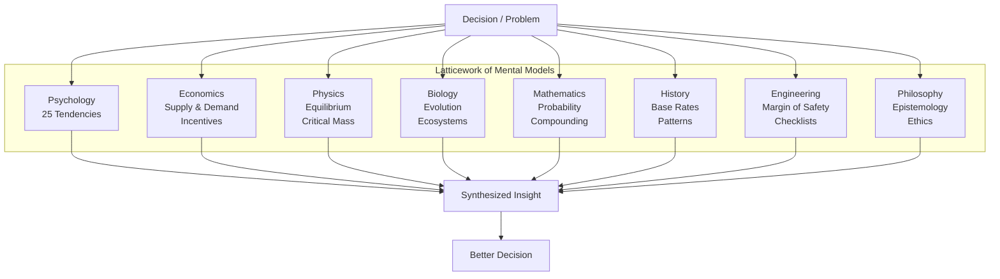

## Core Concepts

### The Latticework of Mental Models

Munger's central metaphor is the latticework: a connected framework of
roughly 100 models from the big disciplines. You do not need to master
any single field — you need working fluency in the most important ideas
from each. When faced with a problem, you run it through multiple
models simultaneously.

The power is not in any single model but in their interaction. Munger
likened it to a surgeon who must understand anatomy (biology),
infection (chemistry), blood pressure (physics), and patient psychology
all at once. No single discipline suffices.

---

### The Eleven Talks

The book's spine is 11 talks Munger delivered between 1986 and 2007:

| # | Talk | Year | Core Idea |
|---|---|---|---|
| 1 | "A Lesson on Elementary, Worldly Wisdom As It Relates to Investment Management & Business" | 1994 | The original mental models speech; introduces the latticework |
| 2 | "The Psychology of Human Misjudgment" | 1992 | 25 cognitive tendencies that cause poor decisions |
| 3 | "A Lesson on Elementary, Worldly Wisdom, Revisited" | 1995 | Updated version of Talk 1 with more examples |
| 4 | "Practical Thought About Practical Thought?" | 1996 | How to structure thinking; the role of checklists |
| 5 | "The Need for More Multidisciplinary Skills from Professional People" | 1998 | Why specialized education fails; the case for broad learning |
| 6 | "Academic Economics: Strengths and Weaknesses" | 2003 | What economics gets right and wrong; the limits of models |
| 7 | "A Lesson on Elementary, Worldly Wisdom, Revisited (Again)" | 2004 | A third pass at the latticework with new cases |
| 8 | "The Lollapalooza Effect" | 2000 | How multiple biases combine to produce extreme outcomes |
| 9 | "On the Importance of Inversion" | 1986 | The Jacobi method applied to life and investing |
| 10 | "Circle of Competence" | 1996 | Knowing the boundaries of your knowledge |
| 11 | "The Art of Stock Picking" | 1994 | Munger's investment criteria; the "mental model" approach to stocks |

---

### The 11 Mental Models Framework

Munger never published a definitive list. The 11 models below are the
most frequently cited across his talks:

**1. Circle of Competence**

Know the boundaries of what you understand. "If you have competence,
you know the edge better than most. If you think you know the edge
when you don't, you're dangerous." Munger and Buffett evaluate
businesses they understand deeply (insurance, consumer goods) and
ignore technology, biotech, and other fields outside their circle.

**2. Inversion (The Jacobi Method)**

"Invert, always invert." Mathematician Carl Jacobi advised solving
problems backward: write the opposite of what you want and solve for
that. Munger applies it constantly: instead of asking "how do I make
good investments?" ask "what would guarantee bad investments?" — then
avoid those things.

**3. Occam's Razor**

Among competing hypotheses, select the one with the fewest assumptions.
Munger preferred simple explanations and simple businesses. "There is
no investment so good that it can't be analyzed into a loss by adding
complexity."

**4. Hanlon's Razor**

"Never attribute to malice that which is adequately explained by
stupidity, ignorance, or incompetence." Munger used this to avoid
paranoia in business dealings. Most bad outcomes are not conspiracies;
they are incentives misaligned or people acting thoughtlessly.

**5. Second-Order Thinking**

Consider not just the first-round effects of a decision but the
subsequent chain. Munger observed that most market participants stop
at first-order thinking (a rate cut is good for stocks), missing the
second-order effects (it creates malinvestment, which eventually
crashes).

**6. Incentive-Caused Bias**

"The power of incentives is a superpower." People respond to how they
are measured. Munger warned that misaligned incentives — in
corporations, government, investing — produce reliably perverse
outcomes. "Show me the incentive, and I will show you the outcome."

**7. Margin of Safety**

Borrowed from engineering and Benjamin Graham: always leave a buffer.
Never invest at fair value. Buy at a discount sufficient to absorb
errors in judgment or unexpected events. "All the wisdom in the world
is not enough to overcome a small structural weakness."

**8. Man-With-a-Hammer Tendency**

"To a man with a hammer, everything looks like a nail." The tendency
to overapply your best model. The antidote is a diverse latticework.

**9. Availability Bias / Recency Bias**

The mind overweights what is recent, vivid, or emotionally charged.
Munger used checklists and historical base rates to counteract this.
"If you can't remember the 1973-74 bear market, you are doomed to
relive it."

**10. Confirmation Bias**

People seek evidence that confirms their existing beliefs and ignore
contradictory evidence. Munger's antidote: "I want to know where I'm
going to die, so I can never go there." He actively sought reasons to
reject his own investment theses.

**11. Lollapalooza Effect**

The multiplicative result when multiple psychological tendencies and
biases operate simultaneously in the same direction. This explains
extreme market phenomena (dot-com bubble, housing crisis) that standard
economics cannot account for. "When you get lollapalooza effects, you
often get extreme outcomes that seem like they shouldn't happen."

---

### Psychology of Human Misjudgment (25 Tendencies)

In his 1992 Harvard speech (Talk 2), Munger catalogued 25 cognitive
tendencies. They are not original to him — most appear in Kahneman and
Tversky's work — but Munger organized them into a practitioner's
framework:

| # | Tendency | Description |
|---|---|---|
| 1 | Reward & Punishment Superresponse | People respond powerfully to incentives; misaligned incentives cause bad behavior |
| 2 | Liking/Loving Tendency | We favor people and things we like, often irrationally |
| 3 | Disliking/Hating Tendency | We distort reality to justify dislike |
| 4 | Doubt-Avoidance Tendency | The mind seeks quick closure; ambiguity is uncomfortable |
| 5 | Inconsistency-Avoidance Tendency | People resist changing beliefs or habits once formed |
| 6 | Curiosity Tendency | The drive to understand; Munger's "learning machine" ethos |
| 7 | Kantian Fairness Tendency | Expectation of fair treatment; violation causes anger |
| 8 | Envy/Jealousy Tendency | "Envy is a really stupid sin because it's the only one you could never possibly have any fun in." |
| 9 | Reciprocation Tendency | The instinct to return favors, exploited in negotiation |
| 10 | Influence-from-Mere-Association Tendency | We associate qualities based on superficial connections |
| 11 | Simple, Pain-Avoiding Psychological Denial | Refusing to see uncomfortable truths |
| 12 | Excessive Self-Regard Tendency | Overconfidence in one's own abilities and judgments |
| 13 | Overoptimism Tendency | Deep optimism blinds us to risk |
| 14 | Deprival-Superreaction Tendency | Losing something hurts more than gaining it feels good |
| 15 | Social-Proof Tendency | Following the herd; "everyone else is doing it" |
| 16 | Contrast-Misreaction Tendency | Judging things relative to what's nearby rather than absolutely |
| 17 | Stress-Influence Tendency | Stress degrades decision quality |
| 18 | Availability-Misweighing Tendency | Overvaluing what is recent or easily recalled |
| 19 | Use-It-or-Lose-It Tendency | Skills atrophy without practice |
| 20 | Drug-Misinfluence Tendency | Substance abuse destroys rationality |
| 21 | Senescence-Misinfluence Tendency | Cognitive decline with age |
| 22 | Authority-Misinfluence Tendency | Deferring too much to authority figures |
| 23 | Twaddle Tendency | The tendency to talk nonsense and waste time |
| 24 | Reason-Respecting Tendency | People need a reason — even a bad one — to comply |
| 25 | Lollapalooza Tendency | The compound effect of multiple biases acting together |

---

### The Lollapalooza Effect

Munger's most original contribution to behavioral economics. When
multiple tendencies operate simultaneously, they produce outcomes far
more extreme than any single tendency would predict. Example: the
dot-com bubble combined social proof ("everyone is getting rich"),
overoptimism ("this time is different"), authority-misinfluence
("analysts say buy"), and deprival-superreaction ("I'll miss out").
Each bias alone caused a small distortion; together they produced a
market that valued companies with no earnings at billions of dollars.

Munger argued that understanding the Lollapalooza Effect is more
important than understanding any individual bias, because it explains
the discontinuous jumps in irrationality that standard economics cannot
handle. It also explains why bubbles and panics are so hard to resist:
they feel rational to the participants because every cognitive system
is pushing in the same direction.

---

### Key Lessons from Munger's Speeches

**On Learning:** "Go to bed smarter than when you woke up." Munger
attributed his success not to IQ but to being a "learning machine."
He read biographies, history, science, and psychology constantly.

**On Investing:** The ideal business has four characteristics: (1) you
understand it, (2) it has durable competitive advantages (a moat),
(3) it is run by able and trustworthy people, and (4) the price is
attractive. Avoid businesses you cannot evaluate, no matter how
appealing they seem.

**On Rationality:** "The best way to get what you want is to deserve
what you want." Munger saw ethics and rationality as connected. Short-
term thinking and corner-cutting are dangerous because they attract the
wrong people and create bad incentives.

**On Avoiding Misteaks:** "It is remarkable how much long-term advantage
people have gotten by trying to be consistently not stupid, instead of
trying to be very intelligent." His checklist approach — borrowed from
pilots and surgeons — was designed to prevent compounding errors.

---

### Practical Applications

**For Investing:**
- Define your circle of competence in writing. Revisit it annually.
- Use inversion: for every potential investment, write the case for
  why it will fail.
- Run every decision through the 25 tendencies checklist.
- When a stock drops 30%, ask: has the business changed or has the
  market simply repriced it?

**For Business:**
- Design incentive structures carefully. Assume people will optimize
  for whatever metric you publish.
- Hire for rationality and learning ability, not domain expertise alone.
- Build a culture that tolerates disagreement and actively solicits
  disconfirming evidence.

**For Personal Decision-Making:**
- Create a personal decision checklist modeled on Munger's tendencies.
- Inversion: what would make your career fail? Health fail?
  Relationships fail? Avoid those things.
- Read widely outside your field. One non-fiction book per discipline
  per year is sufficient to build a basic mental model.

---

### Action Plan

1. **Build your latticework.** Pick 3 disciplines outside your field.
   Read one foundational book in each. Distill the 5 most important
   ideas from each discipline and write them down.
2. **Practice inversion.** For one week, before every significant
   decision, ask: "What would guarantee the worst outcome?" Write it
   down and check that you are not doing any of those things.
3. **Map your circle of competence.** List the domains where you have
   genuine expertise. List the domains where you are an amateur. For
   the next 30 days, refuse to make decisions in domains outside your
   circle.
4. **Create a cognitive bias checklist.** Pick 10 of Munger's 25
   tendencies. Before every major decision (investment, hire,
   purchase), run through the checklist and note which biases might
   be active.
5. **Read invertedly.** Replace one book per quarter in your field with
   a book from a completely unrelated discipline. History, biology,
   physics, poetry — anything outside your professional training.
6. **Track your Lollapalooza moments.** When you feel a strong
   emotional reaction to a market event or decision (euphoria, panic,
   urgency), pause and identify which 3-5 biases are compounding.
   Name them out loud.
7. **Study failures.** Read one post-mortem per month — a business
   failure, an investment loss, a strategic blunder. Ask: which mental
   model would have prevented this?
