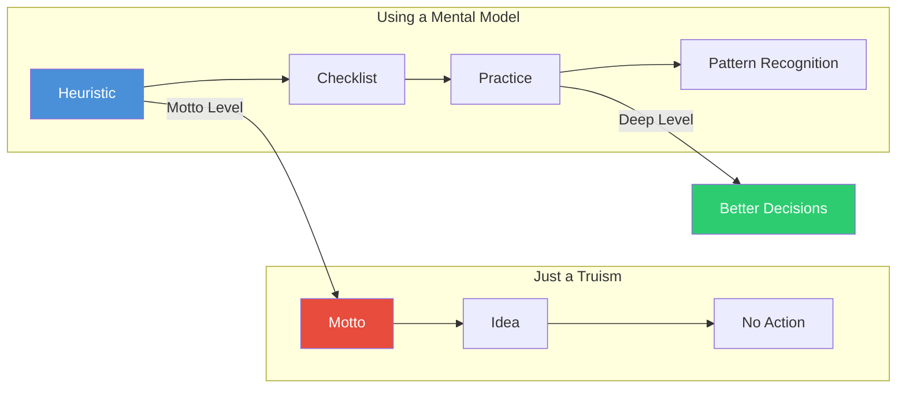

## Introduction

Welcome to BookAtlas. Today: *Poor Charlie's Almanack: The Essential
Wit and Wisdom of Charles T. Munger* — a collection of speeches by
Berkshire Hathaway's vice-chairman, compiled by Peter Kaufman.
First published 2005, Donning Company. 520 pages in the original,
condensed to 380 in the 2023 Stripe Press edition.

I'm Alex. With me is Jordan. We do not agree about this book.

**Alex:** I think this is one of the most overrated books in business.
It's a collection of rambling speeches by a rich guy who got lucky.

**Jordan:** And I think it's the most important book on decision-making
ever written by someone who actually made decisions at scale. Let's
argue about it.

---

## Host 1 (Skeptical) — "Survivorship Bias with Good PR"

**Alex:** Let me start with what bugs me. Charlie Munger was born in
1924. He met Warren Buffett in 1959. He got rich during the greatest
economic expansion in human history. The S&P 500 returned something
like 10% annually during his investing lifetime. A monkey throwing
darts would have done well.

But Munger turned this into a philosophical system. He calls it
"mental models" and "worldly wisdom." I call it post-hoc
rationalization. Every success gets attributed to the framework,
every failure gets explained away.

**Jordan:** You're conflating two things. Is there survivorship bias
in Munger's story? Sure. He was lucky. He was born at the right time
in the right country. But that doesn't make the framework wrong. The
question is: are the mental models useful independently of Munger's
outcome?

**Alex:** Are they? Let's test. Name a model that is both (a) not
obvious and (b) actionable.

**Jordan:** Incentive-caused bias. "Show me the incentive and I will
show you the outcome." This is not obvious. Most people evaluate
behavior based on character, not incentives. Munger says: look at how
people are paid, and you will predict what they do. This is actionable:
if you want better outcomes, change the incentive structure, not the
people.

**Alex:** Okay, that one is genuinely good. But most of the others?
"Circle of Competence" is just "know what you know." "Inversion" is
just "think backwards." These are truisms dressed up as insights.

**Jordan:** You are describing them at the motto level. The value is
in the *practice*. Circle of Competence is not "know yourself" — it is
a specific, repeated discipline of mapping your knowledge boundaries
and refusing to operate outside them. How many investment professionals
actually do that? Inversion is not just "think backwards" — it is a
structured technique for surfacing failure modes that forward thinking
misses. The difference between a truism and a mental model is whether
you actually use it as a checklist.

---



---

## Host 2 (Believer) — "It's a Cognitive Operating System"

**Jordan:** Here is what I think this book actually is. It's an
operating system for the mind. Not a collection of tips, not a
philosophy, not a set of investment rules — an OS.

Munger gives you:
- A **kernel** (multidisciplinary thinking)
- A set of **system calls** (inversion, circle of competence, second-order thinking)
- A **memory manager** (the 25 tendencies — bias detection)
- An **error handler** (checklists, disconfirmation practice)
- A **networking stack** (the latticework — connecting models across domains)

**Alex:** That is a very elaborate metaphor for "he wrote some
speeches."

**Jordan:** Name another book that gives you all five layers. Not
*Thinking, Fast and Slow* — it gives you bias detection but no action
framework. Not *Influence* — it gives you persuasion but no investment
framework. Not *The Most Important Thing* — it gives you investing but
no broad cognitive system. Munger is the only one who tied all the
pieces together into a single, usable structure.

**Alex:** But that's the problem. He tied them together *for himself*.
The structure is Munger's personal framework developed over 60 years.
Is there any evidence that someone reading this book can actually
build their own latticework?

**Jordan:** The evidence is the community that grew around it. Farnam
Street / Shane Parrish built an entire business on applying Munger's
framework. Mohnish Pabrai explicitly copied Munger's approach and
produced a 20+ year track record. The book has been cited by CEOs,
engineers, designers, chess players. It is not just investors.

---

## Which Models Are Actually Most Useful?

**Alex:** Let me concede a point. The Psychology of Human Misjudgment —
the 25 tendencies — is genuinely useful. I use the incentive-caused
bias regularly. The social proof tendency explains 90% of bad
decisions I see at work.

**Jordan:** My list is different. The three most useful:

1. **Inversion.** Because it changes the question from "how do I
   succeed?" (vague, aspirational, hard to answer) to "how do I
   fail?" (specific, concrete, easy to find). You can always find
   failure modes. Avoiding them is more reliable than pursuing success.

2. **Circle of Competence.** Because it is the only model that tells
   you *not to act*. Every other framework says "do this." This one
   says "don't do that." In a world where most professional damage
   comes from acting on bad ideas, the ability to say "I don't know
   this well enough to decide" is superpower-level rare.

3. **Lollapalooza Effect.** Because it explains why normal people do
   insane things. Not just in markets — in relationships, careers,
   politics. When you feel a strong emotional pull toward a decision,
   it's rarely one emotion. It's 3-5 tendencies compounding. Naming
   them defuses the force.

**Alex:** I would swap number three for Hanlon's Razor. The number of
hours I have wasted assuming bad intent when the real explanation was
stupidity, fatigue, or misaligned incentives — it's enormous.

**Jordan:** Hanlon's Razor is good. But it's not unique to Munger.
He borrowed it. Inversion and Circle of Competence and the Lollapalooza
Effect — those are his original formulations. That's what makes the
book special.

---

## The Skeptic's Final Objection

**Alex:** Here is my bottom line. Munger tells you to be rational. He
gives you tools. But the tools are only valuable if you are already
predisposed to use them. If you are a person who seeks confirmation,
you will use the latticework to confirm your biases better. If you are
impulsive, inversion won't slow you down.

The book does not change your character. It refines your cognition.
And the people who need it most — the overconfident, the impulsive,
the tribal — are the least likely to absorb it.

**Jordan:** That's true of every book about thinking. It's not a
criticism of this one. And I would argue that the checklist approach
*does* change behavior. Pilots and surgeons don't use checklists
because they are naturally disciplined — they use them because the
checklist imposes discipline. Munger's system is the same. The
checklist is the bridge from "I know this" to "I act on this."

---

## Practical Mental Model Checklist

Use this before any significant decision:

```
[ ] INCENTIVES — Who is incentivized to want this outcome?
    What would they do if their incentives were different?

[ ] INVERSION — What would guarantee failure here? Am I doing any
    of those things right now?

[ ] CIRCLE — Am I inside my circle of competence for this decision?
    If not, who should I consult?

[ ] SOCIAL PROOF — Am I doing this because others are doing it?

[ ] AUTHORITY — Am I deferring to someone's title rather than their
    reasoning?

[ ] CONFIRMATION — Have I actively sought evidence that I am wrong?

[ ] AVAILABILITY — Am I overweighing a recent or vivid example?

[ ] LOLLAPALOOZA — How many biases are active right now? 1-2 is
    manageable. 3+ means pause.

[ ] SECOND-ORDER — What happens after this? And after that?

[ ] HANLON — Could this be explained by stupidity or circumstances
    rather than malice?

[ ] MARGIN — What is my buffer for error? Is it sufficient?

[ ] MAN-WITH-HAMMER — Am I using the same model I always use?
    What other model would give a different answer?
```

---

## Closing

**Alex:** I remain skeptical of the packaging. The book is too
repetitive, too self-congratulatory, too reliant on Munger's personal
mythology. But I concede the core ideas are real. Incentive-caused
bias, the Lollapalooza Effect, inversion — these are genuinely useful
tools.

**Jordan:** And I concede that the book is overhyped by its fans. It
is not a complete system. It is not a substitute for experience. It
does not make you Charlie Munger. But it is the best starting point
for building your own cognitive toolkit — and there is no second place.

**Alex:** Fair enough. For practical thinkers who want a manual for
avoiding dumb decisions, *Poor Charlie's Almanack* belongs on the
shelf. Just don't expect it to make you a billionaire.

**Jordan:** Read it. Build your checklist. Practice inversion for a
month. Map your circle of competence. The returns on that investment
will beat any stock.

**Both:** This has been BookAtlas. Go to bed wiser than you woke up.
