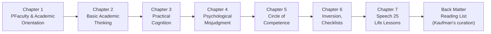

# 01 — Content Roadmap

How to navigate this edition, as guided by Peter D. Kaufman's editorial architecture.

---

## Kaufman's Chapter Map

The companion edition is structured into thematic chapters. Each entry below follows **Kaufman's framing** — what the chapter preamble promises, what the reader is invited to focus on, and how the material inside connects to the wider system.

---

## Reading Order: Recommended vs. Chronological

Kaufman provides both. The **recommended order** is thematic; the **chronological order** tracks Munger's career. For first-time readers, the recommended order is far more useful because Kaufman has designed it to build from foundations to applications.

| Priority | Chapter (Kaufman Theme) | Core Idea | Munger's Source |
|---|---|---|---|
| 1 | Academic Orientation | Why multidisciplinary thinking matters | USC talk (1994/1995) |
| 2 | Basic Academic Thinking | Lollapalooza effects | Various speeches |
| 3 | Practical Cognition | Reality-based decision rules | Daily Journal years |
| 4 | Psychology of Misjudgment | Cognitive biases catalogued | Psychology talk + writings |
| 5 | Circle of Competence | Honest self-assessment | Buffett partnership letters |
| 6 | Inversion + Checklists | Engineering thinking applied to life | Multiple speeches |
| 7 | Speech 25 / Life Lessons | The 25 cognitive biases condensed | 1995 USC talk |

> **Companion entry note:** This table is *not* a chapter summarization of Munger's speeches. It is a map of **Kaufman's editorial choices** — why he placed this speech here, what he wants you to notice, and how one chapter builds on the last. For conceptual analysis (e.g., what Munger actually said about inversion), see [02-analysis](./02-analysis).

---

## Kaufman's Reading Prompts (Selected)

Across the chapters, Kaufman inserts structured prompts. These are the companion's distinct contribution:

**On Circle of Competence:**
> "Before reading the next section, write down — honestly — three areas in your life where you are outside your circle of competence right now."

**On Avoiding Envy:**
> "Munger says the habit of envy destroys more character than any other. Ask yourself: who do you envy, and what would you gain by letting that go?"

**On the Checklist:**
> "Construct a simple five-item checklist for one recurring decision you make this week. Use it. Report back to no one but yourself."

**On Multidisciplinary Learning:**
> "Pick one model from a field you have never studied (e.g., game theory, evolutionary biology). Spend 30 minutes with it. Does it reframe any problem you're working on?"

These prompts are what separate the companion edition from a plain anthology. Kaufman treats Munger's text as **raw material for the reader's own system-building**, not just literature.

---

## The Back-Matter Reading List

One of Kaufman's most lasting contributions is the **annotated reading list** at the back of the book. Rather than simply listing titles, Kaufman explains *why each book matters to Munger* and categorizes them by mental-model domain:

- **Physics & Mathematics** — Darwin, Gauss, Feynman
- **Biology** — Ehrlich, Sailer, Mayr
- **Psychology** — Tversky & Kahneman, Cialdini
- **Economics** — Smith, Knight, Samuelson
- **Hard Sciences & Engineering** — various
- **Biographies** — Eisenhower, Speaker Cannon

This list is effectively Kaufman's **translation of Munger's intellectual influences into a syllabus**. It is the highest-density two pages in the book for any reader who wants to go deeper after finishing the Almanack.

---

## Mode of Engagement: Three Reader Personas

Kaufman implicitly structures the book for three kinds of readers. Understanding which one you are — and which one Kaufman expects — shapes how you use this companion entry:

**The Investor** — reads for investment wisdom, checks out early on the psychology chapters, builds a mental-model toolkit for capital allocation.

**The Generalist / Polymath Wannabe** — reads with a highlighter, loves the back-matter list, circles back to chapters as life problems arise.

**The Behavioralist / Psychology Student** — homes in on Chapter 4 (Psychology of Misjudgment) and Speech 25. Sees the Almanack as a primer on cognitive bias.

Kaufman's editorial structure serves all three, but the **generalist** mode is the one he's most explicitly building toward, evidenced by his chapter sequencing and the preparatory tone of his preambles.
