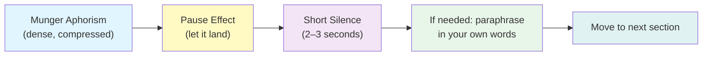

# 03 — Narration Guide: How to Read and Present the Companion Edition

This guide is for **narrators, facilitators, and auto-didacts** — anyone who plans to read *Poor Charlie's Almanack* aloud, host a study group around it, or produce a spoken version (podcast, audiobook-style recording, classroom discussion). It treats the companion edition as a **performance text**, with specific attention to how Kaufman's editorial framing shapes the experience of speaking it.

---

## Where This Guide Differs from the Main Entry

The [main Almanack entry](../poor-charlies-almanack-charlie-munger/) covers Munger's raw delivery style — his cadence, his humor, his long-winded Midwestern pauses. This companion narration guide takes a different angle.

It focuses on:

1. **Kaufman's chapter preambles** as narration scaffolding — when to read them, when to skip them, and how to use them as topic sentences.
2. **The aphoristic density** of Munger's prose and how Kaufman's sequencing builds toward moments that *need* a slower, clarifier pace.
3. **Group study facilitation** — Kaufman's reading prompts are designed to be read aloud and discussed; this guide shows how.
4. **Narration-adjacent opportunities** — using the companion edition's reading list and structural clarity to build longer-form educational content.

---

## Part 1: Solo Narration — How to Read Munger (With Kaufman's Help)

### Pacing Principles



Munger writes in **compound maxims** — sentences that pack 3–5 ideas into a single breath. The single biggest error in narration is rushing past them.

**Recommended pacing technique:**

| Section Type | Example | Narration Pace |
|---|---|---|
| Short aphorism | "In my whole life, I have never known a wise person who didn't read all the time — none, zero." | **Slow. Contemplative.** Let it hang. |
| Multi-part list | Munger enumerating 25 cognitive biases | **Methodical. One per line of breath.** |
| Humorous aside | Munger's Witticisms / self-deprecation | **Light. Faster. Conversational.** |
| Kaufman preamble | Editorial transition between themes | **Neutral, register-set.** Less Munger, more host. |
| Reading prompt | Kaufman's question to the reader | **Direct. To the audience.** |

**Universal rule:** When you arrive at a sentence that contains a "—" or a parenthetical, you have already compressed two thoughts. Breathe before each clause.

### Chapter-by-Chapter Narration Strategy

**Chapters 1–3 (Academic Orientation / Basic Academic Thinking / Practical Cognition):**
These are the densest. Kaufman's preambles are essential here — read them fully, because Munger's speeches in this section assume background knowledge readers may not have. **Do not skip Kaufman's context paragraphs** in narration; they are the bridge that makes Munger's references legible to a listening audience.

**Chapter 4 (Psychology of Human Misjudgment):**
This is the **emotional and intellectual climax** of the book. Munger catalogs 25 biases — narrator stamina matters here. Consider:
- Breaks into **two sessions**: biases 1–12 and biases 13–25
- Reading the list section aloud as a **cumulative inventory** — each bias builds on the last; the listener should feel the weight of the list by the end.
- Kaufman's preamble to this chapter is the most important in the book; it prepares the listener for entering uncomfortable territory (their own biases).

**Chapters 5–6 (Circle of Competence / Inversion + Checklists):**
These are the **practical payoff** chapters. After the psychological deep-dive, this is the active-engagement section. Kaufman's reading prompts are designed to be **discussion-starters** — narrators should treat them as transition points where you, as facilitator, pause and ask. Even in solo narration, verbally pose the prompt and respond to it yourself. The book gets quieter here; let the silence matter.

**Chapter 7 (Speech 25 / Life Lessons):**
Kaufman's decision to include the full USC commencement speech here — in proximity to the abridged psychology talk — is a deliberate juxtaposition. Munger is addressing graduating lawyers about *how to live*, not just how to think. Narration here should shift register slightly: more personal, warmer, slower. This is the book's emotional release valve.

**Back Matter (Reading List):**
Narrating the back-matter reading list as a **vertical list** is surprisingly effective in spoken form. Read each title, Kaufman's category label, and his one-sentence justification. It produces a meditative rhythm — like rolling credits on a film that has just made you smarter. Do not rush this section. It is the companion edition's most original contribution.

---

## Part 2: Group Study Facilitation

Kaufman wrote his reading prompts with discussion groups in mind. They function as **Socratic entry points** — not rhetorical questions he answers, but invitations for the group to surface their own experiences.

### Facilitator's Tool Kit (Directly from Kaufman's Prompts)

| Chapter | Kaufman Prompt (adapted for facilitation) | Suggested Discussion Shape |
|---|---|---|
| Circle of Competence | "What's one area you're currently overestimating your competence in?" | Go around the circle. No fixing — just naming. |
| Avoiding Envy | "Whose success are you resenting? What would you change if you let that go?" | Personal sharing, optional. Ground rule: no one must share. |
| Inversion | "Take a decision you're currently struggling with. What does the worst-case scenario look like? What guardrails would prevent it?" | Small groups of 3. Write worst cases on paper. |
| Checklist | "Design a 5-item checklist for one recurring decision this week. Did using it change the outcome?" | Report back at next session. |
| Multidisciplinary Learning | "Pick one model from a field you've never studied. How does it apply to a problem at hand?" | Knowledge-sharing round robin. |

### Timing for a 3-Session Study Group

Using Kaufman's structure as the syllabus:

**Session 1 (Chapters 1–3):** Foundation. The intellectual architecture. Discussion focus: what does "lollapalooza" mean in your own field?

**Session 2 (Chapters 4–5):** The psychological deep-dive. Discussion focus: which bias from Chapter 4 is most present in your decision-making?

**Session 3 (Chapters 6–7 + Reading List):** Tool-building + closing. Discussion focus: the inversion exercise and your 5-item checklist. Closing with the reading list as a shared next-steps pledge.

---

## Part 3: Technical Production Notes (Audiobook / Podcast)

### Voice and Register

- **Munger sections:** Warm, dry, Midwestern-adjacent. Imagine a beloved grandparent who happens to have an encyclopedic mind. Let humor breathe.
- **Kaufman sections:** Neutral, clearly distinct. Treat Kaufman's voice as **your** voice as host — clearer, more presentational, less aphoristic.
- **Prompt sections:** Directly to the listener. You are the facilitator now. Break the fourth wall intentionally.

### Audio Stack Recommendation

```
Track 1 (Background): NONE. Munger's ideas need room to breathe.
Track 2 (If using music): Only between sections. Not under narration.
Chapter transitions: 3 seconds of silence + spoken chapter title by host.
Between Munger and Kaufman sections: 5-second pause minimum.
```

### Addressing Redundancy

Munger's speeches repeat key ideas (the 25 biases appear in multiple forms). In narration, you have editorial latitude Kaufman did not:
- **Abbreviate** sections where purpose is clearly served by excerpt
- **Flag the repetition for listeners**: "Munger said a version of this in Chapter 2 — here he's refining it"
- **Cross-reference** rather than re-read identically: "As Kaufman noted in the chapter preamble, the inversion principle..."

---

## Part 4: The Companion's Contribution to Auto-Didactic Narration

For solo learners using narration (Driving University, etc.), Kaufman's chapter pacing is a built-in **syllabus**. Use it:

1. Fetch Kaufman's chapter as a topic prompt before listening.
2. Engage the prompt actively — write, speak, or think your response.
3. Listen to Munger's speech. Critique or confirm your initial response.
4. Move to the next chapter. Kaufman has already structured the progression; trust it.

The companion edition's reading list is the **final module** — treat it as a curated playlist of materials to narrate next. Kaufman did that curation for you.
