## The Wisdom Framework

```mermaid
flowchart TB
    subgraph Foundation["Foundation: What Influences Thinking"]
        Evolution["Evolutionary Wiring<br/>Brain selected for survival, not truth"]
        Anatomy["Anatomical Limits<br/>Perception filters & cognitive constraints"]
        Psychology["Psychological Tendencies<br/>Innate biases from tribal ancestry"]
    end

    subgraph Inputs["Sources of Wisdom"]
        Darwin["Darwinian Method<br/>Seek disconfirming evidence"]
        Munger["Munger's Latticework<br/>Multi-disciplinary models"]
        Einstein["Einstein's Heuristics<br/>Simplify, but not too simple"]
        Franklin["Franklin's System<br/>Daily self-improvement & checklists"]
        Feynman["Feynman's Honesty<br/>Don't fool yourself"]
    end

    subgraph Process["The Judgment Process"]
        Knowledge["Knowledge<br/>Understanding reality"]
        Models["Mental Models<br/>Latticework of ideas"]
        Objectivity["Objectivity<br/>Eliminate bias & ego"]
        Inversion["Inversion<br/>Start with what to avoid"]
        SecondOrder["Second-Order Thinking<br/>Trace consequences chains"]
    end

    subgraph Output["Output: Better Decisions"]
        Avoid["Avoid ruinous mistakes"]
        Decide["Make sound judgments"]
        Learn["Learn from every outcome"]
    end

    Foundation --> Inputs
    Inputs --> Process
    Process --> Output

    style Foundation fill:#1a1a2e,color:#fff
    style Inputs fill:#16213e,color:#fff
    style Process fill:#0f3460,color:#fff
    style Output fill:#533483,color:#fff
```

## Human Nature and Cognition

Bevelin opens with a crucial reframe: the human brain was not designed for
truth — it was designed for survival. Every cognitive limitation we have
can be traced back to an adaptive function that helped our ancestors
reproduce. The problem is that those adaptations misfire in modern
environments.

**Multi-source synthesis**: Bevelin weaves together Darwin (evolutionary
biology), LeDoux (neuroscience of emotion), Damasio (somatic markers),
and Cialdini (social psychology) to show that reason is not a separate
faculty governing emotion — they are entangled. The rational brain is a
late addition atop an ancient emotional core. This is the same insight
that Kahneman would later popularize as System 1 / System 2, but Bevelin
grounds it in the evolutionary context that Kahneman largely omits.

**Key insight**: You are not a rational brain piloting an emotional body.
You are an emotional body that sometimes runs rational subroutines. Design
your decision process around this truth.

## The Psychology of Misjudgments

This is the book's longest and most important section. Bevelin catalogs
over two dozen psychological tendencies that produce misjudgments, drawing
heavily on Munger's 25 tendencies but expanding them with research:

| Tendency | Source Thinkers | Mechanism |
|---|---|---|
| Social Proof | Munger, Cialdini, Asch | Following others when uncertain |
| Reciprocation | Munger, Cialdini | Feeling obligated to return favors |
| Commitment/Consistency | Munger, Cialdini, Festinger | Sticking with past decisions |
| Authority Bias | Munger, Milgram | Deferring to perceived experts |
| Envy/Jealousy | Munger, Smith | Resenting others' advantages |
| Contrast Bias | Munger | Judging by relative difference |
| Anchoring | Kahneman, Tversky | Fixating on first reference point |
| Availability | Kahneman, Tversky | Judging probability by ease of recall |
| Representativeness | Kahneman, Tversky | Judging by similarity to stereotype |
| Overconfidence | Munger, Buffett, Darwin | Overestimating own knowledge |
| Confirmation Bias | Bacon, Darwin | Seeking only supporting evidence |
| Loss Aversion | Kahneman, Tversky | Weighting losses more than gains |
| Framing | Kahneman, Tversky | Preferences shift with presentation |

**Multi-source synthesis**: Bevelin connects Munger's practical framework
with the academic research of Kahneman and Tversky — two literatures that
rarely appear together. Munger's tendencies are clinical observations from
decades of investing; Kahneman's biases are experimentally validated in
the lab. Bevelin shows they describe the same underlying phenomena.

**Key lesson**: You cannot eliminate these tendencies. They are hardwired.
The best you can do is (a) know when they are most likely to activate,
(b) create mechanical rules and checklists that override them in high-stakes
situations, and (c) arrange your environment to reduce their triggers.

## How to Think: The Latticework of Mental Models

Munger's central insight, which Bevelin adopts as his organizing principle:
you need mental models from all the major disciplines. A single model
distorts your thinking. A latticework of models — biology, physics,
psychology, history, mathematics — gives you multiple lenses on every
problem.

**Key models covered**:

- **Biology**: Evolution by natural selection, competition, adaptation, the
  Red Queen effect (running faster just to stay in place)
- **Physics**: Critical mass, tipping points, equilibrium, feedback loops,
  entropy, inertia
- **Psychology**: All the biases above, plus cognitive dissonance, the
  Pavlovian association, and operant conditioning
- **Mathematics**: Probability, permutations, combinations, regression to
  the mean, power laws, bell curves, fat tails
- **History**: The march of civilizations, the role of accidents, path
  dependence, how institutions decay

**Multi-source synthesis**: Bevelin connects Darwin's theory of natural
selection (biology) to Schumpeter's creative destruction (economics) to
Popper's falsification (philosophy of science) — all different descriptions
of the same underlying mechanism: selective retention of what works.

## The Decision-Making Checklist

The appendix includes Munger's practical checklists for avoiding
misjudgments. Bevelin organizes them into:

1. **Risk assessment**: What are the worst-case outcomes? Can I survive
   them? What am I not seeing?
2. **Bias check**: Am I falling for social proof? Am anchored? Am I
   overconfident? Did I seek disconfirming evidence?
3. **Inversion**: What would guarantee failure? How do I avoid that path?
4. **Second-order consequences**: And then what? And then what?
5. **Circle of competence**: Do I actually understand this? Am I operating
   where I have an edge?
6. **Base rates**: What is the typical outcome in situations like this?
7. **Incentives**: What incentives are operating on everyone involved?
   (Follow the golden rule: Never ask what someone thinks. Ask what their
   incentives are.)

## Learning from Mistakes

Bevelin draws on Darwin's method as the model for learning:

1. Record observations that contradict your theory before they fade
2. Pay special attention to anomalies — they are where new knowledge lives
3. Cultivate doubt as a virtue, not a weakness
4. Actively solicit criticism from people who disagree with you
5. Never fall in love with your own ideas

**Multi-source synthesis**: Darwin's approach is then connected to
Popper's falsification (science progresses by disproving hypotheses),
Feynman's "first principle" thinking (don't fool yourself), and Buffett's
investment rule (the most important quality is temperament, not intellect).

## Inversion

The book's most memorable single idea: invert, always invert. Instead of
asking "How do I succeed?" ask "How do I fail?" Then systematically avoid
those paths.

Munger's version: "All I want to know is where I'm going to die so I'll
never go there."

**Practical application**: Before any major decision, write down all the
ways it could go catastrophically wrong. If any of those paths are both
plausible and unsurvivable, don't take the step. This is a variation on
the pre-mortem technique later popularized by Klein and Kahneman.

## Second-Order Thinking

Every action has a consequence — and that consequence has consequences.
Most people stop at first-order effects. The best thinkers trace the chain.

**Example**: You cut prices to gain market share (first order: more sales).
Second order: competitors match your cuts (first-order gain evaporates).
Third order: price wars compress margins industry-wide. Fourth order: the
low-cost producer wins; everyone else loses.

This is the same concept Howard Marks calls "second-level thinking" and
what systems thinkers call "feedback loop tracing."

## Circle of Competence

Know the edge of your own understanding. Operate only where you have a
demonstrable advantage. The discipline is not in expanding the circle but
in staying inside it.

**Key insight from Buffett/Munger**: The size of the circle matters far
less than knowing its boundary. A small circle of competence, rigorously
respected, will produce better results than a large one loosely applied.

## Objectivity

Objectivity is not natural — it is a learned skill that requires active
effort. Bevelin synthesizes several techniques:

- **Darwin's golden rule**: Pay special attention to evidence that
  contradicts your theory
- **Franklin's method**: When arguing, take the other side. It reveals
  weaknesses in your own position
- **Munger's mensch**: Be reliable. Be rational. Your word is your bond.
- **Feynman's integrity**: The first principle is that you must not fool
  yourself — and you are the easiest person to fool.

## Darwinian Thinking

The book's most distinctive contribution is applying Darwin's scientific
method to everyday decision-making:

1. Gather observations without theoretical preconceptions
2. Formulate hypotheses tentatively
3. Actively seek disconfirming evidence
4. Abandon or revise hypotheses when evidence contradicts them
5. Repeat

This is Popperian falsification applied to life decisions. Darwin was
famous for his "golden rule": whenever he encountered a published fact,
observation, or idea that contradicted his theory, he made a note of it
immediately. If he did not, he found that his mind would unconsciously
reject or forget the contradiction within an hour.

---

## Key Lessons

### 1. First, avoid stupidity
The single most important rule of wisdom is not to be smart but to avoid
being stupid. A life of avoiding ruinous mistakes outperforms a life of
brilliant but risky moves.

### 2. Build a full toolkit
Since problems don't respect disciplinary boundaries, you need models from
all the major disciplines. A hammer-only mind sees every problem as a nail.

### 3. Treat your own beliefs as suspect
The most dangerous bias is the one you don't know you have. Systematic
self-doubt — especially of your most cherished ideas — is the foundation
of wisdom.

### 4. Use checklists for high-stakes decisions
When the cost of a mistake is high, you cannot rely on your brain to
remember everything. Write it down. Check it off.

### 5. Think backward from ruin
Instead of asking what will work, ask what will fail. Then don't do that.
This single heuristic would prevent most catastrophic decisions.

### 6. Consider second, third, fourth order effects
The most obvious consequence is rarely the most important. Trace the chain.

### 7. Know where you're ignorant
The boundary of your competence is more important than its center. Operate
at the center of what you know.

---

## Practical Applications

### Before a major investment decision
- Run the inversion test: what would make this a disaster? Am I exposed to
  any of those risks?
- Check the bias checklist: am I anchored to the purchase price? Am I
  following a crowd? Am I overconfident about my analysis?
- Assess the second-order effects: if I'm right, what happens next? If I'm
  wrong, what happens next? If everyone else does the same thing, what
  happens?

### When making a strategic business decision
- Define the goal clearly. What exactly are we trying to achieve?
- Consider alternatives: what are the other ways to get this outcome?
- Trace consequences: for each alternative, list the consequences one,
  two, and three steps out.
- Apply the circle of competence test: do we genuinely understand this
  business, this market, this technology?

### When evaluating a new idea
- Darwinian method: what evidence would disprove this idea? Seek it out.
- Base rate check: how often do ideas like this succeed in the real world?
- Incentive check: who benefits if I believe this? Who benefits if I act?

### Daily mental habits
- Keep a mistake journal. Record every decision that led to a bad outcome
  and trace the cause.
- Read broadly across disciplines. Biases and models from different fields
  cross-pollinate.
- Cultivate relationships with people who disagree with you. They are your
  best defense against confirmation bias.
- Before bed, do Franklin's daily audit: what did I do well today? What
  could I have done better?
