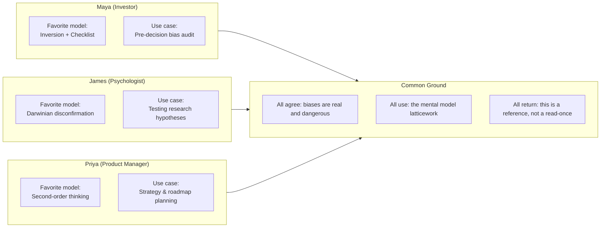

## 🎙️ Introduction

**Host**: Welcome to BookAtlas Book Club. Today we're discussing *Seeking
Wisdom: From Darwin to Munger* by Peter Bevelin. I'm joined by three
readers who each found different things in this dense little book.

**Maya**: I'm an investor. For me, this is the most practical book on
decision-making I've ever used. It lives on my desk.

**James**: I'm a psychologist — well, a cognitive science grad student. I
found the book infuriating and brilliant in equal measure.

**Priya**: I'm in product management. I came to it through mental models
and honestly struggled to get through it. But I keep coming back.

**Host**: Let's start with your first impression. What did this book feel
like to read?

**James**: Like someone took the world's greatest minds, extracted every
useful idea, and stapled them together without connective tissue. It's a
bullet-point book. I kept wishing for an argument, a story, something to
pull me through.

**Maya**: That's exactly why I love it. I don't need a story. I need a
tool. When I'm evaluating a potential investment, I flip to the checklist.
When I catch myself making a decision I might regret, I run through the
biases section. It's a reference, not a novel.

**Priya**: I'm in the middle. I wanted more narrative — the book is hard
to read cover to cover. But the concepts have stuck with me more than
most narrative books I read. Inversion, especially. I use it constantly.

---

## 🎙️ The Framework: A Latticework of Wisdom

**Maya**: My favorite model is inversion. Before every major investment
decision, I write down everything that could go wrong. If the downside
scenarios look survivable, I proceed. If there's a plausible path to
catastrophic loss, I don't. It's saved me from at least three bad
investments I would have made based on enthusiasm alone.

**James**: That's smart but I'd argue there's a prior step: Darwinian
disconfirmation. You should be doing that before you even get to
inversion — questioning whether the premise of the investment is sound.
Bevelin's Darwin chapter is the most original part of the book. The idea
that Darwin had a "golden rule" — write down anything that contradicts
your theory, because otherwise you'll forget or rationalize it away —
that's genuinely useful. I apply it to my thesis research.

**Priya**: For me, second-order thinking was the game-changer. In product,
everyone asks "what happens if we ship this feature?" But almost nobody
asks "what happens after that? And after that?" We shipped a feature once
that boosted engagement metrics (first order), but then customer support
got flooded (second order), which increased costs (third order), which
forced us to deprioritize something else (fourth order). Trace the chain.

---

## 🎙️ The Checklist Debate

**Host**: The book includes Munger's decision checklists. Maya, you said
you use them. James, you seemed skeptical.

**Maya**: I use a modified version before every major decision. It's about
twenty questions: What are the incentives? Am I anchored? What would
disconfirm my thesis? What does the base rate say? It takes ten minutes
and has prevented more bad decisions than I can count.

**James**: I think checklists are fine but they create a false sense of
completeness. The really dangerous biases — the ones that destroy
judgment — are the ones you don't even know are operating. A checklist
of known biases doesn't help with unknown unknowns. Also, checklists
only work if you honestly answer them. And honesty with yourself is
exactly what biases undermine.

**Priya**: I use something in between. Not a formal checklist but a set
of questions I mentally run through. The most powerful one for me is:
"What would make this decision look stupid in hindsight?" That's
inversion applied to a single choice.

---

## 🎙️ The Compilation Critique

**Host**: The book has been criticized as having no original ideas. It's
"a greatest hits compilation." Fair?

**James**: Entirely fair. Bevelin doesn't contribute a single new concept.
Every idea comes from someone else — Munger, Kahneman, Darwin, Franklin,
Cialdini, Feynman. If you've read the originals, you gain nothing new.

**Maya**: Disagree. Curation is a contribution. I've read Munger's
speeches. I've read Kahneman. I've read Darwin's notebooks. But I never
connected them. Bevelin shows that Darwin's method maps onto Popper's
falsification. He shows that Kahneman's availability bias is the same
phenomenon Munger describes as "availability misweighing." The synthesis
is the contribution.

**Priya**: I think the criticism misses the point. Not everyone has read
Kahneman and Darwin and Munger. Most people haven't read any of them.
For those people, this book is a one-stop shop. And even for those who
have, the act of organizing these ideas into a usable system adds value.
A cookbook doesn't contain original ingredients. The value is in the
recipe.

---

## 🎙️ What's Missing

**Host**: What does the book not cover that you wish it did?

**James**: Modern replication issues. The book was published in 2007, and
a lot of the cognitive science it cites has been challenged. Priming
effects. Ego depletion. Some of the social psychology. A modern update
would need to address what survived the replication crisis.

**Maya**: Implementation guidance. Bevelin tells you to use checklists
and seek disconfirming evidence, but he doesn't tell you *how* to turn
those into daily habits. How do you build the discipline to invert every
decision? Where do you keep your checklist? How do you train yourself to
spot confirmation bias in the moment?

**Priya**: Domain-specific application. The mental models concept is
clear, but how does a product manager use it differently from an investor?
A doctor? A policy maker? The book stays at the general level. I wanted
more concrete examples in different fields.

---

## 🎙️ Building Your Own Latticework

**Host**: If someone wants to build their own mental model latticework
based on this book, where do they start?

**Maya**: Start with the biases. They're the most immediately useful.
Learn to recognize social proof, anchoring, overconfidence, and
confirmation bias in your own thinking. That alone will improve your
decisions. Then add models from other disciplines one at a time.

**James**: I'd start with the Darwin chapter. It's the most distinctive
thing in the book. Learn the habit of seeking disconfirming evidence.
Cultivate intellectual honesty. Everything else flows from that attitude.

**Priya**: Start with any decision you regret. Reverse-engineer it using
Bevelin's categories. Which bias did you fall for? Did you use inversion?
Did you trace second-order effects? This makes the framework concrete
and personal. Then apply it forward.

**Maya**: And keep the book on your desk. Don't read it once. Read the
biases section before a big decision. Refer to the checklist. Treat it
as a manual, not a novel. That's what it was designed for.

---

## 🎙️ Final Round

**Host**: One sentence — would you recommend this book?

**Maya**: Yes, if you make decisions where mistakes are costly — investing,
strategy, leadership — this is the single most useful book I know.

**James**: Yes, with a caveat: read the originals too. Bevelin is a map,
but the territory is Munger, Kahneman, Darwin, and Feynman.

**Priya**: Yes, but only if you're willing to use it as a reference.
Don't try to read it like a normal book. It won't work. Use it. Consult
it. Apply it. Then it's invaluable.

**Host**: Final verdict from the club: *Seeking Wisdom* is a flawed,
occasionally frustrating, and ultimately indispensable reference. Not a
page-turner. But a life-changer if you use it right.

This has been BookAtlas Book Club. Thanks for listening.
