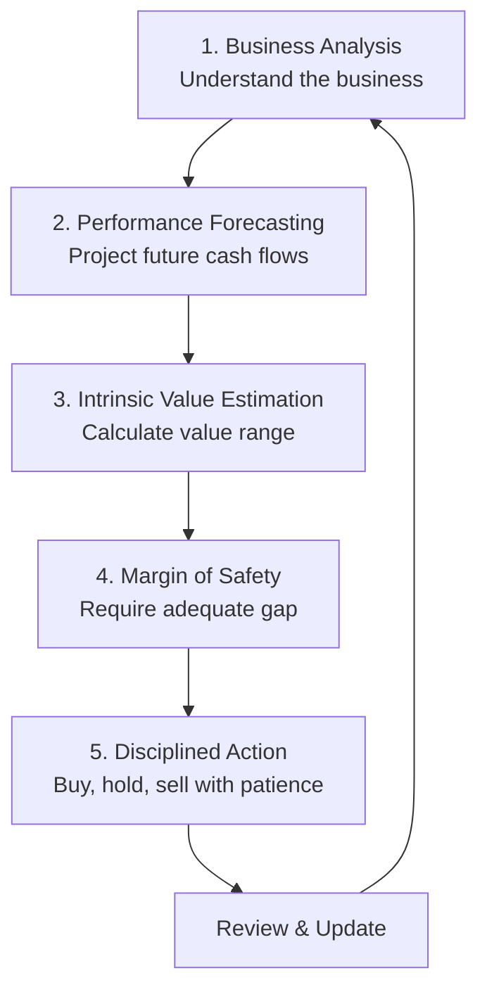
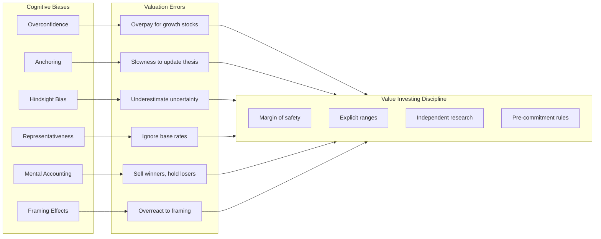
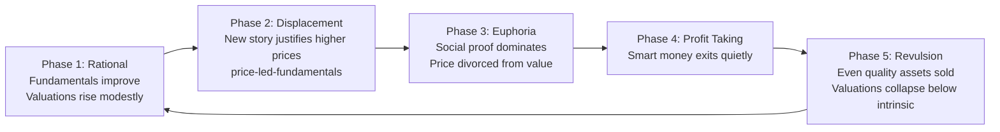
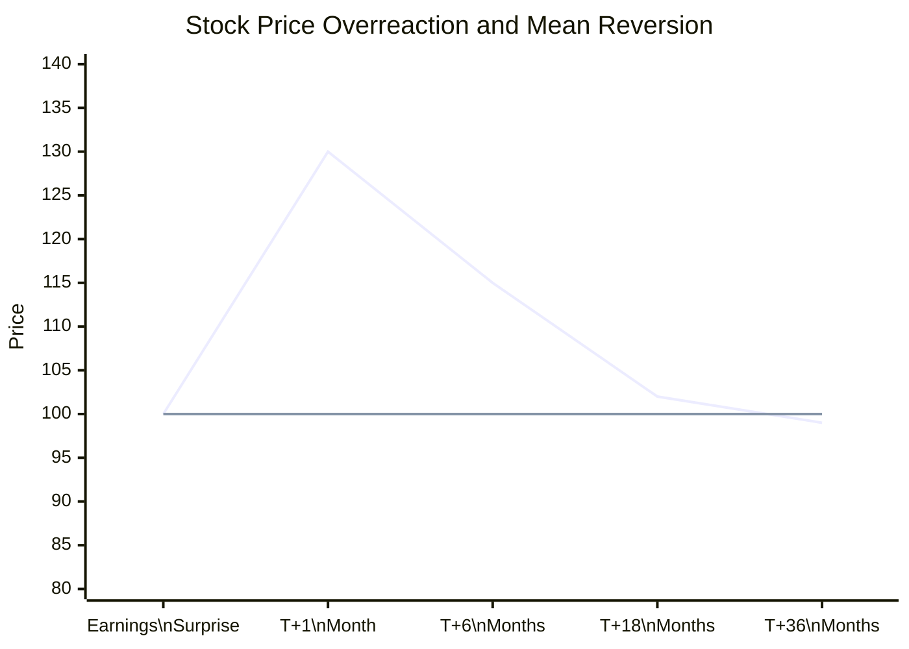
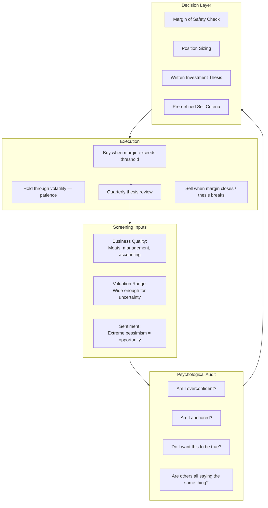

## Chapter Breakdown

### Part I — The Value Investing Foundation

Chapter 1 — The Value Investing Philosophy

Jain opens with the intellectual history of value investing, tracing its lineage from Benjamin Graham at Columbia Business School in the 1920s through David Dodd's *Security Analysis* (1934) and *The Intelligent Investor* (1949) to its modern practitioner Warren Buffett. The foundational claim: price is not the same as value, and the gap between them is where investors find opportunity. Jain distinguishes *investment* from *speculation* along Graham's classic lines: an operation meets the requirements of an investment when it is based on thorough analysis, promises adequate safety (margin of safety), and aims to protect principal and provide adequate return. Anything else is speculation.

Chapter 2 — Intrinsic Value and Its Calculation

Intrinsic value is the cornerstone concept of the entire book. Jain defines it rigorously: the intrinsic value of a business is the present value of all future cash flows the business will generate, discounted at a risk-appropriate rate. He then demonstrates why this is a *range*, not a point estimate — inputs (growth rates, discount rates, terminal values) are all uncertain and interrelated. A DCF with 20% growth assumption is not an analysis; it is a fantasy dressed in mathematics. The art of value investing is knowing when your range of estimated values is wide enough to admit a margin of safety.

Chapter 3 — The Five Disciplines of Value Investing

Jain's central structural contribution: he crystallizes the value investing process into five sequential but interrelated disciplines:

1. **Business Analysis** — Understand the business model, competitive dynamics, management quality, and the broader industry context before you ever calculate a number
2. **Performance Forecasting** — Project future cash flows based on business fundamentals, not analyst consensus or extrapolation from recent trends
3. **Intrinsic Value Estimation** — Apply valuation methodologies (DCF, relative valuation, asset-based approaches) to generate a value *range*
4. **Margin of Safety** — Require a sufficient gap between estimated intrinsic value and market price before acting; larger gaps compensate for greater estimation uncertainty
5. **Disciplined Action** — Buy when the margin exists, hold with patience, sell when the gap closes or the thesis breaks; the hardest discipline is often *waiting*

Each discipline is explored in its own right, with examples of where failures at each step have destroyed capital.

Chapter 4 — Sustainable Competitive Advantage (Economic Moats)

The fourth chapter addresses what makes some intrinsic values durable while others decay. Jain reviews the concept of economic moats — structural advantages that protect a business's profitability from competitive erosion — drawing on the framework popularized by Morningstar and others. Different moat types: switching costs (enterprise software, payment processors), network effects (marketplaces, social platforms), intangible assets (brands, regulatory licenses), cost advantages (scale, location, process), and efficient scale (natural monopolies, niche markets). A business with a wide moat is worth more, has more predictable cash flows, and therefore is more suitable for intrinsic value analysis than a commodity competitor with no structural protection.

---

### Part II — The Behavioral Finance Framework

Chapter 5 — The Case Against Market Efficiency

Jain takes direct aim at the Efficient Market Hypothesis in its semi-strong and strong forms. His critique is not a crude rejection of rational expectations; it is a measured argument that EMH fails in practice because it assumes investors process information rationally and instantaneously. Evidence: predictable patterns of return (value premium, momentum, post-earnings announcement drift), the existence of bubbles and crashes (dot-com, 2008), and the persistence of mispricings for months or years. Jain cites De Bondt and Thaler (1985), Shiller (1981), and the broader literature on market anomalies to establish that behavioral distortions are systematic, not random noise. He reconciles this with the EMH by noting that inefficiencies may persist precisely because exploiting them is psychologically difficult — which is the very point behavioral finance makes.

Chapter 6 — Cognitive Biases in Investing

This is the theoretical core of Part II. Jain reviews six primary cognitive biases and their valuation impact:

- **Overconfidence:** Investors overestimate their ability to forecast earnings and pick winning stocks. Consequence: excessive trading, underperformance, and overpayment for glamour stocks.
- **Anchoring:** Investors fixate on irrelevant reference points (52-week highs, purchase prices, analyst targets) and insufficiently update as new information arrives. Consequence: delayed reaction to earnings deterioration, failure to recognize value deterioration.
- **Hindsight Bias:** After an event, investors believe they "knew it all along." Consequence: overestimation of forecasting ability, insufficient learning from mistakes, inflated confidence going forward.
- **Representativeness:** Investors judge probability by similarity to a prototype rather than by base rates. Consequence: treating a stock with rising earnings as "like Amazon" regardless of actual fundamentals.
- **Mental Accounting:** Investors treat money differently based on its source or intended use. Consequence: holding losing stocks in the hope of breaking even while selling winners too early; treating "house money" differently from principal.
- **Framing Effects:** The way information is presented affects decisions even when the underlying facts are identical. Consequence: earnings surprises framed positively versus negatively change valuations without fundamental changes.

Each bias is linked to specific valuation distortions and illustrated with concrete market examples.

Chapter 7 — The Psychology of Emotions: Fear and Greed

Jain moves from individual cognitive biases to the collective emotional dynamics that move markets. The central argument: fear and greed are not exceptions to normal market functioning — they *are* the mechanism. Markets do not swing from undervaluation to fair value to overvaluation through rational analysis. They swing because investors move in herds, amplifying each other's emotions. During bubbles, greed suppresses skepticism. During crashes, fear suppresses valuation logic. The value investor's job is not to eliminate emotion but to recognize when the market is in an emotional extreme and act opposite to the consensus. Jain reviews evidence from the late 1990s dot-com bubble and the 2008 financial crisis as case studies in collective emotional failure.

Chapter 8 — Social Proof and Herd Behavior

Social proof — the tendency to look to others for information about correct behavior — is one of the most underappreciated drivers of market mispricings. In a market context, social proof becomes herd behavior: when everyone is buying, you conclude it must be right; when everyone is selling, you conclude the thesis must be broken. The result is momentum that overshoots fundamentals dramatically. Jain discusses the anatomy of bubbles: the early rational phase (where fundamentals actually improve), the displacement phase (where stories take over from numbers), the euphoria phase (where social proof dominates), the profit-taking phase, and the revulsion phase (where even quality assets are discarded). Understanding this cycle reduces its emotional power.

---

### Part III — The Integrated Framework

Chapter 9 — Overreaction and Underreaction in Markets

This chapter operationalizes the behavioral/value synthesis. Jain reviews the empirical literature on stock price reactions to earnings announcements: markets systematically overreact to extreme news (both good and bad), producing short-term mispricings that partially reverse over 1–3 year horizons. He connects overreaction to the availability heuristic — extreme events are more available in memory and thus overweighted — and to representativeness — a string of bad earnings leads investors to extrapolate terminal decline even when the business is fundamentally sound. The value investor's strategy: buy companies where bad news has produced an extreme price decline that is disproportionate to the permanent impairment of intrinsic value.

Chapter 10 — Market Sentiment as a Systematic Tool

Jain goes further than most academic treatments: he does not merely describe sentiment as a bias to overcome; he argues it can be used *systematically* as an input to the investment process. Sentiment indicators (put/call ratios, short interest, fund flows, media tone) can help identify when the market is at an extreme of optimism or pessimism, which often coincides with maximum mispricing. The key insight: sentiment is a contrarian indicator, not a momentum indicator. When sentiment is uniformly positive, the marginal buyer has been exhausted and returns are likely to be low going forward. When sentiment is uniformly negative, the selling pressure is exhausted and value is most abundant. Jain warns explicitly against using sentiment as a timing tool — it identifies *where* mispricings exist, not *when* they will correct.

Chapter 11 — Case Studies in Behavioral Value Investing

Several extended case studies demonstrate the framework in practice:

- **The Internet Bubble (1999–2000):** Valuation divorced from fundamentals, narrative-driven investing, social proof overwhelming valuation discipline. The case for value investing's margin-of-safety approach during this period is unassailable in retrospect.
- **The Financial Crisis (2007–2009):** Fear-driven selling of fundamentally sound financial institutions. Value investors who understood the gap between market price (reflecting catastrophic loss estimates) and intrinsic value (once normalcy returned) generated extraordinary returns — Buffett's Goldman Sachs and GE preferred stock investments are canonical examples.
- **Post-Crisis Quality at Discounted Prices (2010):** Some companies with durable moats and strong balance sheets were still trading at depressed prices due to generalized risk aversion. The behavioral explanation: investors' mental accounting treated all financials or all cyclicals as identical after trauma.
- **The Permanent Portfolio Concept:** A long-term demonstration that behavioral discipline — staying invested through volatility without panic-selling — matters more than selecting the highest-return asset.

Chapter 12 — Building a Behavioral Value Investing Process

The final chapter provides a practical synthesis. Jain argues that behavioral finance does not replace value investing — it makes it more disciplined. The integrated process:

1. **Screen for quality first** — filter for businesses with identifiable moats, clean accounting, and aligned management; behavioral distortions are more observable in high-quality names where the long-term outcome is predictable
2. **Calculate intrinsic value with explicit ranges** — build in your own estimation uncertainty; wide ranges mean you need a wider margin of safety
3. **Check your own psychology before you check the stock** — audit for the six biases; ask whether your view is informed or anchored
4. **Use sentiment as a confirmatory signal** — extreme pessimism about a quality business at a deep discount to intrinsic value is the highest-conviction setting
5. **Size positions by confidence and margin of safety** — the larger the margin, the larger the position you can rationally hold
6. **Maintain a journal** — record the basis for every investment decision; reviewing past decisions is the most reliable way to surface hindsight bias and improve future decisions
7. **Define sell criteria in advance** — emotional attachment to a thesis is the most common cause of value traps; pre-define the conditions under which a thesis is broken

---

## Core Concepts

### The Efficient Market Hypothesis vs. Behavioral Evidence

### The Five Disciplines Flow

### The Six Cognitive Biases and Their Valuation Impact

### The Bubble Cycle

### Market Overreaction and Mean Reversion

## Key Frameworks

### The Integrated Value + Behavioral Process

### The Margin of Safety by Uncertainty Level

| Business Quality | Estimation Uncertainty | Minimum Margin of Safety Required |
|---|---|---|
| Wide moat, dominant market position, transparent accounting, aligned management | Low | 20–25% |
| Moderate moat, competitive but stable industry | Medium | 30–35% |
| Narrow or no moat, commodity business, opaque accounting | High | 40–50%+ |
| Distressed / turnaround | Very High | Only if the downside is limited and the optionality is real |

---

## Core Principles

1. **Price is not value.** The stock price at any moment reflects the collective emotional state of market participants, not the objective worth of the underlying business. Act on this gap, do not worship the price.

2. **Intrinsic value is a range, not a number.** DCF outputs look precise but are deeply sensitive to assumptions. Honest valuation requires embracing that uncertainty and sizing positions accordingly.

3. **Margin of safety is the discipline's defining feature.** It is the only tool that compensates for estimation error, unforeseen risk, and your own cognitive biases simultaneously.

4. **Moats make value investing more reliable.** The more durable a business's competitive advantage, the less its intrinsic value fluctuates with market mood — and the more time-value works in your favor.

5. **Markets are efficient at extremes — irrationally so.** The EMH holds at the margin for large-cap stocks with high analyst coverage. It fails at extremes, precisely where value investors look most carefully.

6. **Behavioral biases are predictable and exploitable.** You do not need to be emotionless; you need to know which biases affect you most, at what times, and build guardrails that operate automatically.

7. **Social proof is your enemy.** When every analyst, podcast host, and colleague agrees a stock is a buy or a sell, the marginal opinion has already been incorporated — and then some.

8. **Overreaction is normal; mean reversion is your friend.** The market will overprice bad news and underprice good news repeatedly. Patience is the mechanism that captures the reversion.

9. **Sentiment confirms, it does not time.** Use sentiment indicators to identify where the market is irrationally positioned. Use intrinsic value analysis to decide what to do about it. Do not combine them into a trading signal.

10. **The process matters more than the outcome.** A good value investing process produces good outcomes over time. Any single decision can fail. Judge your process, not your last trade.

---

## Historical Context and Author Background

**Prem C. Jain** holds the position of Professor of Finance at the McDonough School of Business, Georgetown University. He previously taught at the University of Chicago Booth School of Business — the academic home of value investing's intellectual infrastructure — and worked at Goldman Sachs, giving him a ground-level view of institutional money management. This triple identity — academic, Chicago-influenced, and practitioner-facing — shapes the book's voice: it is rigorous without being inaccessible, skeptical without being polemical.

*Value Investing and Behavioral Finance* was published in 2010, at a moment of profound disruption in financial markets. The 2008 crisis had produced two powerful narratives: that markets were broken and regulators had failed (the populist story) and that sophisticated quantitative models and efficient markets had misled everyone (the financial literacy story). Jain's book offered a third narrative: that markets had always been behavioral, that the value investing tradition had always known this, and that the crisis had *confirmed* rather than refuted the value investing approach. Buffett's purchases of Goldman Sachs preferred stock and Burlington Northern Santa Fe in 2009 at depressed prices became, in Jain's telling, a live demonstration of the framework.

The 2010 publication date also places this book at an inflection point in finance academia. The rational expectations revolution of the 1970s and 1980s (Fama, Sharpe, Jensen, Roll) had dominated finance departments for thirty years. By 2010, behavioral finance (Kahneman and Tversky's prospect theory, Thaler's mental accounting, Shiller's market volatility research) was firmly established as a legitimate counter-narrative, but few textbooks attempted the synthesis Jain provides.

---

## Actionable Frameworks

### Pre-Investment Psychology Checklist

Before executing any value investment, run through:

- [ ] Have I identified the business's moat, or am I extrapolating from past success without structural analysis?
- [ ] Is my intrinsic value estimate a range? What is the downside of the low-end estimate?
- [ ] Does my current view depend on this thesis being true? (If yes, examine the confirmation bias risk.)
- [ ] What is the market narrative right now? Is it consensus bullish or bearish? That consensus is built into the price.
- [ ] Did I form this view before or after the price moved? If after, am I anchoring?
- [ ] What would have to be true for this investment to lose 50% of its value? Can I survive that outcome?

### Sentiment Intensity Scale

| Sentiment Level | Market State | Behavioral Driver | Value Investor Action |
|---|---|---|---|
| Euphoric | P/E at cycle high, media constantly bullish, IPOs flooding | Greed, overconfidence, social proof | Minimal new capital; trim existing positions if margin has closed |
| Cautiously Optimistic | Valuations above average but not extreme, some pessimism remaining | Normal risk assessment | Standard position sizing; strong moat businesses can accumulate |
| Anxious / Uncertain | Moderate fear, some quality names at discounts | Loss aversion, anchoring to recent highs | Increase screening activity; target quality names that have fallen 25–40% |
| Panic / Repudiation | Quality companies at multi-year lows, liquidity sales dominating | Herd behavior, availability heuristic | Highest-conviction deployment; widest margins of safety |
| Revulsion | Even sector leaders cheap; analysts have stopped coverage | Disgust, fear of further loss | Extreme patience required — this is where lifetimes of outperformance are made |

### Moat Quality Assessment Matrix

| Moat Type | Key Indicator | Durability | Valuation Benefit |
|---|---|---|---|
| Switching Costs | Customer retention / churn rate | Very High | Reduces earnings volatility; enables higher multiple |
| Network Effects | Value increases with each new user | Very High | Strongest moat type; creates winner-take-most markets |
| Intangible Assets (Brand) | Pricing power, NPS, premium | High | Allows margin resilience; protects against commoditization |
| Cost Advantages | Unit cost trends, scale elasticity | High-High* | Enables competitive response; sustainable if structural |
| Efficient Scale | Market size vs. optimal number of competitors | Medium | Limits competition; niche markets are defensible |
