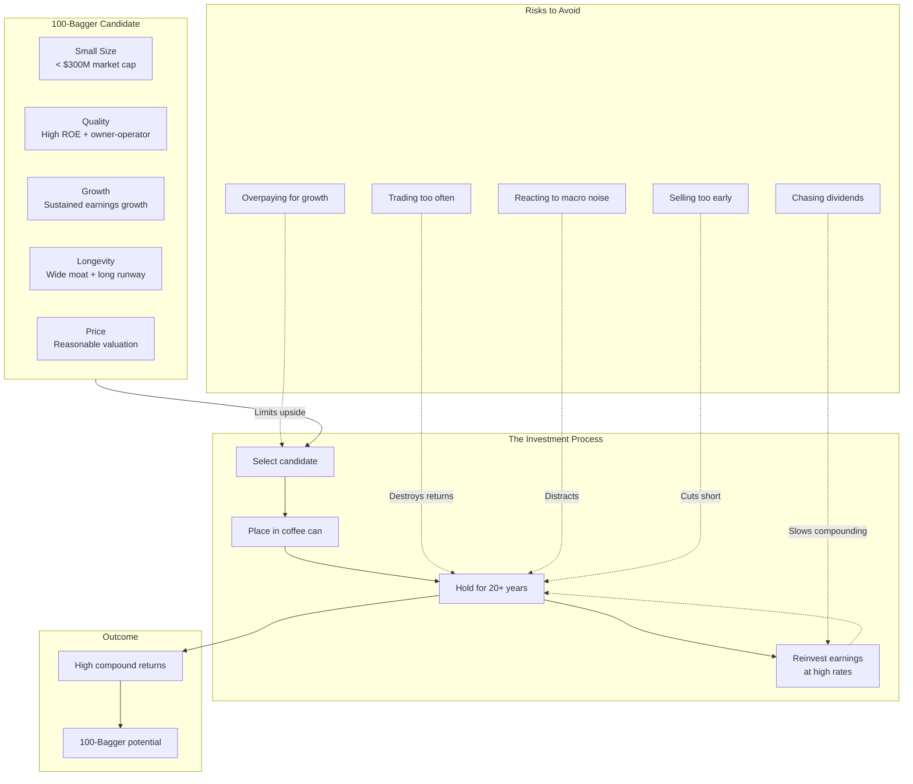

# Core Concepts

## The Coffee Can Portfolio

Mayer opens with the story of Robert Kirby, a professional portfolio
manager who coined the term "coffee can portfolio." In the Old West,
people put their valuables in a coffee can and hid it under the
mattress. The success of the strategy depended entirely on what they
chose to put in the can at the start — because they never touched it
again.

Kirby applied this to investing. In the 1970s, he told a client to
pick their best stocks, hand them over, and agree not to sell for a
decade. The results beat Kirby's own actively managed accounts. The
lesson: *most of the damage done to portfolio returns comes from
trading, not from holding.*

> "The success of the program depended entirely on the foresight used
> to select the objects to be placed in the coffee can to begin with."
> — Robert Kirby, quoted in *100 Baggers*

Mayer extends this into a core philosophy: find great businesses, put
them in the can, and leave them alone for 20+ years. Most 100-baggers
took decades to compound. You cannot collect the full return if you
keep opening the can.

---

## The SQGLP Framework

Mayer distills the common characteristics of 100-baggers into a
five-letter acronym: **SQGLP**.

| Letter | Factor | What to Look For |
|--------|--------|------------------|
| **S** | Small Size | 68% of 100-baggers had a market cap below $300M at the start |
| **Q** | Quality | High returns on capital, strong management, owner-operated |
| **G** | Growth | Sustained earnings growth over many years |
| **L** | Longevity | The ability to sustain quality and growth for decades |
| **P** | Price | A favorable entry point; multiple expansion adds fuel |

A 100-bagger is not just a great company. It is a great company bought
at a reasonable price, with a long runway, run by people with skin in
the game.

### S: Small Size

Size is the most objective filter. A $1B company must grow to $100B to
return 100x. A $50M company must grow to $5B. The math is simply easier
for small companies. Mayer found that 68% of 100-baggers started below
$300M in market cap.

### Q: Quality

Quality means two things: a strong business (high and sustainable
returns on capital) and strong management (preferably owner-operators
with 10-20%+ ownership). Mayer quotes Martin Sosnoff:

> "If management and the board have no meaningful stake in the
> company — at least 10 to 20% of the stock — throw away the proxy and
> look elsewhere." — Martin Sosnoff, *Silent Investor, Silent Loser*

### G: Growth

High earnings growth is non-negotiable. A company growing earnings at
25% annually doubles in ~3 years and compounds 100x in ~21 years. Slow
growers cannot get there regardless of valuation.

### L: Longevity

Most 100-baggers took 20-30 years. Longevity requires moats —
competitive advantages that fend off mean reversion. Mayer emphasizes
that moats are how companies *stay* great.

### P: Price

Valuation matters because multiple expansion amplifies returns. Buying
at 10x earnings when the market later assigns 20x doubles your return
before earnings growth even contributes.

---

## The Owner-Operator Advantage

A recurring theme: the best 100-baggers were run by founders or
families with large equity stakes. Owner-operators think like owners,
not employees. They allocate capital rationally, avoid empire-building,
and think in decades.

Mayer devotes significant attention to William Thorndike's *The
Outsiders*, profiling CEOs who generated extraordinary per-share value
through unconventional capital allocation — buybacks, spin-offs,
decentralization — even in mediocre industries.

> "Industry is not destiny." — William Thorndike, *The Outsiders*

The outsider CEOs (Tom Murphy at Cap Cities, Henry Singleton at
Teledyne, John Malone at TCI) shared common traits: cash-flow focus
over earnings, decentralized management, and a mania for per-share
value.

---

## Returns on Reinvested Capital

The central quantitative concept: find companies that generate high
returns on capital and have opportunities to reinvest those returns at
similarly high rates.

A company earning 30% ROE that can reinvest 100% of earnings grows at
30% annually. A company earning 15% ROE that must pay out 50% as
dividends grows at 7.5%. Over 20 years, the difference is the
difference between a 100-bagger and a 4-bagger.

This is why Mayer is skeptical of high-dividend stocks as 100-bagger
candidates. Dividends are a "leak in the boat" — capital that could be
compounding at high rates is returned to shareholders instead. He
quotes Thomas Phelps:

> "Dividends are an expensive luxury." — Thomas Phelps, *100 to 1 in
> the Stock Market*

---

---

## The Kelly Criterion and Concentration

Mayer advocates for concentrated portfolios. If you have a high-
conviction idea, bet big. He introduces the Kelly criterion — a
mathematical formula for optimal bet sizing developed by John Kelly Jr.
in 1956:

f = edge / odds

In investing terms: position size should increase with your conviction
and the asymmetry of the payoff. If a stock has 100x potential and
limited downside, a small position wastes the opportunity.

Buffett (quoted in the book) agrees:

> "I can't be involved in 50 or 75 things. That's a Noah's Ark way of
> investing — you end up with a zoo that way. I like to put meaningful
> amounts of money in a few things." — Warren Buffett

---

## Case Studies

Mayer devotes chapters to specific 100-baggers:

- **Monster Beverage** (~700-bagger) — small energy drink company that
  rode the caffeine-and-sugar wave for decades. Owner-operated,
  massive growth, ignored by Wall Street for years.
- **Amazon** (~146-bagger from IPO to 2014) — Jeff Bezos's relentless
  reinvestment at the expense of short-term profits. The ultimate
  example of high returns on reinvested capital.
- **Comcast** (~200-bagger) — a cable company. Proves that industry is
  not destiny. Good capital allocation and scale economics turned a
  pedestrian business into a compounding machine.
- **Electronic Arts** (~104-bagger from 1991 peak to 2004) — the video
  game pioneer showed that intellectual property and recurring revenue
  (Madden, FIFA) can produce extraordinary returns.
- **MTY Food Group** — a Canadian restaurant franchisor that grew
  through disciplined acquisitions, consolidating a fragmented
  industry. Small, owner-operated, and compounding at high rates.

---

## Death by Dividend

One of Mayer's more provocative ideas: dividends can destroy 100-bagger
potential. When a company pays out earnings instead of reinvesting them
at high rates, it slows compounding. Mayer argues that for long-term
investors seeking 100x returns, reinvestment is nearly always
preferable to cash dividends — unless the company genuinely cannot
deploy capital profitably.

This runs counter to the dividend-investing orthodoxy and is one of the
book's most debated claims.
