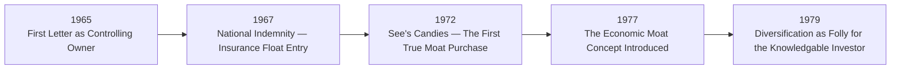
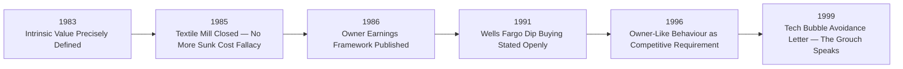
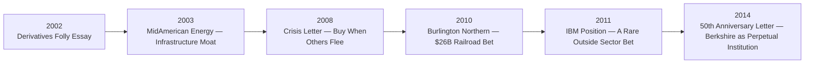
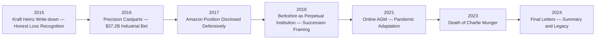

# Content Breakdown and Concept Map

## How 60 Years of Letters Fit Together

Unlike a conventional book, this volume has **no authorial architecture beyond chronology**. Warren Buffett wrote each letter independently, in response to the conditions of a specific year. The compiler's only structural choice was sequence. The reader's job is to detect the recurring ideas across decades — the themes that Buffett returned to repeatedly, refined, and eventually settled into something close to dogma.

The following breakdown groups the letters into five eras, each with its own narrative arc and its own dominant themes. Within each era, individual letters are annotated by their most important ideas.

---

## Era 1: 1965–1979 — The Foundation Years

### Context
Berkshire Hathaway in 1965 was a failing New England textile manufacturer. Buffett and Charlie Munger acquired control for approximately $18 per share, with the intention of using the company as a publicly traded vehicle to deploy capital in better businesses. These early letters document the transition from cigar-butt value investing to what would become the partnership model.

### Key Letters and Ideas

| Year | Milestone | Core Idea |
|------|-----------|-----------|
| 1965 | First letter as controlling owner | The partnership model begins; board and managers replaced |
| 1967 | Acquisition of National Indemnity | Insurance float enters the Berkshire equation |
| 1969 | Partnership dissolved | Full time at Berkshire: one vehicle, not many |
| 1972 | See's Candies for $25 million | First "moat" acquisition; buying a local business with qualitative advantages |
| 1976 | Washington Post | Journalistic independence as a moat; governance as stewardship |
| 1977 | Moat concept made explicit | Broad economic advantages that competitors cannot replicate |
| 1978 | Insurance float explained | How Berkshire's insurance operations generate cost-free capital |
| 1979 | Diversification as protection for the ignorant | Concentrated bets in high-conviction ideas |
| 1979 | Berkshire buys 15% of GEICO | Patience in waiting for the right opportunity at the right price |

### Dominant Theme: The Partnership Model
Berkshire is structured as a collection of autonomous businesses run by owner-managers with no corporate bureaucracy. Each acquired business is left alone to run day-to-day. The central office is small. The headquarters staff is minimal. Corporate overhead is, in Buffett's words, "effectively zero." This model, argued across these letters, is the reason Berkshire's retained earnings compound at above-average rates — they are deployed by people who already own the business, not by a remote central allocation committee.

---

## Era 2: 1980–1999 — The Moat Era: Building a Conglomerate

### Context
This is the period in which Berkshire transforms from an obscure holding company into a widely known investment phenomenon. The letters become longer, more confident, and more explicit about the investing framework. The "economic moat" framework is stated, restated, and applied across insurance, retail, media, and financial services.

### Key Letters and Ideas

| Year | Milestone | Core Idea |
|------|-----------|-----------|
| 1983 | Intrinsic value defined for the first time in detail | Intrinsic value = present value of all future cash, available to owners — not accounting book value |
| 1985 | Closing of Berkshire's last textile mill | Acknowledging sunk cost; admitting a business was doomed |
| 1986 | Owner earnings framework introduced | GAAP earnings insufficient; owner earnings = the relevant number |
| 1987 | Black Monday — Berkshire's stock falls 25% in a day | Investing does not stop when prices fall; the better businesses get cheaper |
| 1989 | Acquisition of Guardian Insurance | Insurance float as a strategic asset class |
| 1991 | Explicit Wells Fargo purchase explained | Buying exceptional businesses when the market is panicked |
| 1993 | Executive pay satire | Options should be priced at business value, not accounting value |
| 1996 | "Owner-Like Behaviour" letter | Owners think long-term; traders think next quarter |
| 1998 | Gen Re acquisition | A risk-managed reinsurance giant; lessons in integration |
| 1999 | "The Ground Rules" letter | Refusing to play the tech bubble; Berkshire's stock falls 44% that year |

### Dominant Theme: Intrinsic Value vs. Book Value
The escalating use of GEICO float and the building of an insurance engine require the reader to understand the gap between what Berkshire's businesses are actually worth (intrinsic value) and what the accounting books say (book value). This gap is the subject of some of the most careful explanatory prose in the entire collection.

---

## Era 3: 2000–2014 — Managing Complexity, The Financial Crisis, Derivatives Reckoning

### Context
The new millennium brings both structural complexity and a defining crisis. Berkshire becomes a conglomerate of hundreds of thousands of employees across widely disparate industries. The 2008 financial crisis provides the most vivid stress test in the company's history. Buffett's 2002 "derivatives folly" essay proves prophetic.

### Key Letters and Ideas

| Year | Milestone | Core Idea |
|------|-----------|-----------|
| 2002 | "The Derivatives Folly" essay | Derivatives concentrate risk, are nearly impossible to value, and are instruments of financial madness |
| 2002 | Clayton Homes acquired | Manufactured housing as an affordable-housing moat |
| 2003 | MidAmerican Energy | Infrastructure businesses with regulated returns as compounding vehicles |
| 2005 | Acquisition of Pacificorp | Regulated utility with a moat: can't replicate a licensed power grid |
| 2007 | Iscar acquisition | Global manufacturing tool company; Berkshire's international footprint grows |
| 2008 | Financial crisis response | "Be fearful when others are greedy, and greedy when others are fearful" — applied in real time |
| 2008 | $5B Goldman Sachs preferred | Buying quality when the market is in panic; structured like a private deal |
| 2010 | Burlington Northern Santa Fe (BNSF) | Largest acquisition ever: $26B in cash and stock for a railroad with a moat |
| 2011 | IBM position | A rare departure from the consumer-brand moat model; faith in IBM's customer lock-in |
| 2014 | 50th Anniversary Letter | The longest, most comprehensive letter in the collection; a personal stock-taking |

### Dominant Theme: Economic Moats and Why They Compound
The term "moat" — popularised by Morningstar analysts and adopted wholesale by Buffett — runs through every letter of this era. A moat is a sustainable competitive advantage: a brand, a network effect, a cost structure, a distribution system, or a regulatory position that makes it difficult for new competitors to erode profitability. The letters from this era function as an annotated catalogue of Berkshire's moat types: brand (See's, Coca-Cola), network (GEICO), infrastructure (BNSF, MidAmerican), and customer stickiness (IBM, Shaw carpet).

---

## Era 4: 2015–2024 — The Final Decades, Passing the Baton

### Context
With the death of Charlie Munger in late 2023 and Buffett in his mid-90s, the letters from this period carry an elegiac quality absent from earlier years — even as the financial analysis is as rigorous as ever. The letters address succession, the durability of the partnership model after its creators are gone, and the reality that Berkshire's next CEO will inherit a $600B+ machine that Buffett spent a lifetime building.

### Key Letters and Ideas

| Year | Milestone | Core Idea |
|------|-----------|-----------|
| 2015 | Kraft Heinz write-down | Mark-to-market accountability; honest loss recognition in a large position |
| 2016 | Precision Castparts | Betting on aerospace supply chains; the forever business thesis |
| 2017 | Apple position grows | Technology as a consumer-brand moat in disguise |
| 2019 | Berkshire as perpetual institution | No sunset clause; "we will be here forever" |
| 2020 | COVID-19 letter | The economy will recover; quality businesses survive crises |
| 2021 | AGM moves online | The partnership tradition adapts |
| 2023 | Death of Charlie Munger | Personal tribute; the closest thing to an obituary in the letters |
| 2024 | Final letter (2023/2024 tax year) | Succession confirmed in concrete terms; Greg Abel named |

### Dominant Theme: Perpetuity and Legacy
The most powerful through-line of this era is the question of whether Berkshire's partnership model can survive its founders. Buffett addresses this directly: Berkshire will continue as a perpetual vehicle, managed by people he trusts, in businesses that generate durable cash flows. The letters shift from "here is why we are buying this business" to "here is why this machine will outlast all of us."

---

## Cross-Era Concept Map: Ideas That Recur Across Decades

```mermaid
graph LR
  A["Intrinsic Value<br/>PV of future cash to owners"] --> B["Owner Earnings<br/>GAAP is a floor, not a ceiling"]
  B --> C["Buy and Hold<br/>Forever preferred; avoid transaction costs"]
  C --> D["Economic Moat<br/>The only reason to pay a premium above liquidation value"]
  D --> E["Owner-Oriented Culture<br/>Retain earnings, communicate honestly, align incentives"]
  E --> F["Stock Price vs Business Performance<br/>They diverge for long periods; don't confuse them"]
  F --> G["Analyst Expectations<br/>Wall Street noise; report for owners not speculators"]
  G --> H["Partnership Model<br/>Decentralised ops, autonomous managers, no corporate overhead"]
  H --> I["Derivatives Folly<br/>Concentrated hidden risk; financial innovation not understood"]
  I --> J["How to Read Financial Statements<br/>Balance sheet, income, cash flow — in that order of importance"]
  J --> A
```

---

## Reading Order by Purpose

This volume is most powerful read **chronologically**, cover to cover, because the letters reference each other forward and backward. However, for targeted purposes:

| Purpose | Recommended Letters |
|---------|---------------------|
| Understand buy-and-hold philosophy | 1979, 1987, 1996, 2008, 2014 |
| Learn the owner earnings method | 1986, 1991, 1992, 2014 |
| Study the acquisition history | 1972 (See's), 1978 (GEICO), 1998 (Gen Re), 2010 (BNSF) |
| Understand derivatives critique | 2002 (the stand-alone essay) |
| Study the partnership model | 1965, 1969, 1977, 1983, 2019 |
| See moat theory applied | 1977, 1988 (Coke), 2005, 2008 (BNSF), 2011 |
| Understand the 2008 crisis response | 2008, 2009, 2010 |
| Governance and incentives | 1993, 1996, 2014 |