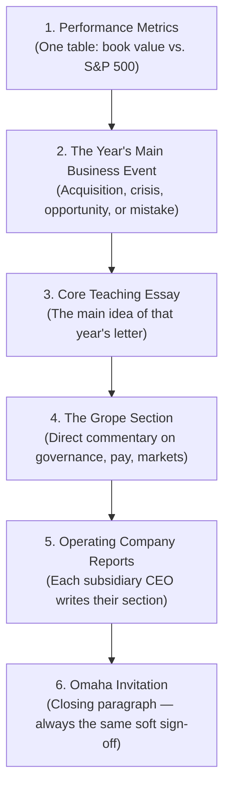
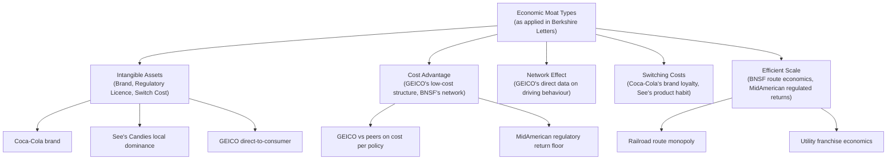

# Analysis: The Letters as Argument, Communication, and Living History

## 1. Why Annual Letters Are Uniquely Powerful as a Literary Form

Annual letters to shareholders occupy a category unlike any other corporate document. They are required by the SEC and the stock exchanges in which Berkshire trades — but the minimum legal requirement is a few paragraphs of prose and a balance sheet. Buffett wrote something else entirely: a 5,000–10,000-word essay on how he thinks about business, risk, markets, human behaviour, capital allocation, and the relationship between price and value, published in plain English with high-school-level vocabulary.

That combination — **legal obligation, intellectual ambition, and deliberate linguistic simplicity** — produces documents that have no parallel in Western corporate culture. No other CEO has sustained this quality of output for more than a decade. Buffett sustained it for almost sixty years. The letters are, in effect, a **public intellectual's multi-decade argument** conducted through the mandatory vehicle of an annual report.

The role of compiler is purely structural: **Max Olsen's contribution was to assemble, proof, and format** the letters across editions without changing a word of Buffett's prose. There is no editorial voice in the text — only Buffett's.

---

## 2. The Letters vs. The Essays of Warren Buffett

New readers approaching this volume should understand **it is different from *The Essays of Warren Buffett* (Cunningham, 1998)** in a structurally important way. The Essays reorganises Buffett's letters thematically; this volume preserves their chronological order.

| Dimension | This Volume (Letters) | The Essays (Cunningham) |
|-----------|----------------------|------------------------|
| Order | Chronological (1965–2024) | Thematic (governance → investing → M&A → accounting) |
| Purpose | Primary source archive | Textbook of investment philosophy |
| Reader's work | Detect patterns across decades | Absorb ideas in logical order |
| Context preserved | Historical event per year | Context stripped; ideas isolated |
| Best for | Understanding Buffett's actual decisions in each year | Learning the framework from scratch |
| Best for | Seeing how ideas evolve | Understanding what the ideas are |

The two volumes complement each other. Serious students of Buffett should read both — this volume first, chronologically, to see the ideas in context; the Essays second, to see them distilled.

---

## 3. Buffett's Rhetorical Method: Anatomy of a Letter

Every letter follows a recognisable structure, even as the content varies. Understanding this structure helps the reader know what to expect and where to focus attention.



### The Performance Table
The first table in every letter compares Berkshire's **per-share book value growth** against the **S&P 500 with dividends reinvested**. This is not a claim that book value equals intrinsic value — Buffett has been explicit that it does not. It is simply the standard internal metric that Berkshire has consistently used. The table quietly teaches the reader, every year, that Berkshire's long-term compounding beats the index — not by extraordinary amounts in any single year, but by not having down years. That absence of loss years is itself the story.

### The Acquisition Narrative
When Berkshire buys a significant business — See's Candies (1972), GEICO (1976, fully 1995), BNSF (2010), Precision Castparts (2016) — Buffett dedicates a section of the following year's letter to explaining the purchase. These passages are unusually transparent: he states the price, the earnings, the cash flow, the moat, and the reasons he believes the price is right. He also explains why he does not know what will happen in the short run. This transparency is not rhetorical generosity — it is a legal obligation satisfied in a way that also builds investor trust over decades.

### The Grope Section
"Grope" is Buffett's own word. In many letters, after working through the year's main narrative, he pivots to a section of pointed commentary — on executive compensation, on Wall Street's short-termism, on the folly of derivatives, on the behaviour of institutional investors. These sections are often the most quoted and the most durable. They are what make the letters into philosophy rather than corporate communications.

---

## 4. Critically: What to Read Closely, What to Skim, and Why

### Read Closely

**The 1986 letter: Owner Earnings framework.** This single section justifies owning the entire volume. It establishes the method by which Buffett evaluates any business, and it is the most precise accounting-to-investing bridge in the letters. Read it twice. Then read it again six months later.

**The 2002 letter: The Derivatives Folly.** Written four years before the global financial crisis, this letter predicted with analytical specificity the mechanism through which the crisis would arrive: financial innovation not understood by those who used it, leverage hidden inside apparently safe structures, and counter-party risk concentrated at the systemic level. Buffett calls derivatives "financial weapons of mass destruction" in the 2002 letter and names specific instruments he believes to be particularly dangerous. Subsequent letters (2003–2008) refer back to this one as conditions materialised.

**The 1996 letter: "Owner-Like Behaviour."** This letter establishes the distinction between owners and speculators with unusual precision. The argument is not merely moral — it is analytically grounded in the tax treatment of long-term holdings, the compounding advantage of avoiding transaction costs, and the psychological freedom that comes from thinking in decades rather than quarters.

**The 2014 letter: The 50th Anniversary Retrospective.** At 56 pages, the longest letter in the collection. Buffett uses it to state the entire Berkshire philosophy in one document: the acquisition strategy, the management model, the capital allocation rules, the successor question, and the economics of compounded retained earnings. This letter functions as a master key to everything else.

### Read Carefully (Not the Same as Closely)

**The annual performance table and subsidiary reports.** The table is useful for quick calibration; the subsidiary reports — usually written by the CEOs of major Berkshire units — are interesting early on (the See's Candies report, the GEICO reports) but become repetitive across many years. They are best skimmed; the Buffett-authored portions are the consistent source of new ideas.

**Letters from the late 2000s and early 2010s.** The 2008–2012 letters cover the crisis, TARP, and the slow recovery with genuine urgency and analytical depth. They are worth reading in full, but the reader should expect the tone to be more reactive than the calm, confident tone of the 1980s and 1990s.

### Skip or Skim

**Letters from 1965–1970 (with one exception).** The 1965–1967 letters are short and historical interest primarily lies in establishing the origins of the partnership model. The 1969 dissolution letter is excellent and should be read in full — it explains Buffett's decision to concentrate everything in one vehicle. The rest of the early years are brief and transitional.

**Annual reports for Berkshire's insurance subsidiaries.** These are technically dense and written for regulators. They contain useful information for specialists but can be skipped by general readers.

---

## 5. The Central Arguments and How They Evolve

### 5a. Intrinsic Value vs. Book Value

Buffett introduces the intrinsic value concept in the 1983 letter with unusual specificity: intrinsic value is the present value of all cash that can be extracted from the business, after necessary reinvestment, over its remaining life. Book value, by contrast, is an accounting concept — the residual after liabilities are subtracted from assets at their historical cost (or, in some cases, market value).

The gap between book value and intrinsic value, Buffett explains, arises from two sources: (1) assets grow in value without being reflected in the books (GEICO's brand, See's Candy's intangible franchise, BNSF's track network), and (2) Berkshire acquires businesses at prices above their book value — sometimes far above — because those businesses earn returns on book that far exceed their cost of capital.

This argument is revisited, refined, and defended in essentially every letter from 1983 onward. The 2014 letter makes the strongest case: intrinsic value per share has grown at approximately 20% annually for 50 years; book value per share has grown at approximately the same rate. The convergence is not coincidence — it reflects the fact that Berkshire's acquisitions have consistently been priced at levels that allow intrinsic value to be demonstrated through GAAP earnings over time.

### 5b. Owner Earnings

The owner earnings framework, stated most clearly in the 1986 letter, is the practical companion to the intrinsic value concept. GAAP earnings measure accounting profit — it includes depreciation, deferred tax liabilities, and other non-cash charges that do not reflect the cash actually available to the equity owner. Owner earnings adjusts for these distortions.

The formula, simplified:

```
Owner Earnings ≈ Net Income
               + Depreciation, Depletion, Amortisation
               + Certain non-cash charges
               − Estimated maintenance capital expenditure
               ± Normal working capital changes
```

The pivotal adjustment is maintenance capital expenditure — the amount needed to preserve the business's existing competitive position, not grow it. This estimate requires judgment; it is the heart of the art of business valuation as Buffett describes it. GAAP earnings cannot substitute for this judgment because GAAP capitalises certain expenditures and expenses others in ways that reflect accounting rule categories, not economic reality.

### 5c. Economic Moat

Buffett does not coin the term "moat" in the letters; he adopts it from the language of Morningstar equity analysts who began using it in the early 2000s. But the concept — a sustainable competitive advantage that protects returns on capital — is present in the letters as early as 1977. See's Candies, acquired in 1972, is described in the 1977 letter as a business with a "castle" (the business) protected by a "moat" (the brand, the product quality, the local dominance). This metaphor became the central evaluation question across every subsequent acquisition: what is the moat, how wide is it, and is it durable?

The letters from the 1980s through the 2000s are a running catalogue of moat types:



---

## 6. The Derivatives Folly (2002) — A Case Study in Prophetic Writing

The 2002 letter contains what is almost certainly the most important single essay in the collection for readers interested in financial risk. Buffett identifies several categories of derivative contracts — credit default swaps, collateralised debt obligations, and structured equity derivatives — and argues that they share three dangerous properties:

1. **Counter-party risk is concentrated and opaque.** A CDS buyer appears to have bought insurance; in a systemic crisis, the counterparty (typically a large bank) may be unable to pay.
2. **Mark-to-model replaces mark-to-market.** In the absence of liquid markets for many derivative instruments, dealers mark them to internal models. These models allow dealers to recognise profits that may not exist and report capital levels that may not be adequate.
3. **Small movements in underlying variables produce large swings in reported results.** Because derivatives are leveraged by construction, they amplify both gains and losses; the gain side is always obvious and always celebrated; the loss side appears suddenly and is always explained, in retrospect, as unforeseeable.

The 2007–2008 crisis validated each of these points with catastrophic precision. Reading the 2002 letter against the news of 2008, and then again in 2024, reveals a document whose analytical framework was not merely right about a specific outcome but for structural reasons that remain true today.

---

## 7. What the Letters Reveal About How to Read Financial Statements

Buffett's repeated advice on how to read financial statements is not a mechanical checklist — it is an argument about which questions matter most:

1. **Start with the income statement** to understand the earnings power of the business on an accounting basis. But treat it with suspicion: it is shaped by accounting conventions that may obscure economic reality.
2. **Move to the owner earnings adjustment** to estimate the cash available to the business owner. This requires estimating maintenance capital expenditure and adjusting for non-cash items.
3. **Examine the balance sheet** not primarily for the purpose of checking solvency (though that matters) but to understand the business's economic net worth and the quality of its asset base.
4. **Read the cash flow statement** to verify that owner earnings are actually being converted to cash. Persistent divergence between owner earnings and operating cash flow is a warning signal.

This sequence — income → owner earnings → balance sheet → cash flow — is repeated with variations across many letters and deserves to be treated as a systematic methodology, not a set of rhetorical flourishes.

---

## 8. Why the Letters Outlast Most Business Writing

The letters are unusual in corporate communications for reasons that emerge clearly when reading them across decades:

1. **No marketing function.** Buffett does not use the letters to sell Berkshire stock, justify a high valuation, or distract from problems. He uses them to explain how he thinks. That intention changes the quality of the prose.
2. **Self-interest aligns with honesty.** Vague writing in an SEC filing creates legal exposure. Clear writing protects him. The reader should not mistake this for altruism — it is sound legal and reputational strategy — but the effect is prose unusually free of the evasions standard in public-company communications.
3. **Third-person framing creates distance.** Buffett refers to Berkshire and its managers in the third person even though he is the primary person responsible. This is not mere convention: it reflects his actual posture toward the enterprise. He thinks of himself, primarily, as an owner/allocator serving owner/managers — not as a CEO addressing staff.
4. **The annual cadence forces compression.** Writing one substantial letter per year concentrates thinking in a way that weekly or monthly communications cannot. The reader benefits from that forced distillation.

---

## 9. Final Assessment

This volume is not a book in the conventional sense — it is an archive of sustained rationality applied to the single problem of how to deploy capital wisely over very long periods. Its value does not lie in tactical advice (markets change, businesses change, the specific stocks Buffett mentions are mostly not available at the prices he paid) but in **demonstrating what consistent, owner-oriented thinking looks like across decades of temptation, crisis, and noise**.

The reader should approach it as a record of intellectual character, not an investing manual. The character is the point. The method is the demonstration.