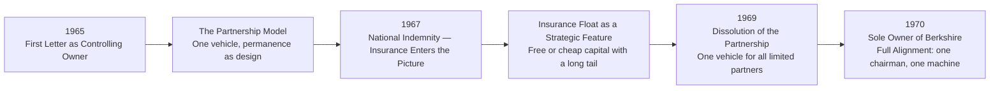
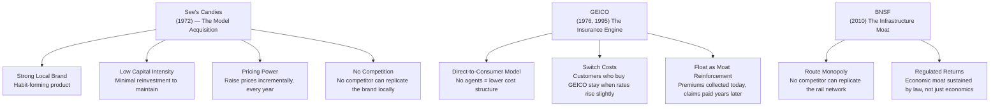
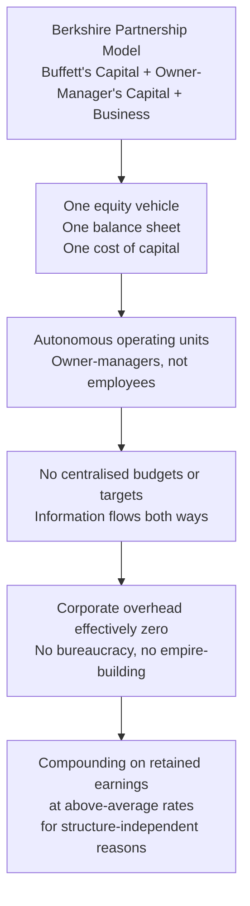
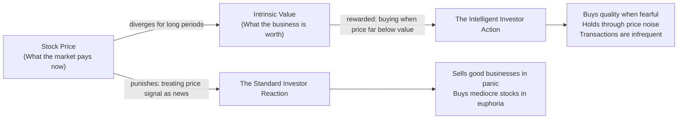
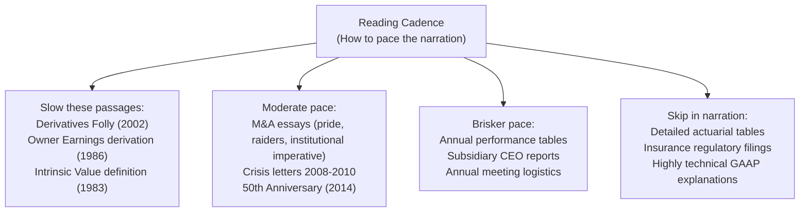

**Narrator:** *Berkshire Hathaway Letters to Shareholders — The Annual Letters of Warren Buffett, Compiled as a Stand-Alone Volume, Specially Curated Edition.* Warren E. Buffett, Chairman, Berkshire Hathaway Incorporated, from 1965 to 2024. Compiled by Max Olsen. The Self-Publishing Partnership. ISBN 9780997316587. Approximately 1,125 pages. Written not as a memoir, not as a textbook, not as advice for the markets — but as annual reports to real owners, which happen to contain more practical business and investment wisdom than any comparable body of prose in the history of American capitalism.

**Reader:** I want to push back on one thing. I have looked at these letters. They are available for free on the internet. If a reader can just go to berkshirehathaway.com, why compile them? Why assign a compiler? Why make a book?

**Narrator:** Because free does not mean read. Because available does not mean encountered. Warren Buffett is writing to a shrinking audience — individual shareholders who own stock in a single public company and who may hold it for decades. His prose does not chase the reader. It does not accommodate the reader who has not read the previous letter. It does not pause to explain a concept introduced in 1978 because by 1998, assume-shrewdly — he assumes the reader has been there. This compiler's work is to surface those threads so a new reader can catch them.

**Reader:** So the book's internal architecture is not chronological in a useful way?

**Narrator:** It is chronological. Every letter follows the year it was written. But the reader must actively trace the recurring ideas across that timeline. That is a kind of reading few people do. Most readers, when they open a volume with sixty years of letters, will sample. They need a guide.

**Reader:** Give me the guide.

---

## Part I: The First Decade — Learning to Write

**Narrator:** The 1965 letter through 1969 reads almost like a young man finding his voice. The sentences are shorter. The financial data is thinner. The tone is still close to the partnership letters. But the governing idea is already present: **this company will not behave like other public companies.** The proxy statement will not proxy. The board will not rubber stamp. The CEO will pay himself as if he were a minority owner, not a chief executive. These are not stated as progressive principles in 1965. They are simply described as the way things are.

**Reader:** That is a quieter kind of radicalism than most people realise.

**Narrator:** The 1969 dissolution letter is, in many ways, the most important of the early letters. It explains why Buffett is taking Berkshire private — not legally private, but functionally private in style and governance. He gives his limited partners a choice: take a distribution, or trust him with all their capital in one vehicle. He describes the costs of running multiple partnerships and the benefits of operating as a single, permanent enterprise. He explicitly raises the partnership model as a structure designed for the long run.



---

## Part II: The Moat Metaphor and Buying Businesses, Not Stocks

**Reader:** Move to the Section II — the middle period. 1972 See's Candies, 1977 the moat essay. Walk me through the argument for buying a local candy company.

**Narrator:** The 1972 letter is where the whole philosophy crystallises. See's Candies was available for approximately $25 million — about three times reported earnings. Buffett describes the business: a regional candy company in California, distinctive product, strong local distribution, strong brand loyalty among its customers. Critically, he describes it as a business that required no special technology, no protected patent, no regulatory licence. Its moat was **brand and habit** — the kind of moat that is rarely visible on a balance sheet but is absolutely real in the economics: See's generated meaningful and growing returns on capital year after year with virtually no reinvestment.

That last point is the key. Returns on capital are meaningful because the business requires almost no capital to maintain its position. The owner does not have to keep reinvesting just to stay even. That is what "owner earnings" will later measure precisely.



**Reader:** And in 1977, the concept gets a name.

**Narrator:** In 1977, Buffett writes explicitly about castles and moats. The language is still plain. He does not write like a strategy consultant. He writes like a man describing a real business he has bought and watched operate. But the concept is precise: **every business that earns above-average returns on capital has a moat. The job of the investor is to determine whether that moat is durable and wide enough to justify the price.** That is the question he returns to, again and again, across the next forty years.

---

## Part III: Intrinsic Value and Its Conquest of Book Value

**Reader:** Now the mechanics. Intrinsic value versus book value. Lay this out the way a narrator would present it for someone listening.

**Narrator:** [steady, deliberate pacing] The concept of intrinsic value appears with force in the 1983 letter. Buffett defines it simply: intrinsic value is the present value of all cash that can be extracted from a business, after necessary reinvestment, over its remaining life. Book value is an accounting concept. It is the residual of assets minus liabilities at their recorded cost. The two numbers diverge whenever a business earns returns on book value that are above or below its cost of capital.

At Berkshire, almost every major acquisition cost more than the target's book value. That is not because Buffett overpays. It is because the target's intrinsic value is higher than its book value — the brand, the customer relationships, the franchise value is real, even though it does not appear on the balance sheet. Book value converges slowly toward intrinsic value when a business earns above-average returns on capital and retains its earnings. Berkshire's book value per share has grown at roughly twenty percent per year for fifty years. Intrinsic value has grown at a similar rate. The convergence is not coincidence — it is the arithmetic of compounding retained earnings at high rates.

[pause] One more turn. When Berkshire buys a business at a price above book value, it is buying future intrinsic value above current book value. The acquisition creates value in the column that accounting does not see.

**Reader:** That is an important distinction. Most people see a high premium over book value and assume it is expensive. Buffett is describing a situation where the premium is economically rational because it reflects economic value not on the books.

**Narrator:** Exactly. And this is where owner earnings becomes the practical tool.

---

## Part IV: Owner Earnings — The Formula and Its Meaning

**Narrator:** [slower pace, more deliberate] The 1986 letter contains the derivation of owner earnings. Listen for the precision of the adjustment:

Owner Earnings starts with GAAP net income. Then:

[pointed — each addition a separate beat]

**Add back:** Depreciation, Depletion, and Amortisation — because these are accounting charges, not cash leaving the business.

**Add back:** Other non-cash charges — deferred taxes that will never reverse, stock-based compensation that does not require cash payment.

[shift to more conversational tone]

Now the harder part.

**Add an estimate of:** Normalised maintenance capital expenditure — the amount the business must spend each year to preserve its existing competitive position and operating capacity. This is not what the accountants say. It is what the business *must* spend to avoid losing ground. GAAP depreciation has no necessary relationship to what a business actually spends to maintain itself.

[returning to measured pace]

The final step: **subtract** any capital expenditure that is truly expansionary rather than protective of the existing business. The residual is the cash that genuinely belongs to the owner — the owner earnings.

[pause]

The practical consequence of this framework is profound. Most investors use GAAP earnings as a proxy for the cash available to owners. That is usually wrong. When a business must reinvest more than its depreciation charge just to stand still — which is structurally true of most industrial businesses — GAAP earnings overstate the cash available to the owner. Owner earnings correct for this.

The longer and more important consequence is the other direction. When a business earns returns on capital substantially above its cost of capital, ROIC applied to book value generates intrinsic value growth faster than book value growth. GAAP earnings understate owner economic income because the return on the book value exceeds the cost of capital. Owner earnings, properly estimated, captures this.

---

## Part V: The Partnership Model

**Reader:** The partnership model — explain that as if you were reading a section of the letters aloud, not summarising them.

**Narrator:** [emphatic, almost didactic — the voice Buffett uses when explaining something he believes to be self-evident but is treated as contrarian]

Berkshire is built as a partnership with the shareholders. Each operating subsidiary is run by its own owner-manager, who is wealthy enough to not require financial incentives from the parent. The parent does not run day-to-day operations. It does not set budgets, approve marketing plans, or intervene in hiring decisions. It owns — in the sense that it holds the equity and receives the dividends — but it does not manage.

The result is an information flow that goes in both directions. The subsidiary owner-managers report accurately because they are owners reporting to owners. No one is trying to manage earnings to hit a target set by head office. No one is gaming a centralised bonus formula. The cost of this structure is that it requires people with real financial means to run the businesses. The benefit is that those people behave as owners because they are owners.

[pacing shifts — more reflective]

This is the explanation Buffett returns to whenever he is asked why Berkshire's corporate overhead is so low. The answer is not efficiency-broker rhetoric about lean headquarters. The answer is that the headquarters does not exist as a management layer because the model does not require one. The few people at headquarters in Omaha are allocators and insurers and holding-company coordinators — not operational managers.



---

## Part VI: Stock Price vs. Business Performance — The Persistent Tension

**Reader:** This is where most investors fail. Make the distinction the way a narrator does.

**Narrator:** [emphatic, almost impatient — the voice Buffett uses when the market is mispricing something he owns]

The price at which a stock trades on the New York Stock Exchange has no necessary relationship to the performance of the underlying business. On a single day — a day like October 19, 1987 — the price of Berkshire shares fell approximately twenty-five percent. The performance of Berkshire's businesses did not change by one percent on that day. The productivity of See's Candies, of GEICO, of the Buffalo News — all of it was precisely what it had been the day before. Only the quotation changed.

[pause, softer]

The intelligent investor does not respond to price changes as if they were news. They accept the price that the market offers when they wish to buy or sell. They do not accept it as a verdict on the business. Over decades — long enough periods — price and value converge. But the convergence is slow and irregular, and it punishes those who mistake the price for the business.

[pause again]

Analyst expectations are a related but separate problem. Wall Street's professional investors — the ones whose consensus earnings estimates your broker quotes — have a structural relationship with the quarters of the calendar. Their bonuses, their reputations, and their model portfolios are built around twelve-month performance. Asking them to value a business on a twenty-year horizon is like asking a sprinter to run a marathon. The sprint structure creates incentive to distort, to hype, to smooth. The annual letters of Berkshire Hathaway are, in effect, a twenty-year argument conducted in response to a market that speaks in three-month sentences.



---

## Part VII: The Acquisition History as Capital Allocation Narrative

**Reader:** Walk through the three or four most important acquisitions as they would be presented in the letters.

**Narrator:** [deliberate, each acquisition a scene]

**See's Candies, 1972.** Twenty-five million dollars. A family-owned candy company in California. The central reason it matters, in Buffett's telling: it did not need to retain earnings. Every year, after a modest capital budget and a comfortable distribution to owners, See's produced cash that could be sent to Omaha and deployed somewhere else. The acquisition paid for itself within a few years, and the stream of cash it has generated since — approximately a hundred million dollars a year after tax for decades — is the clearest illustration of owner earnings in action.

**Washington Post, 1973.** Not by acquisition but through open market purchases starting in 1973. The logic: the Post had a journalism franchise with a well-defined and unthreatened local market, intense customer loyalty, and the political independence that Federalist Paper number 10 teaches us to value. The combination of brand, distribution, political-non-dependence, and high returns on capital explained why Buffett called it a high-return business whose newspaper bar was "among the highest in the country." The purchase generated compounded returns in excess of his expected long-run target for decades.

**GEICO, 1995 — 100% acquisition.** The 1976 letter already explained why GEICO's direct-to-consumer model was structurally cheaper than the agency model used by competitors. In 1995, when GEICO nearly failed, Buffett saw the opportunity to own it completely. The framework he applies: a business with a reflexive moat — its direct model generates lower costs, which allows lower premiums, which retains customers, which reduces unit costs further. It is a structural flywheel that compound over time. That flywheel, Buffett knew, would generate extraordinary returns on insurance float.

[shift to slower cadence — the most significant acquisition]

**Burlington Northern Santa Fe, 2010.** Twenty-six billion dollars. The largest single acquisition in Berkshire's history. A railroad. A regulated business. A moat that is, in its way, as durable as any: the route structure cannot be replicated. The regulatory framework limits new competition. The economics of scale in rail freight make the cost structure nearly defensible. Buffett's argument is precisely this: BNSF is an efficient-scale business — a natural monopoly whose returns are constrained primarily by regulation, not competition. For a company with Berkshire's capital requirements and its long-term compounding objective, buying a regulated, capital-intensive, monopoly-adjacent business with a point-to-point network that cannot be duplicated is one of the most rational capital-allocation decisions in the company's history.

---

## Part VIII: Derivatives Folly

**Reader:** The 2002 letter. The derivatives essay. What makes it prophetic?

**Narrator:** [firm, unemotional, almost forensic — the voice of someone stating a conclusion he has reached after watching the market build a structure he believes to be structurally dangerous]

The 2002 letter is titled, and I quote, "The Derivatives Folly: Additional Comments." It is a continuation of an argument Buffett began in the 1998 letter about the dangers of financial derivatives — particularly credit default swaps, collateralised debt obligations, and structured equity derivatives.

Three points from that letter, which proved to be precisely right:

**First:** Derivatives concentrate risk in ways that are not visible on a balance sheet. A credit default swap buyer has apparently purchased insurance against a default. But the seller of that insurance — typically a large, systemically important bank — may not have the capital to honour the obligation when the systemic event arrives. The risk was not eliminated by the derivative. It was transferred to a party that did not fully price it.

**Second:** Many derivatives are marked to model, not to market. Because there is no liquid market for many of these instruments, the dealers who trade them use internal models to value them. Those models allow profits to be recognised before they have been realised and capital to be reported before losses have occurred. This is not fraud in the conventional sense — it is the consequence of instrument design meeting accounting convention in the absence of liquid markets.

**Third:** Because derivatives include embedded leverage, they amplify both gains and losses. During calm markets, the gains are visible, celebrated, and counted as profit. During stressed markets, the losses materialise rapidly — and they are always, in retrospect, called unforeseeable. They were not unforeseeable. They were structurally inherent to the design of the products.

[pause]

What is extraordinary about this essay is not that it was warning — people warned about derivatives before 2008. What is extraordinary is that it states the mechanism with enough specificity to name the failure mode before it happened. Buffett describes credit default swaps as "financial weapons of mass destruction" because he understands that their systemic character — held by institutions that are too large and too interconnected to fail — means that a correlated stress event will transmit through the system. That transmission happened in 2007 and 2008.

---

## Part IX: How to Read the Whole Volume — A Narration Guide

**Reader:** If you have only forty hours and this 1,125 page volume, how do you read it aloud or present it?

**Narrator:** [assuming a presenter's voice now — warm, informed, practical]

**First ten hours — the arc from 1965 through 1979.** Focus on the partnership model, the See's Candies acquisition, and the origins of the insurance engine. A listener who understands these three things can understand everything else.

**Next twenty hours — 1980 through 1999**. The 1983 intrinsic value letter, the 1986 owner earnings letter, and the 1996 owner-like behaviour letter are the anchor texts. Work through them slowly. Allow time for the formulas. The M&A sections (pride, raiders, the institutional imperative) make excellent narrative segments — they have story and character. The 1998 Gen Re acquisition is Buffett's most honest account of a mistake he should not have made.

**Next six hours — 2000 through 2008.** The 2002 derivatives essay is mandatory, read in full, more than once. The 2008 crisis letters — 2008, 2009, and 2010 together — form a single narrative about what it looks like to buy when the market is in panic. Read them as a three-chapter arc.

**Final four hours — 2009–2024.** The 2014 50th anniversary letter is a master document. Read it in full. From 2015 onward, the tone shifts and the succession question comes into focus but those letters contain less in the way of new ideas. They are valuable as evidence that the partnership model has survived its founders' mortality — the point Buffett addresses directly in 2019 and again in 2023, after Charlie Munger's death.



---

## Part X: The Closing Argument

**Narrator:** [pauses, then — warmer, more reflective, less forensic]

The letters teach, in the end, that capital allocation is a practice of character, not of technique. The technique — intrinsic value estimation, owner earnings adjustment, moat identification — can be learned. The character — the willingness to be patient, to ignore short-term price movements, to own mistakes openly, to defer to long-term owners rather than to quarterly speculators — cannot be taught. It must be demonstrated. And over sixty years of annual letters, Warren Buffett demonstrated it with a consistency that is, at this point in the history of markets, genuinely rare.

A reader who comes to this volume for technique will find it. A reader who stays for the character will be there for a lifetime.

```mermaid
mindmap
  root((Berkshire Letters as Narration))
  Speaking of
    Buy and Hold with Conviction
    Owner Earnings as Tool not Teaching
    Price as Noise not Signal
    Analyst Expectations as Distraction
    Moats as the Evaluation Question
    Acquisition History as Lesson
    Derivative Risk as Structural
    Partnership Model as Organisational Design
  How to Read Aloud
    Slow on the analytical core
    Moderate on the narrative sections
    Brisker on the annual tables
    Skip the actuarial details
  Why it matters
    Sustained voice over six decades
    Not advice — demonstration
    A record of character more than technique
```

---

*All substantive content is Warren E. Buffett's. The compiler's contribution is the assembly. This narration guide is interpretive only and does not alter any text from the original letters.*