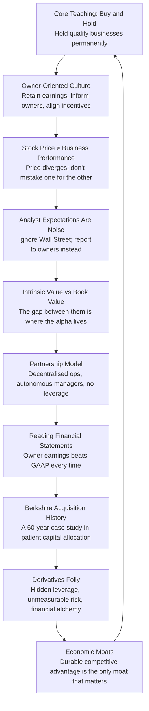

## Overview

For almost **six decades**, Warren E. Buffett has written one document every year: the annual letter to the shareholders of Berkshire Hathaway Inc. distributed each February or March alongside the company's annual report and 10-K filing. These letters are the longest-running, most consequential piece of continuous business writing in American corporate history. They are at once a statutory annual report, a thoroughgoing management discussion, a running case study in capital allocation, and a quietly sustained argument for a particular philosophy of corporate ownership.

This volume compiles those letters — from the first in **1965**, when Berkshire was a $25 million textile company trading around $18 per share, through the **2024** letter, when Berkshire is a conglomerate approaching a trillion-dollar market capitalisation — into a single searchable, shelf-ready reference. The original texts are freely available at **berkshirehathaway.com/letters**; this edition makes them accessible as a continuous reading experience.

The compiler is **Max Olsen**, who undertook the editorial work of assembling, proofing, and formatting the collection across multiple release editions (2012–2014 vintage printings; 1965–2024 digital edition). The ISBN **9780997316587** corresponds to the edition issued by **The Self-Publishing Partnership**, based on the 1965–2014 span of letters.

---

## How the Letters Work as a Book

The collected letters are not arranged by theme — they are **chronological, cumulative, and internally referenced**. Buffett routinely refers back to earlier letters: the 1983 discussion of intrinsic value reappears in the 1996 letter; the 2002 derivatives warning foretells the 2008 crisis. Reading them sequentially reveals patterns that no single letter, taken alone, communicates:

- Ideas that recur across decades, tested against new conditions, and refined
- Mistakes owned openly in one letter that reshape strategy in the next
- A single voice, unchanging in its plain-spoken clarity, explaining increasingly complex businesses

---

## Reading Map

```mermaid
mindmap
  root((Berkshire Hathaway Letters 1965-2024))
  Era 1 1965-1979
    1965 First Letter as Controlling Owner
    1972 See's Candies Acquisition
    1977 The Moat Metaphor Introduced
    1978 Insurance Float Explained
    1979 Diversification as Folly
  Era 2 1980-1999
    1983 Intrinsic Value Defined
    1985 Textile Mill Closure
    1986 Owner Earnings Framework
    1991 Wells Fargo Dip Buying
    1996 Owner-Like Behaviour
    1998 Gen Re Acquisition
    1999 Tech Bubble Avoidance
  Era 3 2000-2014
    2002 Derivatives Folly Essay
    2003 MidAmerican Energy
    2008 Financial Crisis Response
    2010 Burlington Northern Santa Fe
    2011 IBM Position Initiated
    2014 50th Anniversary Letter
  Era 4 2015-2024
    2015 Kraft Heinz Write-down
    2016 Precision Castparts
    2017 Amazon Disclosure
    2019 Berkshire as Perpetual Institution
    2021 AGM Replaced by Online Event
    2023 Death of Charlie Munger
    2024 Final Annual Letters
  Enduring Themes
    Buy and Hold
    Intrinsic Value
    Economic Moat
    Owner Earnings
    Capital Allocation
    Derivatives Risk
    Owner-Oriented Culture
    Partnership Model
```

---

## What Is in Each Letter

Every annual letter follows a recognisable structure:

1. **The Performance Table** — Berkshire's per-share book value and market price compared to the S&P 500, with dividends included
2. **A narrative on that year's managing partner** — the CEO of each major subsidiary writes a section
3. **Buffett's main essay** — covering the year's most important business event, a core investment idea, an acquisition explained, or a warning about financial practices
4. **The Grope Section** — in many letters, a closing section of direct, sometimes pointed, commentary on corporate governance, executive pay, or market folly
5. **The Shareholder Meeting Invitation** — always closed with an invitation to Omaha for the annual meeting

---

## Metadata

| Field | Value |
|-------|-------|
| Author | Warren E. Buffett |
| Role | Chairman, Berkshire Hathaway Inc. |
| Compiler | Max Olsen |
| Publisher | The Self-Publishing Partnership |
| First Compiled | c. 1997 (letters from 1965) |
| This Edition (ISBN) | 9780997316587 |
| Letter Span | 1965–2024 |
| Pages | ~1,125 (varies by edition) |
| Language | English |
| Source | berkshirehathaway.com/letters |

---

## Key Distinctions from The Essays of Warren Buffett

This volume should not be confused with *The Essays of Warren Buffett: Lessons for Corporate America* (Lawrence A. Cunningham, ed., Carrum Asset Management, 1998, ISBN 9781576600760), which reorganises Buffett's letters thematically. This volume is **chronological** — the letters appear in the order they were written. Where *Essays* is a textbook of Buffett's philosophy structured for instruction, this volume is the **primary source archive**, preserving the exact annual context in which each idea was developed and applied.

---

## Eternal Concepts Taught Across the Letters



---

import { BookCard } from '@/components/BookCard'

<BookCard
  related
  title="The Buffett Partnership Letters 1956–1975"
  slug="buffett-partnership-letters-warren-buffett"
  description="The pre-Berkshire partnership letters — the intellectual foundation upon which everything in this volume was built."
/>
<BookCard
  related
  title="The Essays of Warren Buffett: Lessons for Corporate America"
  slug="essays-of-warren-buffett-lawrence-cunningham"
  description="Cunningham's thematic curation of the same source material — organised by idea rather than by year."
/>