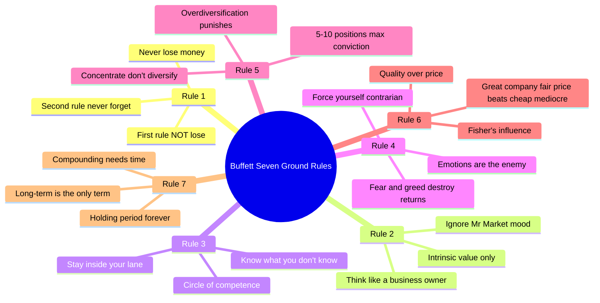
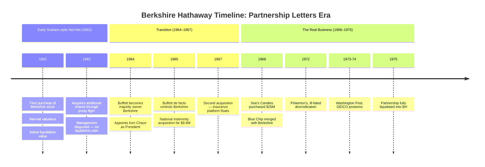

## Seven Principles: The Investment Ground Rules

Buffett condensed his partnership-era philosophy into seven recurring
statements. These are not commandments; they are the results of 14 years of
real-world capital at risk, tested in bull markets, bear markets, and the
full range of human emotion.

### 1. Never Lose Money (and Don't Forget It)

Buffett does not mean "avoid all drawdowns." He means that the mathematical
consequence of a large loss is irretrievable by ordinary means. A 50% loss
requires a 100% gain to recover — an asymmetric penalty. This principle is the
foundation of the **margin of safety** concept borrowed from Ben Graham and
applied with ever-greater rigor throughout the partnership.

The principle produces a particular risk posture: Buffett didn't buy
speculative stocks he merely hoped might go up. He bought situations where the
downside was bounded by identifiable assets, earnings flows, or contractual
cash flows. Every position in the partnership was traceable to a specific
margin-of-safety calculation.

### 2. Think Like a Business Owner

The partnership was buying pieces of businesses, not slices of price action.
This distinction is what separates investing from speculation in Buffett's
framework — a distinction that is often abused but was rigorous in practice.
When he bought Sanborn Map in 1961, he didn't just buy the stock; he studied
the map's competitive position, its customers, its competitors, and the
economics of geographic survey data. Then he bought control and reorganised
the company.

### 3. Circle of Competence

The phrase originates in this period. Buffett knew insurance, railroad
economics, consumer brands, and a handful of other areas cold. He refused to
invest in anything else — not because it might not be profitable, but because
he could not estimate a floor value accurately enough to satisfy Rule 1.

This self-discipline is harder than it sounds. Buffett turned down hundreds of
"hot" ideas through the 1960s. His 1963 letter specifically distanced himself
from technology stocks of the era (computers, aerospace) because he could not
estimate their competitive durability.

### 4. Keep Emotions Out of the Decision

Buffett's letters describe Mr. Market — his teacher Ben Graham's metaphor — as
a manic-depressive who offers you a price every day. The Mr. Market character
is the emotional counterforce: when he is euphoric, his prices are too high;
when he is despondent, his prices are too low. The investor's obligation is to
ignore his mood and price based only on business fundamentals.

This principle has **asymmetric practical effects**. Most investors buy when
the market is rising — because it confirms their decision — and sell when it
is falling — because it contradicts their decision. Buffett did the reverse.
He accumulated heavily in 1974 when the S&P 500 fell 47%, buying Washington
Post at a fraction of its private-market valuation. The market's despair
created his best entry point in a decade.

### 5. Concentrate, Don't Diversify

This principle puts Buffett in direct opposition to modern portfolio theory.
Markowitz (1952) had proven that diversification reduces variance; every
portfolio theory course in the 1960s trained managers to hold 20–40 names.
Buffett held 5–10.

His logic is Bayesian. A genuine informational advantage about one company is
worth concentrating. If you know more about See's Candies than anyone else
(the brand durability, the pricing power, the moat against private label), a
large position generates higher risk-adjusted returns than spreading that same
conviction across twelve stocks you know less well.

The weakness of this approach is that it depends on self-knowledge. Buffett
rarely admits error publicly — but he does describe situations in 1968 where
his concentration in names like Texas National Petroleum exposed the portfolio
to sector-specific shocks that diversification would have mitigated.

### 6. Cigar-Butt Investing Constrains Performance

The **"cigar-butt"** strategy (one free puff left, sell the butt for a penny)
is Ben Graham's formulation of net-net investing: buy stocks trading below
liquidation value of their net assets. The returns are statistical — you buy
enough butts and eventually one pays off — but the payoff structure is
constrained. You make a dollar from a fifty-cent purchase. Not ten dollars.

Buffett's evolution, documented in the partnership letters, is the reversal of
this logic. By 1966–67, after encounters with Charlie Munger and his own
experience with American Express and Disney positions, he writes that a
**wonderful business at a fair price is a better long-term investment than a
fair business at a wonderful price**.

This is the moment where Buffett ceases to be a Graham disciple and begins to
be the investor who builds Berkshire. The letters from this transitional period
are the most intellectually interesting in the collection.

### 7. The Concept of Intrinsic Value and Moat

*Intrinsic value* was Buffett's core metric throughout the partnership, though
he was always clear that it is an estimate, not a mathematical precision. By
1975 he had refined the concept to what Berkshire still uses today: the
discounted value of all future cash that can be taken out of a business over
its remaining life.

The **economic moat** concept — first named explicitly in Coca-Cola
investment analysis post-partnership — has its roots in these letters. Buffett
regularly assessed whether a business had characteristics that would protect its
earning power from competition. Consumer brands with switching costs, toll-road
economics, regulated natural monopolies: these were businesses where the moat
produced a floor on earnings power that made the weather of the economy
irrelevant.

---

## Berkshire Hathaway Origins: From Cigar Butt to Platform

The Berkshire journey through these letters is a master class in intellectual
honesty and willingness to change one's mind. Buffett bet against Graham on a
textile company and won the control of the overall company while losing on the
textile business — which atrophied to insignificance by the 1990s. The
business that mattered was the insurance float and the capital-allocation
skill he built on top of it.

---

## Convertible Arbitrage: The Underappreciated Middle Chapter

Most discussions of Buffett reduce his evolution to: Graham → Fisher → Berkshire.
But there is a middle chapter that the partnership letters illuminate: **the
convertible arbitrage period (1961–1967)**. During these years, Buffett's
largest and highest-conviction positions were often convertible securities —
bonds and preferred shares that combined a bond floor with equity upside.

The strategic logic was elegant:

1. The company must be fundamentally sound (Rule 1: no permanent losses).
2. The bond must be cheap relative to the equity (margin of safety).
3. The conversion feature is a free option on the upside.

Because the bond traded independently from the equity — often in different
markets, sometimes with different sets of holders doing the analysis — the
arbitrage opportunity frequently persisted. Buffett's liquidity-insurance
experience (he had sold insurance policies as a Graham assignment) gave him a
unique edge in pricing this instrument.

He eventually abandoned the arbitrage structure for a simpler equity approach —
preferring direct ownership of earnings power over the contractual structure
of a convertible — but the analytical discipline he built in the convertible
period is precisely what made his later concentrated equity positions so
defensible.

---

## Why Buffett Closed the Partnership

The 1969 letter to partners is the most emotionally honest document in the
collection. Buffett had been running above 20% compounded annual returns for
more than a decade. His net worth was $25 million. He was 39 years old. The
market was expensive. His capital base was $100 million+ and growing. Faced
with the arithmetic certainty that his edge would degrade as assets under
management grew further, he chose to close the partnership rather than dilute
performance.

The reasoning, unpacked:

| Factor | Impact |
|--------|-------|
| Capital growth vs. opportunity set | Beyond ~$100M, his best ideas could not be sized |
| Fee compression | As assets grew, fee percentages remained constant but absolute returns per idea fell |
| Behavioral consistency | Running underperforming periods against new capital psychology would damage discipline |
| Insurance float as replacement | National Indemnity provided a growing, permanent float structure |
| Genuine market tiredness | Valuations in 1969 were elevated in the quality names he tracked |

The decision was rare in investment history. Most managers expand, raise fees,
dilute performance, and retire wealthy without ever being the best version of
their younger selves. Buffett chose to stop rather than suffer the erosion of
his own edge.

---

## Counterarguments and Limitations

**On concentration:** Buffetts's 5–10 rule works if and only if his information
edge is real and durable. There are no studies that replicate his concentration
approach at scale; his edge was partly personal (decades of meeting management)
and partly institutional (he had no real competitors in his early partnership
format). A typical retail investor does not have a circle of competence wide
enough to hold 5 names — they should hold broader baskets.

**On emotional control:** The Mr. Market mental model is elegant but demands
exceptional temperament. Most investors will panic when the market falls 40%,
no matter how many times they have read the letters. Buffett's emotional
architecture — developed through childhood, shaped by a father who was an
investor himself, fortified by experience — cannot be taught from a text.

**On the cigar-butt transition:** Buffett's rejection of deep-value Graham-style
net-net investing in favour of quality-at-reasonable-price is well-documented
in these letters, but the transition was neither clean nor universally correct.
Buffett bought Berkshire Hathaway in 1962 specifically as a Graham net-net. He
held it for 20 years before the textile operations were shut down (1985). The
textile business destroyed roughly $200 million in invested capital during his
ownership — the worst single investment in Berkshire history. He held it,
variously, because of management loyalty (Ken Chace), inertia, and the hope
that the insurance float was worth more than the textile losses. It was, in
the end — but the arithmetic was only positive because float grew so fast in
the 1970s and 1980s that it overwhelmed the textile drag. This is not a clean
illustration of any Buffett principle.

**On intrinsic value estimation:** Buffett repeatedly acknowledged that
intrinsic value is an estimate, not a precision. Yet he also acted as though
it were a fixed number. The tension is unresolved in the letters and is worth
holding in mind when reading them: the gap between his stated humility about
valuation uncertainty and his practical willingness to bet large stakes on
those estimates.

---

## Connections to Other Thinkers and Books

| Book / Thinker | Relationship |
|----------------|--------------|
| *The Intelligent Investor* — Benjamin Graham (1949) | Buffett's partnership structure is Graham's defensive-investor framework applied with an active-management twist |
| *Common Stocks and Uncommon Profits* — Philip Fisher (1958) | Fisher's emphasis on quality and moat is the bridge between Graham and Buffett |
| *Poor Charlie's Almanack* — Charlie Munger (2005) | Munger's "lollapalooza" effects and multidisciplinary thinking shaped Buffett's post-1970 approach |
| *The Essays of Warren Buffett* — Lawrence Cunningham | This and the partnership letters together form the complete Buffett canon |
| *Margin of Safety* — Seth Klarman (1991) | The most direct heir to the Graham-Buffett tradition; explicitly builds on partnership principles |
