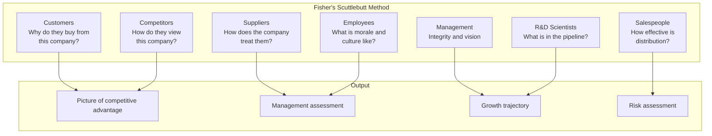
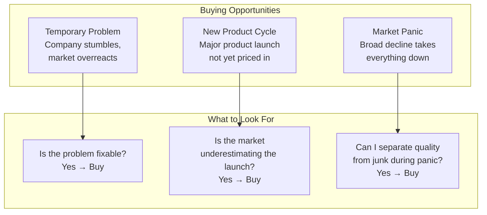

## The Scuttlebutt Method

Fisher believed that financial statements tell you what has already
happened. The scuttlebutt method tells you what is about to happen.

---

## The Fifteen Points

Fisher's framework for identifying superior growth companies:

### Points 1-5: Market and R&D

| # | Point | What to Look For |
|---|-------|------------------|
| 1 | Market potential | Is there growth for years to come? |
| 2 | R&D effectiveness | Has past R&D translated to profitable products? |
| 3 | R&D vs. sales | Is the company's research effort proportional to its size? |
| 4 | Sales organization | Does the company sell effectively? |
| 5 | Profit margins | Are margins sustainable, not just high? |

### Points 6-10: Operations

| # | Point | What to Look For |
|---|-------|------------------|
| 6 | Cost and financial analysis | Does the company know its costs in detail? |
| 7 | Industry position | Is the company a leader or a follower? |
| 8 | Management depth | Is there a strong team, not just a star CEO? |
| 9 | Internal management | Does the company train and promote effectively? |
| 10 | Management integrity | Is management honest with shareholders? |

### Points 11-15: Growth and Durability

| # | Point | What to Look For |
|---|-------|------------------|
| 11 | Long-term outlook | Does management think in decades? |
| 12 | Reporting | Are shareholders told the truth, even when bad? |
| 13 | Management tone | Is there a culture of excellence? |
| 14 | Capital allocation | Are retained earnings used wisely? |
| 15 | Re-investment opportunity | Can the company deploy more capital at high returns? |

---

## The Qualitative Framework

Fisher's approach is the opposite of Graham's. Where Graham asked "Is
this stock cheap?" Fisher asked "Is this company great?"

| Dimension | Fisher's Question |
|-----------|-------------------|
| Growth | Can this company grow revenue at 15%+ for 10+ years? |
| Moat | Why can't competitors take its business? |
| Management | Is management talented, honest, and long-term oriented? |
| Operations | Is the company efficient and does it understand its costs? |
| Capital Allocation | Will retained earnings be deployed profitably? |

---

## When to Buy

Fisher identified three buying opportunities:

1. **Temporary, fixable problems.** A great company has a product
   delay, a regulatory setback, or a bad quarter. The issue is fixable.
   The market overreacts. Buy.

2. **New product cycle.** A company with a strong R&D pipeline is on
   the verge of launching a major new product. The market has not yet
   priced it in. Buy.

3. **Market panic.** A broad market decline takes great companies down
   along with bad ones. This is the best buying opportunity of all.

---

## When to Sell

Fisher: sell only for three reasons:

1. **The original purchase was a mistake.** You misjudged the company.
   It was never as good as you thought.

2. **The company has fundamentally changed.** The competitive advantage
   is gone. Management has changed. The growth thesis is broken.

3. **A much better opportunity exists.** You found a company with
   substantially higher return potential than your current holdings.

The worst reasons to sell: the stock went up (profit booking), the
stock went down (stop-loss), the market had a bad month, you need the
money for something else.

---

## Dividends

Fisher's view on dividends is nuanced:

| When Dividends Matter | When They Don't |
|----------------------|-----------------|
| Company cannot deploy capital profitably | Company has high-return reinvestment opportunities |
| Management is hoarding cash without purpose | Company is growing faster than dividends would provide |
| Dividend signals management confidence | Dividend is needed to attract yield-seeking investors |

The key question: **can the company earn more on retained earnings
than the shareholder could earn elsewhere?** If yes, retain. If no,
distribute.

---

## The Fisher Philosophy Summarized

1. **Buy great companies** with sustainable competitive advantages
2. **Research them deeply** — scuttlebutt, not just financials
3. **Hold them for the long term** — decades, not quarters
4. **Concentrate your portfolio** — 5-10 best ideas
5. **Buy on temporary weakness**
6. **Sell almost never**
7. **Think like an owner** — the stock market is a mechanism for owning
   businesses, not a gambling casino

---

## Key Lessons

- The scuttlebutt method reveals what financials cannot
- R&D must translate to profits — spending is not enough
- Sales capability is a competitive advantage
- Management integrity is non-negotiable
- Hold great companies for decades
- Concentrate your best ideas
- Buy during temporary, fixable problems
- Ignore short-term earnings noise
- Dividends matter only when capital cannot be reinvested profitably

---

## Practical Applications

### For Individual Investors

- Develop a scuttlebutt habit: talk to customers and employees of
  companies you own
- Apply the fifteen points to any company before investing
- Extend your holding period target to 5-10 years minimum
- Reduce portfolio size — 10 stocks max

### For Fund Managers

- Build a qualitative research team (analysts who visit companies)
- Use Fisher's framework as a red-flag checklist
- Measure managers on long-term results (5-year rolling)

---

## Action Plan

1. **Pick one company you own or are considering**
2. **Apply the fifteen points** — score each from 1-5
3. **Interview one customer, one competitor, and one employee** (the
   scuttlebutt method)
4. **Compare your scuttlebutt findings with the financial statements**
5. **Commit to a 5-year minimum holding period** for any new position
6. **Reduce your portfolio** — sell your weakest conviction ideas
7. **Read Fisher's other works** — *Conservative Investors Sleep
   Well* and *Developing an Investment Philosophy*
