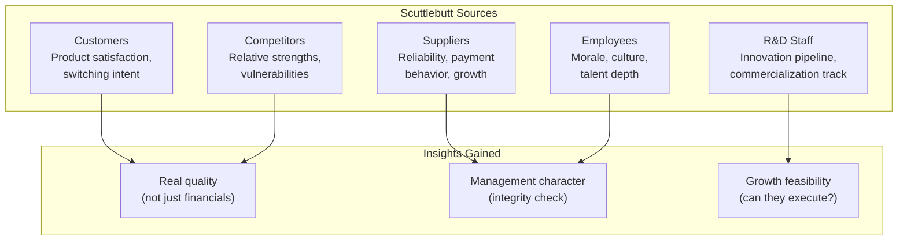

## Introduction

Welcome to BookAtlas. Today: *Common Stocks and Uncommon Profits* by
Philip A. Fisher. Published 1958, John Wiley & Sons. 320 pages.

This is the book that taught Warren Buffett the difference between
buying a cheap stock and buying a great company. Buffett started as a
pure Graham disciple — buying "cigar butt" stocks with a puff left in
them. After meeting Fisher and reading this book, he shifted: "It's far
better to buy a wonderful company at a fair price than a fair company
at a wonderful price."

Today: a growth investor who follows Fisher's scuttlebutt method
religiously, and a value investor who thinks Fisher's approach is too
optimistic and too expensive.

---

## Scuttlebutt: Intelligence from the Ground

**Growth Investor:** The scuttlebutt method is the most powerful
research technique ever devised. I spent three years researching a
company before investing. I interviewed 50 customers, 10 competitors,
and a dozen former employees. I knew the business better than most of
its executives. That kind of knowledge gives you the conviction to
hold through any short-term noise.

**Value Investor:** That's a huge amount of work. Most investors do not
have the time or access. And you can be wrong anyway — all those
interviews might miss a disruption that none of the participants see
coming. Fisher's method works, but it is not scalable.

---

## The Fifteen Points

**Growth Investor:** The fifteen points are a checklist for
investment research. Going through them systematically prevents
confirmation bias. If a company fails on management integrity (point
10) or capital allocation (point 14), nothing else matters.

**Value Investor:** The points are subjective. What does "good" R&D
effectiveness look like? You can make the scoring fit any conclusion
you want. And Fisher excludes quantitative metrics entirely — no
discussion of P/E ratios, debt levels, or return on equity. That is a
gap.

---

## The Role of Price

**Growth Investor:** Fisher's view is that price is secondary for
truly great growth companies. If a company can grow earnings at 20%
for 20 years, buying at 40x P/E is fine — the earnings growth will
quickly bring the valuation down. The magic is in the compounding.

**Value Investor:** That is survivorship bias. You know which companies
grew at 20% for 20 years, but only in hindsight. For every Asian
Paints, there are dozens of companies that looked like growth stocks
and disappointed. If you pay 40x P/E for a company that delivers 10%
growth, you lose money for years. Fisher's framework does not protect
you from this.

---

## When to Sell

**Growth Investor:** Fisher's three sell rules are perfect. If the
original thesis was wrong, if the company has changed fundamentally,
or if you find something much better — sell. Everything else is noise.
"Profit booking" and "stop-loss" are not valid reasons.

**Value Investor:** The "much better opportunity" exception is
dangerous. It becomes a psychological escape hatch. Every time the
market goes up, you find "much better opportunities." Fisher's advice
is correct in spirit, but most investors lack the discipline to apply
it correctly.

---

## The Verdict: Graham vs. Fisher

**Growth Investor:** You need Fisher. Graham tells you how to avoid
overpaying. Fisher tells you what to buy. A complete investor needs
both — Graham for the price you pay and Fisher for the quality you
get.

**Value Investor:** I would say Graham is more important. You can make
money buying mediocre companies at great prices. You cannot make money
buying great companies at terrible prices. Fisher without Graham is
dangerous.

**Growth Investor:** And Graham without Fisher keeps you in mediocre
companies that never compound. They are complementary. Buffett needed
both. So do we.

---

## Final Thoughts

*Common Stocks and Uncommon Profits* is an essential part of the
investor's education. The scuttlebutt method, the fifteen points, and
the emphasis on long-term holding are timeless insights.

But the book is incomplete without a valuation framework. Fisher tells
you what to buy; you need Graham to tell you what to pay. Together,
they form the most powerful investing framework ever developed. Apart,
each has dangerous blind spots.

This has been a BookAtlas narration of Common Stocks and Uncommon
Profits by Philip Fisher. Thanks for listening.
