# Content Breakdown

## Section-Agnostic Concept Map

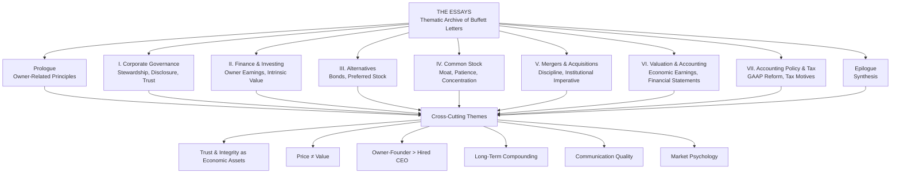

---

## Prologue: Owner-Related Business Principles

The Prologue establishes the central organizing metaphor of the entire volume: **the owner-steward**. Buffett does not waste time distinguishing between an owner who operates the business and a hired manager who administers it — he simply states the difference as the precondition for every other argument that follows.

> "We do not want to elect people to our board who have other significant demands on their time... We want directors who will treat our shareholders' money as if it were their own."

### Key Passages (Cunningham Selections)

| Theme | Buffett's Argument | Evidence/Example |
|-------|-------------------|-----------------|
| Owners vs. managers | The manager who has most of his net worth in the business thinks differently than one who does not | See's Candies — owner-operators run it better than anyone could from Omaha |
| Trust as moat | Honesty in accounting and communication costs nothing upfront and compounds forever | Berkshire's long-term counterparty relationships |
| Long-term orientation | "Our favorite holding period is forever" | The Coca-Cola stake: held since 1988 through multiple crisis cycles |
| Patience as edge | Most market participants operate on short time horizons; this creates opportunity | Buy-and-hold vs. active trading returns compared across decades |

### The Owner-Founder Archetype

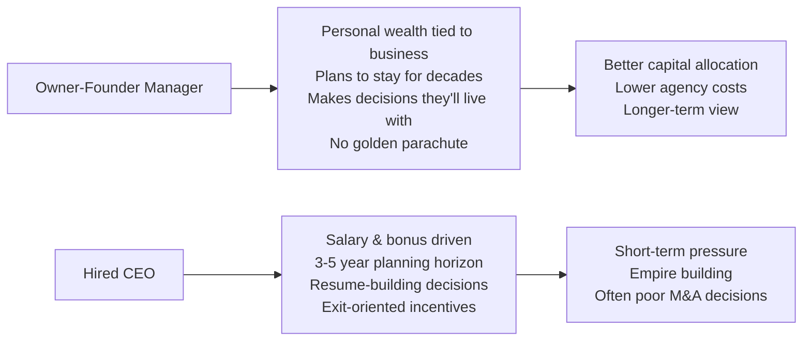

---

## I. Corporate Governance

### Core Principles

Full and fair disclosure is not merely a legal requirement — it is the social contract between a public company and its owners. Buffett writes about governance through concrete examples: the Salomon Brothers crisis management, the role of independent directors, executive pay, and what honest reporting actually looks like in practice.

### Key Topics Covered

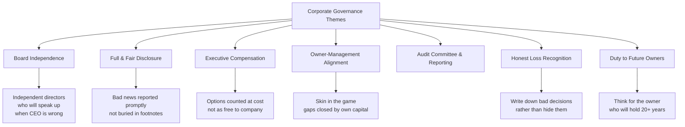

### The Governance Imperative

| Problem | Buffett's Solution | Why It Matters |
|---------|-------------------|---------------|
| Management empire-building | Owner-run businesses don't build empires | Saves capital that would be wasted on overpaid acquisitions |
| Earnings manipulation | Full, timely disclosure of bad results | Builds credibility that pays dividends during crises |
| Misaligned pay | Compensate on owner returns, not accretion accounting | Long-term incentive structures outperform short-term metrics |
| Passive boards | Directors who genuinely represent owners | Independent oversight prevents the CEO from running unchecked |

---

## II. Finance and Investing

### The Core Financial Concepts

This is the **analytical heart** of the book. Cunningham selects passages where Buffett explains the machinery of valuation — not through formulas, but through the stories of actual purchases and sales. The mathematical core is the concept of **owner earnings** and **economic goodwill**.

### Owner Earnings vs. GAAP Earnings

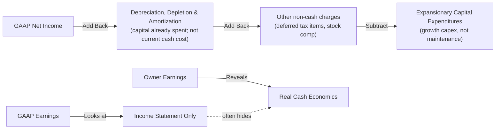

### Intrinsic Value Definition

> "Intrinsic value can be defined simply: It is the discounted value of the cash that can be taken out of a business during its remaining life."

Book value is a poor guide: at Coca-Cola (purchased in 1988), Buffett paid a significant premium to book value — because the brand's economic value far exceeded its accounting carrying value. The investment's success validated the framework.

---

## III. Alternatives to Common Stock

### The Inflation Argument Against Bonds

Buffett's consistent position on fixed income: over long periods, bonds deliver returns that barely protect purchasing power — and during periods of elevated inflation, bonds guarantee a real loss.

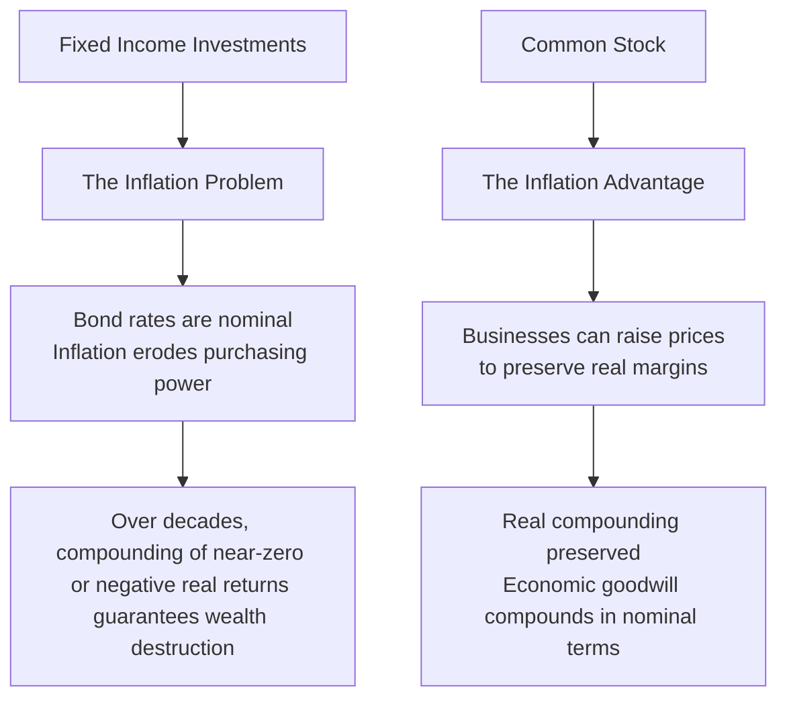

### The Preferred Stock Structuring Lesson

Buffett's experience with preferred stock investments (Salomon, GEICO rescue, Freddie/Fannie structure) shows both the appeal — fixed dividend, priority in liquidation — and the limits: when trouble arrives, preferred stock is still equity, and equity gets hurt last.

---

## IV. Common Stock

### The Moat Framework

The single most important lens for evaluating a common stock investment is the durability of the competitive advantage — the **economic moat**. This concept, popularized by Warren Buffett but rarely correctly applied, recurs throughout multiple sections of *The Essays*.

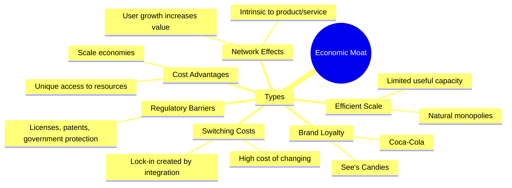

### The Buy-and-Hold Imperative

> "If you aren't willing to own a stock for ten years, don't even think about owning it for ten minutes."

Transaction costs, tax drag, and behavioral errors consistently erode the returns of active traders. The calculus is straightforward but counter-intuitive: **a great business purchased at a fair price will compound more reliably than a portfolio of good-looking but mediocre businesses**.

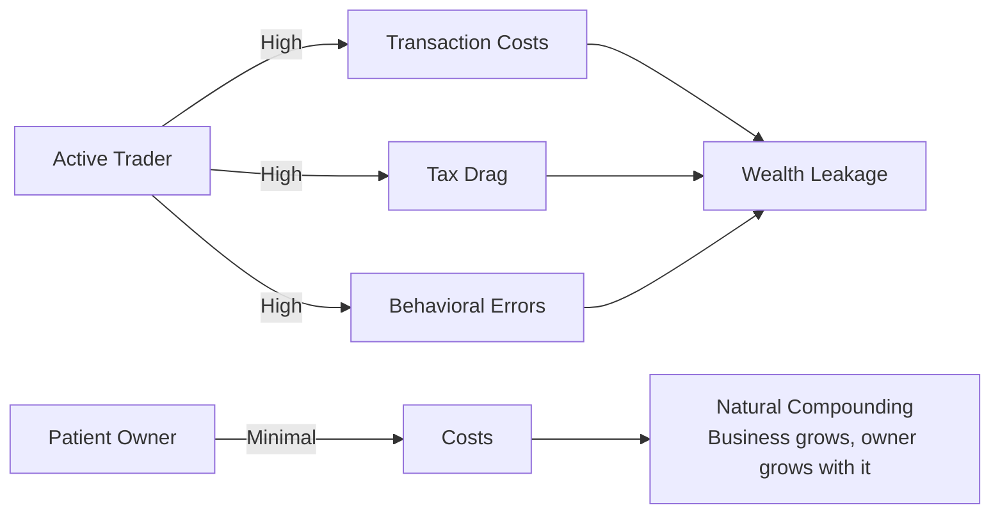

---

## V. Mergers and Acquisitions

### The Institutional Imperative

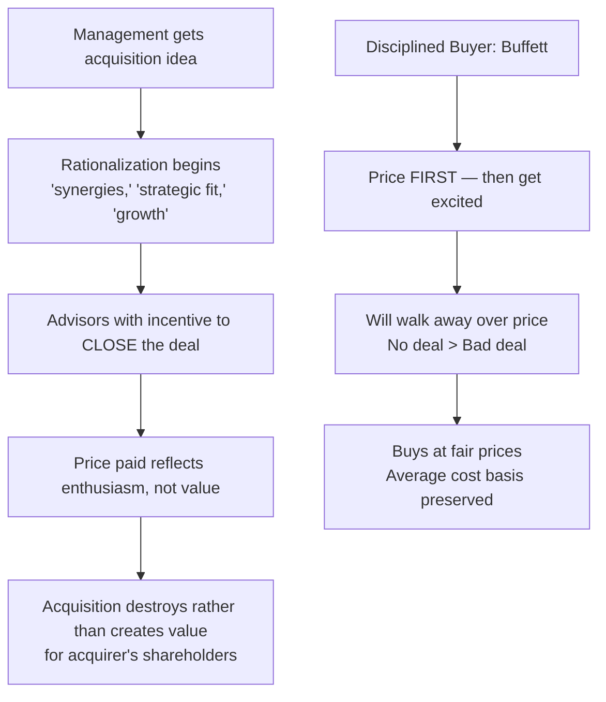

### The Root Causes of Value Destruction in M&A

1. **The Ego Impulse** — Empire-building by CEOs whose self-worth is tied to company size
2. **The Advisory Trap** — Deal fees generate revenue regardless of the outcome
3. **The Momentum Effect** — Once a merger is announced, reversing course becomes publicly embarrassing
4. **The Synergy Mirage** — Projected synergies rarely materialize; they exist in spreadsheets, not in culture

---

## VI. Valuation and Accounting

### What Is Economic Earnings?

Economic earnings (owner earnings, free cash flow to equity) differ from GAAP earnings in ways that matter enormously for long-term investors:

| GAAP Ignores | Owner Earnings Includes |
|--------------|------------------------|
| Amortization of goodwill that has demonstrably failed | Impairment charges that represent real cash past |
| Intangible assets with no measurable limit | Economic value of established brands with pricing power |
| Certain tax attributes | Deferred tax benefits that may never be realized |
| Maintenance vs. growth capex split | Normalized maintenance spending the business actually requires |

### Reading the Financial Statements

Cunningham's curation highlights Buffett's instruction that **the cash flow statement is more important than the income statement, which is more important than the balance sheet** — a sharp inversion of how most investors allocate their attention.

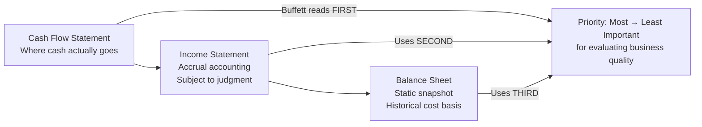

---

## VII. Accounting Policy and Tax Matters

### The Stock Options Argument

The most politically charged accounting issue addressed across the letters is the treatment of **employee stock options**. Buffett's long-running argument: options are a real cost to the company, they represent a transfer of value from existing owners to employees, and accounting rules should reflect this honestly.

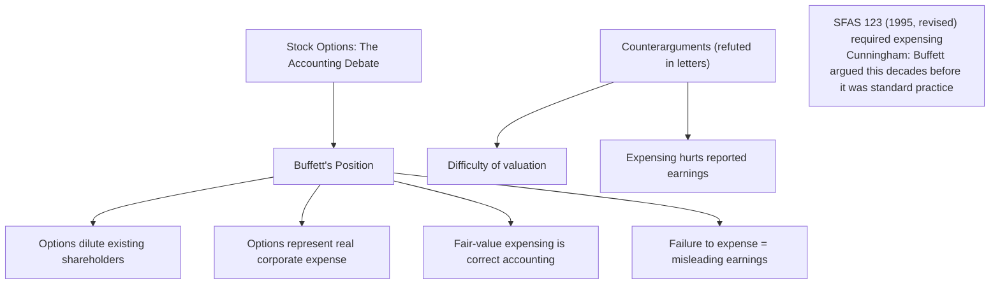

### Tax and Economic Reality

GAAP's tendency to create timing differences between reported earnings and economic reality has structural consequences: tax-motivated accounting decisions divert capital from its most productive uses. Buffett's consistent message: the tax code should not drive investment decisions; economic logic should.

---

## Cross-Cutting Themes

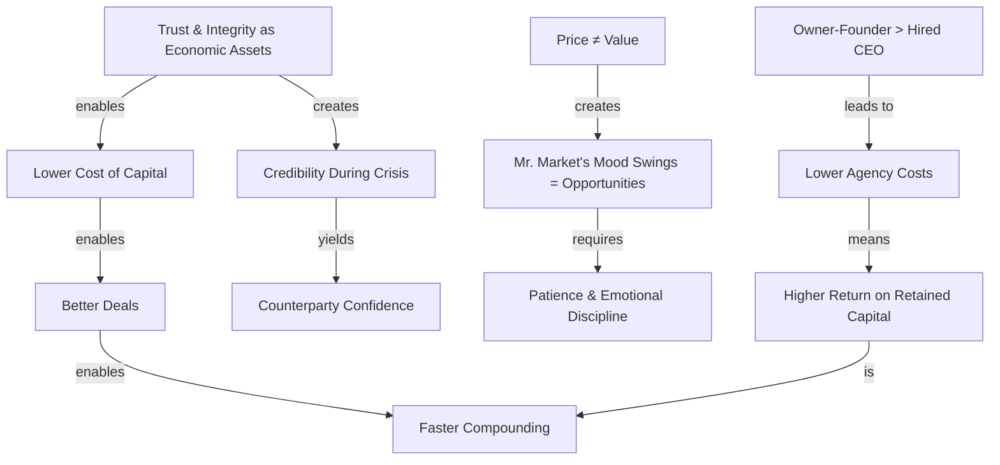

---

## Why This Book Is Unique

| Dimension | *The Essays of Warren Buffett* | Chronological Annual Letters |
|-----------|------------------------------|----------------------------|
| **Arrangement** | Thematic by concept | Chronological by year |
| **Editor's role** | Selection + annotation | Compilation only |
| **Best for** | Learning Buffett's philosophy systematically | Understanding context of each letter |
| **Complements** | Any reading of the letters | Any thematic study of Buffett |
| **Reading experience** | Textbook — ideas isolated and explained | Archive — ideas in historical sequence |

### Not a Memoir

This is not a memoir. Neither are the letters it draws from. There is no narrative arc, no dramatic tension, no character development. What the book offers instead is something rarer: a record of **consistent reasoning applied to real situations over four decades**. The value is not in any single essay but in the demonstration — across multiple examples, across changing market conditions, across different industries — that the same core principles produce consistent results.

---

## Related Works

import { BookCard } from '@/components/BookCard'

<BookCard
  related
  title="Berkshire Hathaway Letters to Shareholders"
  slug="berkshire-hathaway-shareholder-letters-warren-buffett"
  description="The complete chronological letters — read this volume after The Essays to see ideas in their original year-by-year context."
/>
<BookCard
  related
  title="The Intelligent Investor"
  slug="the-intelligent-investor-benjamin-graham"
  description="Benjamin Graham's foundational text on value investing — the intellectual predecessor to the framework Buffett's letters exemplify."
/>
<BookCard
  related
  title="The Warren Buffett Way"
  slug="the-warren-buffett-way-robert-hagstrom"
  description="Robert Hagstrom's systematic analysis of Buffett's 12 investing tenets — a complementary analytical companion."
/>
<BookCard
  related
  title="Common Sense on Mutual Funds"
  slug="common-sense-on-mutual-funds-john-bogle"
  description="John Bogle's case for index investing and low costs — shares the same long-term orientation championed across Buffett's letters."
/>
<BookCard
  related
  title="The Most Important Thing"
  slug="the-most-important-thing-howard-marks"
  description="Howard Marks on risk control, market psychology, and market efficiency — themes that run parallel to Buffett's throughout these essays."
/>
