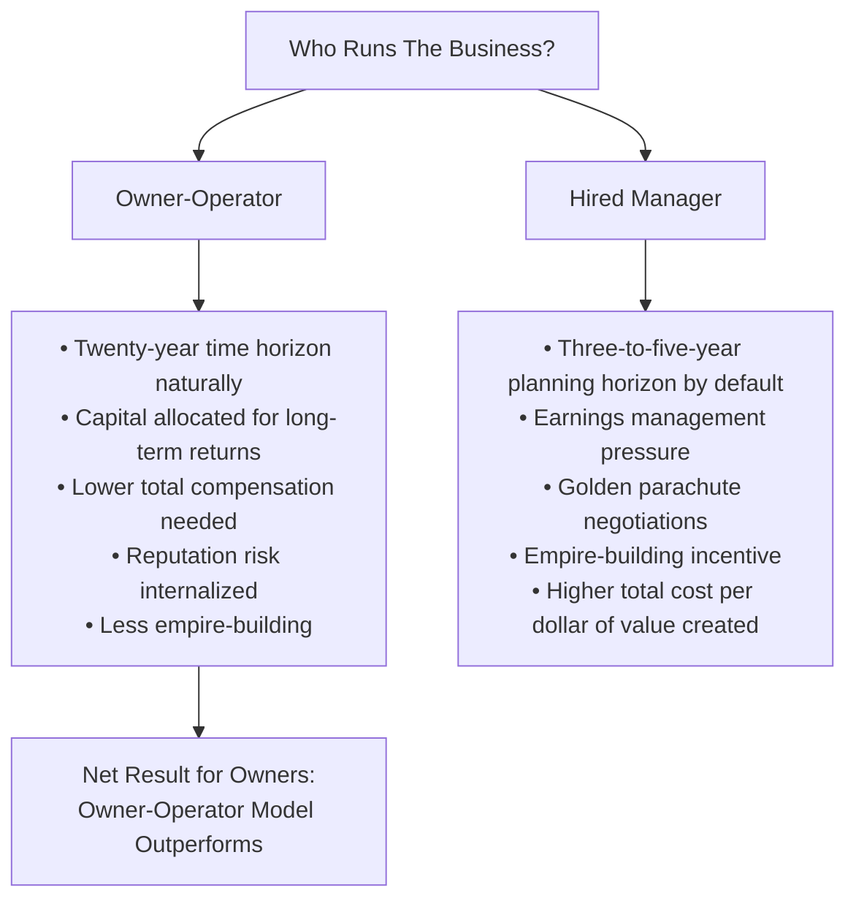
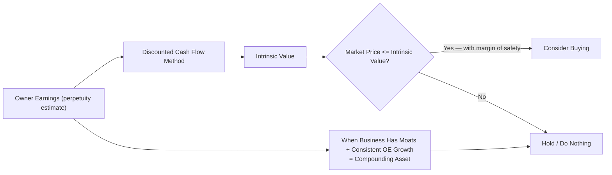
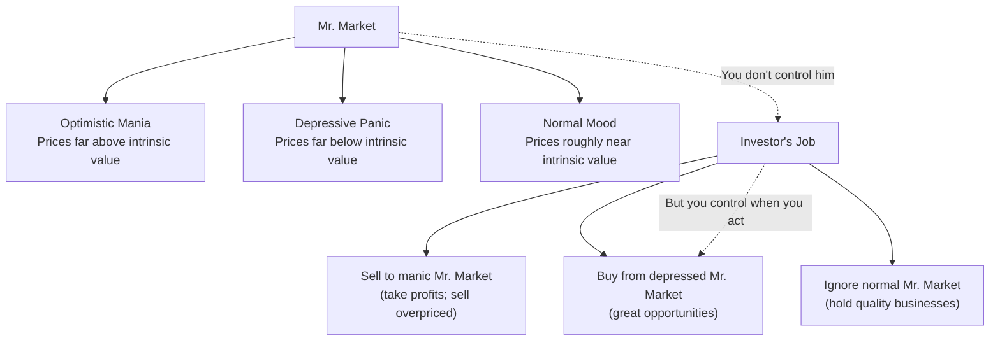
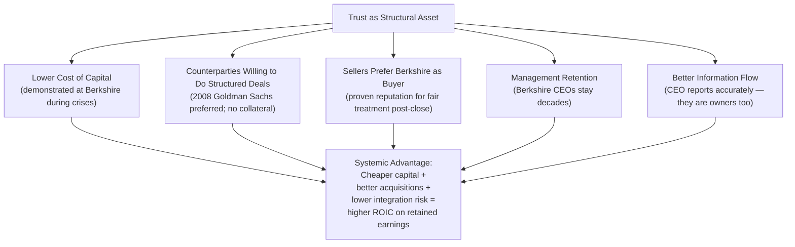

# Analysis

## Why the Letters Are Uniquely Valuable as Corporate History

Warren Buffett's shareholder letters are the longest-running, most coherent piece of business writing in American corporate history. No other CEO has sustained **annual, long-form, unhedged, and intellectually serious** prose for even two decades, let alone four. The letters are not marketing. They are not investor relations. They are a CEO thinking out loud — year after year — about how a business is managed, how capital is allocated, what competitive advantage means, and what fiduciary responsibility actually requires.

Lawrence Cunningham's curation in *The Essays* performs a specific editorial service: **isolating and sequencing ideas**. In the chronological archive, each letter responds to the conditions of a specific year. That context is valuable — it is the subject of the companion volume. In *The Essays*, Cunningham takes the same source material and arranges it thematically. The result is a textbook that can be read cover to cover as a structured education in investment philosophy, rather than as a historical record.

---

## Why Editing a Thematic Selection Is a Legitimate Editorial Contribution

Critics sometimes argue that extracting passages from chronological letters strips them of context. This is true. Cunningham would agree. His introduction acknowledges it directly. But context is not always the point. Sometimes the reader needs to understand *what the idea is* before they can appreciate *how it appeared in a particular year*. The Essays delivers the former; the chronological archive delivers the latter. They are complements, not substitutes.

### The Annotations as Teaching Signals

Cunningham's footnotes and section introductions serve as **reader orientation signals**: they flag where arguments build on earlier sections, where Buffett later modified his own views, and where the letters contain passages of exceptional importance (the 1986 owner earnings derivation, the governance sections after the Salomon crisis). A reader encountering the letters cold would not necessarily know which passages carry the most instructional weight. Cunningham, having read them all multiple times, tells us.

---

## What the Letters Say About Corporate Governance: Stewardship as Structural Option

The governance sections of *The Essays* are particularly valuable for a specific reason: in the 1980s and 1990s — when many of these letters were written — the dominant corporate view was that ownership and control should be separated. Professional managers, accountable primarily to a board, should run the enterprise. Shareholders, arm's-length and dispersed, would exercise control through the board.

Buffett's consistent counter-argument: **the best corporate governance is having an owner run the business.** When the person running the company also owns a large portion of it, problems create personal losses, not spread costs. Short-termism becomes irrational. Empire-building is checked by the cost of capital. Executive compensation stops being a negotiation between the CEO and a captured board.

### Corporate Governance as Trust Architecture

The letters make a subtler argument: **trust is a cost-reducing asset**. A company with a reputation for full and fair disclosure faces a lower cost of capital. Its counter-party arrangements are simpler. Its ability to raise capital in a crisis — when trust matters most — is demonstrably superior. During the 1991 Salomon Brothers Treasury auction scandal, Buffett's governance apparatus (his willingness to step in as Chairman amid a crisis) preserved a trillion-dollar franchise because counterparties trusted Berkshire's commitment.

---

## Finance: The Owner Earnings Framework as Analytical Innovation

The 1986 letter (highlighted in Section VI of *The Essays*) introduced what may be Buffett's most consequential analytical tool: **owner earnings** — an attempt to measure the true economic earnings power of a business.

### Why GAAP Earnings Are Insufficient for a Long-Term Investor

| Problem | GAAP Response | Owner Earnings Fix |
|---------|--------------|-------------------|
| DDA charges don't represent current cash leaving the business | Spread historical cost over useful life | Add back (cash already spent) |
| Maintenance capex required to hold competitive position | Often buried in DDA or inconsistently captured | Explicitly estimated and subtracted (when expansionary) |
| Goodwill amortization (pre-2001) | Arbitrary schedule | Treated as economic impairment test |
| Options-based compensation | Not always expensed fairly | Treated as real cost (advocated by Buffett) |
| Deferred taxes that may never reverse | Not identified in standard statements | Evaluated case-by-case |

### The Practical Application

The owner earnings framework translates into a **valuation language**:

---

## Market Psychology: The Manic-Depressive Patient

One of the most widely quoted metaphors in the letters is **Mr. Market** — the imaginary business partner who offers to buy or sell a business interest every day at prices that fluctuate wildly based on his mood.

The lesson: **a market exists to serve you, not to instruct you**. Most investors get this backward — they look at the daily price and treat it as a verdict on the company's quality. The intelligent investor treats the market as an auction mechanism that occasionally offers opportunities.

---

## Communication Quality: Lessons in Plain-Spoken Writing

The letters are systematically studied in journalism and law schools not primarily for their investment advice but for their **writing quality**. Five principles are consistently visible:

1. **One idea per paragraph** – never bury the lede; the reader should know what each paragraph was about after reading it
2. **Concrete before abstract** – start with the specific business (See's Candies, GEICO), then draw the general principle
3. **Honesty about uncertainty** – "I don't know" stated plainly; hedging that buries rather than reveals uncertainty
4. **Avoiding the passive voice** – Buffett writes as an active participant, not a commentator
5. **Story before statistics** – a business narrative makes the numbers meaningful; numbers alone do not justify a decision

### The Practical Result

| Communication Choice | Effect on Reader |
|---------------------|-----------------|
| Starting with concrete example (GEICO acquisition) | Engages non-finance audiences immediately |
| Admitting errors openly (Gen Re overpayment) | Builds credibility that no marketing spend can buy |
| Explaining terms in everyday language | Reduces information asymmetry that benefits insiders |
| Structured argument with labeled sections | Makes complex ideas digestible in a single sitting |

---

## Trust and Integrity: The Structural Advantage They Provide

Perhaps the most underrated lesson of the entire volume is that **trust functions as an economic moat**. It is not merely a moral preference or a reputational nicety. Companies with durable reputations for honesty operate in systematically different ways than companies without them:

The point is structural: once a company has earned the kind of trust Berkshire has, it operates with lower transaction costs, simpler contracts, and more available capital at every margin. This cannot be engineered — it has to be earned, slowly, and can be destroyed quickly.

---

## Comparison: This Volume vs. the Source Material

| Aspect | *The Essays* (Cunningham 1998/2001) | *Berkshire Hathaway Letters to Shareholders* (Olsen compilation) |
|--------|--------------------------------------|-------------------------------------------------------------------|
| **Organization** | Thematic — by concept | Chronological — by year |
| **Who wrote the ordering** | Lawrence A. Cunningham (editorial) | Max Olsen (compilation) |
| **Primary purpose** | Educational — learn Buffett's philosophy | Reference — all letters in sequence |
| **Annotations** | Editor provides editorial context | Minimal (compiler notes) |
| **Best for first-time readers** | Yes — logical progression | No — requires prior framework |
| **Best for studying evolution of ideas** | No — context stripped | Yes — ideas in original context |
| **Academic use** | MBA, law school, investment curricula | Research, historical comparison |

These two volumes are designed to be read together. Start with *The Essays* for conceptual grounding. Return to the letters when you want to see how an idea actually appeared in a particular year's context — what events triggered it, what mistakes preceded it, what market conditions surrounded it.

---

## Key Analytical Takeaways

1. **Governance precedes performance**. The single most reliable predictor of long-term corporate success is not strategy; it is whether the people running the business think like owners. Hire that first.

2. **Analytical framework beats market timing**. Over any period longer than two years, the quality of the reasoning underlying an investment matters more than whether the purchase happened at the optimal moment.

3. **Accounting literacy is a survival skill**. Investors who cannot read a financial statement reliably will consistently be at an information disadvantage. The letters are, in effect, a free advanced course in financial statement analysis — taught by someone who has never taken an accounting course professionally.

4. **Trust compounds**. Like financial capital, trust accumulates slowly, is expensive to rebuild once lost, and pays returns that no competitive analysis can predict.

5. **Long-term orientation has structural advantages**. The investor with no time constraint acquires information, opportunities, and compounding in ways that a leveraged trader cannot replicate.

---

## Criticisms and Limitations

A faithful analysis must note what the letters *do not* address well:

| Gap | Why It Matters |
|-----|---------------|
| No formal discussion of modern tech businesses | Written primarily about consumer brands, insurance, media, manufacturing |
| Limited treatment of quantitative risk models (VaR, etc.) | Relevant to 2008-crisis-era finance that followed the letters' publication |
| Few explicit portfolio construction rules | Buffett describes principles, not an algorithm |
| No discussion of index funds or passive investing | Written before Vanguard's scale made indexing mainstream |
| Pre-social media era communication norms | Letters assume one-way communication; modern governance requires more |

These gaps are not failures. They reflect the historical period and sector focus. They are also precisely the areas where the companion volumes and subsequent works (including Cunningham's *Berkshire Beyond Buffett*) address the modern questions.
