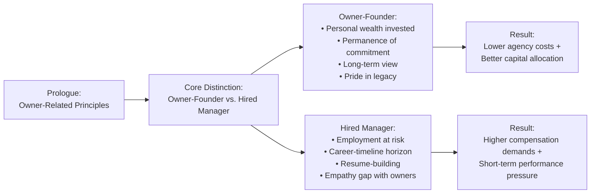
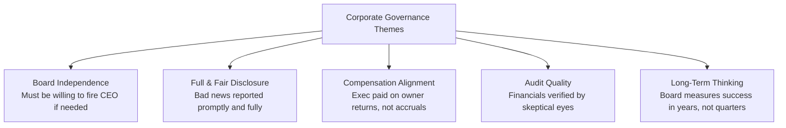
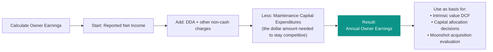
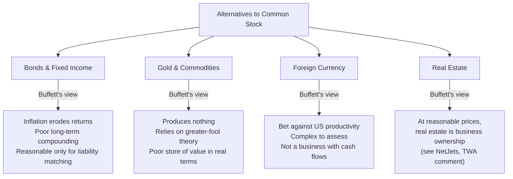
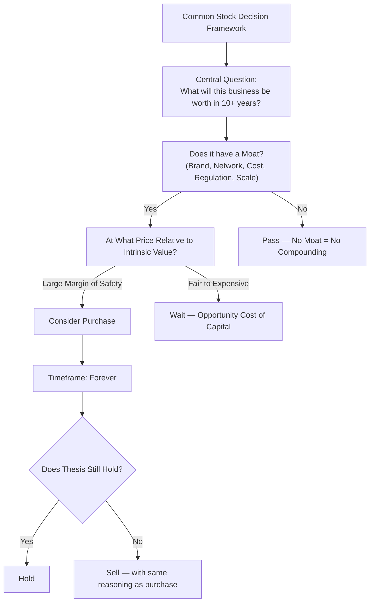
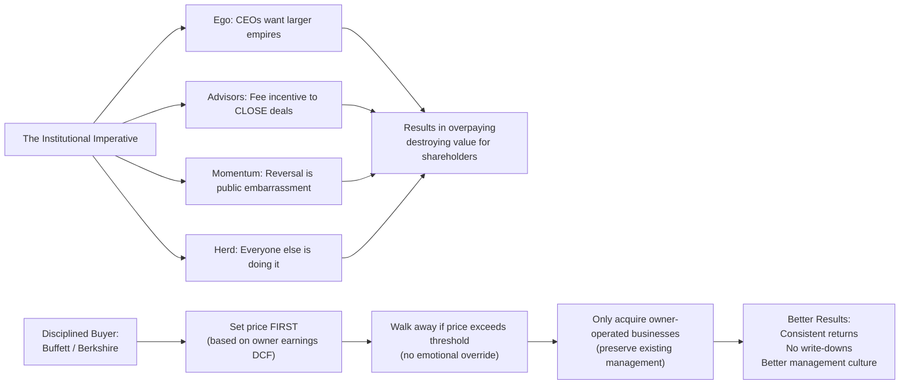
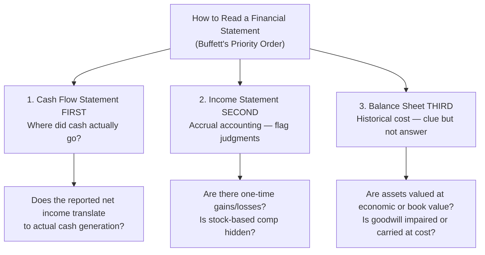
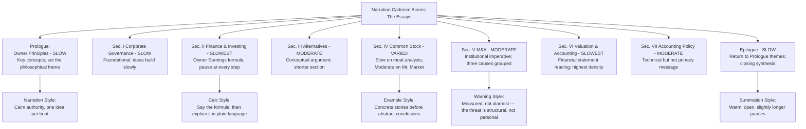

# Narration Guide

## How to Narate a Thematic Volume

This is a **thematic** book, not a chronological archive. The sections build on each other in logical sequence: governance before valuation, valuation before selection, selection before M&A discipline. A narrator who reads it in disorder will lose the reader. The internal logic of the book — engineered by Lawrence Cunningham — is the most important structural fact about this narration.

The voice: **measured, plain-spoken, unhurried**. Buffett writes in a voice that is conversational without being casual. The narrator's job is not to mimic Buffett's Nebraska cadence or his distinctive vocal patterns — it is to match the *intellectual tempo*: deliberate, patient, never rushed, willing to pause for the reader to absorb a passage before moving on.

---

## Generic Passages

### Book Introduction (spoken before Section 1)

> "The Essays of Warren Buffett: Lessons for Corporate America. Selected and arranged by Lawrence A. Cunningham. Original edition, Carrum Asset Management, 1998. Approximately 350 pages. Warren E. Buffett — Chairman of Berkshire Hathaway — speaking through his annual letters to shareholders, chosen and organized by a law professor at Cardozo. These are not essays in the formal sense. They are not speeches. They are heartfelt messages to real owners, written each year, organized into seven themes: Governance, Finance, Alternatives to Common Stock, Common Stock, Mergers and Acquisitions, Valuation and Accounting, Accounting Policy. They span more than two decades of American capitalism. They are the most sustained case for a particular philosophy of corporate stewardship and long-term investing ever written by a single active practitioner. Cunningham's role is to select, arrange, and annotate. What follows is the authorial voice of Warren Buffett, shaped into a single coherent argument about how great businesses ought to be run and how great investors ought to think."

---

## Annotated Narration

### Prologue: Owner-Related Business Principles (Section 0)

**Tone:** Warm, direct, calm confidence.

**Pacing:** Slow. This sets the philosophical frame. Do not rush it.

**Emphasis:** The contrast between ownership and agency. Let the distinction sit before moving on. Buffett's core assertion — that character matters as much as intellect in investing — deserves a beat of silence when delivered.

> "We want to work with owners, not bankers."

**Annotation cue:** Note that "owner" in Buffett's usage means someone with long-term financial commitment, not just legal title.

---

### I. Corporate Governance

**Tone:** Stern but reasonable. This is about doing right when no one is watching — appropriate gravitas.

**Pacing:** Deliberate. Governance is a slow-moving subject; matching narration speed signals that this is foundational, not flashy.

**Key passages to heighten emphasis:**

> "The best businesses are run by people who think of themselves as owners, not managers."

> "We have not succeeded because we have all the answers. We have succeeded because we have all the questions — and we remain interested in the answers."

**Annotation cue:** *The Salomon Brothers crisis* is the practical test of these governance principles. When Buffett was called in as interim Chairman in 1991, the lesson was: the board must be willing to act when management fails. Passively endorsing the CEO is not governance — it is abdication.

---

### II. Finance and Investing

**Tone:** Analytical, instructional, precise. The narrator is teaching a method here.

**Pacing:** Slower than prose sections. When formulas or frameworks appear, slow further.

**Key passage (Owner Earnings):**

> "Owner earnings... represent (1) reported earnings, plus (2) depreciation, depletion, amortization, and certain other non-cash charges, less (3) the average annual amount of capitalized expenditures for plant and equipment, etc. that the business requires to fully maintain its long-term competitive position and its unit volume."

**Annotation cue:** This is the single most important analytical formula in the book. Read it twice. Then explain it in plain language before moving on — the narrator, not just Buffett, owes the reader a verbal translation here.

---

### III. Alternatives to Common Stock

**Tone:** Slightly argumentative — this section makes a case, not just a review.

**Pacing:** Moderate. The inflation argument against bonds deserves time but is relatively short.

**Key point to emphasize:**

> "The money-making qualities of bonds, compared to common stocks, tend to wither as interest rates rise. The opposite occurs when rates fall."

**Annotation cue:** Chapters on bonds in this era (pre-2008 low-rate environment) assumed moderate inflation. The argument is even stronger today — narrator should flag this without breaking the voice of the passage.

---

### IV. Common Stock

**Tone:** Patient, advisory — the narrator is speaking to someone who has already internalized governance and valuation and is now ready for the investment act itself.

**Pacing:** Deliberate sections (moat classification) can alternate with brisker delivery (the market psychology summary). Use tempo changes to signal conceptual density.

**Key passage — Mr. Market:**

> "We simply have to think of ourselves as buying a interest in a business rather than trading a stock... Mr. Market's job is to provide you with an opportunity. The patient investor has a great advantage over the one who is pushed around by Mr. Market's moods."

**Annotation cue:** This section benefits from the narrator identifying when Buffett moves from describing a phenomenon (Mr. Market) to prescribing an action (ignore the noise, evaluate the business). The shift in register is a teaching moment.

---

### V. Mergers and Acquisitions

**Tone:** Slightly wary. The M&A section in Buffett's letters has a consistent note of skepticism. Narrator should channel that without cynicism.

**Pacing:** Measured. Use grouping: the three causes of value destruction in M&A (ego, advisory incentive, momentum) are one conceptual unit. Deliver them as a single idea.

**The Institutional Imperative** (Buffett's term, from the 1980s):

> "The institutional imperative is the tendency of executives to mindlessly imitate the actions of their peers... It is a force that causes them to spray themselves with buckshot rather than take aimed shots. You will find it in companies that say they are planning to diversify, even though the new businesses are not related to anything they know. You will find it in companies that are content to acquire businesses at prices that are far above economic value."

**Annotation cue:** This passage is often cited in business school curricula as the clearest single-page statement on what goes wrong when M&A becomes a habit rather than a discipline.

---

### VI. Valuation and Accounting

**Tone:** Technical, careful, precise. This is the most analytically dense section. Slower tempo throughout.

**Pacing:** Slowest in the book. The accounting sections require the listener to hold multiple numbers in mind. Read these passages as if walking someone through a calculation — allow time.

**Key structural mapping — reading a financial statement the way Buffett reads one:**

**Annotation cue:** The order of reading (CF → IS → BS) is the opposite of how most investors — and most MBA curricula — approach financial statements. Narrator should signal this inversion explicitly.

---

### VII. Accounting Policy and Tax Matters

**Tone:** Like a professor explaining a specialty. Not dry — Buffett's frustration with bad accounting rules comes through — but not as emotionally charged as the governance or M&A sections.

**Pacing:** Moderate to slow. Tax and accounting policy requires careful delivery.

**Key passage — on honest accounting:**

> "Accounting principles exist to serve investors. When they stop doing that — when they become vehicles for management to present results that do not reflect economic reality — they have lost their purpose."

**Annotation cue:** This is the through-line connecting this section back to the governance sections: accounting policy is ultimately a governance question. Bad accounting rules enable bad corporate behavior.

---

### Epilogue

**Tone:** Reflective, warm, slightly slower again. This is the book's closing argument — treat it with the respect due a conclusion.

**Pacing:** Slowest in the book on key sentences; moderate on connective tissue.

**Annotation cue:** The epilogue is the through-line statement — a final summary of everything the reader has been asked to hold across seven sections. When the epilogue returns to a theme from the Prologue (ownership, trust, long-termism), the narrator should subtly signal that return even without explicit cross-reference.

---

## Cadence Map: Pacing Across the Entire Volume

---

## Special Narration Notes

### When Buffett Quotes His Own Letters from Other Years

Cunningham's curation occasionally references a passage from a letter discussed in a different section (e.g., the owner earnings formula in Section VI may reference the Grzywicki acquisition described in Section IV). The narrator should signal these cross-references with a **subtle shift in tone** — not a dramatic cue, but a slight pull-back that tells the listener: "This idea has appeared before in these pages, and it will matter again."

### When Cunningham's Annotation intervenes

Annotations appear as [bracketed editor's notes] or as standalone paragraphs. The narrator's cue is to **shift register briefly**: Buffett's voice → Cunningham's voice → Buffett's voice. The shift should be small — a slight increase in formality, a brief compression of rhythm — but perceptible enough that the listener knows when the editor is speaking.

### On the Writing Quality Itself

When the passage is particularly well-written — and several of these letters are genuinely literary achievements, not just business prose — the narrator should **slow down** and **savor the sentence structure**. A well-constructed sentence deserves to be heard in full before moving to the next idea. Rushing through good prose is a disservice to content the listener will rarely encounter elsewhere.

---

## Recommended Narration Sequence

---

> *This narration guide is an editorial resource. All substantive content within The Essays is Warren E. Buffett's, selected and arranged by Lawrence A. Cunningham. The narration does not alter any text from the original letters.*
