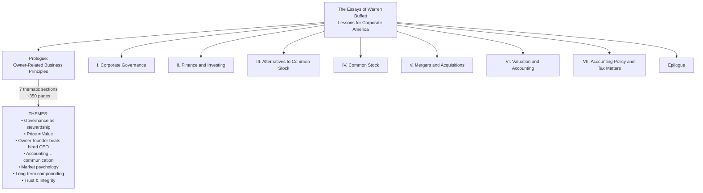
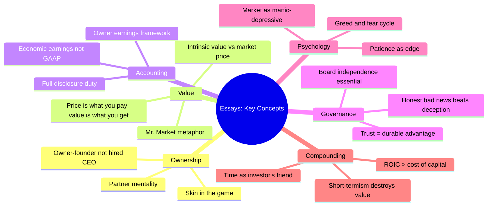

# The Essays of Warren Buffett: Lessons for Corporate America
**Lawrence A. Cunningham, Editor** | Carrum Asset Management, 1998/2001 | ~350pp

## Overview

> "The best way to understand corporate America is to listen to the man who has managed one of its greatest companies for over four decades — in his own words, organized by theme rather than by year."

**Warren E. Buffett** (b. 1930), Chairman of Berkshire Hathaway Inc., wrote his annual shareholder letters from 1977 onward with a clarity and candor unmatched in American corporate history. These letters — ranking among the finest pieces of business writing in the English language — were not written as essays but as heartfelt messages to real owners. **Lawrence A. Cunningham**, then a professor at the Benjamin N. Cardozo School of Law and independent Berkshire scholar, curated and annotated them into a thematic treasury.

Published originally by **Carrum Asset Management** (1998, ~350pp, ISBN 9781576600760), with a second edition in 2001, this book reorganizes Buffett's letters by concept rather than chronology. It transforms a chronological archive into a systematic **textbook of investment philosophy** — accessible, self-contained, and ideal for readers encountering Buffett for the first time.

Cunningham's role is **editorial, not authorial**: he groups passages thematically, introduces each section, and adds annotations. The value is in the curation — the decision to show the ideas in logical order rather than temporal sequence. This volume is now widely used in MBA courses, law school corporate governance curricula, and investment-education programs.

---

## Thematic Structure

### Reading Order

```mermaid
flowchart LR
    P["Prologue:<br/>Owner-Related Principles"] --> I["I. Corporate Governance"]
    I --> II["II. Finance & Investing"]
    II --> III["III. Alternatives to Common Stock"]
    III --> IV["IV. Common Stock"]
    IV --> V["V. Mergers & Acquisitions"]
    V --> VI["VI. Valuation & Accounting"]
    VI --> VII["VII. Accounting Policy & Tax"]
    VII --> E["Epilogue"]
```

| Section | Core Focus | Key Lessons |
|---------|-----------|-------------|
| Prologue | Owner-oriented business principles | Stewardship over agency; trust as competitive advantage |
| I. Corporate Governance | Board independence, full disclosure | Managers as owners not employees; honest reporting |
| II. Finance & Investing | Owner earnings, intrinsic value | ROIC vs. cost of capital; the art of valuation |
| III. Alternatives | Bonds, preferred stock | Why common equity outperforms long-term |
| IV. Common Stock | The owner's approach to equities | Patience, concentration, moat identification |
| V. M&A | Acquisition discipline | The institutional imperative; buying at fair prices |
| VI. Valuation & Accounting | Financial statement analysis | Reading balance sheets; economic vs. accounting earnings |
| VII. Accounting Policy | Tax and GAAP issues | Why accounting rules shape real economic outcomes |
| Epilogue | Synthesis | Enduring principles for investors and managers |

---

## Key Concepts

---

## Communication Principles

A less obvious but vital lesson: these letters are masterclasses in **clear corporate communication**. Buffett explains complex ideas to a general audience — shareholders with no finance background — using plain language, vivid analogies, and structured logic:

1. **One idea per paragraph** — never bury the lede
2. **Concrete examples first** — abstract principle always anchored to a real business
3. **Honesty about uncertainty** — "I don't know" is said plainly
4. **No jargon without unpacking it** — technical terms explained in everyday terms
5. **Admitting mistakes** — errors stated plainly; no hedging or deflection

These five principles make the letters unusually readable despite their analytical depth. They are the reason the letters — written by a single author over decades — are still studied in journalism, law, and business schools for their writing quality alone.

---

## What These Letters Teach About Corporate America

Together, the selected letters in *The Essays* answer a single large question: **What does a well-run, owner-oriented, genuinely capitalist enterprise look like in practice?** Not in theory — in the messy, noisy reality of Wall Street incentives, quarterly earnings pressure, short-term market movements, and the constant temptation for managers to confuse their own interests with those of the owners.

The answer, letter by letter: **the owners must come first**. When they do, everything else — good returns, durable competitive advantages, sustainable growth — tends to follow. When they do not, the system eventually corrects through markets, regulation, or both.

---

## Author & Editor

| | |
|---|---|
| **Essays by** | Warren E. Buffett (b. 1930) |
| **Role** | Chairman & CEO, Berkshire Hathaway Inc. |
| **Edited by** | Lawrence A. Cunningham (b. 1962) |
| **Role** | Professor of Law, Benjamin N. Cardozo School of Law |
| **Publisher** | Carrum Asset Management |
| **Original Edition** | 1998, ~350pp, ISBN 9781576600760 |
| **Second Edition** | 2001 |

---

## Further Reading

import { BookCard } from '@/components/BookCard'

<BookCard
  related
  title="Berkshire Hathaway Letters to Shareholders"
  slug="berkshire-hathaway-shareholder-letters-warren-buffett"
  description="The complete chronological archive — all annual letters from 1965 to present, compiled by Max Olsen."
/>
<BookCard
  related
  title="The Intelligent Investor"
  slug="the-intelligent-investor-benjamin-graham"
  description="Benjamin Graham's foundational text on defensive investing and margin of safety — the philosophical predecessor to these essays."
/>
<BookCard
  related
  title="The Most Important Thing"
  slug="the-most-important-thing-howard-marks"
  description="Howard Marks's distillation of the key insights from decades of investing — themes resonate strongly with Buffett's letters."
/>
<BookCard
  related
  title="Common Sense on Mutual Funds"
  slug="common-sense-on-mutual-funds-john-bogle"
  description="John Bogle's case for indexing and low costs — a complementary argument from a different angle of the same long-term philosophy."
/>
