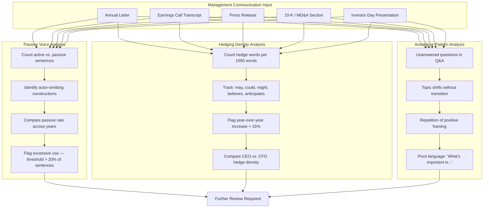
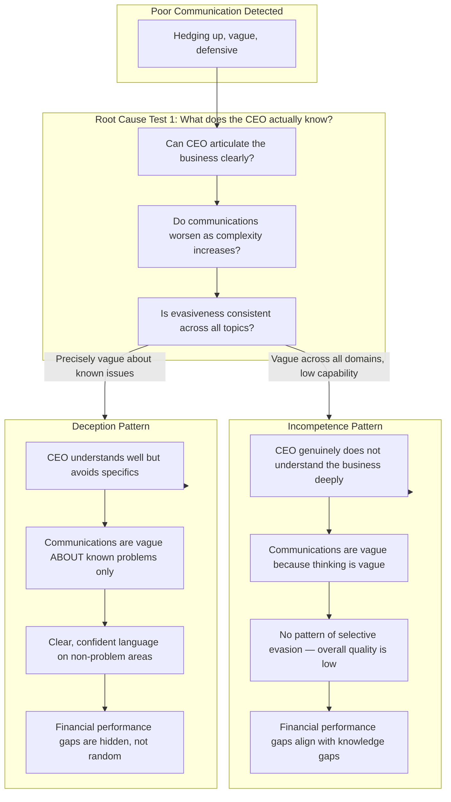
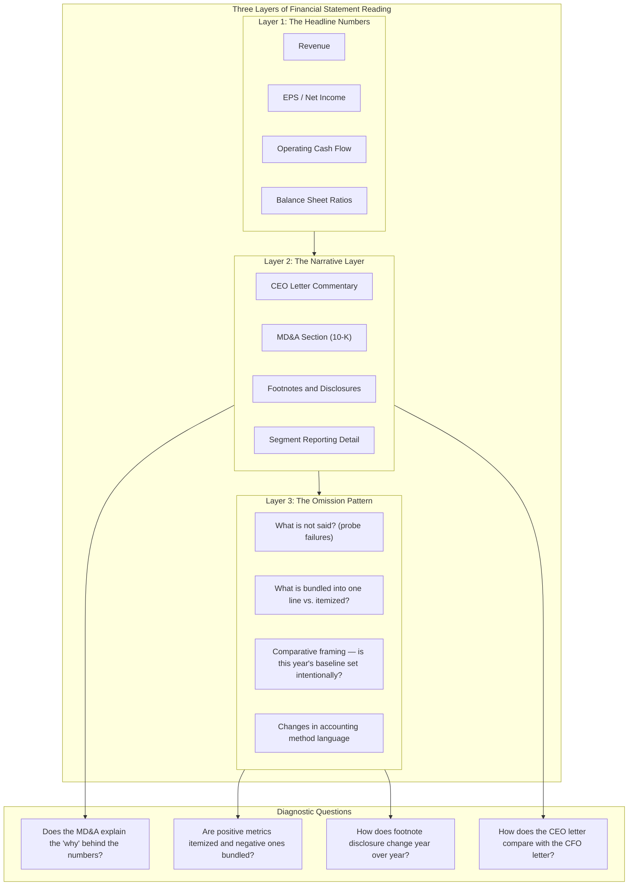
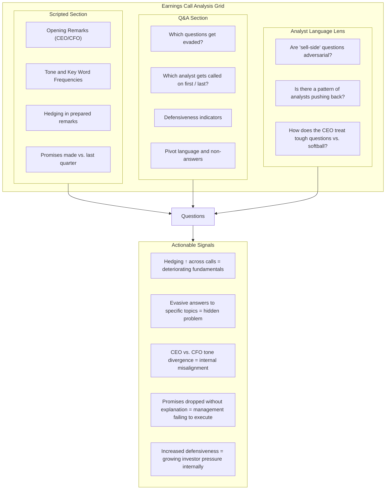
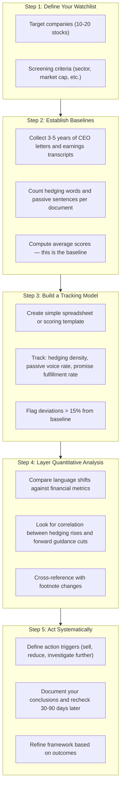

## The Language of Deception

Weintraub's central framework begins with understanding the linguistic
signals that indicate avoidance, deflection, or intentional
misrepresentation. These signals are not proof of deception on their own
but are reproducible markers that warrant deeper investigation.



### Passive Voice

A sentence written in the passive voice removes the actor — the person
responsible for the action — from the grammatical subject position. In
management communication, this carries specific meaning:

| Construction | Passive Version | Active Version | Implication |
|---|---|---|---|
| Mistake acknowledgment | "Errors were identified" | "We made an error" | Avoidance of responsibility |
| Revenue explanation | "Revenue was impacted by..." | "Our revenue fell because..." | Externalizing causality |
| Customer loss | "Certain accounts were lost" | "We lost several key accounts" | Downplaying significance |
| Cost overruns | "Overruns were experienced" | "We exceeded our budgets" | Diffusing accountability |

A passive voice rate above 20% of total sentences in an annual letter or
earnings call is a threshold worth investigating further.

### Hedging Words

Hedging language dilutes commitment. In management communication, rising
hedging density signals declining executive confidence.

| Hedge Category | Words | Connotation |
|---|---|---|
| Probability reducers | "may," "could," "might," "possibly" | Uncertainty about outcomes |
| Epistemic markers | "believes," "anticipates," "expects," "reviews" | Distance from stated facts |
| Temporal avoidance | "moving forward," "going forward," "in the future" | Delaying specifics |
| Comparative softening | "approximately," "roughly," "legacy" | Restating facts to minimize significance |

---

## The Two Types of Management Failure

A critical insight: when a CEO communication is poor, identifying *why*
determines the appropriate response. Incompetence and deception look
similar at the surface but require fundamentally different analysis.



Both incompetence and deception can destroy shareholder value. The
analyst's job is to determine which pattern is present before deciding
whether to hold, sell, or escalate concerns.

---

## Reading Financial Statements Beyond the Numbers

The GAAP financial statements provide structured, comparable data. The
narrative surrounding those numbers — the management discussion, the
footnotes, the CEO letter — tells the story the numbers cannot.



### What Footnotes Reveal

| Footnote Area | What to Look For | Red Flag |
|---|---|---|
| Related party transactions | Who benefits from undisclosed relationships | Hidden conflicts of interest |
| Revenue recognition policies | When does revenue get recorded? | Accelerated recognition may mask slowing demand |
| Contingent liabilities | "Possible" obligations and ranges | Large ranges at the low end with no justification |
| Stock compensation | Options, RSUs, EPS dilution | Aggressive expensing assumptions masking true cost |
| Segment reporting | Why are certain operations consolidated? | Concealing underperforming segments within a profitable parent |
| Pension assumptions | Discount rates, expected returns | Unrealistic assumptions inflating assets |

---

## Earnings Call Analysis

Earnings calls are the richest raw material for linguistic analysis
because they are unscripted, interactive, and public. CEOs who perform
well on scripted annual letters sometimes reveal themselves during live
Q&A.



### What Earnings Calls Tell You That Numbers Do Not

| Signal | Indicator | How It Manifests |
|--------|-----------|-----------------|
| Internal pressure | CEO calls on favorite analysts first | Controlling the narrative; stage-managing perceptions |
| Hidden problem | Deflection from a specific product/region | Microcosm of a macro issue |
| Mismatched leadership | CEO and CFO differ on future guidance | Disagreement in the C-suite |
| Performance stress | "Putting our heads down" / "executing on the plan" | Defensive positioning masking weak results |
| Overconfidence | Forecasting in precise percentages | Complex future stated too simply = overconfidence or bluff |
| Fear of disruption | Charlton avoidance of "disruption" terminology | Acknowledging threat without naming it |

---

## Red Flags in Management Behavior

Weintraub identifies patterns of behavior in CEO communications that
systematically correlate with future problems:

```mermaid
flowchart LR
  subgraph ObservedBehavior["CEO Communication Behavior Observed"]
    OB1["Rising hedging density over 2+ years"]
    OB2["Increasing use of passive voice"]
    OB3["Drop in specific forward commitments"]
    OB4["Topic avoidance in Q&A sessions"]
    OB5["Celebratory tone disconnected from results"]
    OB6["Attribution patterns: success = "we," failure = "the market" or "circumstances""]
    OB7["Increasing use of corporate jargon and buzzwords"]
  end

  subgraph RootCauses["Likely Root Causes"]
    RC1["Deteriorating business fundamentals"]
    RC2["Avoidance of accountability for past decisions"]
    RC3["CEO knows more than is being disclosed"]
    RC4["Avoidant CEO protecting their position"]
    RC5["Detached from operational reality"]
    RC6["Low accountability culture at the top"]
    RC7["Compensating for weak results with language"]
  end

  subgraph InvestorAction["Investor Action Framework"]
    IA1["Conduct deeper quantitative review"]
    IA2["Check footnotes and segment detail"]
    IA3["Review insider trading activity"]
    IA4["Compare with competitor communications"]
    IA5["Revisit original investment thesis"]
  end

  OB1 --> RootCauses --> InvestorAction
  OB3 --> RootCauses --> InvestorAction
  OB5 --> RootCauses --> InvestorAction
  OB7 --> RootCauses --> InvestorAction
```

---

## Building a Repeatable Language Analysis Framework

The book's most important contribution is not any single marker but the
case for a systematic process. Qualitative language analysis is powerful
when applied consistently over time across a watchlist.



### Sample Tracking Template

| Quarter | Date | Company | Hedge/1K Words | Passive Voice % | Promises Kept | Action Flag |
|---------|------|---------|---------------|-----------------|---------------|-------------|
| Q1 2010 | Jan-10 | XYZ Corp | 12.3 | 15% | 5/7 | Normal |
| Q2 2010 | Apr-10 | XYZ Corp | 15.1 | 18% | 4/8 | Watch |
| Q3 2010 | Jul-10 | XYZ Corp | 19.7 | 23% | 2/9 | Investigate |
| Q4 2010 | Oct-10 | XYZ Corp | 22.4 | 27% | 1/8 | Red flag |

---

## The Language-Performance Relationship

Weintraub argues that language quality and clarity are correlated with
long-term financial performance. The mechanism: clear communication
reflects clear thinking, which reflects clear strategic execution.

This relationship has been supported in academic research on
"linguistic obfuscation" in corporate disclosures and the link between
disclosure complexity and future stock returns (Lo et al., 2017; Loughran
and McDonald, 2016).

| Language Trait | Typical of | Financial Implication |
|---|---|---|
| Clear, direct, accountable | Competent management, coherent strategy | Above-median long-term returns |
| Hedging, evasive, vague | Avoidance, uncertainty, hidden problems | Below-median or underperforming |
| Celebratory, buzzword-heavy | Disconnect from operational reality | Overperformance followed by mean reversion risk |
| Opening with acknowledges criticism | Self-aware, accountability-oriented culture | More resilient during downturns |
| Blaming external factors exclusively | Low agency, poor internal accountability | Persistent underperformance |

---

## Chapter-by-Chapter Map

### Introduction and Framework

| Chapter/Section | Title | Core Content |
|---|---|---|
| Ch 1 | Why Words Matter | Language is information; it is not just commentary |
| Ch 2 | The Archetype of the Compromised CEO | Patterns — not individual sentences — reveal character |
| Ch 3 | Passive Voice and Organizational Avoidance | Grammar as governance signal |
| Ch 4 | Hedging as a Performance Predictor | Word frequency analysis and thresholds |
| Ch 5 | What Financial Statements Conceal | The narrative gap between numbers and management explanation |

### Applied Analysis

| Chapter/Section | Title | Core Content |
|---|---|---|
| Ch 6 | The Annual Letter as Diagnostic Tool | Year-over-year language comparison methodology |
| Ch 7 | Earnings Call Intelligence | Q&A section analysis: what to listen for and how to score it |
| Ch 8 | Distinguishing Incompetence from Deception | The decision tree for root-cause analysis |
| Ch 9 | Cultural Linguistics: Reading the Org from the Top | What communication patterns reveal about organizational health |
| Ch 10 | The Long-Term Language-Performance Link | Empirical evidence connecting language quality to stock returns |

### Building Your Process

| Chapter/Section | Title | Core Content |
|---|---|---|
| Ch 11 | Building a Scoring System | Practical design for a watchlist language tracker |
| Ch 12 | Case Studies: Six Companies | Before-and-after language analysis applied to real situations |
| Ch 13 | Integration with Fundamental Analysis | How language signals fit alongside DCF, DDM, and comparable analysis |
| Ch 14 | The Limits of Language Analysis | What it cannot do and how to avoid over-reliance |
| Ch 15 | The Investor's Communication Discipline | Sustaining the practice over time; avoiding error accumulation |