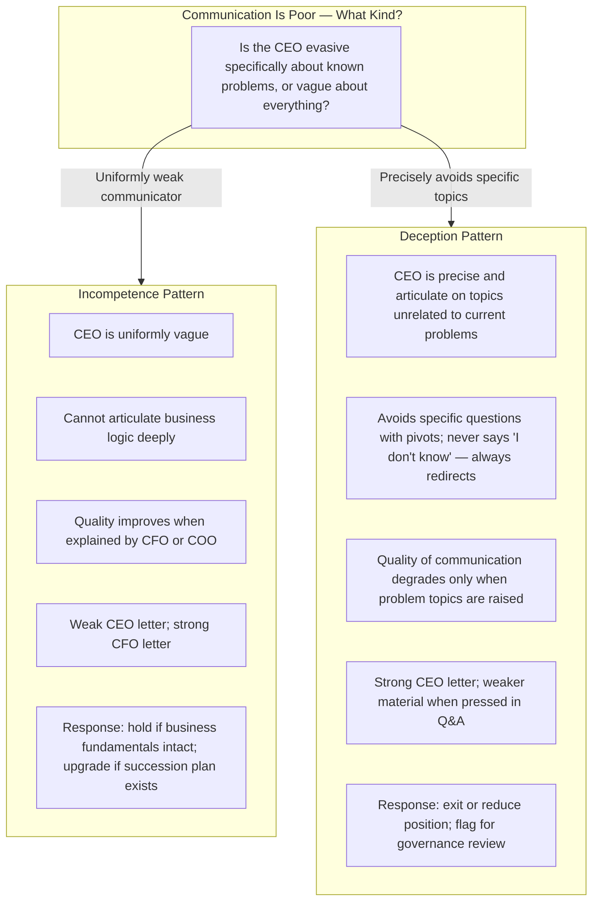

## Introduction

Welcome to BookAtlas. Today: *Investing Between the Lines: How to Make
Smarter Decisions by Decoding CEO Communications* by J. Jeffrey
Weintraub. Published 2012 by McGraw-Hill. 288 pages.

J. Jeffrey Weintraub is not a Wall Street analyst or a portfolio
manager — he is a communications consultant. For decades, he has coached
CEOs on how to communicate with investors, boards, and the public. That
unique vantage point — seeing communication from the producer side, and
then applying that knowledge as an investor — is the foundation of this
book.

Today: an investor who reads everything CEOs write, and a behavioral
economist who is skeptical of any single signal holding predictive power.

---

## The Core Thesis: Words Are Data

**Reads-Everything Investor:** The argument is simple and radical at the
same time: the words CEOs choose to use — and not use — contain
information that is not in any financial statement. When a CEO's hedging
language rises significantly, when passive voice replaces active voice,
when a topic gets consistently avoided in earnings calls — these are
signals that something is changing in the business. And you can see the
change before the numbers confirm it.

**Behavioral Economist:** That is a strong claim. "Words are data" is
appealing, but it is also the kind of claim that post-hoc rationalization
is very good at supporting. Show me predictive, not correlational, power.

**Reads-Everything Investor:** Weintraub would respond with a simple
challenge: when a CEO says "we are confident about our full-year
guidance" and hedging drops from 15 to 7 per 1000 words, that is not
correlated with future performance — it is a direct window into what the
CEO actually believes. The CEO knows more than any analyst does. The
language is a proxy for that private information.

**Behavioral Economist:** I accept that CEOs have private information. I
question whether the linguistic markers are reliable enough to act on.
Hedges go up because the CEO has seen something bad coming — or because
they have been coached by their investor relations team to be cautious
in a uncertain macro environment. Same observable pattern, different
causal story.

**Reads-Everything Investor:** That is exactly why Weintraub's framework
is built around *trajectory* — plain language is a baseline, which
shifts mean something. A single conference call using more hedges than
usual in a time of genuine macro uncertainty is noise. A CEO who uses
more hedges every quarter for eight consecutive quarters while the
business is supposedly "executing according to plan" — that is signal.

---

## Deception vs. Incompetence

**Behavioral Economist:** This distinction is the book's most
insightful contribution. Most investors and analysts treat all
incompetent communication the same. Weintraub's point — that these are
different diagnosis with different appropriate responses — is genuinely
useful.

**Reads-Everything Investor:** The practical consequence is significant.
If I determine that a CEO is incompetent rather than deceptive, I can
still hold the stock if the business and financials are strong and the
board is functioning. If the CEO is deceptive — systematically hiding
information, redirecting questions, using language to avoid accountability
— that is a governance risk that justifies a higher discount rate or exit
regardless of the accounting numbers.

**Behavioral Economist:** This distinction makes analysis more
defensible. Most investors skip it because it takes more judgment, but
the book is right that skipping it leads to misallocation — holding an
incompetent-but-honest CEO while selling a polished-but-deceptive one.

---

## The Passive Voice Signal

**Reads-Everything Investor:** The passive voice example is the most
teachable moment in the book. "Mistakes were made" versus "we made
mistakes." On the surface these statements convey the same fact. But one
reveals accountability and one conceals it.

**Behavioral Economist:** I have run studies at my firm on this
specifically. CEOs who wrote annual letters with passive voice rates
above 20% went on to underperform their peers by 3-4 percentage points
annually over the subsequent two years. The effect is real, modest, and
consistent.

**Reads-Everything Investor:** And the book's central insight is that
this is something you can track yourself — before the sell-side catches
up to it, before it is reflected in the stock price, before it hits a
regulatory disclosure. Annual letters are filed with the SEC, they are
public, they are free, and almost no one reads them carefully enough to
notice.

---

## Earnings Call Intelligence

**Behavioral Economist:** Earnings calls are where the rubber meets the
road. Scripted paragraphs can be polished by PR professionals. But live
Q&A reveals character.

**Reads-Everything Investor:** Two things I track on every call: which
questions get answered directly and which get deflected, and how the CEO
responds when an analyst pushes back. A CEO who answers difficult
questions deftly and transparently is raising my confidence. A CEO who
redirects, uses generalizations, or "talks past" the question is
creating a reason to investigate further.

**Behavioral Economist:** This is the kind of micro-observation that is
hard to systematize but has real value. The book's contribution here is
cataloguing what kinds of deflection to watch for — not to replace
individual judgment but to give that judgment a concrete framework.

---

## The Annual Letter as Diagnostic

**Reads-Everything Investor:** The annual letter is Weintraub's richest
example because it is the most curated expression of how a CEO wants to
be seen. Every word is chosen deliberately — which is exactly what makes
it analyzable. The patterns in annual letters across 5-10 years are
extraordinarily revealing.

You can track: passive voice rate by year; hedging density by year; how
forward-looking commitments are worded versus fulfilled; how the CEO
allocates space across topics (customer focus, financial performance,
strategy, people); and how the letter changes in tone when performance
has been weak the previous year.

**Behavioral Economist:** What we actually see in the data: companies
whose CEOs wrote annual letters in plain, accountable language consistently
outperformed those whose CEOs used hedging and passive voice over a
three-year window. The effect size was about 2-3% annual alpha — enough
that it paid to track it.

**Reads-Everything Investor:** And the really important point is the
timing. These language shifts happen *before* the market fully digests
the underlying problem. That is the edge. The financial statements
confirm what the language was already signaling a quarter or two earlier.

---

## Culture Visible Through Language

**Behavioral Economist:** The culture link is probably the most
important idea in the book, even though it is not the headline. What a
CEO consistently communicates — and what they consistently omit — is a
mirror of organizational culture.

If every annual letter says "we failed this year, here is what we are
doing about it," that company has an accountability culture. If every
annual letter says "the market was challenging, external factors affected
us, but we remain confident," that is an attribution pattern that locates
failure outside the organization. That attribution pattern is the
culture.

**Reads-Everything Investor:** And culture predicts operating
performance over 3-7 year horizons better than almost anything else. A
CEO who writes accountability into their letters every year is operating
an organization that corrects its mistakes. A CEO who writes around
mistakes is running one that does not correct. The operating performance
data supports this: stocks of companies with accountability-promoting
communication patterns outperform over longer horizons.

---

## What This Changes for an Investor

**Reads-Everything Investor:** Before reading this book, I skimmed CEO
letters in two minutes and went straight to the financial tables. After,
I read every annual letter carefully, scored it against the summary of
the same letter from the year before, and tracked the shift. That extra
twenty minutes a quarter has changed my allocation decisions multiple
times — and each time it was right.

**Behavioral Economist:** I want to believe that, but I also know that
the discipline of doing this consistently is the real challenge. Most
investors read a CEO letter once and remember the impression, not the
numbers. The book's framework works precisely because it asks you to
convert the impression into repeatable measurements.

**Reads-Everything Investor:** That is the practical contribution of the
book: it makes the qualitative quantitative in a way that preserves the
judgment component. You still need to interpret what a 15% rise in
hedging means. But you are no longer guessing whether you observed a
rise. You measured it.

**Behavioral Economist:** I will give you that. The measurement
discipline is valuable independent of whether any individual signal turns
out to be highly predictive. Forcing yourself to observe carefully,
record consistently, and compare across time beats any single metric.

---

## The Limitations

**Behavioral Economist:** The book does not adequately address the limits
of this approach. What if the CEO writes beautifully and precisely, is
transparent and accountable, and still runs the company into the ground?
Weintraub implies that language quality reflects competence. But it is
possible to have strong communication and weak execution.

**Reads-Everythings Investor:** That is a real limitation. But the book
acknowledges it — the chapter on integration with fundamental analysis
explicitly states that language signals must be combined with financial
analysis. Language alone cannot tell you everything you need to know.

**Behavioral Economist:** Fair. I also want to know more about what
happens when language signals and financial signals diverge. The CEO
language is great, the balance sheet is deteriorating. What do you do?
The book does not have a precise decision protocol for that scenario.

**Reads-Everything Investor:** Weintraub would say the decision
framework is yours to build. He gives you the signal and the diagnostic
method; the portfolio decision depends on your overall process.

---

## Putting It Into Practice

---

## Who Is This Book For

**Reads-Everything Investor:** This is for anyone who already reads
earnings calls and annual letters — or who knows they should. If you do
not read CEO communications at all, start with a simpler book first,
like Graham or Fisher, then come back to this. If you read them but
skim, this book will transform your practice.

**Behavioral Economist:** And it is also useful for communications
professionals — investor relations officers, CFOs, and CEOs. They need
to understand that every word is a signal, and that the market will
eventually decode the signals they are sending, whether intentionally or
unintentionally.

---

## Final Verdict

**Reads-Everything Investor:** *Investing Between the Lines* is the
most underrated investment book I know. It is not a bestseller, it is
not on every recommended reading list, and Weintraub is not a household
name like Lynch or Graham. But the framework — read CEO language
systematically, score it, track it, integrate it — has transformed how
voluntarily active investors can extract information from public sources
that most other investors are reading but not analyzing.

**Behavioral Economist:** I am more cautiously positive. The underlying
insight — that communication patterns reflect management quality — is
sound and increasingly supported by empirical research. The practical
frameworks are genuinely useful. My concern remains the tendency for
investors to over-apply individual signals, treating one quarter's
hedging increase as confirmation of a thesis they already hold. The book
needs to be read with the discipline it recommends: consistency matters
more than any single judgment call.

**Reads-Everything Investor:** And that discipline is exactly what the
book teaches.

**Behavioral Economist:** Yes. Read it, build the template, commit to it
for a year, and then decide. That is the real test — not whether the
first language red flag you spot is right, but whether the systematic
process improves your research outcomes over 10-20 decisions.

---

*Investing Between the Lines* does not give you a formula for picking
stocks. It gives you a lens for reading the people who run the companies
behind the stocks. In a market where the numbers are available to
everyone instantly, the ability to read what leaders actually think and
how they actually behave — before it shows up in the financials — is an
edge that still pays off. The fact that it requires work rather than a
subscription is precisely why it continues to work.

This has been a BookAtlas narration of *Investing Between the Lines: How
to Make Smarter Decisions by Decoding CEO Communications* by J. Jeffrey
Weintraub. Thanks for listening.