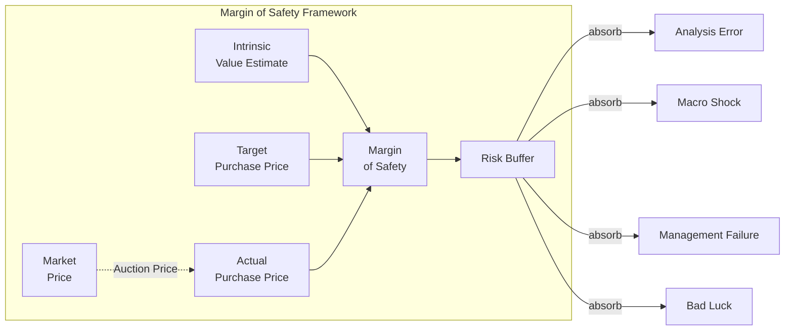
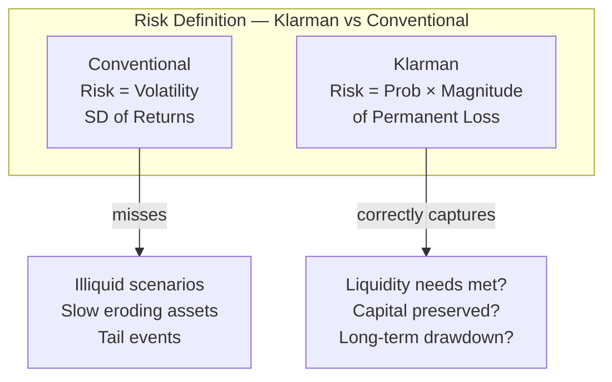
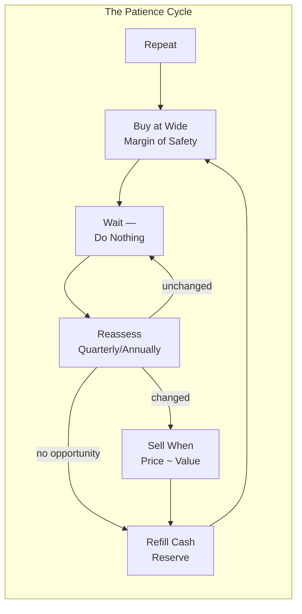

## Core Concepts

### What Is a Margin of Safety?

The term comes from engineering and finance. An engineer designing a
bridge builds it to support 10,000 tons even if the design load is 3,000
tons — the excess is the margin of safety. It absorbs errors in
materials, unforeseen weather, higher traffic than expected.

Klarman applies the same principle to investing. The difference between
what you pay for a security and what it is worth — the discount to
intrinsic value — is the investor's margin of safety. The wider the gap,
the less dependent your outcome is on being right about details.

Graham's original guideline: never pay more than two-thirds of
intrinsic value. Klarman at Baupost rarely writes a check at more than
70 cents on the dollar, and for distressed situations he often waits
for prices in the 30–50 cent range. The discount serves as a buffer
against:

- Sales projections that are overly optimistic
- A macro downturn that reduces earnings by 30%
- A management team that underperforms
- Errors in your own analysis



---

### Risk as Permanent Loss of Capital

Klarman devotes the first third of the book to demolishing the
conventional definition of risk. Standard finance texts define risk as
volatility — the standard deviation of returns. This is wrong, Klarman
argues, for three reasons:

1. A stock that drops 30% and then recovers is not risky under the
   volatility definition. It has low Sharpe ratio. But for an investor
   who needed liquidity at the bottom, it was an infinite-risk event.
2. An asset that drifts down slowly with low volatility can represent a
   permanent loss of capital. Look at Japanese bank stocks in the 1990s.
   Low volatility, catastrophic loss.
3. Focusing on volatility causes investors to diversify away from
   precisely the kind of asymmetric, high-upside opportunities that
   value investors find.

Klarman's definition:

> **Risk is the probability and magnitude of the permanent loss of
> capital.**

This reframes the entire investment process. Suddenly, the question
is not "how volatile is this stock?" but "what could go wrong here,
and how much could I lose?" The answers to that question determine
whether a security is appropriate at any given price.



---

### Intrinsic Value Is Subjective and Unstable

There is no calculator for intrinsic value. Every valuation model
— discounted cash flow, dividend model, asset-replacement-cost model,
comparable-company analysis — produces a *range*, not a point. Klarman
argues that investors who treat their model output as precision are
building on sand.

He outlines the four dominant approaches to valuing a business:

**Discounted Cash Flow (DCF)**
Most widely used in academia. Project free cash flows, apply a
discount rate. The problem: DCF is exquisitely sensitive to terminal
growth assumptions. A 1% change in assumed growth rate over 10 years
can shift a $100 valuation to $140 or $70. Klarman calls DCF "dangerous
in the hands of anyone who does not understand the inputs."

**Net Asset Value (NAV) / Book Value**
Preferred by Klarman for asset-heavy businesses. Liquidation value
minus liabilities. This is the most grounded approach for distressed
companies, and it is the foundation of many of Baupest's best trades.
The problem: book value is often aggregates of assets at historical
cost; realizable value can be much lower or higher.

**Earnings Power Value**
Annuity approach: normalize earnings, capitalize at a reasonable
rate. Works well for stable, mature businesses with predictable
profitability. Fails for high-growth companies (decay is inevitable)
and innovative companies in new sectors.

**Comparable-Company Analysis**
Relative valuation. Useful for sanity-checking but dangerous as the
primary method because market prices — by definition — include the
very mispricing you are trying to exploit.

Klarman's solution: triangulate. Use at least two methods and look for
intersections. A wide range of justifiable values means the margin of
safety must also be wide. A narrow range means a smaller buffer is
acceptable.

---

### Market Inefficiency and the Efficient Market Hypothesis

Klarman reserves his strongest attacks for Eugene Fama and the
Efficient Market Hypothesis (EMH). The EMH was dominant at the time of
writing — 1991 — and remains influential in financial academia.

Klarman's seven-point refutation:

1. **Markets are populated by humans, not computers.** Human behavior
   systematically produces mispricing: greed, fear, herd behavior,
   short-termism, careerism.
2. **The S&P 500 does not consist of identical securities.** If it did,
   a single pricing formula would apply to all stocks, and arbitrage
   would equalize them. In reality, each company has a unique risk
   profile, capital structure, and growth trajectory.
3. **Most professionals underperform.** If markets were efficient, the
   average professional investor would match the index after costs.
   They don't. Most fund managers underperform — which means the
   mispricings they fail to exploit prove the inefficiency exists.
4. **Mispricings cluster at extremes.** EMH cannot explain why tech
   stocks in 2000 or financial stocks in 2008 fell 70–90%. If prices
   reflect all available information, such moves are impossible.
5. **Costs create friction.** Transaction costs, taxes, and short-sale
   constraints prevent arbitrage from working instantly. Friction means
   mispricings persist longer than EMH predicts.
6. **Margin of safety works precisely because markets are inefficient.**
   If markets were always efficient, there would be no bargains. The
   very existence of value investors who outperform proves the
   inefficiency.
7. **The burden of proof.** EMH proponents must prove markets are
   efficient. The existence of Warren Buffett, Seth Klarman, and value
   investing dynasties is all the evidence needed that markets are not.

Klarman summarizes his argument:

> "If the market were efficient, I would be a bum on the street
> with a tin cup rather than a professional investor managing my
> own money."

---

### The Auction Process and Market Psychology

Klarman borrows from Graham the metaphor of **Mr. Market**. Graham
presented Mr. Market as a manic-depressive business partner who shows up
every day offering to buy your interest or sell you his — at whatever
price he happens to be feeling that day.

Klarman extends the metaphor into behavioral finance. The "market" is
not an entity. It is an auction — an aggregation of millions of buy and
sell orders driven by fear, greed, misinformation, and noise. The price
at any given moment is an output of this auction.

```mermaid
graph TB
  subgraph Market_Auction["Mr. Market — The Auction"]
    direction TB
    F[Fear Selling<br/>Panic]
    G[Greed Buying<br/>Euphoria]
    C[Calculation<br/>Fundamental Value]
    I[Information<br/>> Signals]
    O[Orders Flowing<br/>Into Auction]
    P[Price]<--|output| O
  end

  F -->|sellers| O
  G -->|buyers| O
  C -. rarely drives price at extremes .-> P
  I -. expected to drive price in EMH .-> O

  P -->|shows to investor| VI{Value<br/>Investor?}
  VI -->|yes| ACTION[Buy if below intrinsic value<br/>Sell if above<br/>Ignore otherwise]
  VI -->|no (follow crowd)| TRADE[Buy high in euphoria<br/>Sell low in panic]
```

The market is most useful as a source of opportunities, not as a
judge of correctness. When the auction produces a price far below
intrinsic value, the investor buys. When it produces a price far above,
they sell or hold cash. The market is a voting machine in the short run
and a weighing machine in the long run, but the voting phase is where
the decisive mispricings appear.

---

### Special Situations and Distressed Securities

The deepest mispricings Klarman and Baupost have exploited are found in
*special situations* — corporate events that temporarily disconnect
security price from fundamental value. These include:

**Bankruptcy and Chapter 11 Reorganization**
When a company files for bankruptcy, its securities trade in distressed
prices. The equity is usually worthless. But the debt trades far below
recovery value, because buyers fear absolute loss. Klarman systematically
buys the debt, waits for reorganization, and captures the spread between
the fire-sale price and the eventual recovery distribution.

**Spin-offs**
Parent companies spin off subsidiaries to shareholders. The market
routinely underprices the spin-off vehicle, in part because many
institutional holders sell mechanically to reduce complexity. This
creates a buying opportunity at an artificially depressed price.

**Arbitrage and Risk Arbitrage**
Merger announcements create price spreads between the trading price
and the offer price. The spread represents the risk the deal fails.
Klarman buys the spread when the probability-weighted return is
attractive — even when he thinks the deal will close.

**Distressed Exchange Offers**
Companies in trouble approach creditors to restructure. This creates
uncertainty that drives prices below fair value. The investor who
can read the restructuring plan and calculate the post-reorganization
value can buy at a fraction of eventual worth.

**Rights Issues and Recapitalizations**
A company in need of capital may issue rights to existing shareholders.
When the rights trade at a discount to their theoretical value, or when
a distressed company recapitalizes at dilutive prices, permanent loss
potential is low and upside is high — if you do the work.

Klarman's approach to special situations is the most tactical part of
his framework. It requires deep legal and financial analysis — reading
bankruptcy court filings, understanding Chapter 11 priority, parsing
forbearance agreements. It is not for casual investors. But the
structural mispricing is systematic: the institutions that own these
securities have mandates that force them to sell, creating demand on the
other side for patient capital. That demand is why the margin of
safety persists.

---

### The Patience Discipline

Patience is Klarman's most underrated point. He devotes a chapter to it.

Most institutional investors cannot be patient. They are measured
monthly or quarterly. Underperformance for two quarters leads to client
redemptions. Redemptions force the manager to sell into weakness —
precisely when patience is most valuable.

Klarman structured Baupost to avoid this. The fund has a flexible
liquidity structure. Returns are not the sole focus; preservation of
capital is. Investors in Baupost are self-selected for patience.

His prescription for individual investors:

- Treat waiting for good investments as a job, not a vacation. Every
  day you hold cash is evidence that you are doing the work.
- Keep at least 10–15% of the portfolio in cash at all times. A
  permanent cash reserve functions as dry powder for the dislocations
  that will, eventually, appear.
- Do not benchmark against the S&P 500 every quarter. If your strategy
  is value investing, your benchmark is what the market will offer
  when others are forced to sell at distressed prices.
- Resist the pressure to "do something" when the market has
  moved against you without a change in fundamentals.



---

### Key Case Studies in the Book

Klarman does not present a gallery of portfolio company biographies.
He presents principles through a small number of extended examples:

**1987 Black Monday — Treasury Bonds and Junk Bonds**
Baupost bought Treasury bonds (prices up, yields down) and junk bonds
(prices crashed on deflation fears) as the market liquefied. The junk
bond spread widened to 20%+ over Treasuries — far wider than the
implied default probability. Klarman bought at ~50 cents with
underlying collateral values supporting par. Three years later, most
positions had recovered to par or higher.

**The Washington Public Power Supply System (WPPSS) Bonds**
A municipal bond default in the 1980s created Muni bond prices far
below even the distressed recovery value. Bonds with recovery value of
70–80 cents traded at 30–40 cents. Klarman describes how to analyze
the restructuring and capture the spread. One of the cleanest
illustrations of the margin-of-safety principle applied to fixed income.

**Loews Corporation — The Conglomerate Discount**
Loews trades at a discount to the sum of its parts: insurance,
cigarettes, hotels, energy. Klarman explains how the conglomerate
discount can be 30–40% and why it persists — and how to capture it.

**Distressed Retail and Real Estate in the Late 1980s**
Klarman's analysis of Drexel-era junk bonds and commercial real
estate busts shows how extreme events create mispricings that the
margin-of-safety framework was designed to exploit.

---

### Practical Applications

**For the Sophisticated Individual Investor:**
- Establish a permanent cash reserve equal to 15–25% of portfolio value.
  This is not idle; it is your purchase fund.
- Before any purchase, write down three scenarios: best case, base
  case, and worst case. Calculate the implied price return in each.
  Only proceed if worst-case return is acceptable even if it is zero.
- Value securities you own at least once per year. If the price is
  within 10% of your intrinsic value estimate, consider selling —
  unless the business quality is exceptional.
- When a position drops 20% in 30 days, re-evaluate. Did the
  business change fundamentally? Or did the market simply reprice?
  The answer determines the action.

**For Fund Managers and Institutional Investors:**
- Build flexibility into mandates. The most profitable opportunities
  exist in distressed or illiquid securities that most funds cannot
  hold. Narrow mandates destroy margin of safety.
- Resist quarterly benchmarking. Institutional investors who compare
  themselves to indices every quarter will underperform over any
  multi-year horizon, precisely because the best value opportunities
  require multi-year holds.
- Use scenario analysis, not point forecasts. Present clients with
  three scenarios, explain the range, and manage to the downside.

**For the Beginner:**
- Start with Graham's *The Intelligent Investor*. It is the right
  foundation. Margin of Safety assumes Graham's framework.
- Define "risk" correctly from day one. Risk = permanent loss of
  capital. Not volatility. Write this definition on a sticky note.
- Learn to calculate intrinsic value using at least two different
  methods. The gap between them tells you how large a margin of
  safety you need.
- Do not invest in anything you cannot value. If you cannot estimate
  intrinsic value, you cannot assess whether a margin of safety exists.

---

### Action Plan

1. **Calculate intrinsic value for three stocks you already own.**
   Use two methods: DCF and asset book value. Measure the current
   price as a percentage of your value estimate. If it is above 85%
   of your estimate, flag it for research.

2. **Build your distress library.** Read one 10-Q or 10-K from a
   currently-distressed company (any sector). Identify the debt
   structure, the asset collateral, and the priority of claims. This
   is the work Klarman does before he acts.

3. **Set a cash floor.** Decide on a minimum cash percentage and
   enforce it mechanically. 10% is the absolute minimum Klarman
   respects. Most of his best opportunities arrive when he is
   sitting on 20–30% cash.

4. **Reject the next 10 "can't-miss" opportunities.** When a new fund
   is hyped, a sector is hot, or an IPO is being placed, do nothing.
   Practicing inaction is a discipline. It is harder than it sounds.

5. **Invert every investment thesis.** Before buying, write down the
   three most likely reasons this investment will fail. Calculate the
   maximum realistic loss. If you cannot tolerate that loss, do not
   invest regardless of the upside.

6. **Practice scenario thinking.** Every week, pick one position and
   run a 10-minute scenario analysis. Best case? Base case? Worst
   case? The habit builds the discipline that prevents permanent
   capital loss.