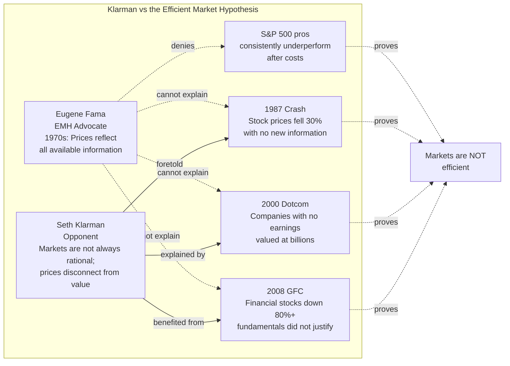

## Introduction

Welcome to BookAtlas. Today: *Margin of Safety: Risk-Averse Value
Investing Strategies for the Thoughtful Investor* by Seth A. Klarman —
published 1991, HarperBusiness. 350 pages. Written during the peak of
the 1980s bull market, where everyone was celebrating buyout booms and
junk bonds. And Klarman sat down and wrote a 350-page warning.

I'm Sam. With me is Casey. We rarely argue about books. We argue
about this one.

**Sam:** It is the most important investing book nobody has read.
For practical purposes, it has been out of print for 30 years. Used
copies sell for thousands. It is more scarce than any first edition
Graham or a signed Buffett letter.

**Casey:** And also more important than most of those. This book is
Graham distilled through the mind of someone who has actually done the
work at the highest level for four decades. Let's talk about it.

---

## Host 1 — "The Most Precise Book Ever Written on Investing"

**Sam:** Let me start with why this book stands apart. Klarman is the
only major value investor who has written a book that is not a biography
and not a memoir and not a marketing pamphlet. It is pure argument:
here is how markets work, here is how to value securities, here is how to
manage risk, here is why most people will fail.

He lays out seven chapters. In each, he builds toward the same
conclusion: invest with a margin of safety or do not invest at all.

**Casey:** And he does not sugarcoat the consequence of ignoring the
margin. The book's most quoted passage is also its most uncomfortable.
He says purchasing a security without a margin of safety is equivalent
to driving across a bridge rated for 10,000 pounds with a 10,001-pound
load. The bridge might hold. But it is a bad bet.

Then he says: "Most investors who lose money do so because they are
fully invested in a market or sector they have convinced themselves is
safe."

That single sentence captures the entire case against momentum
investing, against buying what everyone else is buying, against the
idea that the past predicts the future.

**Sam:** The second thing that makes this book unique is the redefinition
of risk. Standard finance: risk = volatility, measured as standard
deviation of returns. Klarman: risk is the probability and magnitude of
permanent capital loss.

This distinction changes everything. A Treasury bond that yields 2% and
never moves in price is "low risk" under the standard definition. But
if inflation is running at 4% over 30 years, you have a permanent loss
of 50% in real terms. Klarman would call that a risky investment.
A biotech stock that drops 60% in a week but recovers and compounds
15% annually is "high risk" under standard definition. But if you
sold at the bottom, the risk was not the volatility; the risk was that
you sold for a loss you did not have to take.

---

## Host 2 — "Is This Book Practical or Just Philosophy?"

**Casey:** Let me push back. The book is a philosophy. A beautiful one.
But for most investors, it is nearly impossible to implement.

Klarman's margin of safety requires a wide gap between price and
intrinsic value. He wants 30–50% discounts in distressed situations
and 25–30% in ordinary situations. But markets — particularly large-cap,
efficient markets — simply do not offer those discounts reliably.

An investor who insists on a Klarman-level margin will be uninvested
most of the time. For an institutional investor with quarterly
performance reviews, that is a career-limiting strategy. For an
individual investor, that is boring and uncomfortable.

**Sam:** Klarman explicitly addresses this. He says most of the time,
the best action is inaction. He says holding cash is not a failure.
The market is an auction, and an auction is only favorable when it is
favorable. He says the opportunity will come. It always comes. The
1987 crash, the 1990 S&L crisis, the 2001 post-dot-com bust, the 2008
GFC, the 2020 COVID crash — every decade produces a window of extreme
mispricing. The discipline is to have the dry powder ready.

**Casey:** But having dry powder for 10 out of 120 months means your
annual returns will trail the index in bull markets. Klarman acknowledges
this. His response is: if you want to match the index, just buy the
index. Most investors are not benchmarks; they are decision-making
entities trying to preserve capital and compound over decades. If you
accept underperformance in rising markets as the cost of avoiding
permanent losses in falling ones, the framework is internally consistent.

---

## The Section They Actually Argue About — Is Klarman Right About EMH?



**Sam:** The EMH debate is not theoretical. It is practical. If markets
are efficient, there is no margin of safety. Klarman writes: "If the
market were efficient, I would be a bum on the street with a tin cup
rather than a professional investor managing my own money."

Seven years after this book was published, the dot-com bubble happened.
Stocks with no revenues, no profits, no business models were priced at
billions. That is not efficiency; it is collective mania. Klarman
predicted this kind of behavior, without naming the specific event.

**Casey:** And yet. The book was published in 1991. The 1990s bull
market ran for nearly a decade. The market was not efficient — it was
efficient enough to make value investors look foolish for almost the
entire decade. Klarman himself underperformed in some years during this
period. His 1999 returns were something like 9% against a market that
returned 21%.

**Sam:** Which he acknowledges explicitly. He writes about underperform-
ance as the price of admission for the margin-of-safety approach. The
1990s are Exhibit A in his case for patience. The value investor who
sold out in frustration in 1999 missed the entire post-2001 recovery —
when Klarman's funds outperformed dramatically.

---

## Host 2 — "Distressed Securities: Where the Edge Actually Lives"

**Casey:** The most technically rich part of the book is the treatment
of distressed securities. Klarman covers:

- **Bankruptcy reorganization:** How to read Chapter 11 filings, value
  the reorganized entity, calculate the implied recovery to each class
  of security.
- **Spin-offs and split-offs:** Why institutional forced-selling
  creates mispricings, how to calculate the sum-of-parts value before
  the market does.
- **Arbitrage and risk arbitrage:** When to trade the spread between
  the trading price and the deal price, how to estimate deal-
  completion probability, when to walk away.
- **Distressed exchange offers:** Companies that cannot meet debt
  maturities and must negotiate. The investor who understands the
  restructuring can buy securities at a fraction of post-restructuring
  value.

This is not populist value investing. This is specialized, incremental
alpha. Klarman treats it as the natural extension of the margin-of-
safety concept. When a company is in financial distress, its securities
trade without regard to intrinsic value. This is where the widest
margins appear — and where the greatest returns are available to those
who do the work.

**Sam:** It also requires genuinely specialized expertise. You have to
understand the absolute priority rule in bankruptcy. You have to
understand how a DIP (debtor-in-possession) facility works. You have to
read reorganization plans and calculate exit values. This is not reading
10-Ks. It is legal/financial analysis. Most individual investors cannot
do this. Most institutional investors choose not to.

**Casey:** Exactly why the edge persists. The market for distressed
securities is characterized by forced selling from institutions,
complexity that deters retail capital, and paper risk premia that exceed
the actual risk. Klarman is behaving like a specialist surgeon in a
field where general practitioners fear to tread.

---

## The Skeptic's Closing Argument

**Sam:** My final push. Klarman says the margin of safety approach
outperforms over full market cycles. I agree that on a 20-year
horizon, value beats momentum, beats growth, beats most things. Klarman
himself has the track record to prove it.

But Klarman also says most investors will not have the discipline to
execute this strategy. He is right about that too. And here is my
question: if the approach requires behavioral traits — patience, risk
tolerance, intellectual independence — that are extremely rare, is it
meaningful to write a book about it? The people who need it most cannot
use it. The people who can use it already know it.

**Casey:** That is a fair challenge. But the same critique applies to
every genuinely useful book. *The Intelligent Investor* has the same
problem. *Security Analysis* has the same problem. The book is not a
system that works regardless of who implements it. It is a
philosophical foundation. The implementation depends on the reader.

My response: Klarman wrote this book not to create armies of disciples
but to articulate a philosophy that he had seen work for decades.
The scarcity of practitioners does not make the philosophy wrong. It
makes it harder.

---

## Practical Mental Model Checklist

Before any investment decision:

```
[ ] MARGIN — Is the purchase price at least 30% below my intrinsic
    value estimate? If not, I do not buy.

[ ] RISK — What is the worst realistic scenario, and could it produce
    a permanent loss of capital? Is that outcome tolerable?

[ ] INTRINSIC VALUE — Have I estimated value using at least two
    methods? Do they agree within a reasonable range? If the range
    is wide, I need a wider margin.

[ ] LIQUIDITY — If I had to sell in a forced scenario (margin call,
    redemption, life event), what would I likely recover? The margin
    must cover that.

[ ] REASON FOR DISCOUNT — Why is the market offering a discount?
    Is the market wrong about a specific risk? Or is the market right
    and I have not yet understood the risk?

[ ] PATIENCE TEST — Am I buying because this looks like a discount
    right now, or because I have been waiting for this particular
    situation for months?

[ ] CASH CHECK — After this purchase, do I maintain my permanent cash
    reserve? If not, I am over-indexed and cannot exploit the next
    dislocation.
```

---

## Closing

**Sam:** I came to this book expecting another manual for beating the
market. I found something rarer: a manual for surviving it. Margin of
Safety does not promise to make you rich. It promises — with rigorous
logic — to keep you from going broke. In an industry where everyone
is selling alpha, that is a radical stance.

**Casey:** And I came expecting something overly cautious, a book
written by someone who is so good at the game that he has forgotten
what it is like to be an amateur. I found instead that Klarman's
caution is the result of having seen — and survived — enough disasters
to know how fragile capital is. His instinct to protect the downside
is not timidity. It is the instinct of a professional who has spent
his whole career managing permanent capital.

**Sam:** If you are going to read one book that explains why passive
indexing is not the whole story, why long-term compounding requires
intellectual independence, and why the three most important words in
investing are "margin of safety" — this is the book.

**Casey:** Read it. Take notes. Practice inverting investment theses.
Watch the auction. The market will eventually give you what Knarman
describes. The question is whether you will be ready when it does.

**Both:** This has been BookAtlas. Preserve capital. Wait for the
auction. Keep your margin wide.

**Sam:** Go read Seth Klarman.