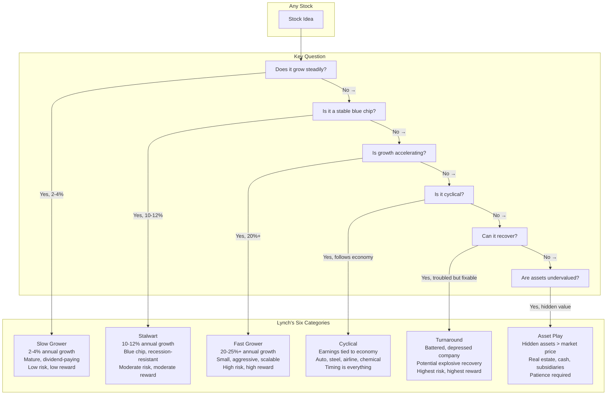
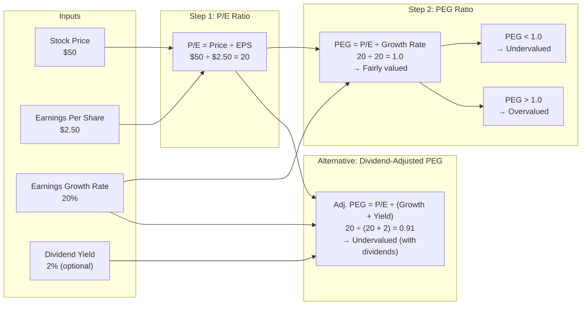
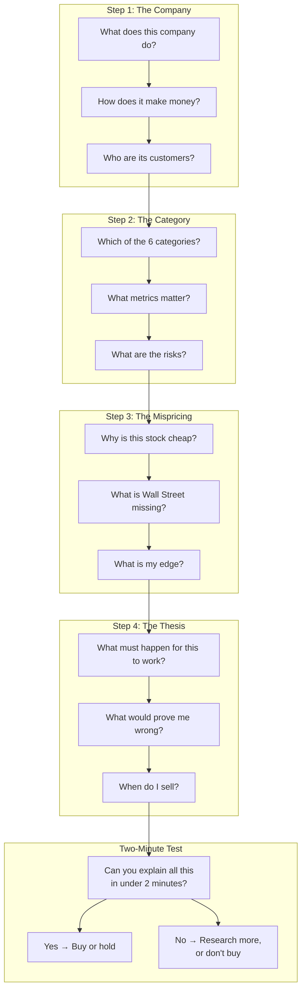
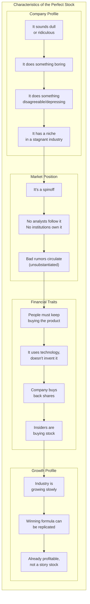
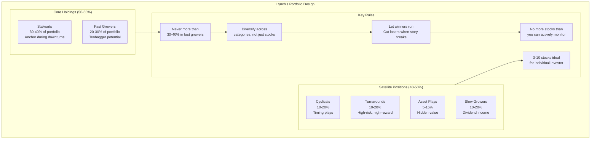
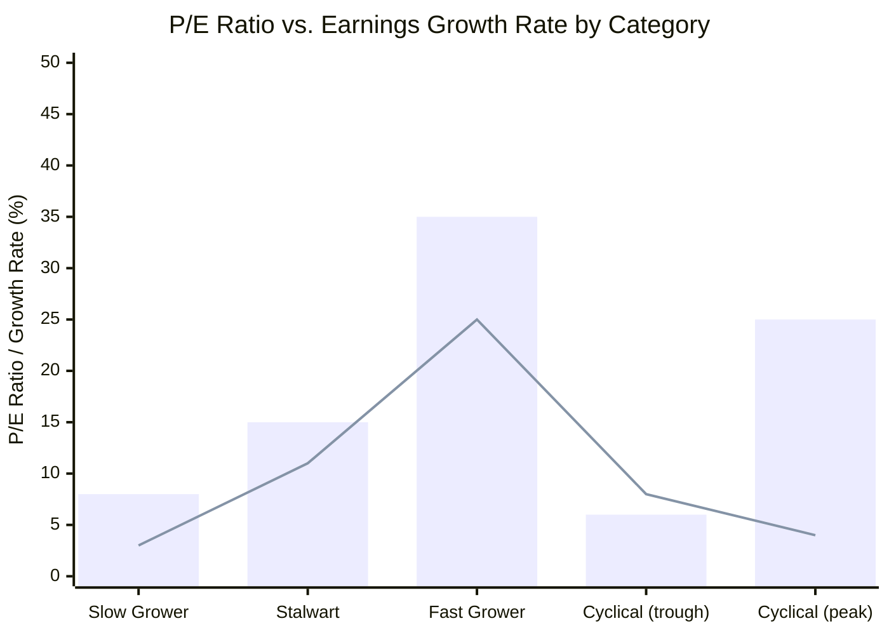

## The Six Stock Categories

Lynch classifies every stock into one of six categories. This is not an
academic exercise — the category determines how you evaluate the stock,
what you expect from it, and when you sell it.

### Category Details

| Category | Growth | P/E Range | Balance Sheet | Sell Signal |
|----------|--------|-----------|---------------|-------------|
| Slow Grower | 2-4% | 5-10 | Strong | Dividend cut or loss of market share |
| Stalwart | 10-12% | 10-20 | Strong | P/E exceeds growth rate, 30-50% gain |
| Fast Grower | 20-25%+ | 20-50+ | Moderate | Growth slows, new competitors emerge |
| Cyclical | 0-40% (swings) | 4-8 (trough) | Varies | Inventory builds, capacity expands |
| Turnaround | Potentially high | N/A (losses) | Critical to assess | Debt resolved, operations stabilized |
| Asset Play | Situation-dependent | Varies | Asset-rich | Market recognizes hidden value |

---

## The PEG Ratio

The PEG ratio (Price/Earnings to Growth) is Lynch's signature
valuation tool. His rule of thumb: a fairly priced stock has a P/E
ratio equal to its earnings growth rate.

### PEG Ratio Guidelines

| PEG Ratio | Interpretation | Action |
|-----------|----------------|--------|
| <0.5 | Deeply undervalued | Strong buy (if growth is sustainable) |
| 0.5-1.0 | Undervalued | Buy |
| 1.0 | Fairly valued | Hold or watch |
| 1.0-2.0 | Overvalued | Consider selling |
| >2.0 | Dangerously overvalued | Avoid or sell |

**Important:** PEG works best for fast growers and stalwarts. For
cyclicals, use normalized P/E. For turnarounds, PEG is meaningless
(earnings are depressed or negative). For slow growers, consider
dividend-adjusted PEG.

---

## The Two-Minute Drill

Lynch insists you must be able to explain why you own a stock in two
minutes. If you cannot, you do not understand it well enough.

### Examples of Good Two-Minute Stories

**Fast Grower (Dunkin' Donuts):** "Dunkin' Donuts is a fast grower
expanding store count nationally. Each new store generates predictable
cash flows within 12 months. The company has no debt and is buying
back shares. Wall Street ignores it because donuts are boring. The risk
is saturation. I will sell when same-store sales growth slows below 5%
for two consecutive quarters."

**Cyclical (Ford):** "Ford is a cyclical at the bottom of the auto
cycle. Inventory-to-sales ratios are low. The company has a strong
balance sheet after the 2008 restructuring. When the economy recovers,
earnings will rebound sharply. I will sell when capacity utilization
hits 85% and management starts building new plants."

---

## The Perfect Stock

Lynch describes 13 characteristics of ideal stock candidates. No stock
has all 13, but more is better.

### Stocks to Avoid

| Red Flag | Explanation |
|----------|-------------|
| Hot industry | "The next X" — these are almost always overpriced |
| Whisper stock | "About to discover something miraculous" |
| Diworseification | Company diversifies into businesses it does not understand |
| One customer dependency | If one client is 50%+ of revenue, the risk is unacceptable |
| Exciting name | The more exciting the name, the more overpriced the stock |
| 50-100% growth | Unsustainable — growth will decelerate and the stock will collapse |

---

## Portfolio Strategy by Category

Different categories play different roles in a portfolio. Lynch
recommends understanding each category's purpose.

### Monitoring Cycle

| Category | Check Frequency | Key Metrics to Watch |
|----------|----------------|----------------------|
| Slow Growers | Quarterly | Dividend payout ratio, market share trend |
| Stalwarts | Quarterly | P/E vs. growth, competitive threats |
| Fast Growers | Monthly | Same-store sales, growth rate trajectory |
| Cyclicals | Monthly | Inventory levels, capacity additions, pricing |
| Turnarounds | Weekly | Debt levels, cash burn, operating milestones |
| Asset Plays | Quarterly | Asset valuations, catalyst timeline |

---

## P/E Ratio vs. Growth Rate

Lynch's core insight linking valuation to growth:

**Legend:** Blue bars = P/E Ratio | Red line = Earnings Growth Rate (%)

A stock is fairly valued when the bar and line are roughly equal
(PEG ~1.0). When the bar exceeds the line (PEG > 1.0), the stock is
overvalued. When the line exceeds the bar (PEG < 1.0), the stock is
undervalued.

Note the cyclical pattern: at the trough, P/E is low and growth is
about to recover. At the peak, P/E is high and growth is about to
decline. This is why cyclicals require different analysis.

---

## Chapter-by-Chapter Map

### Part I: Preparing to Invest

| Ch | Title | Core Idea |
|----|-------|-----------|
| 1 | The Making of a Stockpicker | Lynch's personal journey from caddie to Magellan manager |
| 2 | The Wall Street Oxymorons | Why professional investors are often wrong — herding, career risk, bureaucracy |
| 3 | Is This Gambling, or What? | Distinguishing investing from speculation; both involve risk but investing requires research |
| 4 | Passing the Mirror Test | Know your risk tolerance, time horizon, and whether you have the stomach for stocks |
| 5 | Is This a Good Market? Please Don't Ask | You cannot time the market — the question is not "is it a good market" but "are there good companies?" |

### Part II: Picking Winners

| Ch | Title | Core Idea |
|----|-------|-----------|
| 6 | Stalking the Tenbagger | Find investment ideas in everyday life — the consumer's edge and the professional's edge |
| 7 | I've Got It, I've Got It — What Is It? | The six stock categories: classification determines strategy |
| 8 | The Perfect Stock, What a Deal! | 13 characteristics of ideal stock candidates |
| 9 | Stocks I'd Avoid | Red flags: hot stocks, whisper stocks, diworseification, customer concentration |
| 10 | Earnings, Earnings, Earnings | The P/E ratio explained; why earnings drive stock prices over the long term |
| 11 | The Two-Minute Drill | How to articulate your investment thesis; what story each category should tell |
| 12 | Getting the Facts | How to research a company: annual reports, 10-Ks, Value Line, talking to IR |
| 13 | Some Famous Numbers | Cash flow, debt ratios, inventory, pension plans, and what they reveal |
| 14 | Rechecking the Story | When to revisit your thesis; how to monitor the key assumptions |
| 15 | The Final Checklist | Complete pre-purchase checklist covering category, valuation, financials, and catalysts |

### Part III: The Long-Term View

| Ch | Title | Core Idea |
|----|-------|-----------|
| 16 | Designing a Portfolio | Portfolio construction by stock category; how many stocks to own; asset allocation |
| 17 | The Best Time to Buy and Sell | Category-specific buy and sell rules; when to hold, when to fold |
| 18 | The Twelve Silliest Things People Say | Debunking common market myths |
| 19 | Options, Futures, and Shorts | Lynch does not recommend these for individual investors |
| 20 | 50,000 Frenchmen Can Be Wrong | Why contrarian thinking pays off; the danger of following the crowd |

---

## Key Insights from Each Section

### Part I: Preparing to Invest

- Investing is not gambling if you do the work
- You cannot predict the economy or the market
- Know your risk tolerance before you start
- The mirror test: are you a long-term investor or a speculator?
- Small companies have larger moves than large companies

### Part II: Picking Winners

- The best ideas come from your everyday experience
- Classify the stock first, analyze second
- Earnings drive stock prices — everything else is noise
- The two-minute drill forces thesis clarity
- Check the balance sheet before buying anything

### Part III: The Long-Term View

- Design your portfolio by category, not just by stock
- Different categories have different sell rules
- Market declines are buying opportunities
- Ignore the crowd — 50,000 Frenchmen can be wrong
- Time is on your side with great companies
