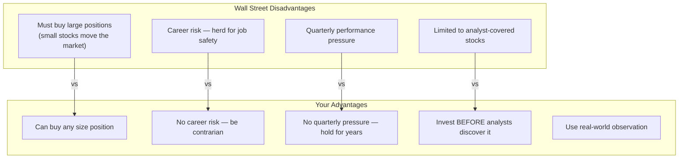
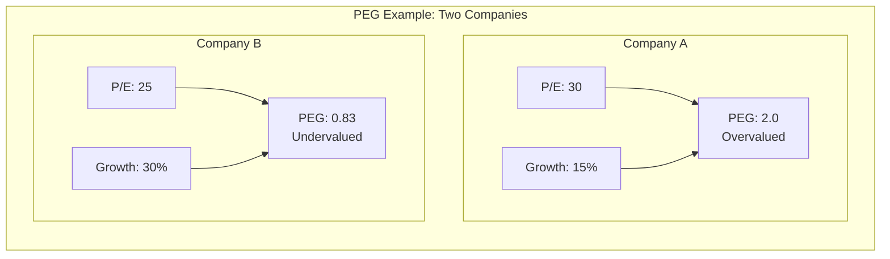

## Introduction

Welcome to BookAtlas. Today: *One Up On Wall Street: How to Use What
You Already Know to Make Money in the Market* by Peter Lynch with John
Rothchild. Published 1989, Simon and Schuster. 304 pages.

Peter Lynch managed Fidelity's Magellan Fund from 1977 to 1990. Under
his management, it became the best-performing mutual fund in the world,
averaging 29% annual returns. In this book, he explains how individual
investors can beat Wall Street at its own game.

Today: an enthusiastic individual investor who follows Lynch's system,
and a skeptical academic who thinks stock picking is a fool's errand.

---

## The Core Thesis: Your Edge

**Enthusiast:** The most important sentence in the book is this: "Your
investor's edge is not something you get from Wall Street experts. It
is something you already have." Lynch is saying that I — a regular
person with a job and a family — have advantages that professional fund
managers do not. I can invest in small companies. I do not have to
worry about career risk. I can be patient. I can buy stocks that are
too small for institutions. That is a huge insight.

**Skeptic:** It is a nice sentiment, but it ignores the evidence. The
overwhelming majority of individual investors underperform the market.
Dalbar's studies show the average equity fund investor earns far less
than the S&P 500 because they buy high and sell low. The "edge" sounds
good in theory, but in practice, most people lack the discipline to
execute.

**Enthusiast:** Lynch would agree with you! He says repeatedly that
stock picking is not for everyone. The mirror test in chapter 4 asks:
do you have the stomach to hold when the market drops 20%? If not, buy
a mutual fund. He is not saying everyone should pick stocks. He is
saying those who do should use their natural advantages.

**Skeptic:** Fair point. But the book's title and marketing suggest
anyone can do this. The nuance gets lost.

---

## The Six Categories

**Enthusiast:** The stock category system is genius. Before Lynch, I
treated every stock the same way. Now I ask: is this a fast grower or
a cyclical? A stalwart or a turnaround? Each type needs a different
approach — different metrics, different expectations, different sell
rules. It is like having six different investment playbooks.

**Skeptic:** But the categories are subjective. Is Apple a stalwart or
a fast grower? Was Amazon a fast grower or a cyclical? Companies evolve
from one category to another. The framework is useful for thinking but
not precise enough to make decisions on its own.

**Enthusiast:** That is the point! Lynch says you must re-evaluate
constantly. The category is not permanent. When a fast grower slows
down, it becomes a stalwart or even a slow grower. That is your signal
to reconsider the investment. The categories force you to think
dynamically about the company.

---

## The PEG Ratio

**Enthusiast:** The PEG ratio is the single most useful investing tool
I have ever learned. It is so simple: divide the P/E by the growth
rate. If the answer is under 1.0, the stock is undervalued. If it is
over 1.0, you are paying too much. I screened hundreds of stocks using
PEG and found some incredible bargains.

**Skeptic:** The PEG ratio is only as good as the growth estimate it
uses. Analysts are notoriously bad at predicting growth. A PEG of 0.5
does not mean a stock is cheap — it might mean the market is correctly
pricing in a growth slowdown that the analyst has not yet recognized.
The PEG gives false precision.

**Enthusiast:** Lynch would say that is why you need the two-minute
drill and fundamental research. The PEG is a screen, not a conclusion.
It tells you which stocks to investigate further. Then you do the
homework on whether the growth is sustainable.

**Skeptic:** That is a lot of work for every stock.

**Enthusiast:** Investing is supposed to be work. If you are not
willing to do it, buy an index fund. Lynch says exactly that.

---

## The Two-Minute Drill

**Enthusiast:** The two-minute drill changed how I think about
investing. Before, I would buy stocks because I had a vague feeling
they would go up. Now, I force myself to write down the thesis before
buying. If I cannot explain it clearly in two minutes, I do not buy it.
It has saved me from dozens of bad decisions.

**Skeptic:** That is actually a good discipline. It forces you to
articulate your assumptions, which makes them testable. The problem is
that people write convincing two-minute stories that are wrong. A good
story is not the same as a good investment.

**Enthusiast:** The drill catches the bad stories. If your thesis is
"this stock will go up because it has a cool product," the drill exposes
that as nonsense. You have to connect the product to earnings, earnings
to stock price, and identify what could break the chain.

**Skeptic:** And most people cannot do that.

**Enthusiast:** Lynch says that means they should not pick stocks.
That is honest advice.

---

## The Tenbagger

**Enthusiast:** The tenbagger concept is thrilling. The idea that one
stock can return ten times your money — and that you can find it by
paying attention to the world around you — is incredibly motivating.
Lynch found Taco Bell by eating there. His wife noticed Hanes hosiery.
These are not genius insights. They are observations anyone could make.

**Skeptic:** And for every Taco Bell, there are a hundred restaurant
chains that went bankrupt. Survivorship bias again. Lynch tells you
about the ones that worked, not the ones that failed. The tenbagger
hunt is a lottery ticket with extra steps.

**Enthusiast:** Lynch addresses this. He says you only need a few
winners. He was right about 60% of the time — but the winners were
10x and the losers were down maybe 20-30%. That is the math of
tenbaggers: a few huge winners cover many small losses.

**Skeptic:** Assuming you can identify the winners in advance. Most
people cannot.

---

## The Perfect Stock

**Enthusiast:** Lynch's description of the perfect stock is brilliant.
It sounds dull. It does something boring. No analysts follow it.
Institutions do not own it. It is in a stagnant industry. This is the
opposite of what most people look for — and that is exactly why it
works. The best investments are hiding in plain sight.

**Skeptic:** It is a useful heuristic, but it is also a description of
how Lynch found stocks in the 1980s. The market has changed. Small
stocks are more heavily traded. Information is more widely available.
The "hidden gem" is harder to find because technology has made the
market more efficient.

**Enthusiast:** Maybe true for some stocks, but there are always
overlooked opportunities. The boring industry thesis is timeless.
People will always underappreciate garbage collection, payroll
processing, and funeral services — and those businesses generate
incredible cash flows.

---

## Stocks to Avoid

**Enthusiast:** The red flags in chapter 9 are worth the price of the
book alone. "Diworseification" — Lynch's term for companies that
diversify into businesses they do not understand — describes half the
corporate disasters of the past thirty years. Avoiding hot stocks in
hot industries has saved me from countless tech bubbles.

**Skeptic:** Avoiding hot stocks is good advice, but it is not
original. Benjamin Graham said the same thing in 1949. And if you
followed this advice blindly, you would have missed Amazon, Google,
and Apple — all of which were once "hot stocks in hot industries."

**Enthusiast:** But you also would have missed Pets.com, Webvan, and
hundreds of other flameouts. Lynch is not saying never buy a
technology stock. He is saying do not buy it because it is hyped. Buy
it because you understand the business and the valuation makes sense.
He invested in technology companies — just not the obvious ones.

---

## Portfolio Design

**Enthusiast:** Lynch's portfolio advice is practical and clear. Own
3-10 stocks. Diversify across categories, not just industries.
Stalwarts provide stability. Fast growers provide upside. Cyclicals
are for timing. Turnarounds are for home runs. Every category has a
purpose.

**Skeptic:** A portfolio of 3-10 stocks is not diversified. You are
taking enormous idiosyncratic risk. If one company fails — and in a
concentrated portfolio, that matters — you lose a huge percentage of
your net worth. Index funds are safer and simpler.

**Enthusiast:** Safer, but also capped. You cannot beat the market if
you are the market. Lynch's point is that concentration forces better
research. If you own 50 stocks, you do not know any of them well. If
you own 5, you know every one of them deeply. The research quality
compensates for the concentration risk.

---

## The Final Verdict

**Enthusiast:** *One Up On Wall Street* is the best investing book
ever written for the individual investor. It is practical, funny, and
empowering. Lynch gives you a complete system: how to find ideas, how
to evaluate them, how to build a portfolio, and when to sell. I have
read it six times and find something new each time.

**Skeptic:** It is a wonderfully written book with useful frameworks.
The six categories, the PEG ratio, and the two-minute drill are
genuinely valuable tools. But the book oversells the individual
investor's ability to beat the market. Lynch was a once-in-a-generation
talent who managed money during a once-in-a-generation bull market.
His advice is good; his results may not be replicable.

**Enthusiast:** Fair. But even if I only match the market, I have
learned more about business and investing than any index fund could
teach me. The book made me a more thoughtful investor. That alone is
worth it.

**Skeptic:** And that is why I recommend it too — not as a how-to-guide
for beating the market, but as an education in how great investors
think. Read it, enjoy it, learn from it. Just be realistic about what
it can deliver.

---

## Final Thoughts

*One Up On Wall Street* is a classic for good reason. Lynch's
framework — the six categories, the PEG ratio, the two-minute drill,
the tenbagger concept — provides a complete system for stock research
and portfolio management.

The book is not perfect. The examples are dated. The research process
reflects a pre-internet world. The "invest in what you know" slogan
can mislead beginners into overestimating their edge. And Lynch's
spectacular track record may not be replicable.

But the core insights are timeless: classify every stock, understand
what you own, check the valuation against growth, be patient, ignore
the noise, and sell when the story changes. Every serious stock picker
should know this book.

This has been a BookAtlas narration of *One Up On Wall Street* by
Peter Lynch. Thanks for listening.
