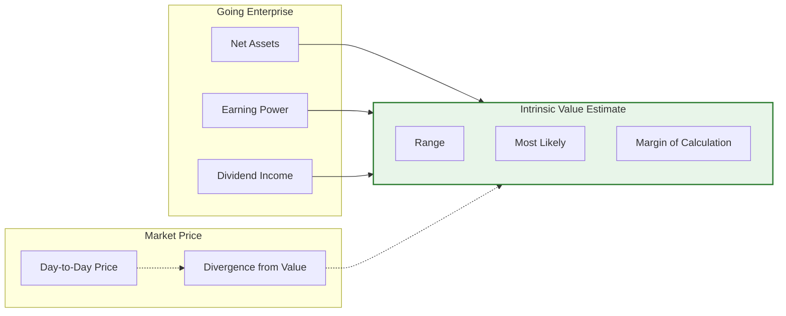
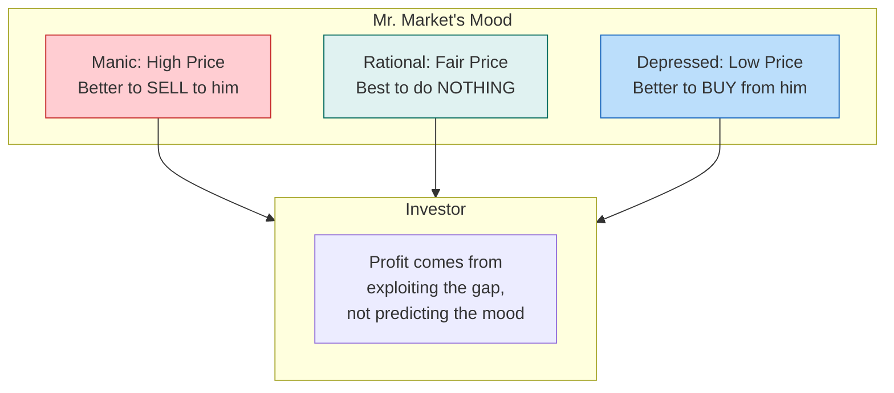
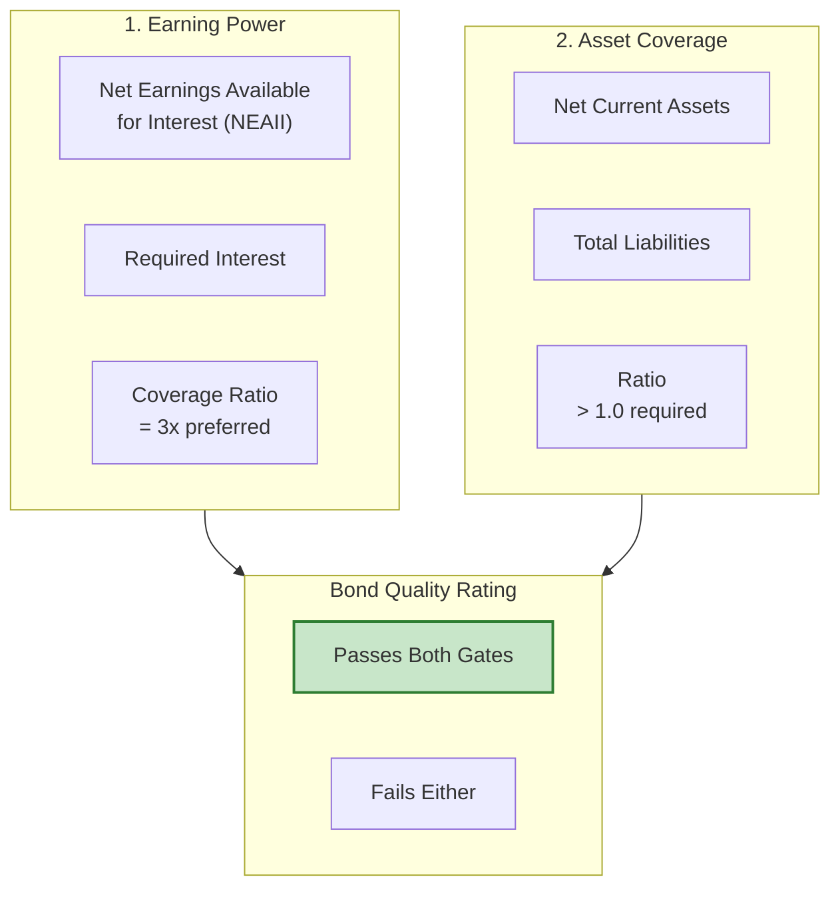
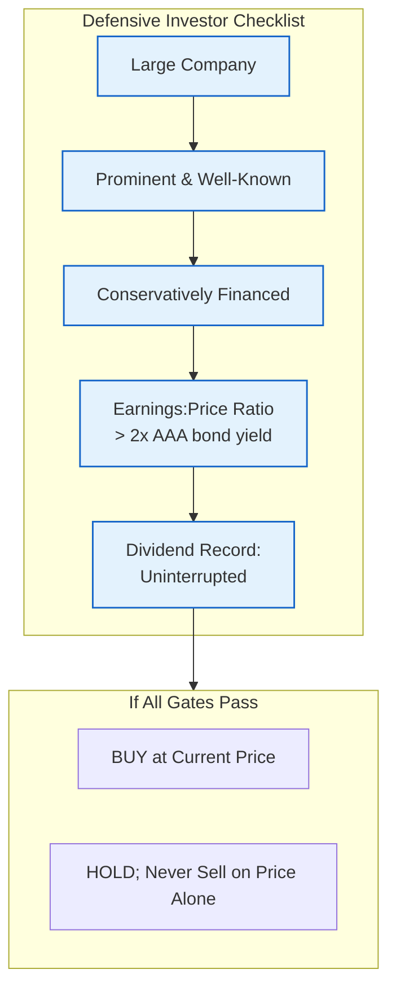
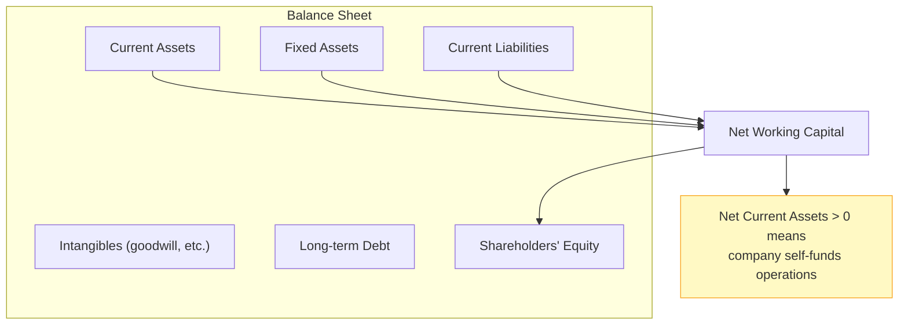
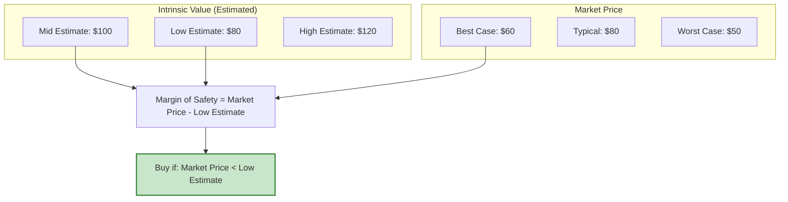

## Investment vs. Speculation

Graham and Dodd begin with a critical distinction — one that remains essential:

> "An investment operation is one which, upon thorough analysis, promises safety of principal and a satisfactory return. Operations not meeting these requirements are speculative."

This single sentence separates the world of security analysis from the casino. Everything that follows in Security Analysis rests on this definition. An investor analyzes. A speculator guesses.

---

## Intrinsic Value: The Central Concept

Everything in Graham-Dodd value investing revolves around a single, simple idea: **every business has a value that exists independently of what any particular buyer or seller thinks it is worth.**

Intrinsic value is the present value of all future income the asset will generate — for stocks, primarily dividends plus eventual selling price; for bonds, coupon payments plus principal repayment.

**Critical facts about intrinsic value:**

- It is an estimate, not a precise number
- It must be expressed as a range, not a point estimate
- It can differ between analysts using the same information
- The market price can deviate from it — often wildly
- The intelligent investor profits from these deviations

---

## Mr. Market

Graham's famous metaphor:

> "Imagine that you have a partner named Mr. Market, who offers every day to buy your interest or sell you his. Mr. Market is quite emotional. Some days he is euphoric and names a very high price. Other days he is despondent and names a low price. The better his mood, the more willing he is to buy from you; the worse his mood, the more aggressively he wants to sell to you."

The corollary: **use Mr. Market's moods, don't participate in them.**

---

## Fixed Income Analysis: The Bond

Graham and Dodd argued that bond analysis should be based primarily on **earning power**, not asset value. A company with strong earnings can service its debt regardless of assets. A company with weak earnings may have impressive assets that cannot prevent default.

### The Two Prongs of Bond Evaluation

### Callable Bonds

When an issuer can redeem a bond before maturity, the call option has value — to the issuer, not the investor. Graham-Dodd methodology requires deducting the call option value from the price at which a bond can be considered fairly priced.

| Feature | Straight Bond | Callable Bond |
|---------|--------------|---------------|
| Coupon rate received | Full | Full (until called) |
| Price sensitivity | Normal | Asymmetric — upside limited |
| Fair price analysis | Yield-to-maturity | Yield-to-call must be calculated |
| Interest rate risk | Both directions | Convexity is truncated on upside |

### Convertible Bonds

A convertible bond is a bond with an embedded call option on the stock. Its value has two components:

1. **Bond floor**: the investment value (what the bond would trade at without the conversion feature)
2. **Conversion value**: the equity option value

Graham and Dodd stressed that convertible bond analysis must treat the two components separately — what appears to be an attractive yield may mask a very expensive equity option embedded in the structure.

---

## Preferred Stock Analysis

Preferred stock occupies an ambiguous position: it has an obligation to pay dividends (like a bond), but lacks the legal standing of a bond in bankruptcy (like common stock). The Graham-Dodd view: **analyze preferred stocks on bond principles, not equity optimism.**

**Tests for preferred stock quality:**

1. **Earnings coverage of preferred dividends**: Can the company cover its preferred dividend obligations comfortably from earnings?
2. **Absence of arrears in the recent past**: Companies that fell behind on preferred dividends in the past are risky
3. **Senior securities outstanding**: If the company has outstanding bonds, the preferred is secondary — analyze both
4. **Asset coverage**: Does the company have sufficient assets to cover preferred obligations?

The critical error Graham and Dodd identify: investors treating preferred stocks as "equity" and using equity valuation tools (P/E ratios, growth assumptions) on a security with fixed obligations.

---

## Common Stock Analysis: Defensive vs. Enterprising Investor

Graham and Dodd's most important practical distinction:

### The Defensive (Passive) Investor

The defensive investor wants to invest, not research. Their requirements:

- Buy only **high-grade** (investment grade) bonds
- Diversify across at minimum 10-15 stocks
- Choose only **large, prominent, conservatively financed** companies
- Buy only if the stock yields at least a 2:1 current earnings-to-price ratio vs. AAA bonds
- Hold for the long term; do not trade
- Do not listen to brokers, tipsters, or market commentary

### The Enterprising Investor

The enterprising investor is willing to do the work:

- Conduct thorough security analysis on individual names
- Pursue special situations, undervalued situations, and arbitrage
- Accept more risk in exchange for higher expected returns
- Must have the knowledge, temperament, and time to implement

The enterprising investor must also know when to **not** do enterprising work — when conditions don't offer sufficient margin of safety.

---

## The Three Common Stock Tests

Graham and Dodd proposed three complementary approaches to estimating intrinsic value for common stocks:

| Test | Basis | What It Captures | Best For |
|------|-------|-----------------|---------|
| Asset Value | Net current assets, adjusted | Liquidation / net asset value | Distressed stocks, net-nets |
| Earning Power | Normalized earnings × capitalization rate | Sustainable income | Mature, profitable companies |
| Dividend Power | Reconstructed dividends | Income to shareholders | Utility and utility-like stocks |

**The asset test** is mechanical: count the current assets, subtract all current liabilities, examine long-term debt. A stock trading at less than net current asset value is a buy candidate (a "net current asset" stock or "net-net").

**The earning power test** is the central method for going concerns: estimate normal earnings (not peak, not trough — the long-run average), apply a capitalisation rate that gives a fair risk premium over AAA bonds.

**The dividend power test**: for companies with irregular dividend histories, reconstruct a dividend that management should have paid and analyze the stock as if that dividend rate had been maintained.

---

## Financial Statement Analysis

Graham and Dodd devoted significant space to teaching the reader how to read a financial statement. For a modern audience, the key principles are:

### Balance Sheet

**Key ratios from the balance sheet:**

- Net current assets = current assets minus all current liabilities
- Net quick assets = cash + receivables + marketable securities minus all current liabilities
- Debt-to-equity = long-term debt / shareholders' equity
- Current ratio = current assets / current liabilities

### Income Statement

Graham and Dodd emphasized **normalized earnings** — stripped of one-time items, cyclically adjusted, reflecting the long-run earning power of the business rather than its current period result.

| Adjustment | Reason |
|-----------|--------|
| Remove one-time gains/losses | Not recurring; not part of earning power |
| Cycle-average revenue | Averages off high/low business cycle years |
| Use conservative depreciation | Accelerated depreciation masks true costs |
| Exclude non-operating income | Focus on operations, not portfolio income |
| Check quality of receivables | Growing receivables faster than revenue is a red flag |

---

## The Margin of Safety

The margin of safety is the difference between the market price and the estimated intrinsic value. Every Graham-Dodd purchase must have a sufficient margin to absorb:

- Analytical error (your estimate of intrinsic value may be wrong)
- Bad luck (unforeseen events deteriorate the business)
- Human error (you might be wrong about the business's trajectory)

**How wide is wide enough?**

- Bonds: par value provides the margin; bond analysis focuses on preserving principal
- Preferred stocks: 15-20% below intrinsic value (because preferred has equity risk)
- Common stocks: 33-50% below intrinsic value (because equities have the most uncertainty)

The margin of safety must be measured against the **low end** of the intrinsic value range, not the midpoint.

---

## Railroad, Utility, and Industrial Analysis

Graham and Dodd recognized that different industries require different analytical approaches:

| Industry | Primary Focus | Key Metric |
|----------|--------------|-----------|
| Railroads | Net income, maintenance, traffic density | Net earnings per system mile |
| Utilities | Rate base, regulated returns | Cost of service, fair return |
| Industrials | Earnings stability, growth, competitive position | Normalized EPS, ROIC |

Railroads: high fixed costs, asset-heavy, highly cyclical. Earnings are the primary driver, not assets.

Utilities: regulated monopolies with rate-of-return pricing. The investment quality depends on regulatory stability and rate base growth.

Industrials: the most heterogeneous. Graham and Dodd emphasized earning power stability as the primary criterion for defensively-oriented industrial stocks.

---

## Special Situations

Graham and Dodd covered several types of "special situations" — the enterprising investor's opportunity set:

1. **Merger arbitrage**: buying stock in a company being acquired at a price below the offer
2. **Holding company discounts**: parent company stock trading at a discount to its underlying assets
3. **Rights and warrants**: equity options that offer leverage but require sophisticated valuation
4. **Bankruptcy reorganization**: analyzing post-reorganization values for distressed companies

Each requires specialized methodology. The enterprising investor must match their skill to the complexity of the situation.

---
