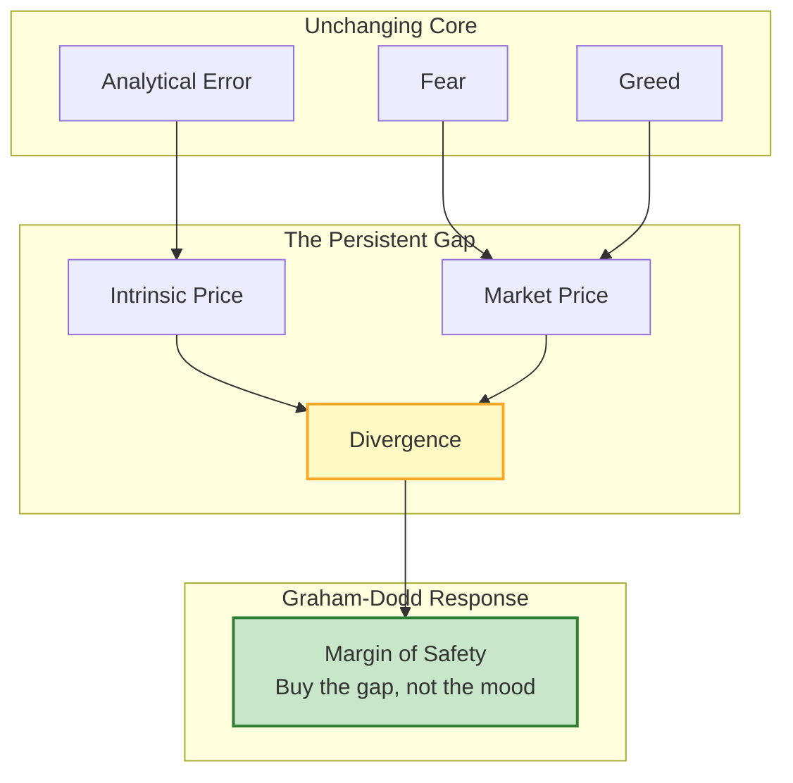
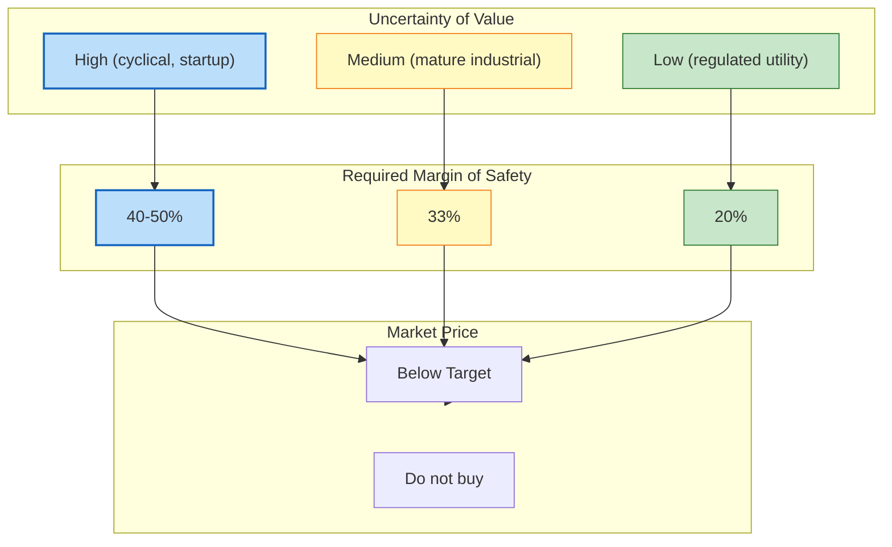

## Introduction

Welcome to BookAtlas. Today: *Security Analysis* by Benjamin Graham and David L. Dodd. Published 1934. McGraw-Hill. 700 pages in the 6th edition with post-crisis commentary added.

This is the book that gave investing its intellectual architecture. Before Graham and Dodd, there was no discipline of security analysis — just tips, hunches, and brokerage recommendations. After Security Analysis, there was a methodology: analyze financial statements, estimate intrinsic value, buy with a margin of safety, profit from market irrationality.

Two listeners joining today:

- **Defensive Investor** – believes in simplicity, rules, and the power of disciplined buying. Has read Security Analysis twice cover to cover.
- **Enterprising Investor** – believes in doing the work, pursuing special situations, and squeezing out every basis point of alpha.

---

## Why This Book Still Matters, 91 Years Later

**Enterprising Investor:** It matters because the market hasn't changed. Human psychology hasn't changed since 1934. Panic, euphoria, and the gap between price and value — those are permanent features of markets. Security Analysis is about that gap, and the gap is still there.

**Defensive Investor:** I'll add: the margin of safety principle is the single most important idea in investing, and every serious investor, whether they know it or not, is practicing a version of it. The book doesn't just matter — it's the foundation. Everything else is commentary.

---

## Investment vs. Speculation

**Defensive Investor:** This distinction is the book's opening move, and it's still the most important thing most people get wrong. Graham defines an investment as any operation that, upon thorough analysis, promises safety of principal and a satisfactory return. Everything else is speculation. Most individual investors I know are speculating without knowing it.

**Enterprising Investor:** I agree with the definition, but I'd push back on the implication that speculation is negative. Graham himself was more nuanced than that. He recognized that the enterprising investor can do well through active analysis — just with more risk and more work. The problem is not speculation per se. It's unacknowledged speculation — pretending you're investing when you're guessing.

---

## Mr. Market: Your Manic-Depressive Partner

**Defensive Investor:** Mr. Market is the most useful metaphor in all of finance. It gave me a framework to stop reading the daily market news. I don't check prices. Mr. Market tells me a price every day; I tell him I'll buy when his price is right.

**Enterprising Investor:** It's elegant, but simple version of the metaphor can mislead. The real Mr. Market doesn't necessarily swing back. Sometimes a company genuinely deteriorates and the market price goes down for good reason. You can't assume the manic-depressive always corrects himself — sometimes the problem is the business, not his mood.

**Defensive Investor:** That's exactly why the margin of safety matters. You test the business fundamentals *first*. Mr. Market's mood only matters if the fundamentals haven't changed.

**Enterprising Investor:** Fair. I'll give you that.

---

## Bond Analysis: Earning Power Over Assets

**Defensive Investor:** The bond chapters are the book's great unsung contribution. Graham and Dodd showed that a railroad with miles of track but negative earnings is not a safe bond — and a company with moderate assets but consistent earnings is a safe bond even when the asset coverage looks thin. This insight anticipated modern credit analysis by half a century.

**Enterprising Investor:** Absolutely. It's also why the 2008 crisis was so revealing. Lehman Brothers had assets, but its earning power had collapsed. Graham and Dodd would have sold Lehman bonds immediately.

**Defensive Investor:** And what about the callable bond treatment? Graham-Dodd forces you to strip out the call option — value the bond on a non-callable basis and then adjust down for the issuer's ability to redeem early. Most individual investors I talk to have never heard of this.

**Enterprising Investor:** Because call options in bonds are asymmetric — the issuer gains, the holder loses. If you're holding callable bonds near par when rates fall, you're vulnerable. Graham and Dodd were thinking about options before Black-Scholes was even written.

---

## Preferred Stock: The Bond in Disguise

**Defensive Investor:** This section is where most equity investors go wrong. Preferred stocks look like stocks in the name. Graham and Dodd say they should be analyzed as bonds. Fixed obligation, priority in liquidation, but no legal standing in bankruptcy. That's a bond, not an equity.

**Enterprising Investor:** And because of that, the margin of safety requirement is tighter. You don't get to assume the company will grow; you analyze it on current earning power covering the current preferred dividend requirement. If earnings slip, the preferred dividend is in jeopardy — same as a bond covenant, but with less legal protection.

**Defensive Investor:** It's elegant in its simplicity. Most investors today treat preferred stock as a hybrid that gives them equity upside with bond-like income. The book explains why that's wrong.

---

## The Three Tests for Common Stock

**Enterprising Investor:** The three tests — asset value, earning power, dividend power — are the backbone of Graham-Dodd common stock analysis. But which one you use depends entirely on the company type. Net-net stocks use the asset test. Industrial growth stocks use the earning power test. Utilities use dividend power. Context matters.

**Defensive Investor:** That's exactly why the defensive investor uses rules, not judgment. You don't decide which test to apply — you buy stocks that pass *all three* tests, mechanically. No judgment, no discretion, no mistakes.

**Enterprising Investor:** Which necessarily means you only buy deep-value, low-growth, boring companies. That's fine for defensive investors. But the enterprising investor wants to find great companies trading at low prices — which often implies passing only the earning power test, not all three.

**Defensive Investor:** And that's why 99% of active investors underperform. Because they overestimate their ability to identify "great companies at low prices" and underestimate how often "cheap" is cheap for a reason.

---

## The Margin of Safety: Theory into Practice

**Defensive Investor:** The margin of safety is where philosophy meets arithmetic. You estimate intrinsic value as a range. You require the market price to be at least one-third below the bottom of that range before you buy. That's the rule. No exceptions.

**Enterprising Investor:** One-third is arbitrary though, right? What if you have a company with extraordinarily stable earnings — a regulated utility with guaranteed returns? You'd demand less of a margin there.

**Defensive Investor:** Less of a margin, but still a margin. Graham said the required margin depends on the **quality of the business** and the **reliability of the earnings estimate**. For a utility with a regulated rate base, you might accept 20%. For a cyclical industrial with erratic earnings, you'd want 40-50%. The principle doesn't change — only the threshold.

---

## Defensive vs. Enterprising: The Great Divide

**Defensive Investor:** The defensive investor's advantage is discipline. You don't have to be smarter than the market. You just have to be more disciplined. Buy high-quality stocks at the right price, diversify, hold forever. It's simple. It works.

**Enterprising Investor:** And it means you'll own a portfolio of index-like returns with a slight edge. Nothing wrong with that — for people who don't want to spend their lives on security analysis. But the enterprising investor can do better, because the Graham-Dodd process is not mechanical. It requires judgment, research, and the courage to act when others won't.

**Defensive Investor:** And most people who try to be enterprising end up speculating. The discipline required to be an enterprising investor — honestly assessing your skill level, honestly admitting when a situation doesn't offer enough margin — is exactly the discipline most people lack.

**Enterprising Investor:** Fair. I'll concede that the enterprising investor's path is narrow and difficult. But I'd take that difficulty over mediocrity.

---

## The Portfolio Management Discipline

**Defensive Investor:** Diversification is the defensive investor's only real tool. The book recommends at minimum 10-15 stocks, in different industries. Don't concentrate. Don't time the market. And never sell a good stock just because its price went up.

**Enterprising Investor:** The enterprising investor diversifies less strategically and more tactically — identifying the 3-5 best situations and concentrating. But only after rigorous analysis. The portfolio for an enterprising investor is fewer stocks, higher conviction, more work.

**Defensive Investor:** One thing both approaches agree on: market timing is speculation. The enterprising investor times the market only through the margin-of-safety discipline — waiting for prices to be low enough to offer sufficient safety. That's not timing. That's buying discipline.

---

## The 2008 Test: Did Graham-Dodd Survive?

**Defensive Investor:** The 2008 financial crisis was Graham-Dodd on steroids. The premise of Security Analysis — that market prices eventually reflect intrinsic value, but only after a long and painful divergence — played out in real time. Banks with strong earning power but temporarily impaired earnings were available at 30-50% of their long-run intrinsic value. Graham-Dodd buyers made fortunes.

**Enterprising Investor:** Yes, and the 6th edition post-crisis essays make this case vividly. Seth Klarman, writing in the 6th edition, notes that the same principles that worked in 1934 worked in 2008. Howard Marks' contribution about the cognitive failure of investors during bubbles is essentially Graham-Dodd applied to modern context.

**Defensive Investor:** And notice what didn't work: leverage, derivatives, "new era" thinking, performance-chasing. Graham-Dodd warned against all of it. The people who got hurt in 2008 weren't practicing Security Analysis.

**Enterprising Investor:** Let me go a step further. The people who profited most from 2008 *were* practicing Security Analysis. Bruce Berkowitz at Fairholme, Seth Klarman at Baupost, Howard Marks at Oaktree. They all viewed Security Analysis as a living document, not a museum piece.

---

## Final Thoughts

**Defensive Investor:** *Security Analysis* is the most important financial book ever written. Every financial analyst, every portfolio manager, every serious individual investor should read it. It takes effort, it's not fun, some chapters are dated — but it teaches you to think. Not to trade, not to speculate, not to chase returns — to think.

**Enterprising Investor:** And for those of us who want to go beyond the basics, it gives us the toolset. The three tests, the margin-of-safety framework, the special situations analysis — those are the tools of enterprising investing. Without them, you're just guessing. With them, you have a systematic edge.

**Defensive Investor:** Together? Graham-Dodd gives you the ceiling. Fisher gives you the floor. Securities analysis gives you the framework. Great investing is built on all three.

**Enterprising Investor:** And it starts with Security Analysis.

---

*This has been a BookAtlas narration of Security Analysis: Principles and Technique by Benjamin Graham and David L. Dodd. Thanks for listening.*
