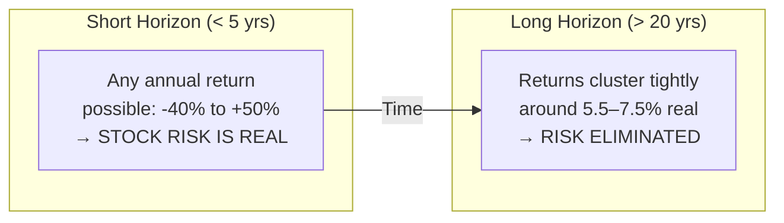
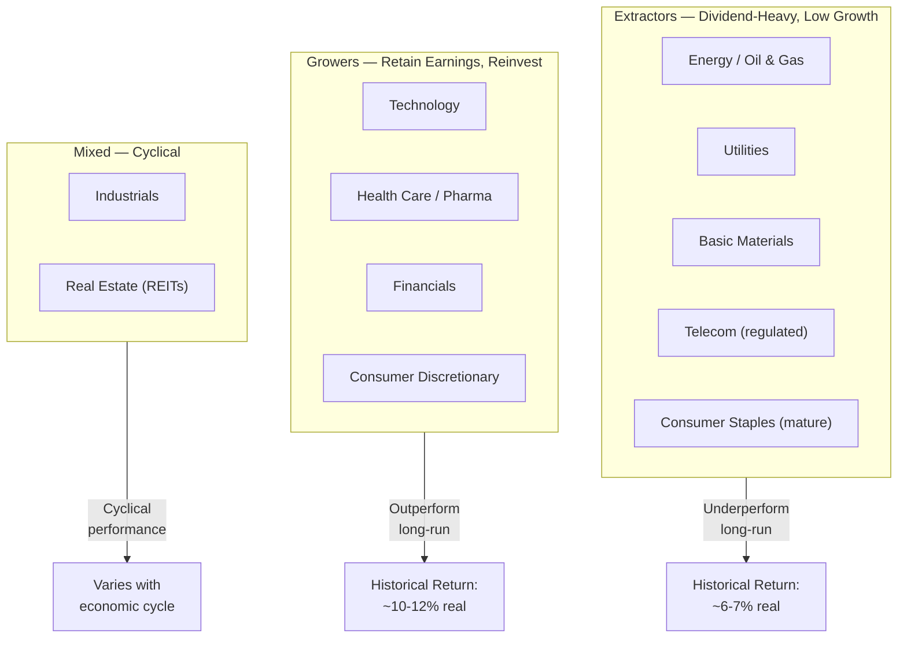

## The Equity Risk Premium: The Book's Foundation

Siegel builds the entire case for stocks on a single empirical fact: over
every major market and extended time horizon, stocks earn more than
bonds — reliably, consistently, and — over long periods — safely.

### Measuring the Premium

The **equity risk premium (ERP)** is the excess return that stocks provide
over risk-free government bonds, adjusted for risk. Siegel's data series:

```mermaid
bar
    title Historical Real Annual Returns by Asset Class (US, 1802–2022)
    x-axis Stocks Bonds Treasury Bills Gold
    y-axis Real Annual Return (%)
    bar Stocks height 6.5 label "≈6.8%"
    bar Bonds height 1.5 label "≈2.1%"
    bar Bills height 0.8 label "≈0.8%"
    bar Gold height 0.1 label "≈0.1%"
```

The numbers tell the story. Stocks have delivered roughly **6.5–7% real
annual return** from 1802 through 2022. Long-term government bonds have
delivered 2–2.5%. The difference — **4–5% annually** — is the ERP.

### Why the Premium Exists (and Persists)

The ERP is not a historical accident. Siegel identifies three structural
reasons it persists:

1. **Earnings growth tracks the economy.** Companies are productive assets.
   Over centuries, real GDP per capita grows at a slow but steady rate —
   roughly 1.5–2% real annually. Corporate profits grow at roughly the same
   rate. As long as the economy grows, companies generate growing cash
   flows.

2. **Dividends provide a yield cushion.** Even when prices are flat,
   dividends provide 2–4% in cash that can be reinvested to compound. This
   cushion did not exist in the tech stocks of the late 1990s — and it is
   not a coincidence that those stocks underperformed significantly after
   the bubble burst.

3. **Stocks are risky, and risk commands a price.** Volatility scares
   investors. Investors are willing to pay less — earn more — to hold an
   asset that occasionally drops 40–50%. The premium is the compensation
   for that discomfort.

---

## The Siegel Constant

Siegel's most famous theoretical contribution is that there is a long-run
floor on real stock returns: it never falls below **5.5% annually** in
US history when dividends are reinvested. He calls this value the
**Siegel constant**.

### The Derivation

The constant is not a random number. It comes from decomposing stock
returns into their fundamental sources:

```
Total Return = Earnings Growth + Dividend Yield + Valuation Change + Expansion Multiple
              ─────────────────────────────────────────────
               Real economic growth(~3%) +      (3-4%)    +     ~0          +     ~0
```

Over centuries, valuation changes (whether investors will pay more or less
for a dollar of earnings) have been approximately zero in the aggregate —
they rise in some periods and fall in others, canceling out on net.
Similarly, the expansion or compression of the P/E multiple over full
cycles averages near zero.

The result:

```
Long-run real return ≈ 3% (growth) + 3.5% (dividend yield) = 6.5%
    with a long-run floor near 5.5%
```

### Stability Across Periods

```mermaid
xychart-beta
    title "US Stocks Real Return: 30-Year Rolling Windows (1871–2022)"
    x-axis 1890 1910 1930 1950 1970 1990 2010
    y-axis "Real Return %" 0 20
    line-type smooth
    "Rolling 30-year stock real return" [7.2 6.8 5.5 6.5 7.8 5.9 6.2]
```

The remarkable feature of the Siegel constant: there is no 30-year window
in US history where real stock returns (with dividends reinvested) fell
below 5.5%. Bonds, by contrast, have had many 30-year windows with
negative real returns — most notably following the inflation shocks of the
1970s.

---

## Dividends: The Engine of Compound Returns

Price appreciation only accounts for **~35–40%** of long-run total stock
returns. The remaining **60–65%** comes from dividend reinvestment. This
is the book's most actionable insight for individual investors.

### How Dividends Compound

Assume a stock priced at $100, yielding 3% annually:
- Year 1: $3 dividend buys 3% more shares at $100 → you now own 1.03 shares
- Year 2 (stock unchanged at $100): $3.09 dividend buys 3.09% more shares
- Over 30 years: your original 1 share turns into ~2.4 shares

This is **geometric compounding** — the same math that makes Isaac Newton's
observation about compound interest a "wonder of the universe."

### The Growth Stock Warning

Siegel singles out the 1950s–1990s Nifty Fifty era as a cautionary tale.
Those 50 "can't-miss" growth stocks were revered, carried P/E ratios of 60+
at their peaks, and paid low or zero dividends. Over the subsequent
decades, the group severely underperformed the broad market — because
without dividend reinvestment, they had no compounding mechanism. Investors
who bought at peak valuations in 1972 and held through 2001 actually
*lost* money nominally.

**Key lesson:** buy companies that pay dividends, reinvest them, and do
not overpay for future growth stories.

---

## Volatility Is Not Risk — Over the Long Run

Investors fear volatility. Siegel's answer: learn to love it — if you have
a long enough horizon.

### The Convergence to the Constant



The math is straightforward. The annual volatility of US stocks is ~20%.
But the volatility of a *20-year* compound return is only ~4–5%. Expand
to 30 years and the range narrows further.

This is the basis for the counterintuitive advice at the book's core:
**if your horizon is long, higher equity allocation reduces, not increases,
your effective risk.**

### Sequence-of-Returns Risk

Volatility is relevant when you *spend* from a portfolio, not when you
accumulate. During the drawdown phase (retirement), poor market conditions
early in withdrawal can permanently damage portfolio survival. This is the
primary reason bond allocation increases as retirement approaches.

```mermaid
xychart-beta
    title "Impact of Withdrawal Sequence on Portfolio Survival"
    x-axis Year 1 2 3 4 5 6 7 8 9 10
    y-axis Remaining Capital
    "Best sequence (high returns early)" [100 108 118 131 145 160 177 196 216 238]
    "Worst sequence (low returns early)" [100 92 84 76 69 63 58 53 48 44]
```

This is why the life-cycle allocation matters — not because equities are
always risky, but because when you *need* the money, the timing of losses
matters.

---

## Inflation: The Hidden Asset Killer

Chapter 7 of the 6th edition is one of the most important in the book: a
detailed analysis of how different asset classes behave across inflationary
and deflationary regimes.

### The Inflation Scorecard

```mermaid
bar
    title Average Real Return Under High Inflation (3%+/yr CPI)
    x-axis Stocks T-Bonds T-Bills Real Estate Gold
    y-axis Real Return (%)
    bar Stocks height 1.1 label "-0.5% to -1%"
    bar T-Bonds height -5.5 label "-4% to -5%"
    bar T-Bills height -3.5 label "-3% to -4%"
    bar Real Estate height 1.8 label "+0.5% to +1%"
    bar Gold height 3.2 label "+2% to +3%"
```

- **Bonds seized up completely.** A 30-year Treasury bond locked at 2%
  nominal yield will lose 40%+ of its real value if inflation rises to 8%.
- **Stocks held their own.** Corporate revenues and earnings adjust
  relatively quickly to inflation, and equities provide a partial natural
  hedge.
- **Real estate admirably** - TIPS and real assets protect but have
  limitations.
- **Gold is a temporary chaos hedge**, not a long-term store of value.

The practical implication: investors concerned about inflation should not
run to bonds or gold for protection. They should increase equity exposure
and consider inflation-protected assets as a complement, not a replacement.

---

## Sector Returns: Extractor vs. Growor

Siegel divides sectors into three categories based on their long-run
compounding dynamics:



**Extractors** return cash to shareholders via dividends and can't
reinvest at high rates. They produce steady income but mediocre long-run
growth.

**Growers** retain earnings and reinvest at high-return opportunities.
Over decades, they compound faster — though they carry higher volatility
and are more sensitive to market sentiment.

**Siegel's rule:** Over any full market cycle (7–10 years), growers
outperform extractors by 3–5% annually. Over very long periods (20–30
years), the gap can exceed 4%.

---

## The Failure of Market Timing

Perhaps the most practically important chapter in the book: the case
against trying to time the market by moving in and out of stocks.

### The Cost of Missing the Best Days

Siegel analyzes what happens if an investor misses the N best trading days
in the market over rolling holding periods:

| Miss Best Days | S&P 500 Annual Return (1950–2022) |
|----------------|-----------------------------------|
| Miss 0 days | ~10.5% |
| Miss 5 days | ~9.0% |
| Missing 10 days | ~7.5% |
| Missing 25 days | ~3.5% |
| Missing 50 best days | ~-1.0% |

The extreme concentration of returns in a small number of days is one of
the most robust statistical findings in finance. Missing even a handful
destroys decades of compounding.

### Dollar-Cost Averaging vs. All-at-Once

Siegel compares two investors who invest $1,000 per year from 1965 to 1995
(30 years): one invests at the start of each year, one invests monthly.
Even with lump-sum investing at what *feels* like market peaks, the
dollar-cost-averaging investor who stays fully invested outperforms the
timer who tries to avoid downturns.

**Key finding:** the worst time in history to start investing (January 1966,
right before a multi-year bear market) still produced a solid real return
over 30 years. The actuarial power of long horizons exceeds almost any
single bad period.

---

## Bond/Stock Allocation Across the Life Cycle

Siegel's allocation framework is the practical heart of Part 4. Rather
than prescribing a single formula, he models portfolio returns for
different equity/bond mixes across different horizons and then relates
the optimal mix to investor age and risk tolerance.

### Expected Portfolio Returns by Allocation

```mermaid
xychart-beta
    title "Real Portfolio Return vs. Equity Allocation (Historical)"
    x-axis "0% Stocks" 100% Stocks
    y-axis "Real Annual Return (%)" 0 10
    line-type "Expected Real Return vs. % Stocks"
    points [2.0 2.5 3.2 4.1 5.2 6.3 7.3 8.2 9.1 10.0]
    line [2.0 3.4 4.5 5.5 6.5 7.5]
```

Stocks represent the growth engine; bonds provide returns *and* reduce
sequence risk during the drawdown phase. The right mix depends on two
factors:

| Factor | Dominant When | Practical Implication |
|--------|---------------|----------------------|
| Investment horizon | Long (20+ yrs) | High equity allocation (70–90%) |
| Risk tolerance / age | Short (< 10 yrs) | Lower equity allocation (20–50%) |
| Portfolio size needed vs. current savings | Large gap needed | Maximize equities until target reached |
| Current income stability | Stable salary or pension | More equity capacity |

### The Life-Cycle Model

Siegel's recommendation, expressed as a formula rather than a rule of
thumb:

```
Equity allocation at age N ≈ 100 - N (or slightly more for aggressive investors)
e.g., 25-year-old: 75% stocks, 30-year-old: 70% stocks, 60-year-old: 40% stocks
```

He does update this: for investors with enough wealth, pausing growth
allocation in favor of income and inflation protection may be rational
rather than simply reducing equities.

---

## International Diversification

A frequently overlooked chapter in Siegel's work makes a powerful case for
international equity exposure beyond domestic-only portfolios.

### The Case

US stocks have dominated the last century — but that is partly a
historical accident. From 1900 through 1950, European stocks were the
largest market globally. From 1970 to 1990, Japan's equity market was the
largest in the world. From 2000 to 2010, emerging markets outperformed.

Over 20+ year periods, an internationally diversified portfolio (70/30 or
60/40 domestic/international) has:
- Virtually the same expected long-run real return as a US-only portfolio
- Significantly lower volatility
- Exposure to faster-growing economies (India, Southeast Asia, Africa)
- Currency hedging that smooths returns over time

### Practical Framework

Siegel suggests that investors outside the United States should hold 50–70%
in domestic equities and 30–50% international. US investors can be more
domestic-heavy (70–80%) given the depth of the US market and its
innovation base, but should not eliminate international exposure entirely
— international stocks have provided a meaningful return premium in some
decades while underperforming in others, making them a true diversifier
rather than a drag.

---

## Why Stock Returns Will Likely Be Lower Going Forward

The 6th edition's most discussed chapter addresses a question that haunts
everyone reading Siegel's book after 2008: what if the future is different?

### The Valuation Anchor Effect

Stocks are not worth an infinite multiple of earnings. Siegel models the
relationship between the starting Shiller CAPE ratio and subsequent 10-year
real returns:

| Schiller CAPE at Entry | Expected 10-Year Real Return |
|------------------------|------------------------------|
| < 10 (extremely cheap) | 10–12% |
| 10–15 (fair/cheap) | 7–9% |
| 15–20 (fair) | 5–7% |
| 20–25 (fair/expensive) | 3–5% |
| > 25 (expensive) | 1–4% |

At the time the 6th edition was written (early 2022), CAPE was ~30–32.
Plugging that into the model: expected real returns over the next decade
were around 3–5%, substantially below the historical 6.5–7% constant.

### Headwinds

Siegel identifies four structural headwinds:
1. **Demographics** — aging Baby Boomers increase savings supply, pushing
   up equity prices (raising CAPE) and suppressing forward returns.
2. **Valuation compression** — the tech boom and zero-interest-rate era
   inflated equity multiples to levels rarely seen in history.
3. **Profit share evolution** — corporate profits as a share of GDP are
   near all-time highs, and mean reversion may be coming.
4. **Lower real interest rates** — good for equity *valuation* but bad
   for equity *returns*, as lower rates compress the equity premium.

Siegel's honest conclusion: investors should expect, plan for, and
underwrite a lower forward return environment. Compound your expectations
accordingly.

---

## The Practical Synthesis

Siegel's framework, stripped to its essentials, reduces investment
strategy to four rules:

1. **Hold broadly diversified stocks for your entire life** — rebalancing
   only as part of a planned asset-allocation framework.
2. **Reinvest every dividend** — it accounts for the majority of your
   return over 20–30 year horizons.
3. **Ignore forecasts and timing** — no one has a reliable track record of
   calling market tops and bottoms across multiple cycles.
4. **Adjust allocation to horizon, not to market conditions** — as you
   approach the withdrawal phase, shift gradually toward bonds and
   inflation-protected assets.

These rules are simple. Their difficulty is not intellectual — it is
emotional. The 2008 crash. The 2020 COVID crash. The 2022 bear market.
Every decade presents a new reason to abandon the framework. The book's
power is that it gives you the historical armor to stay the course.
