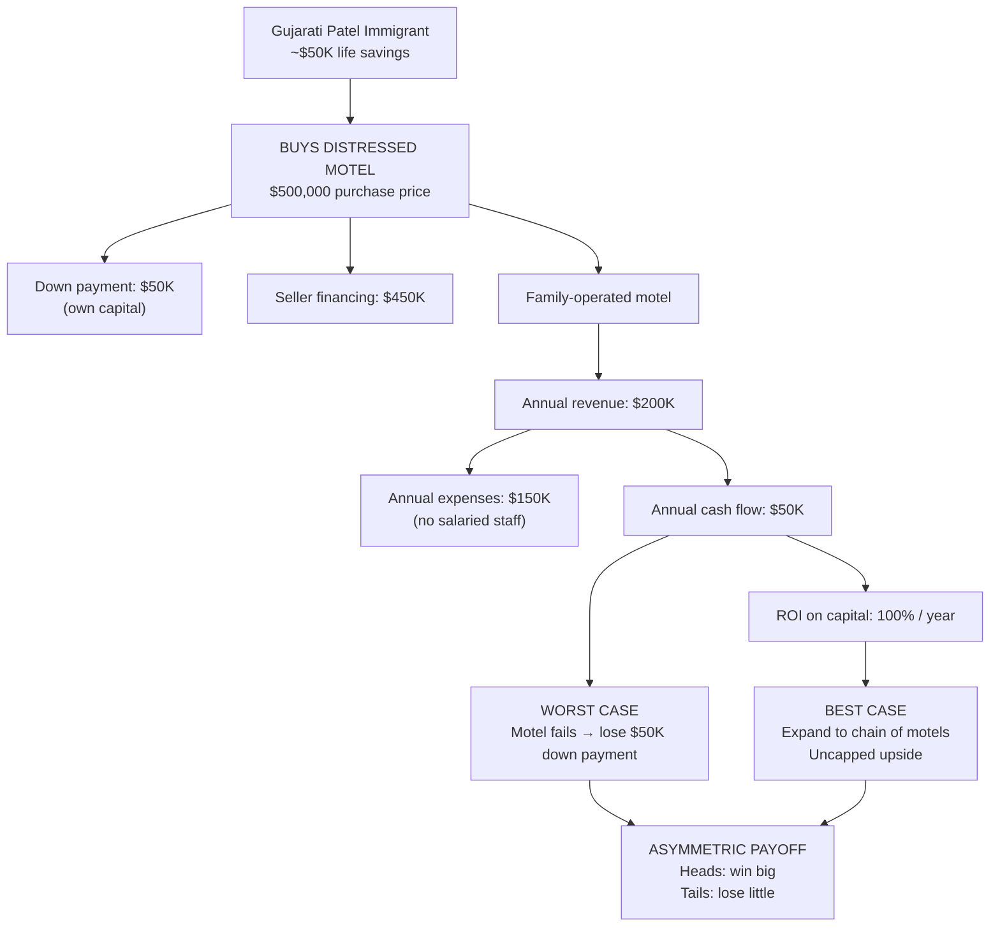
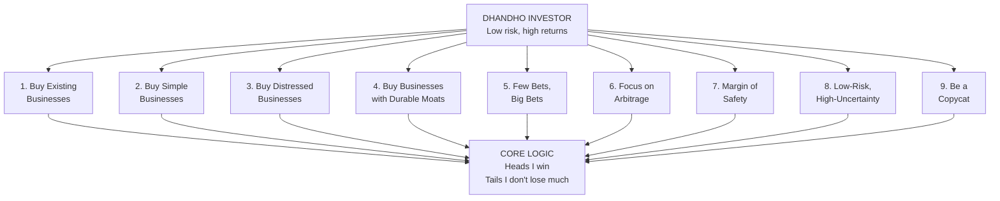
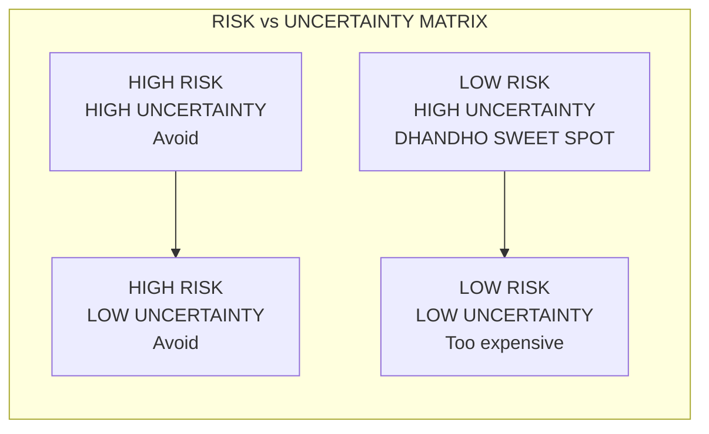
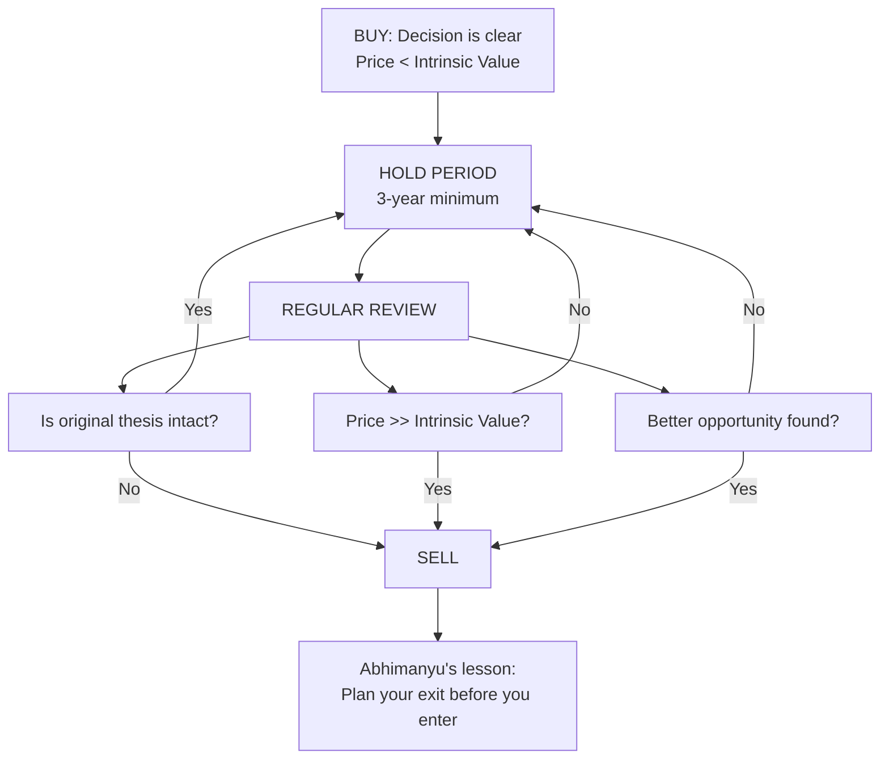

## The Patel Motel Model



The Patel motel model is the book's central metaphor. A Gujarati
immigrant buys a distressed motel in the US with minimal equity and
seller financing. The structure creates an asymmetric payoff: limited
downside (the down payment) and unlimited upside (cash flow plus
appreciation). Operating costs are minimized by running the motel as a
family business — no salaried staff, no management overhead. This same
asymmetry is what the Dhandho investor seeks in the stock market.

## The 9 Dhandho Principles



### 1. Buy Existing Businesses

Startups have unproven models, unknown unit economics, and high failure
rates. Existing businesses have operating history, financial statements,
and predictable cash flows. The Patels never built new motels — they
bought existing ones at distressed prices. For stock investors, this means
preferring established companies over IPOs and speculative ventures.

### 2. Buy Simple Businesses

Businesses with slow rates of change (motels, railroads, utilities,
insurance) are easier to analyze and value. Rapidly changing industries
(tech, biotech, fashion) introduce obsolescence risk that is hard to
quantify. Pabrai's rule: if you cannot understand the business well
enough to explain it to a 10-year-old, you have no business owning it.

### 3. Buy Distressed Businesses in Distressed Industries

Maximum pessimism creates maximum mispricing. When an industry is hated
(airlines post-9/11, financials in 2008, energy in 2015), good companies
get thrown out with bad ones. The key is distinguishing temporary
distress (cyclical) from permanent distress (structural obsolescence).

### 4. Buy Businesses with Durable Moats

A moat — low-cost production, brand power, network effects, regulatory
protection — keeps competitors at bay. Without a moat, high returns
attract competition that erodes profitability. Pabrai favors businesses
where the moat is clear and measurable (e.g., Moody's in credit ratings).

### 5. Few Bets, Big Bets, Infrequent Bets

Pabrai rejects diversification for its own sake. If you have researched
thoroughly, concentrated positions make sense. Charlie Munger said: "The
idea of excessive diversification is madness." Pabrai uses the Kelly
Criterion to size positions: when the odds are overwhelmingly favorable,
bet 10-20% of the portfolio.

### 6. Focus on Arbitrage

Pabrai identifies four types: commodity arbitrage (buy low, sell high in
different markets), correlated stock arbitrage (same stock on different
exchanges), merger arbitrage (capturing deal spreads), and Dhandho
arbitrage (low-risk special situations). The underlying principle: seek
setups where the outcome is bounded and the odds are knowable.

### 7. Margin of Safety

From Benjamin Graham: never pay full price. Buy at a significant discount
to conservative intrinsic value. Pabrai looks for a 50%+ discount. The
margin of safety converts a good business into a great investment and
protects against being wrong.

### 8. Low-Risk, High-Uncertainty Businesses

This is Pabrai's most original contribution.



Risk = probability and magnitude of permanent capital loss.
Uncertainty = range of possible outcomes. The market over-discounts
uncertainty, creating low prices for businesses that are actually
low-risk. A motel during a recession is low-risk (people still need
cheap lodging) but high-uncertainty (will the recession last 6 months
or 3 years?). The Dhandho investor buys when uncertainty is high but
risk is low.

### 9. Be a Copycat, Not an Innovator

Innovation carries unproven demand and execution risk. Copycats take a
proven model and execute it better. Ray Kroc copied the McDonald
brothers. The Patels copied other Patels. In investing, Pabrai advocates
cloning the portfolio strategies of proven investors via 13-F filings
or annual letters. Cloning reduces the risk of original error.

## The Seven-Question Investment Checklist

Before investing, Pabrai asks:

1. Is this a business I understand very well?
2. Can I estimate its intrinsic value today and 5 years out?
3. Does it sell at a 50%+ discount to that value?
4. Would I bet a large chunk of my net worth on it?
5. Is the downside limited and knowable?
6. Does it have a durable competitive advantage?
7. Is management honest and capable?

If all seven answers are yes, the investment passes the Dhandho screen.

## Kelly Criterion for Position Sizing

```
Kelly % = (b * p - q) / b

Where:
  p = probability of winning
  q = 1 - p (probability of losing)
  b = net odds received on the bet
```

Pabrai adapts this for investing. If a stock has an 80% chance of
doubling and a 20% chance of losing 20%, the Kelly formula suggests a
large position. In practice, Pabrai caps individual positions at 10-20%
because real-world probabilities are never as precise as the formula
implies.

## Abhimanyu's Dilemma: The Art of Selling



From the Mahabharata: Abhimanyu knew how to enter the Chakravyuha
(battle formation), but not how to exit. Pabrai warns that selling is
harder than buying. His rules: do not sell at a loss within 2-3 years
(give the thesis time), sell when price exceeds intrinsic value, sell
when the thesis breaks, and sell to fund a better opportunity.

## Cloning Strategy

Pabrai's approach to studying great investors:

1. Track 13-F filings of investors like Buffett, Klarman, Greenblatt,
   and Lou Simpson.
2. Identify their new positions and significant adds.
3. Reverse-engineer their thesis.
4. Apply the Dhandho checklist independently.
5. If the investment passes, clone it.

Warning: 13-F filings are 45 days delayed and only show long US equity
positions. The disclosed position may already be partially sold.

## Case Study: Stewart Enterprises

Pabrai walks through his investment in Stewart Enterprises, a funeral
home operator, as a Dhandho example:

- Distressed industry (funeral homes were out of favor)
- Simple business (predictable deathcare revenue)
- 50%+ discount to intrinsic value
- Durable moat (regulatory barriers, local market positions)
- Minimal downside (hard assets, steady cash flow)

The stock tripled within a few years.

## Key Formulas

### Kelly Criterion (bet sizing)

```
f* = (b * p - q) / b
```

Optimal fraction of capital to maximize long-run growth given edge.

### Margin of Safety

```
MOS = (V - P) / V
```

Where V = conservative intrinsic value estimate, P = purchase price.
Pabrai targets MOS >= 50%.

### Expected Value (scenario-weighted)

```
EV = Σ(pi × outcome_i)
```

Heads I win, tails I don't lose much — quantified.

## Actionable Advice

1. **Start with the checklist.** Before any buy, run the seven Dhandho
   questions. Reject any stock that fails three or more.

2. **Clone the best.** Subscribe to 13-F filing trackers for 5-10 proven
   value investors. Study their moves.

3. **Cap your position count.** Hold no more than 15 stocks. Your top 5
   will drive your returns.

4. **Set sell rules in advance.** Write down the conditions under which
   you will sell before you buy.

5. **Distinguish distress from rot.** Cyclical distress is an
   opportunity. Structural decline is a trap.

6. **Do nothing most of the time.** Pabrai's fund sometimes held 50%+
   cash. The discipline to wait is a competitive advantage.

7. **Think in probabilities.** Every investment is a bet. Estimate the
   odds. Size accordingly.

8. **Read annual letters.** The best investors (Buffett, Munger,
   Klarman) teach more through their letters than any book.
