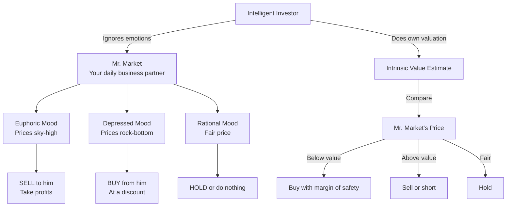
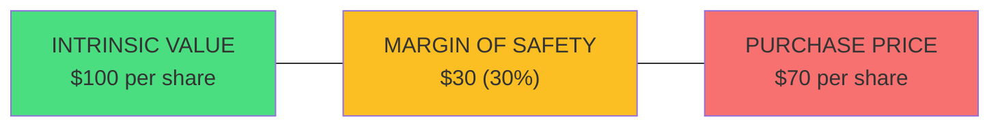
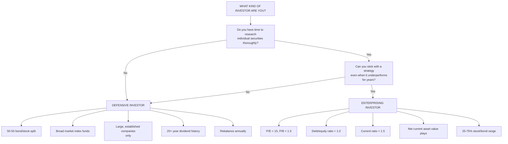
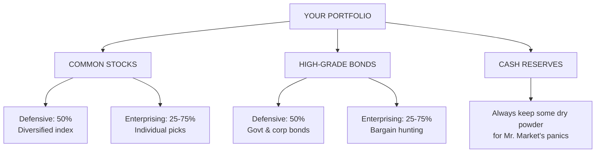

## The Mr. Market Concept



The market is a pendulum that forever swings between unsustainable
optimism and unjustified pessimism. The intelligent investor recognizes
these swings for what they are — opportunities, not instructions.

## The Margin of Safety



Graham likened the margin of safety to a bridge engineered to carry
80,000 lb trucks but built to withstand 100,000 lbs. The extra capacity
is the safety buffer. In investing, buying a $100 asset for $70 gives you
a 30% margin of safety. If you are wrong about the valuation and the
asset is really worth only $85, you still have not lost money.

## Defensive vs Enterprising Investor Decision Tree



## Asset Allocation Framework



## Detailed Chapter Summaries

### Introduction: What This Book Expects to Accomplish

Graham states his aim: to provide a practical guide for the ordinary
investor, not a treatise for professionals. He defines the "intelligent"
investor as someone with patience, discipline, and a desire to learn —
not necessarily a high IQ. The subtitle "A Book of Practical Counsel"
signals the book's applied nature.

### Chapter 1: Investment vs Speculation

Graham's famous definition: "An investment operation is one which, upon
thorough analysis, promises safety of principal and an adequate return.
Operations not meeting these requirements are speculative."

He classifies market participants into defensive and enterprising
investors and outlines the results each can realistically expect. The
enterprising investor's three areas of activity are: trading, short-term
selectivity, and long-term selectivity. Graham warns that most people who
try to beat the market will fail.

### Chapter 2: The Investor and Inflation

Graham examines how inflation erodes purchasing power. Bonds suffer in
inflationary environments; stocks provide a partial hedge. He recommends
real estate investment trusts (REITs) and other inflation-sensitive
assets for a portion of the portfolio but warns against over-reacting to
short-term inflation scares.

### Chapter 3: A Century of Stock Market History

A historical survey of stock prices from 1871 to 1971. Graham shows that
long-term returns average around 9-10% but are punctuated by extreme
swings. He introduces the concept of mean reversion: what goes
excessively up must eventually come down, and vice versa.

### Chapter 4: General Portfolio Policy for the Defensive Investor

The defensive investor should maintain a 50-50 split between stocks and
bonds. Rebalance annually. Never deviate based on market forecasts. The
stock portion should be limited to large, prominent companies with a long
record of continuous dividend payments.

### Chapter 5: The Defensive Investor and Common Stocks

Seven qualitative and quantitative criteria for stock selection: adequate
size, strong financial condition, uninterrupted dividend record for at
least 20 years, no earnings deficit in the past 10 years, minimum 33%
earnings coverage on dividends, P/E ratio below 15, and price-to-book
ratio below 1.5.

### Chapter 6: Portfolio Policy for the Enterprising Investor: Negative Approach

What to avoid: second-rate bonds, foreign bonds, IPOs, hot growth stocks,
and "story" stocks. Most of the enterprising investor's edge comes from
avoiding bad investments, not finding great ones.

### Chapter 7: Portfolio Policy for the Enterprising Investor: The Positive Side

What to pursue: bargain issues (stocks selling below net current asset
value), special situations (mergers, liquidations), and relative-value
trades. Graham emphasizes buying dollar bills for 50 cents — verified
through balance sheet analysis.

### Chapter 8: The Investor and Market Fluctuations

The most famous chapter. Introduces Mr. Market and the concept that the
investor should exploit market volatility rather than be victimized by
it. Graham counsels: "The intelligent investor should recognize that
market fluctuations are his friend, not his enemy." The price gyrations
of a stock should never force a sale; the investment decision must be
based on the business's underlying value.

### Chapter 9: Investing in Investment Funds

Graham analyzes the fund industry, noting that most managed funds fail to
beat the market averages over time. He recommends index funds (then a
novel idea) for defensive investors. He warns against load funds and
funds that charge high management fees.

### Chapter 10: The Investor and His Advisers

Covers the roles of brokers, investment bankers, financial analysts, and
advisors. Graham is skeptical of all of them — they are in the business
of selling securities, not making you money. The investor must ultimately
take responsibility for their own decisions.

### Chapter 11: Security Analysis for the Lay Investor

An accessible introduction to reading financial statements. Graham
teaches how to evaluate earnings power, asset values, and dividend
capacity. He stresses common-size analysis (expressing line items as
percentages of revenue) and looking at multi-year averages.

### Chapter 12: Things to Consider About Per-Share Earnings

A deep dive into accounting distortions: depreciation methods,
amortization of goodwill, pension liabilities, and stock options. Graham
warns that reported earnings are often manipulated. Intelligent investors
must normalize earnings over a 7-10 year period.

### Chapter 13: A Comparison of Four Listed Companies

A worked example comparing four companies across multiple dimensions:
Eltra Corp, Emhart Corp, Giddings & Lewis, and Gardner-Denver. Graham
walks through the process of identifying which is cheapest relative to
its earnings and assets.

### Chapter 14: Stock Selection for the Defensive Investor

Seven criteria summarized: (1) adequate size, (2) strong financial
condition (current ratio > 2, debt-to-equity < 1), (3) 20+ years of
dividends, (4) no losses in 10 years, (5) 10-year earnings growth of at
least one-third, (6) P/E < 15 on 3-year average, (7) P/B < 1.5.

### Chapter 15: Stock Selection for the Enterprising Investor

Enterprising investors can relax some criteria but must follow stricter
discipline on valuation. Graham suggests focusing on: (a) stocks at low
P/E multiples relative to 5-year average earnings, (b) net-net working
capital plays, and (c) special situations like spin-offs and
liquidations.

### Chapter 16: Convertible Issues and Warrants

Graham explains the mechanics of convertible bonds and warrants. His
verdict: they are rarely good investments for the intelligent investor.
They combine the worst features of stocks and bonds — limited upside
with full downside.

### Chapter 17: Four Extremely Instructive Case Histories

Real examples from Graham's time: Lancer Industries (a case of stock
manipulation), the collapse of a once-great company, a net-net play that
worked out, and a special situation arbitrage. Each illustrates a
different principle.

### Chapter 18: A Comparison of Eight Pairs of Companies

Paired comparisons where similar companies trade at vastly different
valuations. Graham shows how the cheaper one almost always outperforms
the expensive one over the next several years. The market's mispricing
corrects — but it takes time.

### Chapter 19: Shareholders and Managements: Dividend Policy

Graham advocates for a consistent dividend policy and criticizes
management teams that hoard cash or issue excessive stock options. He
argues that shareholders should demand dividends as proof that management
is serving their interests.

### Chapter 20: "Margin of Safety" as the Central Concept of Investment

The capstone chapter. The margin of safety is the difference between
price and intrinsic value. It is the thread that ties all of Graham's
ideas together. Even a diversified portfolio of mediocre companies bought
at deep discounts will outperform a concentrated portfolio of great
companies bought at full price.

### Postscript

Graham reflects on the limitations of his approach and acknowledges that
value investing requires patience. He notes that during speculative
bubbles, the value investor will underperform — and must be willing to
endure that.

## Key Formulas

### Graham Number (Maximum Fair Price)

```
Graham Number = √(22.5 × EPS × BVPS)
```

Where EPS = earnings per share and BVPS = book value per share. The 22.5
comes from the product of Graham's maximum acceptable P/E (15) and
maximum acceptable P/B (1.5). A stock trading below its Graham Number is
potentially undervalued.

### Net Current Asset Value (NCAV)

```
NCAV = Current Assets - Total Liabilities
NCAV per Share = NCAV / Shares Outstanding
```

Also known as "net-net" working capital. Graham would buy stocks trading
below 2/3 of NCAV per share.

### P/E Rule

```
Maximum Acceptable P/E = 15x (on 3-year average earnings)
```

### Bond-Stock Split Rebalancing

```
Defensive: 50% stocks / 50% bonds
Rebalance when deviation > 5%

Enterprising: 25-75% stocks, 25-75% bonds
Adjust based on market valuation levels
```

## Real-World Examples

**Washington Post (1973).** Warren Buffett's firm bought shares for ~$83
million when the company's assets were worth at least $400 million. The
margin of safety was nearly 80%. Buffett held for decades and made a
100x+ return. This is the canonical Graham-style investment.

**GEICO (1948).** Graham-Newman Corp acquired a 50% stake in Government
Employees Insurance Company for $712,000. The business was growing
rapidly but was ignored by Wall Street due to its unconventional direct-
to-consumer model. Graham's stake eventually became worth billions.

**Net-Net Stocks in the 1970s.** Graham identified dozens of Japanese
and US stocks trading below net current asset value. He demonstrated
that a portfolio of 30+ such net-nets returned ~20% annually over three
decades.

## Actionable Advice

1. **Decide which investor you are today.** If you cannot commit 10+
hours per week to research, you are defensive. Own index funds.

2. **Set your bond/stock split and rebalance annually.** Pick a ratio
and stick to it regardless of market conditions.

3. **If you pick stocks, apply the seven defensive criteria** before
buying anything. Reject any stock that fails three or more.

4. **Calculate the Graham Number** for any stock you consider. Do not
pay more.

5. **Read Chapter 8 and Chapter 20 twice.** They contain the entire
philosophy in concentrated form.

6. **Ignore macro forecasts.** Graham said: "If I have noticed anything
over these 60 years on Wall Street, it is that people do not succeed in
forecasting what is going to happen to the stock market."

7. **Keep cash reserves.** When Mr. Market panics, you want to be a
buyer, not a forced seller.

8. **Never buy an IPO.** Graham's data showed IPOs were systematically
overpriced. Modern research confirms this.
