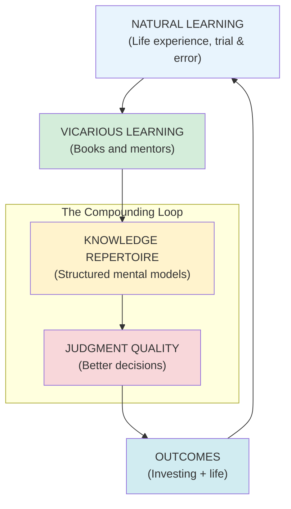
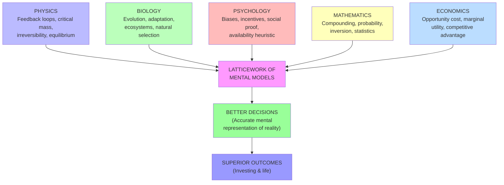
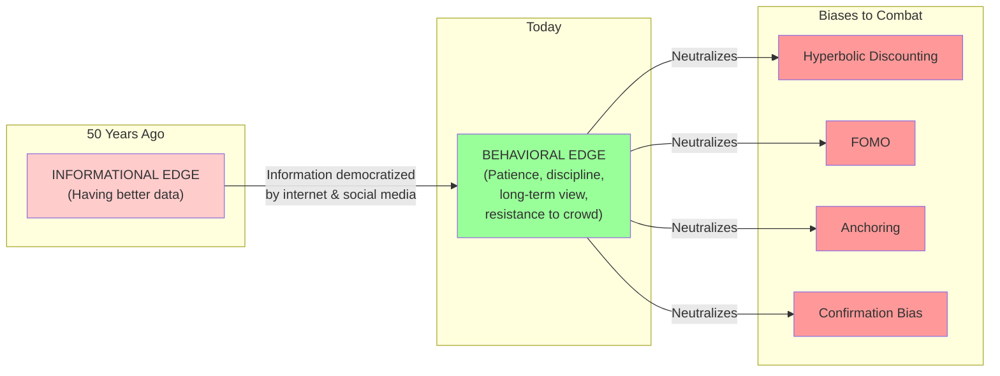
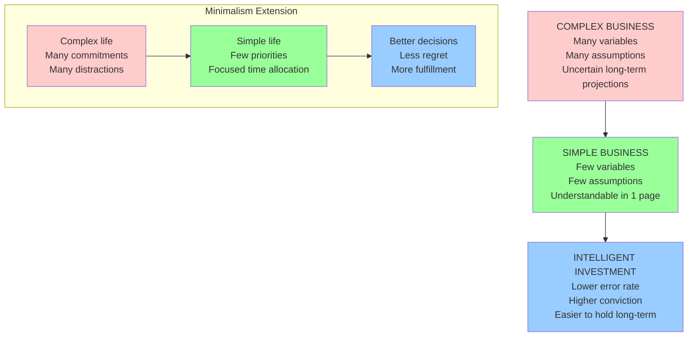
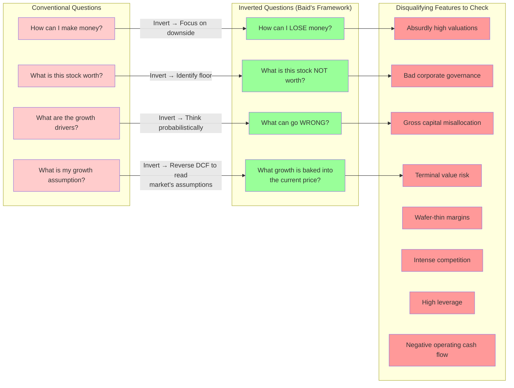
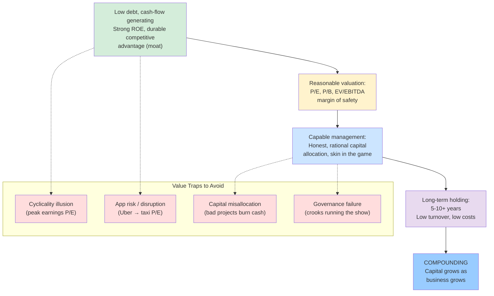
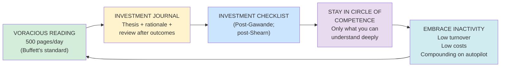

## Book Structure Overview

The Founder Institute edition (~230 pages, 2021) is organized as a sequence of interlocking essays grouped around six thematic areas. Each area is self-contained but builds on the previous one. The summary below traces that arc.

---

## Part 1: The Philosophy of Lifelong Learning

Baid opens with his central life thesis: the quality of your decisions determines the quality of your outcomes, and the quality of your decisions is determined by the quality of your knowledge. He draws a direct line from Newton's "standing on the shoulders of giants" to his own investing career — every success he attributes to his teachers.

The loop is self-reinforcing: better outcomes provide more experience, which, combined with continued learning, further expands judgment.

---

### Core Chapters in This Section

**The Joy of Compound Learning.** Baid argues that knowledge compounds in the same mathematical form as capital. At 7% knowledge growth per year, a modest initial advantage grows enormous over decades. The implications are enormous: start young, be consistent, and prioritize breadth before depth.

**Read Like Your Life Depends on It.** Baid cites Buffett's daily 500-page reading habit and Munger's statement that he knew no wise person who did not read constantly. The argument: books are the highest-leverage activity available to any human being. A 300-page book may compress 20 years of someone's professional life into a few hours. Where else can you get that leverage?

**Be a Funnel, Not a Sponge.** Baid argues that learners should process and redistribute knowledge, not hoard it. Goodwill compounds when you help others. T. H. White: "The best thing a human being can do is to help another human being know more."

---

## Part 2: Mental Models and Multi-Disciplinary Thinking

Drawing directly on Peter Bevelin's *Seeking Wisdom* and Charlie Munger's lectures at USC, Baid explains the latticework of mental models: the idea that true wisdom comes not from depth in one field but from having the big ideas from many fields — physics (compound interest, critical mass, feedback loops), biology (evolution, natural selection, ecosystems), psychology (cognitive biases, incentives, social proof), mathematics (probability, compounding, inversion), and economics (opportunity cost, marginal utility, comparative advantage) — and understanding how they interact.

Baid quotes Einstein's five ascending levels of intellect: "Smart, Intelligent, Brilliant, Genius, Simple." For Einstein (and Baid), simplicity is the highest form of intellect — and it is achieved by boiling any complex problem down to its essential variables through multi-disciplinary understanding.

---

## Part 3: The Behavioral Edge

Baid's section on behavioral finance is both the most original and the most practically important part of the book. His core argument is that markets have changed, and the source of investor alpha has changed with them.

Baid illustrates the behavioral edge through **hyperbolic discounting** — the tendency to apply high discount rates to cash flows far in the future, which systematically undervalues high-quality compounding businesses. Stanford professor Sanjay Bakshi demonstrated that quality businesses (15-20% ROEs sustained for decades) are chronically underpriced because investors cannot wait. "Any stock that has compounded at 15 to 20 percent for decades was, by definition, undervalued by the market for long periods of time."

The chapter on **financial independence** is the practical payoff. Baid argues that achieving FI removes urgency, and removing urgency allows patience. Investors who need the market to cooperate sell too early, take excess risk, and abandon sound strategies at the worst moment. The first FI target is not consumption — it is optionality and time toWait.

---

## Part 4: Simplicity and Minimalism

Baid's chapter on simplicity is among the strongest in the book. He starts with Einstein and Joel Greenblatt at Columbia: "Investing success has got nothing to do with the ability to do a spreadsheet. It has more to do with the big picture. Focus on the big picture. Think of the logic, not just the formula."

Minimalism is an extension of simplicity: not only taking the complex to the simple, but removing the unnecessary. Very few things really matter. Baid applies this to both investing (few key variables drive returns) and life (few activities drive fulfillment).

---

## Part 5: Inversion — The Underrated Decision Tool

One of the book's most actionable contributions is its systematic application of inversion to stock evaluation. Baid cites Carl Jacobi, Charlie Munger, and Peter Bevelin (*All I Want to Know Is Where I'm Going to Die So I'll Never Go There*) to establish inversion as a primary decision discipline.

Baid's inverted framework is not merely a checklist — it is a mindset reset. Human beings are wired to seek confirming evidence. Inversion forces the investor to behave as their own worst critic, actively disconfirming the bullish thesis before committing capital.

---

## Part 6: Value Investing Fundamentals

Baid synthesizes lessons from Graham, Buffett, Munger, and Greenblatt into a compact guide to evaluating businesses. He emphasizes that **an investment is part ownership in a business** — this definition alone eliminates most stock market activity as speculation rather than investment.

Core criteria Baid applies consistently:
- **Low debt** and positive operating cash flow
- **ROE > cost of capital** sustained over many years
- **Reasonable valuation** with a margin of safety
- **Capable, honest management** with aligned incentives
- **Durable competitive advantage** — brand, network effects, switching costs
- **Minimal or no equity dilution** over many years

---

## Part 7: The Investment Process — Habits That Compound

Baid closes with the practical habits that create sustainable outperformance. These are not glamorous but they are relentlessly effective.

**The investment checklist** and **investment journal** are the two tools Baid considers non-negotiable. He purchased a physical notebook for ten dollars in late 2014 and calls it one of the best value investments he ever made. The journal records the original thesis at purchase and the decision rationale at sale. Periodic review honest-ly surfaces errors in reasoning even in successful outcomes — the most humbling and most useful kind of self-awareness.

**Embrace inactivity.** Baid quotes Keynes: "The market can remain irrational longer than you can remain solvent." Patience with good businesses is the defining discipline of a great investor. Low turnover conserves costs, taxes, and cognitive energy for decisions that truly matter.

---

## Chapter-by-Chapter Summary (Founder Institute Edition, ~230 pp.)

| Ch. | Title | Focus |
|------|--------|-------|
| 1 | The Joy of Compound Learning | Compounding applied to knowledge |
| 2 | Read Like Your Life Depends on It | Reading as the highest-leverage activity |
| 3 | Be a Funnel, Not a Sponge | Sharing knowledge as a compounding act |
| 4 | Multi-Disciplinary Thinking | Munger's latticework of mental models |
| 5 | The Behavioral Edge | Psychology over information as source of alpha |
| 6 | Simplicity and Minimalism | Few things really matter; act accordingly |
| 7 | Inversion | Asking what could go wrong before asking what will go right |
| 8 | Evaluating Businesses | Graham-Buffett-Greenblatt synthesis |
| 9 | Avoiding Value Traps | Four major traps and how to detect them |
| 10 | Building the Investment Process | Habits: reading, journal, checklist, circle of competence |
| 11 | Life Beyond Returns | Goodwill, kindness, health, gratitude, and karma |
