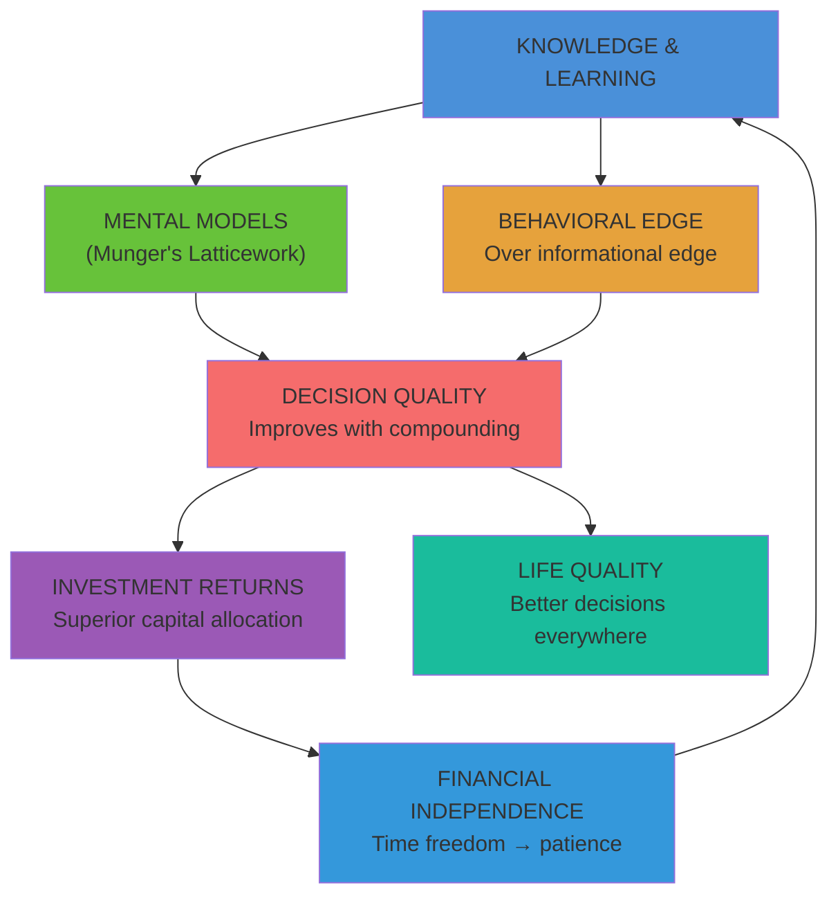

## Overview

*The Joys of Compounding: The Passionate Pursuit of Lifelong Learning* (2021) by Gautam Baid, CFA, is part memoir, part investing primer, and part philosophical manifesto — unified by a single, transformative insight: **the principle of compounding applies not only to money, but to knowledge, wisdom, relationships, and every form of capital that matters in a good life**.

Baid integrates the wisdom, strategies, and thought processes of more than 200 of history's greatest minds — spanning investors (Buffett, Munger, Greenblatt, Graham, Klarman), scientists (Einstein, Newton), philosophers (Socrates, Seneca, Montaigne), psychologists (Kahneman, Tversky), educators, physicians, and entrepreneurs. He shows that every domain of human achievement obeys a version of the same compounding law: small, consistent, deliberate effort applied over time produces results that seem to defy expectation.

At roughly 230 pages, the book is short enough to read in a single focused weekend yet dense enough to reward repeated re-reading. Baid's voice is direct, humble, and grounded in personal experience — he is not a professor dispensing theory, but a practitioner who achieved financial independence in his thirties through the very habits he describes.

---

## Executive Summary

Baid's thesis builds on four interlocking pillars:

**Pillar 1: Knowledge Compounding.** Baid quotes Buffett's famous advice: read 500 pages a day. Munger's observation that those who keep learning keep rising. Books compress decades of experience into hours of reading. The knowledge you accumulate compounds into a latticework of mental models that lets you make decisions no individual experience could produce.

**Pillar 2: Behavioral Edge Over Informational Edge.** Fifty years ago, the best investors had the best information. Today, information is democratized and social media has made markets efficient and fast. The sustainable edge is psychological: patience, discipline, temperament, rationality, and the willingness to take a long-term view when everyone else is reacting to noise.

**Pillar 3: Simplicity Is the Highest Form of Intellect.** Einstein placed simplicity at the top of his five ascending levels of intellect. Baid applies this to investing: do fewer things better. Focus on simple businesses within your circle of competence. Understand the two or three variables that actually drive an investment decision. Inversion — asking what could go wrong — is more reliable than forecasting.

**Pillar 4: Financial Independence Fuels Patience.** When you are not dependent on the market for near-term income, you can hold great businesses for decades. Financial pressure destroys patience; financial independence removes the sense of urgency that causes investors to sell too early, take excessive risk, or abandon strategies at the worst moment.

---

## Key Takeaways

1. **The best investment you can make is in yourself.** All other investments are downstream of the quality of your thinking. An investment in knowledge pays the best interest.

2. **Compounding is universal.** It applies to money, knowledge, relationships, health, skills, and goodwill. The same mathematical law governs all forms of growth.

3. **You are either a sponge or a funnel.** Baid argues that great learners are funnels — they take in ideas, process them, and pass wisdom on to others. Sponges absorb without distributing; funnels compound through sharing.

4. **Build a latticework of mental models.** Munger's concept: learn the big ideas from the major disciplines (physics, biology, psychology, economics, mathematics) and let them interact. This gives you more than the sum of isolated expertise.

5. **Fifty years ago, the edge was information. Today, the edge is behavior.** In a world of instant information, the investor who can stay calm, patient, and rational when the market panics commands a permanent advantage.

6. **Read voraciously. Synthesize relentlessly.** Baid credits his reading habit above almost every other practice. The body has limits; the mind does not. Neuronal connections that form through consistent reading compound over years into a genuinely different person.

7. **Practice inversion.** Ask four inverted questions when evaluating any stock: How can I lose money? — not How can I make money? What is this stock NOT worth? — not What is it worth? What can go wrong? — not What are the growth drivers? What growth rate is embedded in the current price? — not What will growth be?

8. **Simplicity, not brilliance, is the standard.** Unlike Olympic figure skating, investing does not award extra points for difficulty. Originality and complexity are neither necessary nor sufficient for superior returns. Simple and understandable is a feature, not a limitation.

9. **Capital preservation first, then compounding.** After the Indian bear market of 2018–2020, Baid shifted to prioritizing return of capital over return on capital. Quality and prudent diversification replaced high-risk concentrated bets.

10. **Keep an investment journal.** Baid bought a physical notebook in 2014 for ten dollars. Writing down your original thesis, reviewing it after outcomes are known, and honestly recording your mistakes is one of the highest-ROI habits an investor can build.

---

## Who Should Read

- Beginning and intermediate investors who want a philosophy-first introduction to value investing
- Anyone who reads self-improvement books and wants a rigorous, cross-disciplinary framework
- CFA candidates and finance students seeking the human side of professional investing
- Professionals in any field who want to apply multi-disciplinary thinking to their work
- Readers of Charlie Munger, Warren Buffett, or Joel Greenblatt looking for a synthesis and modern application
- Anyone rebuilding their approach to learning, decision-making, or personal development

---

## Who Should Skip

- Advanced practitioners seeking technical valuation frameworks or quantitative methods
- Readers wanting deep coverage of a single topic — the book deliberately spans many fields and stays at a principles level
- Investors looking for stock-picking tips or specific buy recommendations
- People who want dense academic referencing throughout (Baid draws on 200+ sources conceptually but does not footnote extensively)

---

## Difficulty

Easy to Medium. Baid writes in a conversational, storytelling style that requires no prior finance or economics background. The concepts are drawn from serious sources but explained accessibly. The value investing chapters are genuinely introductory. Psychological and philosophical sections require no specialized knowledge. The book's interdisciplinary reach means readers with any background will encounter a few unfamiliar domains — which is precisely Baid's point about learning broadly.

---

## Reading Time

~5 hours for the ~230-page edition. Chapters are short and self-contained; the book is structured as a series of connected essays rather than a linear argument. Most chapters can be read independently and reflect on a single idea or teacher. Readers will likely find themselves returning to specific chapters rather than consuming the book once and moving on.

---

## Historical Context

**First Edition, HarperCollins India, November 2020 (456 pp.)** The original Indian edition was substantially longer and targeted at the domestic Indian investing audience. It achieved significant commercial success in India and established Baid as a leading voice in Indian value investing circles.

**Founder Institute Edition, January 2021 (~230 pp.)** This streamlined edition was published for the Founder Institute's global entrepreneurial and investor audience. It condenses the core philosophy while dispensing with some India-specific content and examples, making it accessible to a worldwide readership. This is the edition catalogued under ISBN 9780578980879.

**Columbia University Press Revised Edition, 2021** Columbia University Press released a revised and updated edition (part of the Heilbrunn Center for Graham & Dodd Investing Series) that reached a US institutional and academic audience. Guy Spier contributed a foreword. This edition was instrumental in establishing Baid's international reputation.

At its core, the book belongs to a tradition that runs from Benjamin Graham's *The Intelligent Investor* (1949) through Charles Ellis's *Winning the Loser's Game* (1985) and Joel Greenblatt's *The Little Book That Beats the Market* (2005). What distinguishes Baid is the remarkable breadth of his intellectual lineage: he refuses to limit his teachers to the investing canon, drawing on Socrates, Seneca, Montaigne, Goethe, Einstein, Kahneman, Keynes, and dozens more to make the case that learning itself is the highest form of compounding.

---

## Related Books

| Title | Author | Why |
|---|---|---|
| Seeking Wisdom | Peter Bevelin | "The finest book ever written on multidisciplinary thinking" — Baid's #1 influence and most-cited source |
| Poor Charlie's Almanack | Charlie Munger | The original latticework of mental models; direct inspiration for Baid's methodology |
| The Intelligent Investor | Benjamin Graham | Foundation of defensive value investing philosophy |
| The Little Book That Beats the Market | Joel Greenblatt | Core simplicity thesis; Baid's approach to business evaluation echoes Greenblatt's magic formula logic |
| The Making of a Value Investor | Gautam Baid | Baid's second book; the companion volume covering his personal investment evolution during the Indian bear market |
| Thinking, Fast and Slow | Daniel Kahneman | Behavioral psychology foundation for Baid's emphasis on temperament and rationality |
| The Checklist Manifesto | Atul Gawande | Baid recommends it for building investment process discipline |
| A Mind for Numbers | Barbara Oakley | Learning how to learn; Baid's philosophy on reading and mental model building |
| How to Read a Book | Mortimer Adler | The original guide to active, analytical reading — directly relevant to Baid's reading philosophy |

---

## Final Verdict

**8.5/10.** *The Joys of Compounding* is not the deepest single-subject investing book you will ever read, and it does not aim to be. It is a rare and valuable creation: a book that uses investing as the frame through which to explore how to live a better, more deliberate, more curious life. Baid's willingness to draw from 200+ sources across disciplines makes it unlike any other book in the personal finance canon.

The book's two main strengths are its breadth and its authenticity. Baid has actually done what he recommends — he achieved financial independence through disciplined lifelong learning — and this lived authority separates it from the thousands of self-help books that recycle well-worn ideas without personal proof. His chapter on inversion is alone worth the price of the book.

Its limitations are ones Baid openly acknowledges: it is a principles book, not a textbook. The treatment of valuation, accounting, and specific company analysis is introductory. Readers seeking technical depth should follow up with Graham, Greenblatt, or Mauboussin. But as a philosophy for how to think, learn, decide, and invest — and as a launching pad into the 200+ authors Baid name-checks — this is one of the most recommended starting points in the entire investing literature.

For the aspiring polymath investor, this is essential reading. **Recommended follow-up:** *Seeking Wisdom* by Peter Bevelin (next level of multidisciplinary thinking) and *The Little Book That Builds Wealth* by Pat Dorsey (practical application of moats and competitive advantage).
