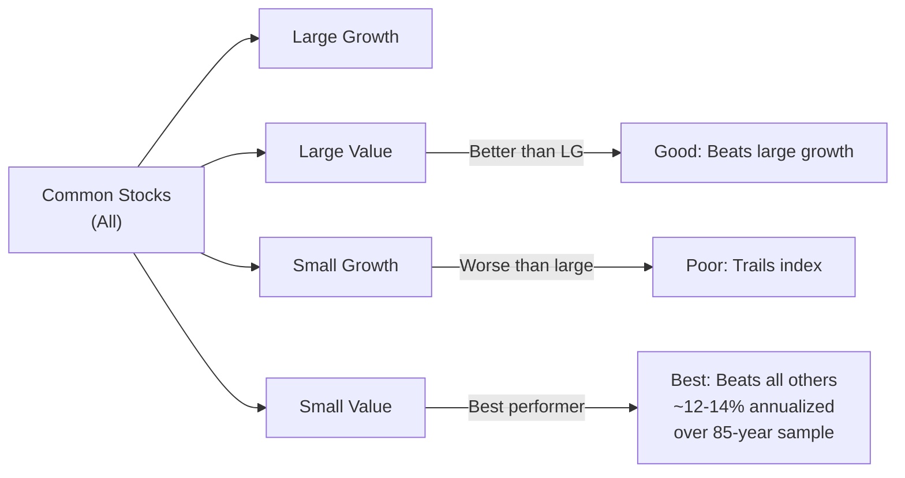
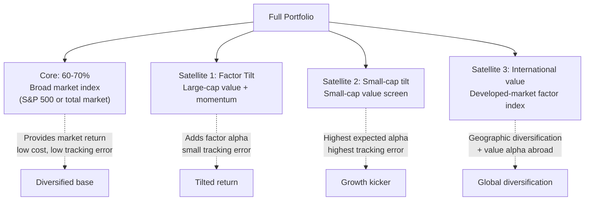

# Core Concepts

## The Great Database

The empirical starting point for everything in the book: O'Shaughnessy's "Great Database" — the first clean, standardized, complete record of all publicly traded US stocks from 1926 onward. Standard, commercially available data suffers from three problems the Great Database was built to solve:

- **Survivorship bias:** Standard databases include only currently surviving companies, inflating historical returns because bankruptcies and delistings are excluded.
- **Short time horizon:** Academic data and provider data typically start around 1962 (CRSP's first year of full coverage), cutting out the Depression and pre-WWII era.
- **Inconsistent methodology:** Breakpoints, float definitions, and valuation calculations changed across decades; no single provider used uniform methodology for the full period.

O'Shaughnessy standardized all value and price metrics, applied consistent universe definitions across 85+ years, and — critically — included every delisted stock. This is why his results look different (and more conservative) than many published academic papers.

---

## The 11 Factor Categories

O'Shaughnessy tested 11 broad categories of investment strategy. Each was evaluated on historical return, risk profile, and robustness across time periods:

| Factor | Key Metric(s) | Description |
|--------|---------------|-------------|
| **Market Cap** | Size | Can small stocks reliably beat large stocks? |
| **Price-to-Earnings** | P/E | Cheap on earnings — the classic value screen |
| **Price-to-Book** | P/B | Graham's ratio, updated |
| **Price-to-Sales** | P/S | The book's most important finding |
| **Price-to-Cash Flow** | P/CF | Value measured on operating cash |
| **Dividend Yield** | DY | Income-focused strategy |
| **Price-Momentum** | 6mo–1yr | Past price trends predicting future returns |
| **Earnings Growth** | EPS momentum | Earnings acceleration as a signal |
| **Earnings Stability** | Low volatility of EPS | Consistent earners outperform erratic ones |
| **Financial Strength** | Interest coverage, debt | Solid balance sheets matter |
| **PEG Ratio** | P/E ÷ growth rate | "Growth at reasonable price" screening |

---

## The Market Value Effect

One of the most robust findings in finance is the **market value effect**: small stocks have returned significantly more than large stocks over long time horizons.

O'Shaughnessy quantified this across every 10-year rolling period in the 1926–1997 database:

- **Large-cap stocks** (top 10% by market value)
- **Mid-cap stocks** (middle 40%)
- **Small-cap stocks** (bottom 50%)
- **Micro-cap stocks** (bottom 20%)

On average, **small-cap value** — small stocks with low P/E or P/S ratios — outperformed all other combinations. But the key nuance is that simple "small-cap" (unfiltered for value) produced significant outperformance only when combined with value characteristics.

> Small size alone is not enough. Small-cap *growth* stocks severely lagged. It is the combination of small with cheap that is the engine.

---

## Small-Cap Value: The Best-Performing Strategy

After testing every combination, the book identifies one strategy as consistently outperforming across all periods tested:

The small-cap value portfolio in O'Shaughnessy's backtests:

- Outperformed the S&P 500 by 3–5% annualized across the full 1926–1997 period
- Outperformed through the Depression, the 1970s, and the tech bubble
- Had a higher worst-drawdown but recovered faster — value and size are different risks

---

## The Superiority of Price-to-Sales

Perhaps the book's most actionable and surprising finding is that **P/S is the single best standalone valuation ratio** tested. Not P/E. Not P/B. Not dividend yield.

P/S outperforms P/E because:
- Sales are harder to manipulate than earnings
- P/E breaks down when earnings are negative or near-zero (common for distressed and growth stocks)
- P/S captures both profitability and scale without elimination bias

The O'Shaughnessy "Best Value" screen (small-cap, low P/S, positive earnings, high relative strength) produced an annualized return roughly double the market's across the full period.

---

## Value vs. Growth

The book delivers a clean verdict: **value systematically beats growth over long periods**, with significant statistical and practical margins.

Value strategies (low P/E, low P/B, low P/S) outperformed growth strategies (high P/E, high P/B) in every long-term subperiod examined. Growth's best years tend to cluster in the late stages of bull markets — precisely when valuation risk is highest.

> Growth stocks do not create the most wealth; they destroy the most on a relative basis. The companies that genuinely grow earnings into excessive valuations are rare. The rest are priced for perfection and disappointed.

---

## The Limitations of the Efficient Market Hypothesis

O'Shaughnessy accepts that markets are directionally efficient — you cannot consistently beat them by reading newspapers or trading tips. But his empirical results directly contradict the *strong* form of EMH.

His argument against strong EMH is structural:

1. **Systematic, repeatable anomalies exist.** If markets were perfectly efficient, well-known factors like value and size would not produce persistent excess returns after decades of publication.
2. **The anomalies are risk-adjusted.** Even after adjusting for volatility (Sharpe ratios, Sortino ratios), value and small-cap strategies produce higher risk-adjusted returns than simple indexing.
3. **Behavioral biases explain the gaps.** Anchoring, extrapolation bias, and overconfidence cause investors to systematically overpay for glamour and underpay for value.

O'Shaughnessy's conclusion is now mainstream: **markets are "efficient-ish"** — enough to make beating them hard, but not so efficient that systematic factors cannot generate excess returns with discipline and patience.

---

## The Core-Satellite Approach

O'Shaughnessy invented (or at least popularized) the **core-satellite portfolio** approach as a practical implementation of the book's findings:

The core provides market-rate returns at minimal cost. The satellites apply proven factor tilts. Investors get the best of both worlds: indexed safety plus active upside.

---

## The O'Shaughnessy Shark

O'Shaughnessy developed a proprietary screening methodology — sometimes called the "OSAM Shark" — that ranks all stocks on a composite of factors:

- **Value:** P/E, P/B, P/S, P/CF, dividend yield
- **Quality:** earnings stability, balance sheet strength
- **Momentum:** 6-month and 12-month price trends

The result is a ranked list where the "best" stocks (cheap, stable earners with recent momentum) cluster at the top. Portfolios constructed from the top decile have outperformed across all testing periods.

The methodology evolved from rules-based screens to a composite scoring system. The key insight: **no single factor wins every year**, but combining factors creates more robust returns with smaller drawdowns.

---

## Strategy Decay and the Transience of Alpha

Perhaps the most important caution in the book: **every successful strategy eventually decays**. O'Shaughnessy documents why:

1. **Publication effect:** Once a strategy is widely known, capital flows into it quickly, compressing the anomaly until the excess return disappears.
2. **Discovery and crowding:** Academics cover new anomalies; the hedge fund industry arbitrages them away.
3. **Survivorship bias in discovery:** We study the anomalies that worked. We rarely hear about the hundreds of factor combinations tested that did not work.

O'Shaughnessy's recommendation: accept that alpha is temporary. Create robust processes. Diversify across multiple validated factors. Manage expectations. Do not extrapolate a great 10-year track record into infinity.

---

## Process Over Strategy

A theme running through the entire 4th edition: **the quality of your decision-making process matters more than any individual stock pick or strategy.**

O'Shaughnessy argues that most investment failures are not caused by bad data — they are caused by:
- Abandoning a strategy at its worst point (after underperforming for 2–3 years)
- Strategy hopping when a new idea outperforms
- Failing to understand why a strategy is working (or stopped working)
- Letting emotions override disciplined execution

> "The strategy that will make you the most money over the next 20 years is the one you will stick with through 15% market drawdowns and 3-year underperformance periods."
