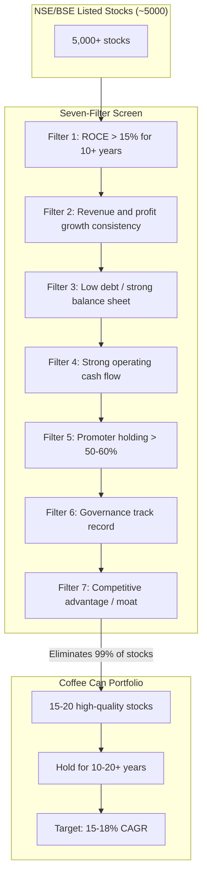

## The Coffee Can Philosophy



---

## The Story Behind the Name

In the 1980s, a US brokerage found an account from the 1960s: a client
had bought a portfolio of quality stocks, put the certificates in a
coffee can, and forgotten about them for over 20 years. The portfolio
had grown 100x.

The lesson: the best thing you can do with quality stocks is nothing.
Hold them. Let compounding work.

---

## Filter 1: Return on Capital Employed (ROCE)

ROCE is the most important quality metric:

```
ROCE = (Profit Before Interest and Tax) / (Total Capital Employed)
```

- **Required threshold:** > 15% for 10+ consecutive years
- **Why it matters:** ROCE measures how well a company uses its capital
  to generate profits. Consistently high ROCE indicates a sustainable
  competitive advantage.
- **The comparison:** If a company generates 30% ROCE while its
  competitors generate 10%, the difference is its moat — pricing
  power, brand, technology, or scale.

**Examples of high ROCE Indian companies:** Asian Paints, HDFC Bank,
Bajaj Finance, Maruti Suzuki, Nestle India.

---

## Filters 2-4: Consistency and Financial Health

| Filter | Metric | Threshold |
|--------|--------|-----------|
| Revenue growth | CAGR over 10 years | Positive, ideally > 10% |
| Profit growth | PAT CAGR | Consistent with revenue |
| Debt | Debt-to-Equity | < 0.5 (ideally zero debt) |
| Cash flow | CFO / PAT | > 0.8 (cash flow supports reported profits) |

The key: **earnings quality** matters as much as earnings quantity. A
company that reports profits but generates no cash is suspect.

---

## Filter 5: Promoter Holding

India's unique characteristic: many companies are controlled by
founders or families ("promoters").

| Promoter Holding | Signal |
|-----------------|--------|
| > 60% | Strong alignment; promoter wealth is tied to the company |
| 50-60% | Good alignment |
| 30-50% | Moderate |
| < 30% | Weak alignment — be cautious |
| Decreasing trend | RED FLAG — promoters are exiting |

Mukherjea's finding: companies with high promoter holding outperform
those with low promoter holding, because promoters treat the company
as their legacy, not just a financial asset.

---

## Filter 6: Governance

Governance is assessed through:
- Related-party transactions (are promoters extracting value?)
- Auditor reputation (Big 4 vs. smaller firms)
- Board independence
- Accounting practices (revenue recognition, provisions)
- Dividend history (consistent dividends signal governance quality)

**Red flags:**
- Frequent changes in auditors
- Related-party transactions that seem unfavorable to the company
- Promoters pledging shares for personal loans
- Subsidiaries with opaque financials

---

## Filter 7: Competitive Advantage

A sustainable moat can come from:
- **Brand** (Titan, Asian Paints) — pricing power from brand loyalty
- **Scale** (HDFC Bank) — network effects and cost advantages
- **Regulation** (some sectors) — license to operate is scarce
- **Technology** (TCS, Infosys) — proprietary systems or expertise
- **Distribution** (Maruti Suzuki) — widest service network in India

The question: **why can't competitors take this company's business?**
If the answer is not convincing, the company does not qualify.

---

## Portfolio Construction

- **15-20 stocks** in the portfolio
- **Sector diversification:** 3-4 sectors maximum
- **Equal weight or slightly tilted to highest conviction**
- **No stop-losses** — small STIRs kill compounding
- **Dividends reinvested** — this is a critical source of returns

### The STIR Problem

STIRs (Short-Term Inexplicable Reasons to sell) are the enemy:
- "The stock went up too much"
- "The stock went down; I'll wait for it to recover"
- "The economy is slowing"
- "There's an election coming"
- "I need to book profits"

All of these destroy the compounding that makes coffee can investing
work.

---

## The Holding Period

The evidence:
- A 10-year holding period with 15% CAGR turns $10,000 into $40,000
- A 20-year holding period turns $10,000 into $163,000
- A 30-year holding period turns $10,000 into $662,000

The difference between 10 and 30 years is 16x — all from patience.

### When to Sell

Only three reasons:
1. The company permanently loses its competitive advantage
2. The original investment thesis is proven wrong
3. The stock becomes an unacceptably large portion of net worth

---

## Key Lessons

- Quality + patience = wealth
- ROCE is the single most important financial metric
- Ignore macro noise entirely
- Let winners run for decades
- A simple system beats complex analysis
- Promoter holding is a powerful alignment signal
- Dividends are a critical source of compounding
- Small STIRs are the biggest destroyer of returns

---

## Practical Applications

### For Individual Investors

- Apply the seven-filter screen to your existing portfolio
- Be ruthless — most stocks will not qualify
- Commit to a 10+ year holding period
- Turn off CNBC, stop checking daily prices

### For Advisors

- Build coffee can model portfolios for clients
- Educate clients on the importance of patience
- Create systematic review cadence (annual, not weekly)

### For SRI Managers

- Use the seven-filter screen as a PM policy
- Resist pressure to trade for performance
- Measure success in decades, not quarters

---

## Action Plan

1. **Run the seven-filter screen** on the NSE 500
2. **Build a watchlist** of companies that pass all seven filters
3. **Select 15-20** for your coffee can portfolio
4. **Buy them** in a demat account designated for long-term holdings
5. **Set a calendar reminder** to review annually (not more often)
6. **Reinvest dividends** automatically
7. **Do nothing else** for 10 years
