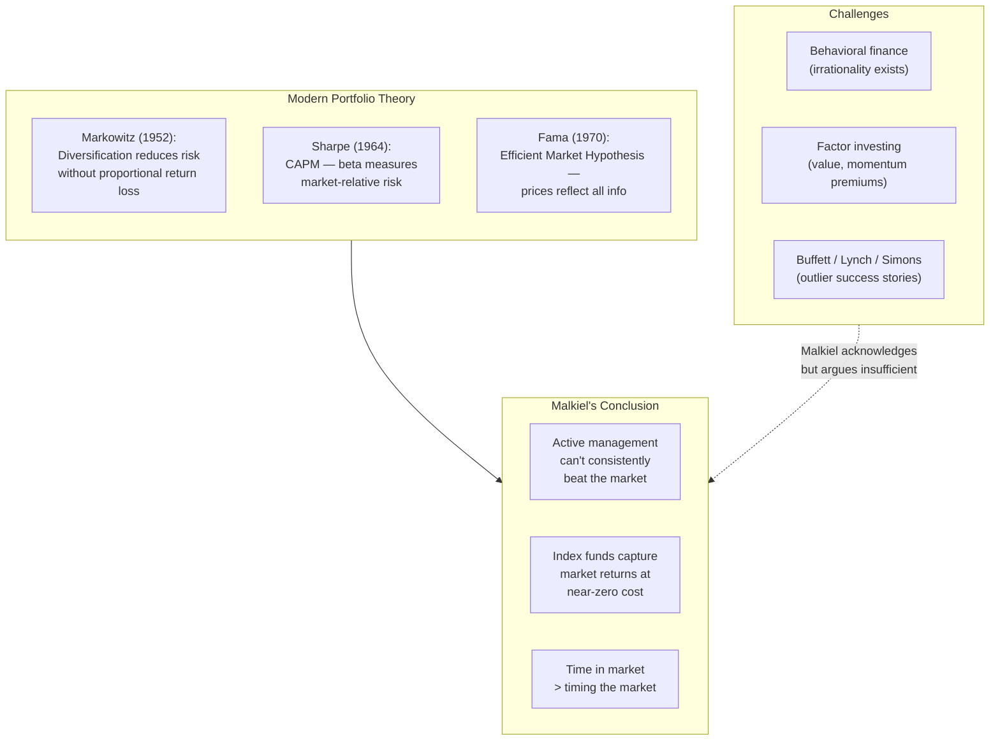

## Introduction

Welcome to BookAtlas. Today: *A Random Walk Down Wall Street: The
Time-Tested Strategy for Successful Investing* by Burton G. Malkiel.
First published 1973. W. W. Norton. 480 pages. Thirteen editions. Over
1.5 million copies sold. Fifty years in print.

This book more or less started the passive investing revolution.
Malkiel's central claim is simple: stock prices move randomly in the
short term, you cannot predict them, and the smartest thing you can do
is buy a low-cost index fund and hold it forever.

We're going to approach this book with two voices. On one side, an
index fund advocate who has followed Malkiel's advice for decades. On
the other, a value investor who thinks Malkiel gives up too easily on
the intelligent investor's ability to find bargains.

Let's get into it.

---

## The Setup: What Is a Random Walk?

The title is a metaphor. Imagine a drunk man staggering down a street.
Each step is independent of the last — sometimes left, sometimes
right, sometimes forward. You cannot predict where the next step will
land based on where the previous steps went.

Malkiel argues that stock prices behave the same way. Tomorrow's price
change has no reliable connection to yesterday's. This is not a claim
that markets are irrational. It is a claim that they are so
competitive — with so many smart people analyzing the same
information — that any exploitable pattern gets traded away almost
instantly.

**Indexer:** This is the most liberating idea in all of finance. It
means you do not need to be smarter than Wall Street. You do not need
to analyze earnings reports. You do not need to watch CNBC. You just
need to buy the whole market and wait.

**Value Investor:** Liberating or defeatist? Malkiel is telling
millions of people that their efforts to learn about companies and
make informed decisions are worthless. But Benjamin Graham and Warren
Buffett have shown that disciplined value investing does work. The
market is not a random walk when you are buying companies at half
their intrinsic value.

---

## Technical Analysis: Reading Tea Leaves

Malkiel devotes significant space to debunking technical analysis —
the practice of predicting stock prices from chart patterns. His most
famous demonstration: he generated random stock charts using coin
flips and presented them to technical analysts, who confidently
identified patterns in the random noise.

**Indexer:** This is the strongest section of the book. Technical
analysis is essentially astrology for finance. There is no evidence
that chart patterns work. Hedge funds with PhDs and supercomputers
have tried to exploit every conceivable pattern, and they still fail
to consistently beat the market.

**Value Investor:** I agree on technical analysis. Chart patterns are
nonsense. But Malkiel uses the failure of technical analysis as a
stalking horse for his broader argument that *all* active management
is futile. That is a logical leap. Technical analysis failing does
not mean fundamental analysis fails. Graham and Buffett do not use
charts. They use balance sheets.

---

## Fundamental Analysis: The Honest Effort

Malkiel treats fundamental analysis with more respect than technical
analysis. He acknowledges that it is intellectually serious. But he
argues it still cannot consistently beat the market because earnings
are unpredictable, analysts are biased, and competition erodes any
edge.

**Indexer:** The data is overwhelming. Over 15-year periods, roughly
85% of actively managed funds underperform their benchmark. And the
ones that outperformed in one period rarely repeat. Past performance
is not just not a guarantee — it is barely even a clue.

**Value Investor:** You are using mutual fund data to argue against
value investing. But the average mutual fund is not a value fund. Most
funds are closet indexers with high fees. The truly disciplined value
investors — the ones who buy when everyone else is selling — have a
different track record. Malkiel cites Buffett as an exception but does
not seriously examine *how* Buffett does it. That feels like an
oversight.

---

## Modern Portfolio Theory: The Science

The book introduces the academic framework that supports the passive
conclusion: diversification, beta, the efficient frontier, and the
capital asset pricing model.

**Indexer:** This is the core of the argument and it is airtight.
Diversification is the only free lunch. Index funds give you maximum
diversification at minimum cost. The math is not complicated — it just
takes discipline to follow.

**Value Investor:** Modern portfolio theory assumes investors are
rational and markets are efficient. But Malkiel himself spends a
chapter on behavioral finance showing that investors are *not*
rational. If investors are irrational, markets can be inefficient. And
if markets are inefficient, active management can work. Malkiel never
fully resolves this tension.

---

## Behavioral Finance: The Psychology of Money

Malkiel explains the biases that cause investors to make systematic
errors: overconfidence, herd behavior, loss aversion, anchoring, and
confirmation bias.

**Indexer:** This is why index investing is so powerful. It does not
just beat the market on fees — it protects you from yourself. When
you own the whole market, you cannot panic-sell your individual
holdings. You cannot chase the hot stock. You cannot make the
psychological mistakes that destroy wealth.

**Value Investor:** But if you know about these biases, you can guard
against them. That is what the best value investors do. They
institutionalize discipline. They have checklists. They buy when
everyone else is selling because they know the herd is panicking. The
biases are real, but awareness of them can be an edge. Malkiel treats
them as permanent obstacles; I treat them as exploitable patterns.

---

## The Life-Cycle Guide: Actionable Advice

The book's most practical section provides specific asset-allocation
models based on age: 80-90% stocks in your 20s, gradually shifting
toward bonds as retirement approaches.

**Indexer:** This alone is worth the price of admission. Malkiel gives
you a concrete plan. Not "invest wisely" — here is the exact
percentage of stocks you should own at every age. Combine this with a
low-cost total market index fund and you are done. You have a
retirement strategy that will beat 90% of professional investors.

**Value Investor:** The life-cycle guide is genuinely useful. But it
is too conservative for younger investors. A 25-year-old with a high
risk tolerance and stable income could reasonably be 100% stocks. And
it ignores the most important factor: savings rate. A 30-year-old
saving 30% of income in cash under the mattress will retire richer
than one saving 5% in a perfectly allocated index portfolio. The book
could emphasize this more.

---

## The Verdict: Do You Need This Book?

**Indexer:** Yes. Every single person who invests should read this
book. It is the most important investing book ever written because it
is the most honest. Malkiel is not selling you anything. He is not
promising market-beating returns. He is telling you the uncomfortable
truth: you are not special, the market is smarter than you, and the
best thing you can do is get out of your own way.

**Value Investor:** I would say: read it, but read it critically.
Malkiel is right about technical analysis, right about fees, right
about diversification, and right that most people should index. But
he overstates his case. He dismisses active management too quickly and
does not engage seriously with the evidence that some strategies and
some investors have genuinely beaten the market. Read it alongside
*The Intelligent Investor* and decide for yourself.

**Indexer:** That is a fair compromise. But notice: even the value
investor agrees that most people should index. Malkiel's argument is
not that *no one* can beat the market. It is that *you* probably
cannot and you should not try until you have good reason to believe
you are the exception. For 99% of investors, that reason never comes.

---

## Final Thoughts

*A Random Walk Down Wall Street* has been called the best book on
investing ever written. That might be an overstatement — *The
Intelligent Investor* has a claim, too. But it is certainly the most
*important* investing book of the last 50 years, measured by impact.

Malkiel did not invent the random walk hypothesis or the efficient
market hypothesis. But he translated them from academic journals into
a book that changed how millions of people invest. The passive
revolution traces directly to these pages.

The book's message is simple, and it can be life-changing: you do not
need to beat the market. You just need to join it, at the lowest
possible cost, and wait.

This has been a BookAtlas narration of *A Random Walk Down Wall
Street* by Burton G. Malkiel. Thanks for listening.
