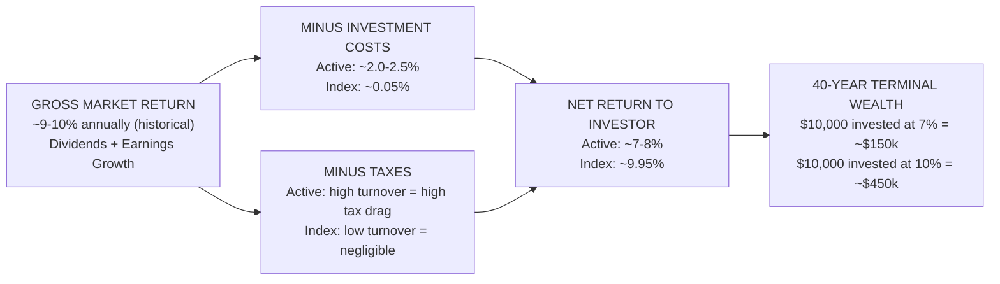
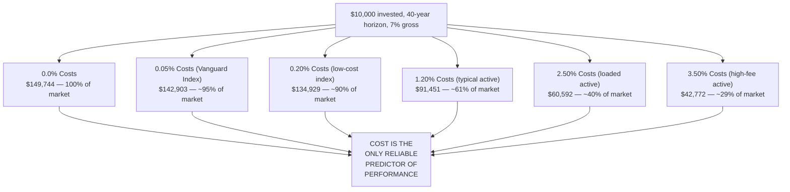
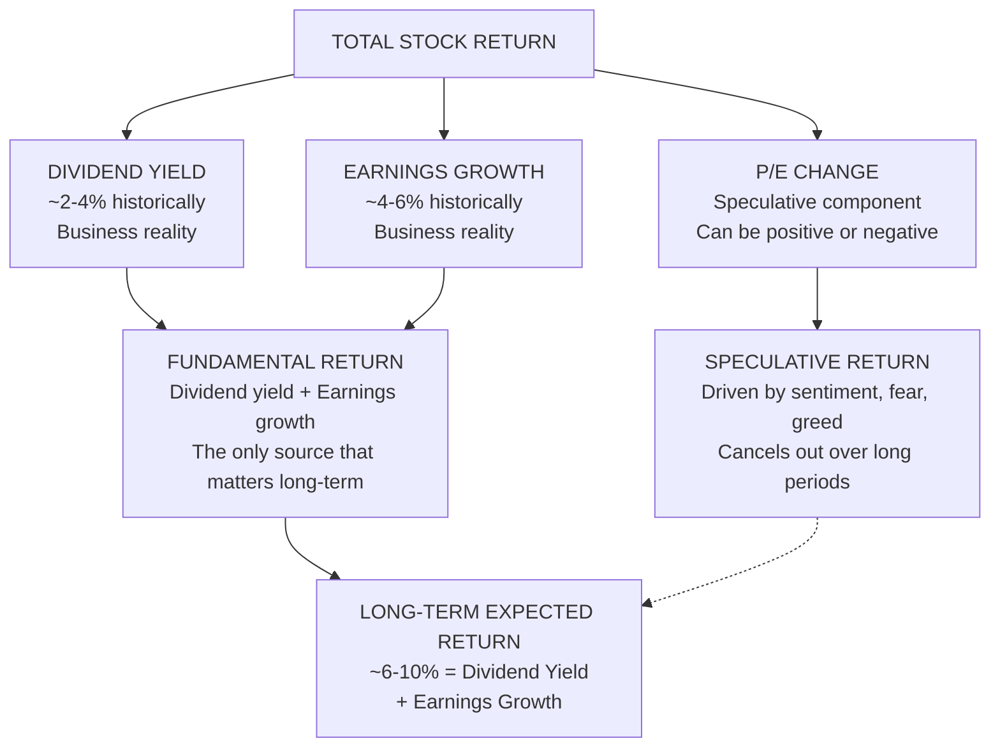
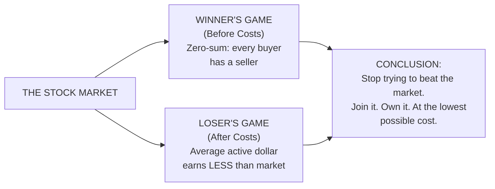
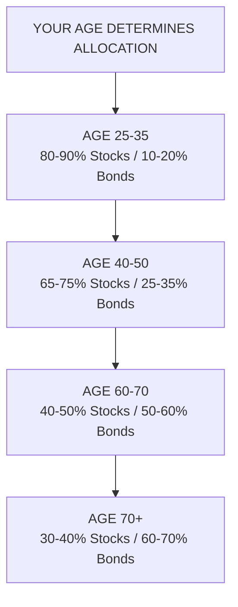

## The Core Equation



The entire 624-page book is an expansion of this one diagram. Reduce costs. Reduce taxes. Keep more of what the market delivers. Everything else is noise.

---

## The Mathematics of Index Fund Victory



A 2% annual fee difference over 40 years reduces an investor's share of market return from ~100% to ~40%. This is the tyranny of compounding costs — a slow, invisible erosion that most investors never fully comprehend.

---

## The Three Sources of Stock Returns



Over a century, fundamental returns (dividends + earnings growth) account for ~95% of total stock return. Speculative returns (changes in valuation) dominate over short periods but average to near zero over decades. Investors who chase speculative returns consume costs and achieve below-market results.

---

## Winner's Game vs. Loser's Game: The Active Management Problem



Bogle labels this the "craps game" of active management. Before costs, active and passive investors are tied — both earn the market return. After costs, the average active fund must underperform the market by the average amount of its fees. Only an index fund — which avoids all the cost drag of trading, managers, researching, marketing, and distribution — guarantees near-market returns.

---

## Chapter-by-Chapter Summaries

### Part I: The Case for Index Investing

#### Chapter 1: A Financial Parable
Bogle introduces a fable of two investors who both earn the market's ~7% gross return. Investor A uses low-cost index funds (0.05% expenses). Investor B uses typical actively managed funds (2.0%+ expenses). Over 50 years, Investor A's $10,000 grows to ~$294,000. Investor B's grows to ~$67,000. The message: **costs are not a detail — they are the whole story.**

#### Chapter 2: The Nature of Stock Returns
Bogle debunks the belief that markets will continue to deliver 15%+ annual returns. Those returns from the 1980s and 1990s were driven by falling interest rates and rising P/E ratios (speculative factors) rather than business fundamentals. Reasonable long-term expectations: 4-7% nominal.

#### Chapter 3: How Most Investors Turn a Winner's Game into a Loser's Game
The zero-sum component: before costs, all active investors combined earn the market return. After costs, all active investors combined earn less. The only way to guarantee your fair share is to match the market at the lowest cost. Indexing is the only path.

#### Chapter 4: The Grand Illusion — Why Forecasting Is Futile
Bogle presents decades of data showing that professional economists and strategists consistently fail to predict market direction, GDP growth, interest rates, or corporate earnings. The prudent investor ignores forecasts and focuses on the two things that are knowable: current dividend yield and long-term earnings growth.

#### Chapter 5: The Relentless Rules of Humble Arithmetic
The most important chapter in the book. Bogle demonstrates mathematically that the gap between what the market delivers and what investors receive is determined almost entirely by costs. Over time the cost gap compounds into a chasm.

---

### Part II: The Application to Specific Fund Types

#### Chapter 6: Stock Funds
#### Chapter 7: Bond Funds
Bogle applies the same cost-focused lens to bond funds. Returns on bonds are lower and the variance of returns among active managers is narrow — meaning the cost advantage of indexing is even more pronounced in bonds than in equities. He recommends a single total bond market index fund.

#### Chapter 8: Balanced Funds
Balanced funds (stocks + bonds) make sense for investors who want simplicity. Bogle recommends funds in the 60/40 or 50/50 ratio and praises Vanguard's Wellington Fund for its low cost and disciplined rebalancing — though he notes its active management still adds unnecessary cost relative to an index-based balanced fund.

#### Chapter 9: The Grand Illusion of Performance
A comprehensive empirical review of mutual fund performance over decades. The data shows consistent underperformance of active funds on both a before- and after-cost basis. Not one reliably predictable pattern of outperformance. Hot funds become cold funds.

#### Chapter 10: The Case for Index Funds
Bogle systematically addresses and refutes the standard objections to indexing:
- *"Indexing doesn't work in bear markets."* — It works, because beating the market is harder in down markets.
- *"A good active manager is worth the fees."* — The good ones are rare before costs and non-existent after costs.
- *"Indexing creates market inefficiencies."* — Predicted in 1974; has never materialized.
- *"If everyone indexed, markets wouldn't work."* — A theoretical impossibility; index funds represent the vast majority of informed investors.

---

### Part III: The Anatomy of the Mutual Fund Industry

#### Chapter 11: The Fund Industry's "Immutable Laws"
Bogle identifies structural incentives that systematically harm investors: fund companies compete for assets, not returns; fund managers are paid to manage money, not to outperform benchmarks; fund families maximize fees through 12b-1 marketing fees, loads, and complex share classes.

#### Chapter 12: Performance Chasing
The average equity fund investor is not the average mutual fund. The average fund investor is much worse off because of when they put money into and take money out of funds. Bogle shows that chasing past performance — buying last year's winners — is consistently wrong. The best-performing funds over any 5-year period tend to be among the worst performers over the following 5 years.

#### Chapter 13: The "Craps Game" — An Empirical Analysis
Bogle updates his original 1999 "craps game" analysis with 2009 data. Nothing has changed. The percentage of active funds beating their benchmark after costs remains at ~15-20% over any measurement period. The percentage beating the market over 30+ years is essentially zero.

#### Chapter 14: Bonds and Money Market Funds
Even in markets where outperformance seems easy (bond funds, money market funds), costs determine outcomes. The lowest-cost funds deliver the highest returns. Money market fund yields collapse to the lowest common denominator because investors chase yield rather than minimizing costs — exactly wrong behavior.

---

### Part IV: Asset Allocation and Rebalancing

#### Chapter 15: Asset Allocation
Expanded significantly in the 2010 edition. Asset allocation — the division of a portfolio between stocks and bonds — accounts for more than 90% of a portfolio's return variability over time. Bogle advocates a simple age-based rule: bond allocation ≈ your age. This rule builds in an automatic risk reduction as you age.



#### Chapter 16: Rebalancing
Rebalancing is forced contrarianism: sell what has gone up, buy what has gone down, return to target percentages. Bogle recommends annual rebalancing — tying it to a birthday or anniversary is an effective behavioral guard against procrastination.

---

### Part V: Practical Implementation and The "Final Portfolio"

#### Chapter 17: Tax Efficiency
Tax management adds another layer to the cost argument. Index funds' minimal turnover means minimal realized capital gains. Holding index funds in taxable accounts and bonds in tax-advantaged accounts (IRAs, 401k) maximizes after-tax returns. Bogle shows that a well-managed index portfolio in a taxable account can be as efficient as any active management strategy in a tax-advantaged account.

#### Chapter 18: Building a Portfolio (Updated for the 2010 Edition)
Bogle provides his "Final Portfolio" model:

```mermaid
flowchart TD
    Age["INVESTOR AGE" --> Allocation
    Subgraph Allocation["SIMPLE TWO-FUND PORTFOLIO"]
        Stocks["50% US Total Stock Market<br/>(VTSMX / VTI)"]
        Bonds["50% US Total Bond Market<br/>(VBMFX / BND)"]
    End
    Allocation --> Action["ACTION STEPS"]
    Action --> Step1["1. Buy both funds in a low-cost provider (Vanguard, Fidelity, Schwab)\n2. Set up automatic rebalancing once per year\n3. Never chase performance\n4. Rebalance back to 50/50 after each calendar year"]
    Action --> Step2["RETIREES: 50/50 stocks/bonds\nYOUNG WORKERS: 80/20 stocks/bonds"]
    Action --> Step3["LOWER COST IS THE NUMBER ONE PRIORITY\nExpense ratio should be below 0.10%"]
```

#### Chapter 19: The Final Word
The book closes with Bogle's "Clash of the Cultures" framework: the culture of speculation (short-term, zero-sum, cost-heavy) versus the culture of investment (long-term, wealth-creating, cost-light). Indexing is a return to sound investment. The culture of speculation, embodied by hedge funds, private equity, leveraged ETFs, and frequent trading, is parasitic on real investors. Bogle ends with a call to action for individual investors, plan sponsors, regulators, and fund boards to align incentives and lower costs.

---

## Bogle's Return Forecasting Formula

```
Expected Annual Return = Dividend Yield + Expected Earnings Growth ± Speculative Return (P/E change)
```

Example (2010 perspective):
- S&P 500 dividend yield: ~1.8-2.0%
- Expected earnings growth: ~5.0%
- P/E change (mean reversion): -2.0% (headwind from above-average starting P/E)
- → Fair value expected return: ~4-5% nominal over the coming decade

This is the "relentless rules of humble arithmetic" — speculative valuations cancel out and investors should anchor their expectations to dividends and earnings growth alone.

---

## Real-World Examples

**The Vanguard 500 Index Fund (VFINX).** Launched in 1976 as the "First Index Investment Trust," derided as "Bogle's Folly," attracted only $11 million in its IPO. Today it manages over $800 billion and has outperformed ~85-90% of active large-cap funds since inception.

**The SPIVA Scorecards.** S&P Dow Jones Indices publishes annual reports (SPIVA) that measure the percentage of active funds that underperform their benchmarks. Over 15 years, 85-90% of active funds underperform. This holds across size, style, and geography. The percentages are higher in less-efficient markets (small cap, emerging markets).

**The Bogleheads Community.** What began as a footnote on the Morningstar forums in the late 1990s grew into thousands of documented families following Bogle's exact prescriptions — three-fund portfolios, age-based allocations, Vanguard-only cost minimization — all achieving market-matching returns. Reddit's r/Bogleheads alone has grown to over 500,000 members.

**Warren Buffett's $1 Million Bet.** Buffett wagered that a simple S&P 500 index fund would outperform a basket of hedge funds over 10 years (2007–2017). The index fund returned 7.1% annualized versus 2.2% for the hedge fund basket. Buffett won resoundingly and credited Bogle's framework for giving him the confidence to make the bet.

---

## Actionable Advice

1. **Use a low-cost, broad-market total stock market index fund.** Look for an expense ratio below 0.10%. Vanguard's VTSAX/FSKAX are benchmarks.

2. **Use a low-cost total bond market index fund.** Same cost discipline. Bond indexing has even fewer arguments for active management than equities.

3. **Set your stock/bond allocation by age.** Stocks: roughly (100 minus your age) percent. Bonds: the remainder.

4. **Rebalance annually.** Do it on your birthday or January 1st. Mechanical rebalancing eliminates emotional decision-making.

5. **Never chase performance.** If a fund's recent returns look exceptional, its costs are likely hidden and its windfall returns are mean-reverting.

6. **Avoid front-end loads and 12b-1 fees.** Any fund charging you to sell or charging an ongoing marketing fee is structuring to feed the fund company, not you.

7. **Hold index funds in taxable accounts.** Their minimal distributions mean minimal annual tax bills, and you control when you realize capital gains by selling.

8. **Use target-date retirement funds** only if you want maximum simplicity and are willing to accept slightly higher fees for automatic rebalancing. Vanguard's TR funds charge ~0.08%.

9. **Prefer mutual funds or ETFs based on cost, not structure.** ETFs and index mutual funds at the same expense ratio are functionally equivalent. The institutional structure (ETF vs mutual) matters less than the fee.

10. **Stay the course.** Buy, hold unchanged through crashes and rallies, ignore media commentary, and let compounding work.
