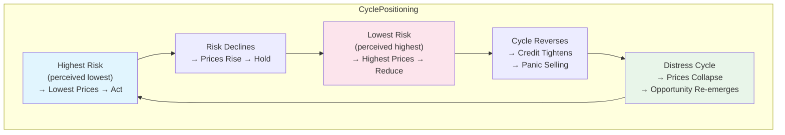

## The Book's Architecture

Mastering the Market Cycle is organized in four thematic parts. Each chapter breaks down a single facet of the cycle framework, with heavy use of Oaktree Capital real-world examples and extensive references to prior financial crises.

---

## Part 1: The Nature of Cycles and Their Importance

Chapters 1–3: Why Cycles Matter

Marks opens by establishing that cycles are not minor fluctuations in an otherwise linear process. They are the process. Economies grow in fits and starts; business profits oscillate independently of the overall economy; and investor sentiment swings from greed to fear without even a moment of rest at equilibrium.

The central insight of this section: *cycles are not mechanical*. They move irregularly because human psychology is irregular. Two cycles that look similar on a chart can unfold at very different speeds and with very different magnitudes because the people driving them behave differently at each turning point.

Regression to the mean is identified as the primary self-correcting mechanism. After every extreme — high or low — forces build up that push the pendulum back toward the midpoint. But momentum does not stop at the midpoint: it continues past it, producing the next extreme in the opposite direction. This pattern is irreversible and universal.

Marks cites the 2008 crisis as both a demonstration of the cycle at work and an illustration of how *not* recognizing it produces massive errors. The boom that preceded it created the conditions for the bust, and the bust itself contained the seeds of recovery.

---

## Part 2: The Pendulum of Investor Psychology

Chapters 4–7: The Pendulum and the Cycle of Risk

This is the philosophical heart of the book.

Marks argues that the market pendulum swings across five dimensions simultaneously: greed ↔ fear, optimism ↔ pessimism, risk-tolerant ↔ risk-averse, overpriced ↔ underpriced, and far-seeing ↔ short-sighted. Crucially, these five dimensions do not move independently — they are expressions of the same psychological oscillation.

The pendulum metaphor is the book's most original and memorable contribution. Marks demonstrates that the midpoint is almost never occupied. The market spends virtually all its time either swinging toward an extreme or recoiling from one. This makes intuitive sense to anyone who has watched markets surge toward overvaluation, crash to panic, and then meander uncertainly before swinging back up again.

The implication for investors is severe: *at any given moment, most people are wrong about how risky the market is*. When the consensus is that risk is high, prices are cheap and risk has already been partially discounted — making this the right time to be aggressive. When the consensus believes risk is low and the only direction is up, prices are high and risk is building, not receding — making this the wrong time to be aggressive.

The three stages of a bull market:
1. Only a few people believe things will get better.
2. Most people see that things are improving.
3. Everyone believes things will stay better forever.

The three stages of a bear market:
1. Only a few people believe things won't stay better forever.
2. Most people see that things are getting worse.
3. Everyone believes things can only get worse.

Knowing this structure does not tell you the exact date of the turning point. But it does tell you when the odds have shifted, and that is enough.

The risk cycle: risk is not the same as volatility. Risk is the likelihood of permanent capital loss. Marks cites Peter Bernstein: ""If you know the probability distribution of possible outcomes and you know nothing else, you are ahead of most investors."* Most investors confuse risk with recent volatility — precisely the metric that is lowest at the point of maximum danger. When risk assets have stopped declining, sentiment is calm, and spreads are tight, this is precisely when the risk is highest — because it has already been forgotten.

---

## Part 3: Cycles That Amplify and Reinforce

Chapters 8–11: The Economic, Profit, and Credit Cycles

The economic cycle is driven by both secular forces (demographics, technology, productivity) and cyclical forces (consumer confidence, business investment, inventory cycles). Marks argues that the short-term cycle is disproportionately driven by psychology because consumers who fear unemployment will spend less and companies that fear recession will defer investment — together producing the very recession they anticipated. This self-fulfilling mechanism is why economic forecasting is such a poor activity for investors.

The profit cycle is generally more volatile than the economic cycle. Corporate profits swing wider than GDP. This is partly due to operating leverage (fixed costs mean a small decline in revenue produces a large decline in profits) and financial leverage (debt service obligations amplify losses). Industries with high fixed-cost structures and those dependent on consumer discretionary spending are the most volatile.

**The credit cycle** receives special attention — Marks considers it the most volatile and consequential of all cycles. The sequence is inexorable:

> Prosperity brings expanded lending, which leads to unwise lending, which produces large losses, which makes lenders stop lending, which ends prosperity, and on and on.

The credit market swings from open (easy borrowing, lenders competing to offer lower rates and weaker protections) to closed (no one will lend, even at high rates, without extreme protections). The transition is driven by the same psychology that moves markets: at the open end, lenders are so eager for yield that they stop requiring adequate compensation for risk. At the closed end, fear is so pervasive that even good credits cannot access financing.

**The race to the bottom**: when lenders compete aggressively for deal flow, the winner is the one who offers the *best* terms to the borrower — and is therefore most likely to lose money. This is the credit cycle's mechanism for concentrating losses at the cycle's most reckless participants.

The distressed debt cycle thrives at the intersection of credit closure and economic weakness. When companies cannot refinance maturing debt and face recession-driven revenue declines, their bonds fall in price to levels where the bankruptcy outcome is partially or fully priced in. This is where Oaktree has prospered: buying those bonds with the expectation that reorganization will produce recovery values far above the distressed price.

**Real estate** adds a special amplification: construction timelines of years to decades. Projects approved and begun at the top of a cycle are delivered at the bottom, flooding the market with supply precisely when demand is weakest. This guarantees that every overheating phase of real estate is followed by an oversupply correction.

---

## Part 4: Position for the Cycle

Chapters 12–18: Application and Practice

Marks argues that *where* you are in the cycle should determine *how* you position, not *whether* you invest. There is no time when the correct answer is "get out of the market entirely" — but there are times when defensiveness is warranted and times when aggression is warranted.

Key diagnostic questions for assessing cycle position:
- How close is the current price to intrinsic value, and what is the range of outcomes?
- How are investors behaving? Is there fear in prices and greed in sentiment, or vice versa?
- What are credit conditions? Is capital readily available at low cost, or is it scarce and expensive?
- How much optimism is factored into current prices? Marks: *"If I could ask only one question regarding each investment I had under consideration, it would be simple: How much optimism is factored into the price?"*

Investment positioning is described as a spectrum between maximum aggressiveness (high risk, high potential return) and maximum defensiveness (low risk, low potential return). The investor's job on any given day is to decide where on that spectrum the current environment calls for.

**Being wrong is inevitable**: Marks invokes Peter Bernstein's observation that most investors have no stomach for being wrong, when in reality being wrong comes with the franchise of investing in an unknown future. The trick is to survive — not to be hottest stock-picker or the best forecaster, but to stay in the game long enough for the distribution of knowledge to favor you.

**Success sows the seeds of failure**: This is the most important lesson Marks draws from the cycle framework. Periods of strong performance generate optimism, attract inflows, justify risk-taking, and encourage extrapolation of favorable trends. Each of these impulses leads to mispricing and sets up the reversal. Seasons of failure do the opposite: they produce the pessimism, scarcity of capital, and low prices that create the conditions for outsized subsequent returns.

---

## Key Concepts Summary

| Concept | Marks's Definition | Practical Implication |
|---------|-------------------|----------------------|
| The Market Pendulum | Investor psychology swings irreversibly across five dimensions, spending almost no time at equilibrium | When consensus is at an extreme, the return potential is highest in the opposite direction |
| Risk | Probability of permanent capital loss + probability of missing opportunity | Risk is highest when it is not perceived; lowest when it is most feared |
| Regression to Mean | All extremes self-correct via countervailing forces that build momentum past the midpoint | The energy that drives a swing to an extreme produces the return swing |
| Credit Cycle | Credit availability drives the amplitude of all other cycles | "Slammed-shut" credit markets are where the best distressed opportunities emerge |
| Economic Cycle | A long-term growth trend modulated by short-term psychological-driven fluctuations | Economic forecasts are mostly useless for investors; psychological signals are more actionable |
| Profit Cycle | Profits swing wider than the underlying economy due to operating and financial leverage | High fixed-cost and high-debt businesses are most exposed to cycle troughs |
| The Race to the Bottom | When lenders compete for deals at the cycle's open phase, the winner-loser relationship inverts | The most aggressive lender at cycle peaks produces the worst outcomes |
| Positioning | Adjusting portfolio risk exposure based on assessment of current cycle location | Being right about direction matters less than being positioned for it |
| Three Stages of Bull/Bear | Terminally optimistic Stage 3 produces the worst forward returns; terminally pessimistic Stage 3 of a bear produces the best | Identifying which stage is current is more actionable than predicting the turning point |

---

## The Cycle of Contrarianism

---

## Final Reflection

*Mastering the Market Cycle* does not offer a map. It offers a compass. The destination — knowing whether markets will be up or down next year — remains unknowable. But the direction in which *sentiment* and *price relative to value* currently point is knowable, and adjusting your portfolio to account for where you currently stand is the investor's primary tool for tilting the odds in favor without pretending to predict the unknowable.

The book's deepest value lies in its inoculation against extrapolation. Most investors suffer when they assume the current trend will continue. Marks's entire framework rests on the opposite assumption: extremes in one direction inevitably produce the conditions for reversal.
