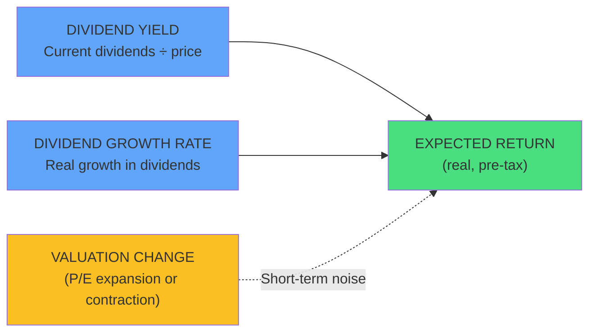
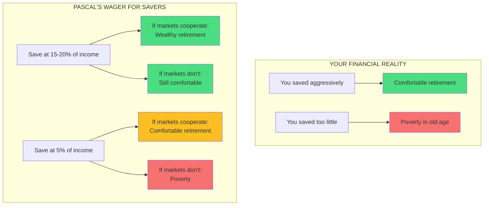
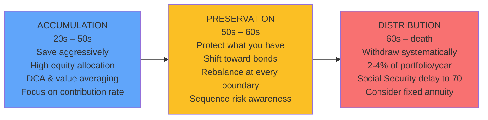

## The Gordon Equation



The Gordon Equation is Bernstein's preferred tool for estimating
future stock returns. Unlike historical averages (which are backward-
looking and unreliable), the Gordon model gives a forward estimate
based on observable data. For bonds, the equivalent is simply the
current yield to maturity.

```
Expected Real Stock Return = Dividend Yield + Real Dividend Growth Rate
Expected Real Bond Return = Current Yield to Maturity
```

In 2010, Gordon Equation estimates suggested ~3.5-4% real returns for
stocks and ~1.5-2% for bonds — far below the 10% nominal historical
average that most investors expected. Bernstein used this gap to argue
that investors needed to save more and expect less.

## Pascal's Wager Applied to Investing



Bernstein borrows Pascal's famous wager (it is rational to believe in
God because the upside of belief vastly outweighs the downside of
non-belief) and applies it to saving. The catastrophic outcome —
dying poor — is so terrible that the only rational choice is to save
aggressively enough to avoid it, even if the probability seems low.

## Asset Allocation Decision Tree


## The Three Stages of Investing



## Detailed Chapter Summaries

### Chapter 1: A Brief History of Financial Time

Bernstein opens with a tour of financial history stretching back
thousands of years: from Mesopotamian grain loans, through the
Venetian bond market (the first sovereign debt market), to the Dutch
East India Company (the first publicly traded stock). The central
lesson: financial markets have always crashed, and they always will.
The risk premium exists because catastrophic losses are a real
possibility — not abstract probability.

The chapter's key episode: the near-death experience of Venice's bond
market during the War of the League of Cambrai (1508-1516). Investors
who held Venetian bonds through the crisis were rewarded with
extraordinary returns. Those who panic-sold locked in permanent losses.
The pattern — panic, recovery, enrichment of the steadfast — repeats
across centuries.

### Chapter 2: The Nature of the Beast

A deep dive into the risk-return relationship. Bernstein introduces
the Gordon Equation as the only sensible way to estimate future
returns and demolishes the idea that past returns tell us anything
useful about the future.

Key sections:

**Of Ravens and Returns.** Ravens lived 40+ years in captivity but
were assumed to live only 17 years by medieval bestiaries. Bernstein
draws the analogy: investors consistently underestimate the range
of possible outcomes.

**History vs Math.** Historical data is unreliable. Different starting
and ending dates produce wildly different "average returns." The
Gordon Equation frees you from this problem.

**Mr. Gordon's Curious Equation.** The Gordon Equation is explained
with examples. Bernstein shows why high dividend yields in 2010
pointed to lower future returns.

**Home Sweet Home?** A sharp analysis of homeownership as an investment.
Bernstein's rule of thumb: if a house costs more than 150 times its
monthly rent, renting is financially superior.

**Adventures in Equity.** Small-cap and value stocks historically
outperform but with higher volatility and longer drawdowns. Bernstein
recommends tilting portfolios toward these factors.

**Jack Bogle Outfoxes the Suits.** The story of Vanguard's founder —
how simplicity and low costs beat complex active management.

### Chapter 3: The Nature of the Portfolio

Bernstein moves from theory to construction. The chapter opens with
four essential preliminaries:

1. Save as much as you can, as early as you can
2. Maintain at least six months of liquid emergency assets
3. Diversify as widely as possible
4. Use passive index funds, never individual stocks or active funds

The asset allocation two-step: (1) decide the overall stock/bond split
(age = bonds, adjusted for risk tolerance), then (2) decide how to
split the equity side among US, international, small-cap, value, and
REITs.

Bernstein warns against chasing past performance and explains why
mean-variance optimization (Markowitz's Nobel-winning framework) is
dangerous for individual investors — it produces portfolios that are
unstable and unintuitive.

### Chapter 4: The Enemy in the Mirror

The behavioral finance chapter, and Bernstein's most personal (he is
a neurologist). He catalogs the psychological biases that destroy
investor returns:

- **Overconfidence.** 74% of Swedish men rate their driving ability
above the median. Investors are worse.
- **Recency bias.** The most recent market data dominates thinking.
- **Loss aversion.** Losses hurt roughly 2-2.5x more than equivalent
gains feel good.
- **Narrative fallacy.** Humans crave stories. Financial markets
produce noise, not stories. We invent patterns where none exist.
- **The illusion of control.** We believe we can pick stocks, time
markets, and select fund managers. The evidence says otherwise.

Bernstein's "bargain-basement psychotherapy": set a plan, automate it,
and stop checking your portfolio. The less you engage, the better you
will perform.

### Chapter 5: Muggers and Worse

Bernstein's most scathing chapter. The financial services industry,
he argues, is designed to extract wealth from investors, not create it.
He provides a detailed breakdown of the total cost of active investing:
expense ratios, trading commissions, bid-ask spreads, market impact
costs, taxes, and the compounding damage of each.

A 2.2% annual drag on large-cap funds and a staggering 9.0% on
emerging-market funds means the deck is stacked against every active
investor from the start.

**The Fund Funhouse.** Mutual funds owned by publicly traded companies
are the worst offenders — under pressure to increase profits, they
raise fees and launch gimmicky products. Vanguard (owned by its
fundholders) is the rare exception.

### Chapter 6: Building Your Portfolio

The practical application chapter. Bernstein walks through:

- **How much to save.** The earlier you start, the less you need per
month. The later you start, the more painful the math gets.
- **Dollar cost averaging** (investing a fixed dollar amount each
period) and **value averaging** (investing enough each period to hit
a target portfolio value). Bernstein calls value averaging "the most
powerful tool I know."
- **Four investor profiles** with specific portfolio allocations:

| Profile | Age | Allocation |
|---|---|---|
| Young accumulator | 30 | 80% stocks / 20% bonds |
| Mid-career | 45 | 60% stocks / 40% bonds |
| Near-retirement | 60 | 40% stocks / 60% bonds |
| Retiree | 70 | 30% stocks / 70% bonds |

- **Rebalancing.** Every few years, not monthly. Over short periods,
stocks trend; over multi-year periods, they mean-revert. Infrequent
rebalancing captures this.
- **Teaching children.** The most important bequest is financial
competence, not cash. Bernstein advises creating bank accounts and
small portfolios for children, rewarding frugality, and modeling
disciplined behavior.

### Chapter 7: The Name of the Game

The capstone — Bernstein's manifesto in bullet points. He distills
everything into a short, repeatable set of principles:

1. Understand the risk-return tradeoff.
2. Know financial history so you can say "I've seen this before."
3. Use the Gordon Equation.
4. Markets are efficient for individual securities — you cannot
out-trade professionals.
5. Your primary decision is the stock/bond split.
6. Diversify because you do not know the future.
7. Ignore your portfolio's winners and losers; focus on the whole.
8. You are your own worst enemy.
9. Tune out financial news.
10. Beware of fees and conflicted advisors.
11. Live modestly and save aggressively.
12. Design your allocation around age and risk tolerance.
13. Consider small-cap and value tilts.
14. If retirement spending exceeds 4%, consider an annuity.
15. Teach your children well.
16. Never forget Pascal's wager — avoid dying poor at all costs.

The book closes with a curated reading list organized by the four
pillars: theory, history, psychology, and business.

## Key Formulas

### Gordon Equation

```
Expected Real Stock Return = Dividend Yield + Real Dividend Growth Rate
```

Example: S&P 500 dividend yield of 2% + real dividend growth of
1.5% = 3.5% expected real return. Substantially below the ~7% real
return of the 20th century.

### Bond Return Estimate

```
Expected Real Bond Return = Yield to Maturity - Expected Inflation
```

### Home Purchase Rule

```
Fair Purchase Price ≤ Monthly Rent × 150
```

### Withdrawal Rate Bands

```
2%:  Secure as possible
3%:  Probably safe
4%:  Taking real risks
5%:  High chance of portfolio depletion
```

### Asset Allocation Rule

```
Bond % ≈ Age - Risk Adjustment
Risk Adjustment: Normal = 0, Low = -10%, Very Low = -20%
```

### Value Averaging Formula

```
Monthly Investment = Target Portfolio Value - Current Portfolio Value
```

If the target is $10,000 and the portfolio is at $8,500, you invest
$1,500 that month. In a down market, this forces you to buy more
shares. In an up market, you buy fewer — or even sell.

## Real-World Application

**The 2008 Crisis as a Case Study.** The book was published just
months after the market bottom. Bernstein's advice: rebalance. If
your 60/40 portfolio had drifted to 40/60 during the crash, you
should have sold bonds and bought stocks — exactly what felt like
the wrong thing to do. Those who did captured the 2009-2010 rally.
Those who panicked missed it.

**The Lost Decade (2000-2009).** The S&P 500 returned approximately
0% nominal over this period. An investor who used age-based bond
allocation and rebalanced annually would have significantly outperformed
a 100% equity holder — with far less volatility.

## Actionable Advice

1. **Calculate your expected returns using the Gordon Equation** before
setting your savings target. Assume lower returns than history suggests.

2. **Set your bond allocation to your age** and rebalance every 2-3
years. If you are 40, start at 40% bonds. Adjust only for extreme
risk tolerance differences.

3. **Build a three-fund portfolio at Vanguard:** US total stock index,
international total stock index, and total bond index. Add small-cap
value and REITs only if your portfolio is large enough.

4. **Use value averaging** for monthly contributions. Set a target
value path and invest whatever is needed to hit it each month.

5. **In retirement, withdraw no more than 4%** of your starting
portfolio, adjusted for inflation. If 4% does not cover expenses,
consider an immediate fixed annuity.

6. **Delay Social Security to age 70.** It is the best inflation-
adjusted annuity available anywhere.

7. **Teach your children to save.** Open a custodial account, match
their savings, and discuss money openly.

8. **Read Bernstein's reading list** (Chapter 7) and work through the
titles by pillar: theory, history, psychology, business.
