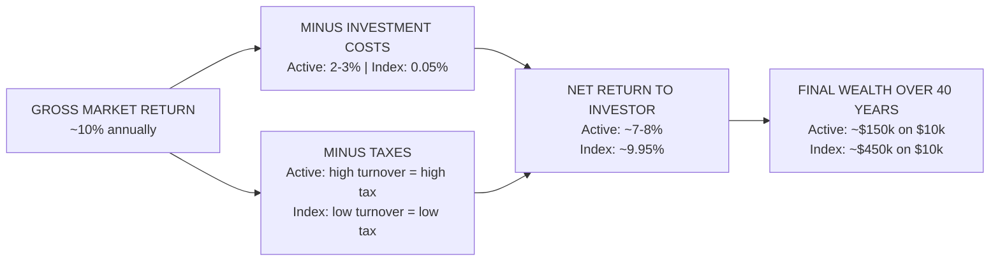
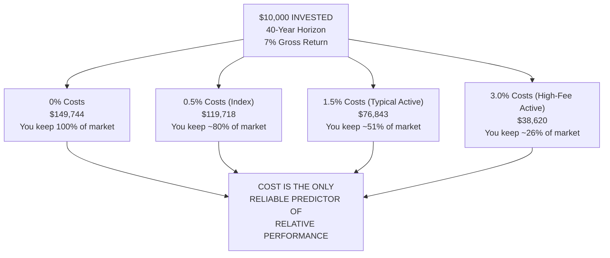
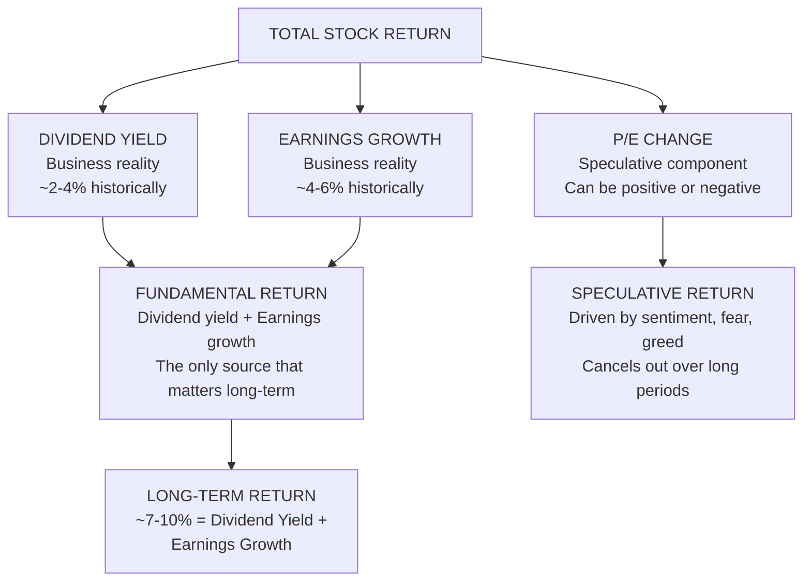
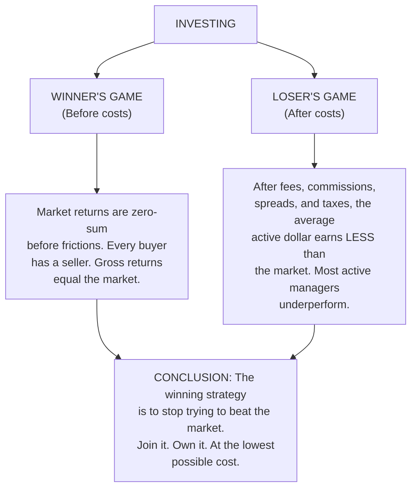
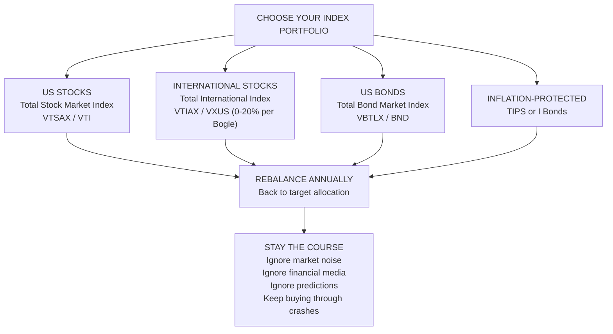

## The Core Equation



The entire book is an expansion of this one diagram. Reduce costs. Reduce
taxes. Keep more of the market's return. Everything else is noise.

## The Cost Matters Hypothesis



Bogle's Cost Matters Hypothesis (CMH) states that the single most reliable
predictor of a fund's relative performance is its expense ratio. Lower costs
predict higher relative returns. This is not "efficient markets" — Bogle
explicitly rejects the strong form of EMH. He simply observes that whatever
alpha a manager might generate is consumed by fees.

## Three Sources of Stock Returns



Bogle's framework for forecasting long-term stock returns is remarkably simple:
expected return = dividend yield + expected earnings growth. Valuation changes
(expanding or contracting P/E ratios) add noise in the short term but cancel
out over decades. This framework gives investors "reasonable expectations"
rather than the fantasy of double-digit annual returns.

## A Winner's Game vs A Loser's Game



## Index Portfolio Decision Tree



Bogle's recommended portfolio is disarmingly simple: one US total stock market
index fund, one total bond market index fund, and optionally a small allocation
to international stocks. He was famously skeptical of international
diversification beyond 20%, arguing that US companies already have global
exposure and currency risk adds unnecessary volatility.

## Detailed Chapter Summaries

### Introduction and Chapter 1: A Parable

Bogle introduces a fable of two investors who both earn the market's 7% gross
return. Investor A uses low-cost index funds (0.05% expenses). Investor B uses
typical actively managed funds (2%+ expenses). Over 50 years, Investor A's
$10,000 grows to ~$294,000. Investor B's grows to ~$67,000. The message: costs
are not a detail — they are the whole story.

### Chapter 2: The Nature of Returns

Bogle debunks the popular belief that the stock market will continue to deliver
the 15%+ returns of the 1980s and 1990s. He shows that those returns were
driven by falling interest rates and rising P/E ratios (speculative factors)
rather than business fundamentals. Reasonable expectations for future equity
returns: 4-7% nominal.

### Chapter 3: How Most Investors Turn a Winner's Game into a Loser's Game

The zero-sum game argument: before costs, the aggregate of all investors must
earn the market return. After costs, the aggregate of all investors must earn
less than the market. The only way to guarantee your fair share is to match the
market at the lowest possible cost.

### Chapter 4: The Grand Illusion

Forecasting is futile. Bogle presents data showing that even professional
economists and strategists consistently fail to predict market direction, GDP
growth, interest rates, or corporate earnings. The prudent investor ignores
forecasts and focuses on the two things that are knowable: current dividend
yield and long-term earnings growth.

### Chapter 5: The Relentless Rules of Humble Arithmetic

The most important chapter. Bogle demonstrates mathematically that the gap
between investment returns (what the market delivers) and speculative returns
(what investors think they will get) is determined by cost. Over time, the
cost gap compounds into a chasm.

### Chapter 6: Focus on the Lowest-Cost Funds

A practical guide to identifying low-cost funds. Bogle recommends funds with
expense ratios below 0.20%. He warns against front-end loads, 12b-1 fees, and
funds with high turnover ratios.

### Chapter 7: Taxes

Index funds' low turnover (2-5% annually vs 50-100% for active funds) means
they defer almost all capital gains taxes. Over a lifetime, this tax
efficiency adds 0.5-1.0% to annual returns compared to a comparable active
fund. Bogle recommends holding index funds in taxable accounts and bonds in
tax-advantaged accounts.

### Chapter 8: When the Good Times No Longer Roll

A sobering chapter about bear markets and the importance of staying the course.
Bogle shows that missing just the 10 best days in the market over a 20-year
period cuts returns by half. Market timing is a loser's game.

### Chapter 9: The Magic of Compounding Returns, the Tyranny of Compounding Costs

The title says it all. Bogle calculates the impact of costs on compounding:
a 2% annual fee on a portfolio earning 7% over 50 years consumes 63% of the
final account value. To put it differently: you do 100% of the saving and take
100% of the risk, but Wall Street takes 63% of the return.

### Chapter 10: Dividends

Dividends are the foundation of long-term returns. Bogle shows that from 1926
to 2016, dividends contributed ~40% of the S&P 500's total return. The
disappearance of dividends in the modern era is a worrying sign that corporate
managers are prioritizing stock buybacks (which boost executive compensation)
over shareholder payouts.

### Chapter 11: Benjamin Graham's Wisdom

Bogle traces his intellectual debt to Benjamin Graham, who argued that the
defensive investor should own a broad cross-section of the market and not
attempt to pick individual stocks or time the market. Graham's advice from
1949 aligns perfectly with Bogle's index-fund message.

### Chapter 12-16: The Professional's Game and ETFs

Bogle critiques hedge funds, private equity, and actively managed institutional
portfolios, showing they all underperform simple index funds after fees. He
also warns against the ETF revolution: while low-cost index ETFs are fine
(VTI, VWO, BND), the proliferation of leveraged, inverse, and sector-specific
ETFs represents speculation dressed up as investing.

### Chapter 17: Asset Allocation

New in the 10th Anniversary Edition. Bogle recommends a simple age-based rule:
your bond allocation should roughly equal your age. A 30-year-old: 70% stocks,
30% bonds. A 65-year-old: 35% stocks, 65% bonds. Rebalance annually.

### Chapter 18: Retirement Investing

Also new in the 10th Anniversary Edition. Bogle recommends target-date
retirement funds as a "one-decision" portfolio for investors who want maximum
simplicity. He warns against retirement withdrawal rates above 4% annually.

### Chapter 19: A Dozen Rules for Sound Investment Strategy

A summary chapter distilling the book's wisdom into 12 actionable rules:

1. Remember that the stock market is a giant distraction
2. You cannot outsmart the market
3. Costs matter
4. Minimize taxes
5. Don't trade
6. Stay diversified
7. Never try to time the market
8. Keep it simple
9. Stay the course
10. Focus on the long term
11. Ignore the noise
12. Have reasonable expectations

### Chapter 20 and Epilogue

Bogle reiterates his central message and presents his "Final Portfolio": 50%
total stock market index fund, 50% total bond market index fund for the
retired investor; 80/20 for the younger investor. He closes with a call to
action: "The winning formula for success in investing is owning the entire
stock market, and doing so at the lowest possible cost."

## Bogle's Return Forecasting Formula

```
Expected Annual Return = Dividend Yield + Earnings Growth
                     +/- Speculative Return (P/E change)
```

Example (2017 estimate):
- S&P 500 dividend yield: 2.0%
- Expected earnings growth: 5.0%
- P/E change (assuming reversion to mean): -1.0% (drag from high starting P/E)
- Fair value return: 2.0% + 5.0% - 1.0% = ~6.0% annualized over next decade

This is far below historical averages and the key reason Bogle warned investors
in 2017 to lower their expectations.

## Real-World Examples

**The Vanguard 500 Index Fund (VFINX).** Launched in 1976 as the "First Index
Investment Trust," it was derided as "Bogle's Folly." Critics called it
un-American. It attracted only $11 million in its first IPO. Today, the
Vanguard 500 Index Fund has over $800 billion in assets. It has outperformed
~90% of all large-cap active funds since inception.

**The Harvard Endowment.** A cautionary tale of active management run amok.
Harvard's endowment, once the envy of the investing world, earned just 2.6%
annually from 2008-2016 while charging massive internal fees and employing
hundreds of professionals. A simple 60/40 index portfolio returned ~7% over the
same period.

**The Buffett-Bogle Bet.** Warren Buffett bet $1 million that a simple S&P 500
index fund would outperform a basket of hedge funds over 10 years (2007-2017).
He won by a landslide: the index fund returned 7.1% annualized vs 2.2% for the
hedge fund basket. Buffett credited Bogle's book for giving him the confidence
to make the bet.

## Actionable Advice

1. **Put 100% of your stock allocation into a single total US stock market
   index fund** (VTSAX, FSKAX, SWTSX). One fund is all you need.

2. **Put 100% of your bond allocation into a single total US bond market index
   fund** (VBTLX, FXNAX, SWAGX). Again, one fund.

3. **Set your bond allocation to roughly your age.** A 35-year-old: 65%
   stocks, 35% bonds. A 55-year-old: 45% stocks, 55% bonds.

4. **Rebalance once a year.** Sell what has gone up, buy what has gone down.
   Do it on your birthday. Never deviate.

5. **Never pay an expense ratio above 0.20%** for any fund you own. If you
   are paying more, you have the wrong fund.

6. **Never trade.** Buy and hold forever. If you are tempted to trade, remind
   yourself that the average active fund underperforms by ~2% annually.

7. **Ignore the financial media.** CNBC, Bloomberg, and market pundits exist
   to sell advertising, not to make you money. Their "expert forecasts" are
   noise.

8. **Turn off dividend reinvestment in taxable accounts** if you need the
   income. Otherwise, reinvest automatically.

9. **Use a target-date retirement fund** if you want absolute simplicity.
   Vanguard's Target Retirement funds charge 0.08% and do everything for you.

10. **Stay the course.** The most successful investors are not the smartest or
    the luckiest. They are the ones who did nothing.
