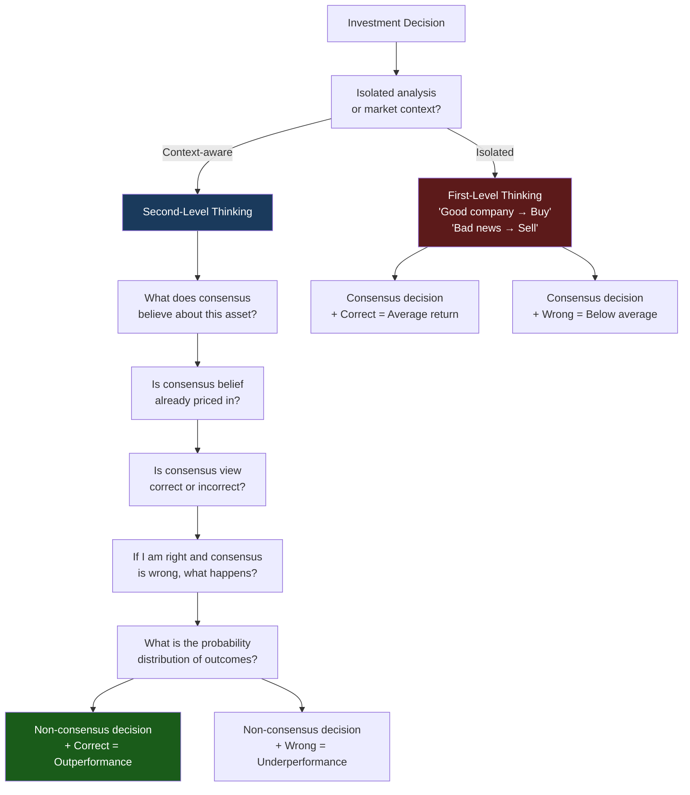
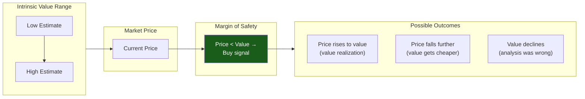
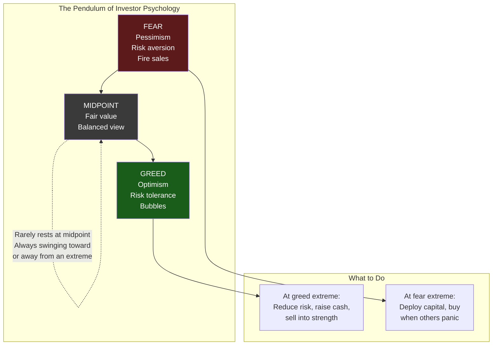
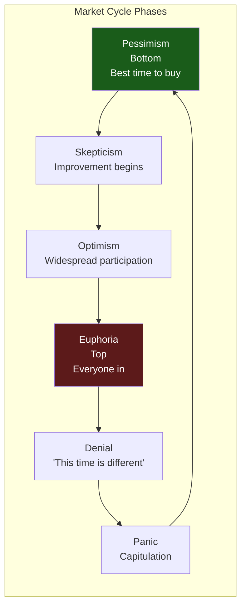

## The Architecture of the Book

Marks organizes 20 chapters around a deliberate rhetorical device:
each claims its topic is "the most important thing." The implicit
argument is that investing cannot be reduced to any single factor.
Success requires holding all 20 in mind simultaneously.

The chapters group into several clusters:

- **Thinking framework:** Second-level thinking, market efficiency
- **Valuation:** Value, price vs. value
- **Risk:** Understanding, recognizing, controlling risk
- **Market dynamics:** Cycles, pendulum, where we stand
- **Psychology:** Combating negative influences, contrarianism
- **Execution:** Finding bargains, patient opportunism
- **Humility:** Knowing what you don't know, luck
- **Portfolio construction:** Investing defensively, avoiding pitfalls,
  adding value
- **Integration:** Pulling it all together

---

## Second-Level Thinking

This is the book's opening concept and its most important building
block. Marks defines it by contrast:

**First-level thinking** is simplistic and superficial:
- "It's a good company; let's buy the stock."
- "The outlook calls for low growth and rising inflation; let's sell."
- "Earnings will fall; sell."

Second-level thinking is deep, complex, and convoluted:
- "It's a good company, but everyone thinks it's a great company, and
  it's not. The stock is overpriced; let's sell."
- "The outlook stinks, but everyone else is selling in panic. Buy!"
- "Earnings will fall less than people expect, and the surprise will
  lift the stock; buy."

The second-level thinker asks:

- What is the range of likely future outcomes?
- Which outcome do I think will occur?
- What is the probability I am right?
- What does the consensus think?
- How does my expectation differ from the consensus?
- How does the current price reflect the consensus view?
- Is the consensus psychology too bullish or too bearish?
- What happens to the price if the consensus is right? If I am right?

---

## Understanding Market Efficiency

Marks studied at the University of Chicago Booth School, where Eugene
Fama developed the efficient market hypothesis (EMH). He takes EMH
seriously but not dogmatically.

**Where EMH is right:** Markets incorporate information quickly. Most
obvious edges are competed away. A first-level thinker believing they
can easily beat the market is deluded.

**Where EMH is wrong:** Markets are not perfectly efficient. Mispricing
can persist — sometimes for years — because of psychological factors,
institutional constraints, and limited arbitrage capital. The key
insight: efficiency is a spectrum. Less-followed, more-complex,
uncomfortable asset classes (distressed debt, small caps, special
situations) are less efficient and offer greater opportunity for those
with genuine skill.

---

## Value and the Price-Value Relationship

Marks is squarely in the Graham-Buffett value tradition:

> "An accurate estimate of intrinsic value is the essential foundation
> for steady, unemotional and potentially profitable investing."

**Intrinsic value** is the cash flows an asset will generate over its
life, discounted to the present. It cannot be calculated with precision
— but that does not excuse failing to estimate it.

**The price-value gap** is where opportunity lives:

- Buy when price is significantly below intrinsic value (margin of
  safety)
- Hold or sell when price approaches or exceeds intrinsic value
- Never buy without knowing what something is worth

Marks warns against the "greater fool theory" — buying an overpriced
asset hoping to sell it to someone even more optimistic. This is not
investing; it is speculation.

---

## The Three Chapters on Risk

Marks dedicates three consecutive chapters to risk — the book's most
important section.

### Understanding Risk

Risk is not volatility. Risk is the probability of permanent capital
loss. This distinction is critical: a volatile asset that recovers was
never truly risky; a stable asset that goes to zero was.

> "Risk means more things can happen than will happen."
> — Elroy Dimson, quoted by Marks

Risk is inherently subjective and unobservable. You cannot measure it
with standard deviation or any backward-looking metric. The absence of
loss does not mean the portfolio was safely constructed — it may mean
the risky bet simply has not gone wrong yet.

### Recognizing Risk

The most counterintuitive insight in the book:

> "Risk is highest when it is perceived to be lowest."

When everyone believes an asset is safe, they bid up its price,
compressing risk premiums. High prices = low forward returns = high
hidden risk. Conversely, when everyone is terrified, prices fall, risk
premiums expand, and the potential for safe, high-return investment
increases.

This is the "perversity of risk": the perception of safety creates
risk; the perception of risk creates safety.

### Controlling Risk

Controlling risk is not the same as avoiding it. Avoiding all risk
guarantees risk-free returns (near-zero in real terms). The goal is to
take risks only when adequately compensated.

Marks advocates **defensive investing**:

- Emphasize survival under negative outcomes, not maximization under
  favorable ones
- Insist on a margin of safety
- Diversify across genuinely independent sources of risk
- Avoid leverage

---

## Cycles and the Pendulum

Marks uses two related metaphors:

**The pendulum** describes investor psychology. It rarely rests at the
midpoint of fair value. It swings toward greed (overvaluation) and
toward fear (undervaluation). The swing itself is predictable; the
extent and timing of the turn are not.

**Cycles** describe the broader market environment. The credit cycle is
particularly important: when lending standards are loose and capital is
abundant, the seeds of the next downturn are sown. When credit is
frozen and no one will lend, the conditions for recovery are created.

> "Bull markets are born on pessimism, grow on skepticism, mature on
> optimism, and die on euphoria."

---

## Combating Negative Influences

Investing is an emotional activity. Marks catalogs the psychological
forces that undermine rational decision-making:

| Influence | Effect |
|-----------|--------|
| Greed | Drives buying at the top; creates the bubble |
| Fear | Drives selling at the bottom; locks in losses |
| Envy | Comparing returns leads to risk-taking at the wrong time |
| Ego | Refusing to admit mistakes; doubling down on losers |
| Capitulation | The urge to conform — buying what is hot, selling what is not |

The antidote is not the absence of these feelings — everyone feels them
— but the discipline to resist them. Marks's advice:

- Develop a strongly held sense of intrinsic value
- Insist on acting when prices diverge from value
- Remember that things that seem too good to be true usually are
- Accept that you may look wrong while the market becomes more extreme
- Surround yourself with like-minded, disciplined colleagues

---

## Contrarianism

Marks is careful to distinguish contrarianism as a process from
contrarianism as an identity:

> "Simply being contrary for its own sake won't work. You have to be
> contrary and right."

The uncomfortable truth: the right contrarian trade feels terrible. If
it felt good, everyone would do it, and it would not work. Buying
during a panic is painful. Selling during euphoria is premature.
Living through the period where the market becomes *more* mispriced
before it corrects is agonizing.

The reward for this discomfort is the only sustainable edge in
competitive markets: non-consensus correctness.

---

## Finding Bargains

Marks describes the characteristics of assets that offer the best
risk-reward:

- Little known and not fully understood
- Fundamentally questionable on the surface
- Controversial, unseemly, or scary
- Deemed inappropriate for "respectable" portfolios
- Unappreciated, unpopular, and unloved
- Trailing a record of poor returns
- Recently the subject of disinvestment, not accumulation

These are the opposite of what most investors look for — and that is
precisely why they work.

---

## Patient Opportunism

> "The biggest investing errors come not from factors that are
> informational or analytical, but from those that are psychological."

Activity is not a virtue. Marks emphasizes the importance of sitting on
your hands when there is nothing compelling to do. Building a watchlist
of attractively valued assets, then waiting for the cycle to bring them
to a compelling price, is the disciplined approach.

Oaktree's philosophy: "We never know where we are going, but we'd
better have a good idea where we are."

---

## Knowing What You Don't Know

Marks divides the investment world into two schools:

| "I Know" School | "I Don't Know" School |
|-----------------|----------------------|
| Believes macro forecasts have value | Swears off macro forecasting |
| Tries to predict GDP, rates, elections | Focuses on micro: companies, securities |
| Tends toward overconfidence and leverage | Emphasizes margin of safety and survival |
| Can look brilliant for a while | Almost never looks brilliant |
| Eventually gets blown up | Stays in the game |

Marks firmly belongs to the "I don't know" school. He acknowledges
that the future is fundamentally uncertain and builds his investment
process around that assumption.

---

## Appreciating the Role of Luck

One of the book's most philosophically important chapters. Marks argues
that investment outcomes are a combination of skill and luck, and it is
impossible to cleanly separate them in any single result.

The implications:

- Do not judge a decision by its outcome; judge the process
- A good process can produce a bad outcome, and vice versa
- Beware of drawing strong conclusions from small samples
- Humility is the logical response to uncertainty
- The goal is to put the odds in your favor, then accept whatever
  happens

---

## Key Lessons

- **Think in probabilities, not certainties.** Every investment is a
  bet on a distribution of outcomes, not a single prediction.
- **Risk is invisible until it materializes.** The absence of loss does
  not mean the portfolio is safe.
- **The best time to buy is when there is no hope.** Most investors
  cannot do this. That is why it works.
- **You cannot do the same things as everyone else and expect different
  results.** This is the fundamental logic of second-level thinking.
- **Defense wins championships.** Avoiding permanent capital loss is
  more important than capturing every basis point of return.
- **Trees do not grow to the sky, and very few things go to zero.**
  Reversion to the mean is the most powerful force in markets.
