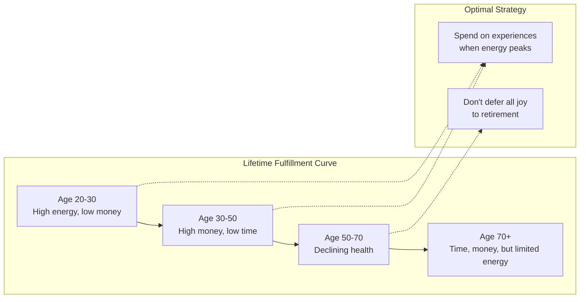
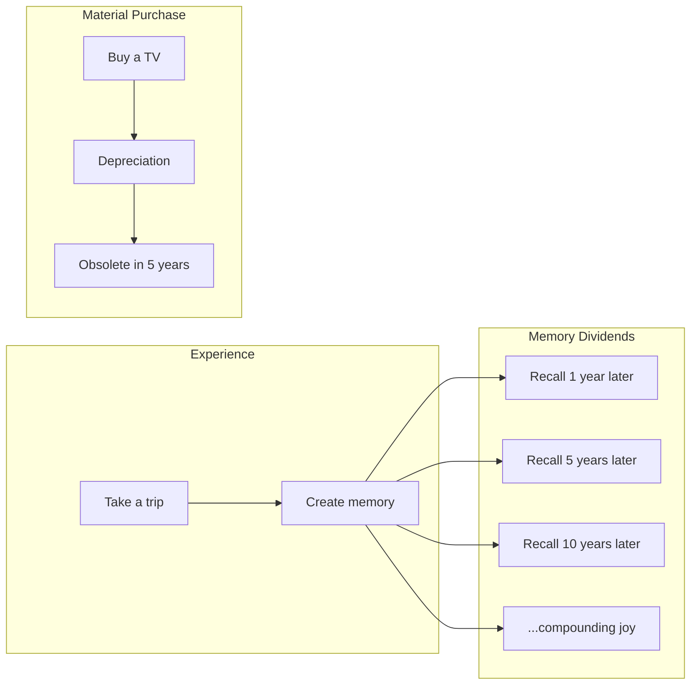

## The Fulfillment Curve

Perkins introduces the fulfillment curve — a visual representation of
life satisfaction over time.

The typical curve is suboptimal: most life satisfaction is
concentrated in youth and old age, with a trough in middle age
when people work hardest. Perkins argues you can raise the curve
by spending money on experiences throughout life.

---

## Time Buckets

Instead of traditional financial planning, Perkins proposes
time-based planning:

| Decade | Recommended Focus |
|--------|------------------|
| 20s | Travel, relationships, skill building |
| 30s | Career acceleration, starting family |
| 40s | Peak earning, family experiences |
| 50s | Financial independence preparation |
| 60s | Active retirement |
| 70s | Slower experiences |
| 80s | Comfort and reflection |

The insight: some experiences lose value as you age. Backpacking
at 65 is different from backpacking at 25. Plan experiences while
you can still enjoy them.

---

## Memory Dividends

Experiences produce memory dividends — recurring joy from
recollection. Material goods depreciate. This is the core argument
for spending on experiences rather than things.

---

## The Optimal Savings Rate

Perkins does not advocate zero savings. He advocates
calibrated savings:

- Save enough to fund retirement and basic security
- Do not oversave at the expense of current experiences
- Calculate your "enough" number and stop accumulating past it
- Give money to family and causes while you are alive

---

## Risk and Regret

The book distinguishes two types of risk:

| Risk | Description |
|---|---|
| Running out of money | The traditional fear |
| Running out of life | Missed experiences you cannot reclaim |

Most people overweigh the first risk and underweigh the second.
The optimal balance is not maximum savings but maximum fulfillment.

---

## Key Lessons

- **Experiences are investments, not expenses.** They pay dividends
  in joy and memories.
- **Money has diminishing returns.** Past a certain point, more
  savings does not mean more happiness.
- **Health is wealth.** You cannot buy back lost health. Enjoy
  experiences while you are able.
- **Give while you live.** Seeing the impact of your gifts is more
  satisfying than leaving an inheritance.
- **Plan in time buckets, not just dollars.** Match spending to
  the life stage where it will bring most joy.

---

## Action Plan

1. **Calculate your "enough" number.** How much do you actually need
   to retire? Stop accumulating past that point.

2. **Create a time bucket plan.** What experiences do you want in
   each decade of your life?

3. **Invest in a major experience this year.** Something that will
   produce memory dividends for decades.

4. **Make a significant "alive gift."** Give money to family or a
   cause now, not in your will.

5. **Re-evaluate your savings rate.** Are you deferring too much
   life to a future that may never come?
