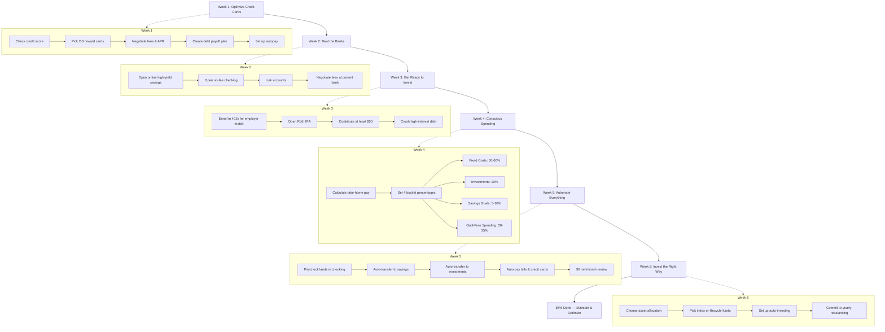
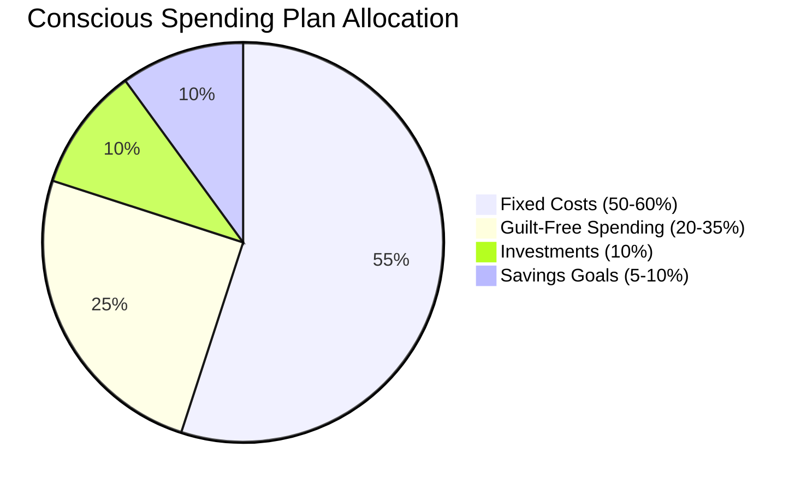
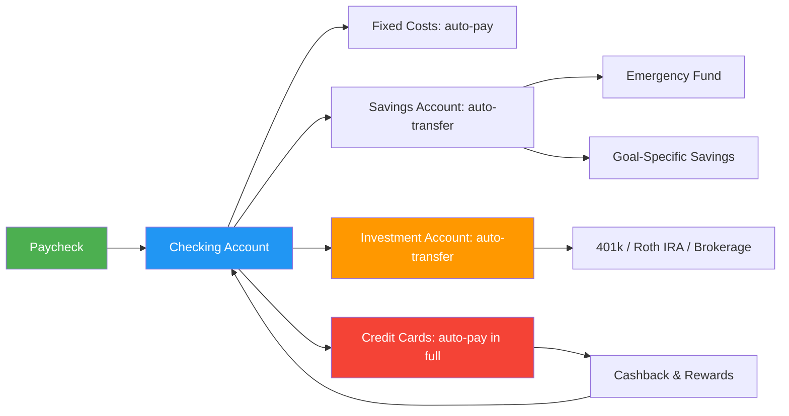
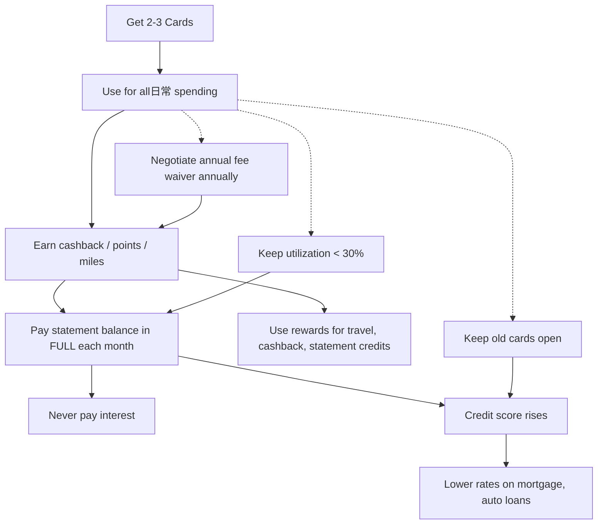
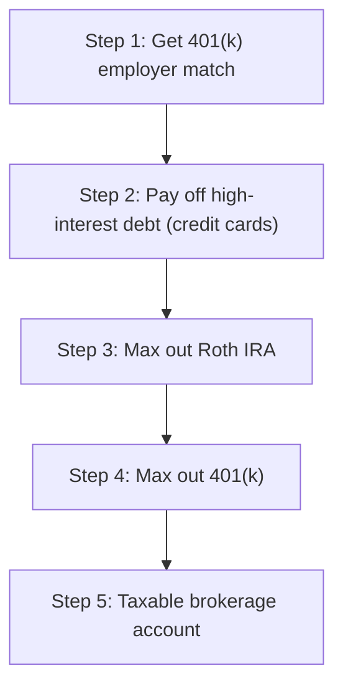
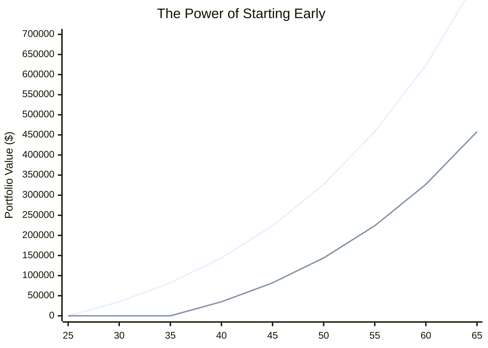

## Deep Dive: The 6-Week Program and Core Concepts

### The 6-Week Program Flowchart

### The Conscious Spending Plan (4 Buckets)

**Bucket 1: Fixed Costs (50-60%)** — Rent/mortgage, utilities, groceries, insurance, transportation, minimum debt payments. These are non-negotiable survival costs.

**Bucket 2: Investments (10%)** — 401(k), Roth IRA, taxable brokerage. Sethi says this is the single most powerful bucket because it compounds over decades.

**Bucket 3: Savings Goals (5-10%)** — Short-to-medium term goals: vacations, wedding, emergency fund, home down payment, gifts.

**Bucket 4: Guilt-Free Spending (20-35%)** — Dining out, entertainment, shopping, hobbies, travel — spend this money *without guilt* because you have already funded your future.

### The Automation System

Sethi's automation system treats your checking account as a hub. When your paycheck arrives, automatic transfers fan money out to every destination before you have a chance to spend it. The key insight: **if you never see the money, you never miss it.**

### Credit Card Strategy

Sethi calls credit cards "free short-term loans with perks." The six commandments:
1. Pay on time, every time
2. Pay the statement balance in full
3. Keep credit utilization below 30%
4. Keep old cards open (lengthens credit history)
5. Use cards for purchases you would make anyway
6. Never carry a balance for discretionary spending

### The 85% Rule — Action Over Perfection

Sethi argues that most people fail at personal finance not because they lack knowledge, but because they get paralyzed chasing the perfect credit card, the perfect investment, or the perfect budget. His antidote: the 85% Solution.

> "I would much rather get it 85 percent correct than do nothing at all."

This applies across the board:
- Open a savings account with a mediocre interest rate *today* rather than searching for the perfect rate for months
- Start contributing to your 401(k) at a low percentage rather than waiting until you can "max it out"
- Pick a simple target-date fund rather than agonizing over the perfect portfolio

### Ladder of Personal Finance

### Investment Growth Visualization

**Scenario**: $5,000 invested per year at 8% average return. The top line starts at age 25 and stops contributing at age 35 (total invested: $55,000). The bottom line starts at age 35 and contributes until 65 (total invested: $150,000). Despite investing nearly 3x less, the early starter ends with ~$835,000 vs ~$458,000. **Time in the market beats timing the market.**

### Week-by-Week Breakdown

#### Week 1: Optimize Your Credit Cards

Sethi opens the program with credit because it is the pipeline through which most money flows. Key actions:
- Pull your credit report from annualcreditreport.com
- Apply for 2-3 cards optimized for your spending patterns (travel vs cashback vs points)
- Call each card issuer to negotiate a lower APR, higher credit limit, and waived annual fee using Sethi's scripts
- If in debt: list all cards, pay minimum on all, then avalanche (highest interest first) or snowball (smallest balance first) the rest
- Set up automatic payments to avoid ever missing a due date

**Negotiation Script Example**:
> "Hi, I've been a customer for X years and I've never missed a payment. I noticed I'm being charged an annual fee of $Y. I'd like to have that fee waived. If not, I'll need to consider closing the account."

#### Week 2: Beat the Banks

Banks make money on fees and low-interest deposits. Sethi's strategy:
- Open a checking account at an online bank (no monthly fees, ATM fee reimbursement)
- Open a high-yield savings account (HYSA) at a different online bank to reduce impulse transfers
- Keep your existing bank account only if they match the fee-free terms after negotiation
- Never pay for checks, overdraft protection, or monthly maintenance

#### Week 3: Get Ready to Invest

The ladder of personal finance governs all investment decisions:
1. **Get the 401(k) match** — This is an immediate 50-100% return on your money. Always contribute at least enough to get the full match.
2. **Pay off high-interest debt** — Credit card debt at 15-25% interest destroys any investment return. Kill it first.
3. **Max a Roth IRA** — Tax-free growth and withdrawals in retirement. Contribute up to the annual limit.
4. **Max your 401(k)** — Up to the annual IRS limit. Reduces taxable income now, grows tax-deferred.
5. **Taxable brokerage account** — For anything beyond retirement limits.

Sethi recommends Vanguard, Fidelity, or Schwab for brokerage accounts.

#### Week 4: Conscious Spending

Sethi famously hates the word "budget." His alternative is a conscious spending plan built on your values rather than deprivation.

The process:
1. Calculate your monthly after-tax income
2. Categorize your spending for the last 3 months
3. Assign target percentages to the four buckets based on your values
4. If your actual spending exceeds targets, cut from buckets that do not align with your Rich Life

**Example**: If you spend $500/month on dining out but it brings you genuine joy, keep it. If you spend $200/month on cable TV you barely watch, cancel it. The goal is alignment, not austerity.

#### Week 5: Save While Sleeping (Automation)

The crown jewel of Sethi's system. Steps:
1. Schedule all bill payments to auto-pay from checking on or just after payday
2. Set up recurring transfers from checking to savings on payday
3. Set up recurring transfers from checking to investment accounts on payday
4. Configure credit cards to auto-pay the statement balance in full from checking
5. Spend 90 minutes per month reviewing: did everything go through? Are balances where expected?

**For irregular income** (freelancers, consultants): calculate your average monthly income, set automation based on the *minimum* paycheck, and manually transfer extra when you have a good month.

#### Week 6: Invest the Right Way

Sethi dismantles the myth of financial expertise:
- Over 75% of actively managed mutual funds underperform their benchmark index over 5+ years
- Stock pickers, day traders, and market timers almost all lose to a simple S&P 500 index fund
- Financial advisors charge 1% AUM fees that compound into hundreds of thousands of dollars lost over a lifetime

His prescription:
- **Index funds** — Buy VTSAX (total US stock market) or VOO (S&P 500). Low fees (~0.03%), instant diversification.
- **Target-date / lifecycle funds** — Set it and forget it. The fund automatically shifts from aggressive to conservative as you approach retirement.
- **David Swensen model** — For DIY investors: 30% US stocks, 15% international developed stocks, 10% emerging markets, 15% real estate (REITs), 15% US Treasury bonds, 15% TIPS. Sethi acknowledges this is optional; a simple two-fund portfolio works too.

### Invisible Money Scripts

The 2nd edition adds significant new material on the psychology of money. Sethi argues that everyone has "invisible scripts" — unconscious beliefs about money inherited from family and culture. Examples:
- "Money is the root of all evil"
- "Rich people are greedy"
- "I will never be good with money"
- "You have to work hard for every dollar"

Until you surface and challenge these scripts, no amount of budgeting or investing advice will stick. Sethi provides journaling prompts and reflection exercises to help readers identify their own scripts.

### The Rich Life Philosophy

The book's ultimate message is that money is a means, not an end. Sethi defines a Rich Life as one where:
- You spend money intentionally on things that align with your values
- You have automated your finances so money stress is minimized
- You give generously to causes and people you care about
- You have the freedom to say no to work, obligations, or situations that do not serve you
- You invest in experiences and relationships, not just material goods

> "A Rich Life means spending extravagantly on the things you love, as long as you cut costs mercilessly on the things you don't."
