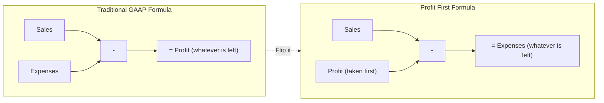
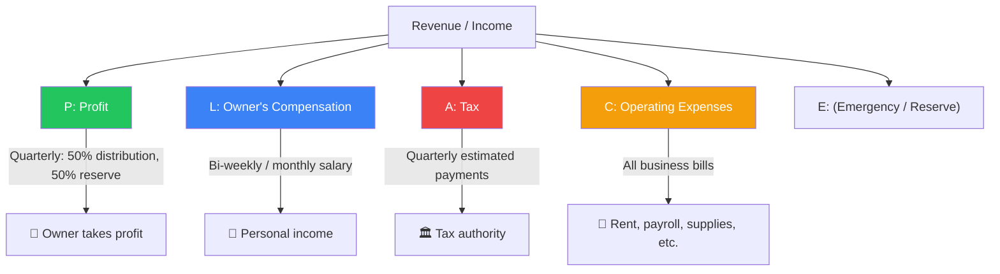
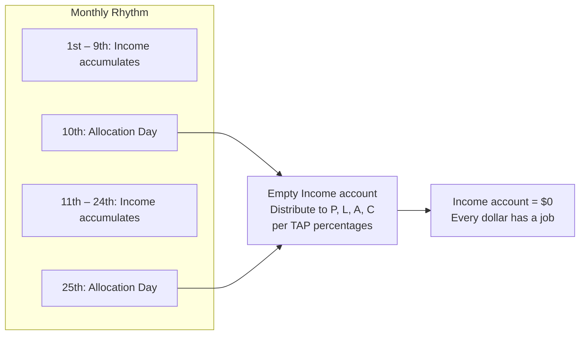
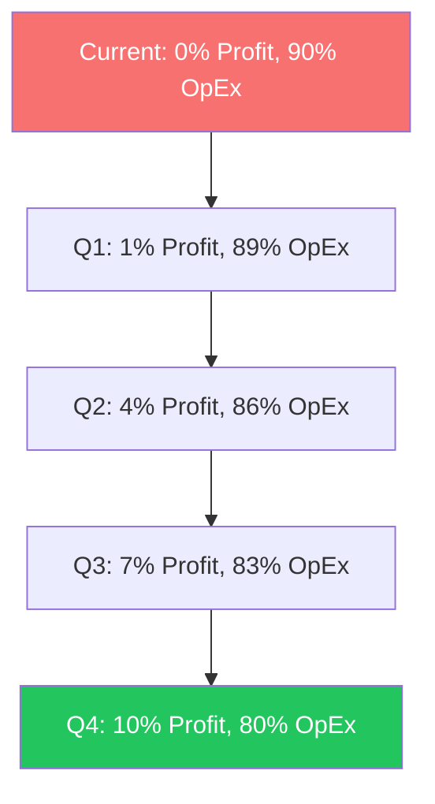

## The Profit First Inversion

The entire system rests on a single formula change:

Mathematically, the two formulas are identical. Behaviorally, they are
worlds apart. The GAAP formula makes profit a passive residual — the
dribble-down after everyone else has been paid. The Profit First formula
makes profit an active priority — the first dollar out of every sale.

---

## The Behavioral Problem Profit First Solves

### Parkinson's Law of Spending

> Work expands to fill the time available for its completion.
> — C. Northcote Parkinson

Michalowicz applies Parkinson's Law to business finance: **Expenses
expand to consume the available cash.** If you have $50,000 in your
checking account, you will find ways to spend $50,000. If you have
$10,000, you will find ways to spend $10,000. The only reliable way
to control spending is to reduce the amount of cash visible in the
spending account.

### Bank Balance Accounting

Most entrepreneurs do not read income statements or balance sheets. They
check their bank balance. This is widely criticized by accountants, but
Michalowicz turns it into a feature: instead of fighting this habit, the
system uses it. By physically moving money out of the operating account
before it can be spent, the lower balance automatically constrains
spending — no willpower required.

### The Primacy Effect

People remember and prioritize the first item in a sequence. By making
profit the first allocation — the first transfer out of the Income
account — the brain registers profit as the most important thing. This
is the psychological mechanism behind "pay yourself first."

---

## The PLACE Allocation System

The five-account structure forms the acronym **PLACE**:

| Account | Bank | Purpose |
|---|---|---|
| **P**rofit (Savings) | Bank 2 (different bank) | Cannot be touched except quarterly distribution |
| **L**abor / Owner's Compensation (Checking) | Bank 1 | Owner's salary — paid on a regular schedule |
| **A**ccount for Tax (Savings) | Bank 2 | Ring-fenced tax money — out of sight |
| **C**ost of Operations / OpEx (Checking) | Bank 1 | All day-to-day business expenses |
| **E**mergency / Reserve | Built into profit account | 50% of profit stays as reserve |

The critical design choice: **Profit and Tax accounts live at a different
bank.** This adds one extra login step and one extra transfer delay. That
tiny friction is intentional — it prevents impulse transfers back to OpEx.

---

## Target Allocation Percentages (TAPs)

Michalowicz provides benchmark TAPs based on **Adjusted Revenue**
(gross revenue minus cost of goods sold):

| Revenue Bracket | Profit | Owner's Pay | Tax | OpEx |
|---|---|---|---|---|
| $0 – $250K | 5% | 50% | 15% | 30% |
| $250K – $500K | 10% | 35% | 15% | 40% |
| $500K – $1M | 15% | 20% | 15% | 50% |
| $1M – $5M | 10% | 10% | 15% | 65% |
| $5M – $10M | 15% | 5% | 15% | 65% |
| $10M – $50M | 20% | 0% | 15% | 65% |

These are starting points, not Gospel. The book provides a method for
calculating your own TAPs based on comparable public companies in your
industry.

---

## The Allocation Rhythm

### Twice-Monthly Allocation

On the 10th and 25th of each month:
1. Log into Bank 1 (Income account)
2. Multiply the balance by each TAP percentage
3. Transfer Profit → Bank 2 Profit savings
4. Transfer Owner's Pay → Owner's Comp checking
5. Transfer Tax → Bank 2 Tax savings
6. Leave the remainder in OpEx checking

### Quarterly Profit Distribution

Every quarter:
1. Log into Bank 2 Profit savings
2. Transfer **50%** to your personal account — this is real, spendable profit
3. Leave **50%** as a reserve buffer

The 50/50 split builds a safety net while making profit tangible. A
$5,000 quarterly distribution to yourself is a psychological reward
that the system delivers reliably.

---

## Assessment Phase: Finding Your CAPs

Before setting TAPs, determine your **Current Allocation Percentages (CAPs)**
from the last 12 months:

1. **Profit**: Net profit not reinvested ÷ Adjusted Revenue
2. **Owner's Pay**: Your total compensation ÷ Adjusted Revenue
3. **Tax**: Total business tax payments ÷ Adjusted Revenue
4. **OpEx**: All other expenses ÷ Adjusted Revenue

Compare CAPs to TAPs. The gap between them defines your migration path.

---

## The 3% Migration Rule

Never adjust allocations by more than 3% in a single quarter. If your
current profit allocation is 0% and your target is 5%, the first quarter
moves to 1% profit (or even 0.5%). Each quarter, shift another 3% until
you reach the target.

This gradual approach prevents the system from triggering a cash crisis.
If your OpEx account suddenly drops from 90% to 30% of revenue, you
cannot pay rent. The 3% rule keeps the business running while it heals.

---

## Cutting Expenses Strategically

When the OpEx allocation is insufficient, Michalowicz provides a
systematic approach to cost reduction:

1. **List every expense** from the last 12 months
2. For each, ask: *"Does this expense help us make customers happy or
   keep the business running?"*
3. If **No** → cut it immediately
4. If **Yes** → can we do it cheaper?

He recommends against cutting expenses that directly generate revenue
(sales commissions, customer acquisition) and instead targets
"zombie expenses" — subscriptions, unused software, redundant services,
lunch deliveries, vanity office space.

---

## Focusing on What's Profitable

Once the system is running, Michalowicz shifts from expense-cutting to
profit optimization:

### Profitable Services

Audit every service or product line. Rank by profit margin per hour
of effort. Double down on the top 20%. Drop or outsource the bottom
80% that consumes time without producing profit.

### Profitable Clients

Segment clients by:
- Revenue generated
- Difficulty of service
- Consistency of purchasing

Fire clients who are low-revenue, high-difficulty, or inconsistent.
Replace them with clients who buy your most profitable services without
friction.

---

## Common Implementation Mistakes

| Mistake | Why It Fails | Fix |
|---|---|---|
| Keeping all accounts at one bank | Too easy to transfer from Profit back to OpEx | Use two separate banks |
| Skipping the CAPs assessment | Guessing percentages rather than measuring | Run the Instant Assessment before setting TAPs |
| Migrating too fast | Business cannot operate on the reduced OpEx | Follow the 3% rule — no more per quarter |
| Not taking quarterly distributions | Profit becomes an abstract number rather than a reward | Take 50% every quarter — celebrate it |
| Including COGS in OpEx | Distorts the expense allocation | Use Adjusted Revenue (Revenue - COGS) |
| Ignoring taxes | Tax allocation gets spent on operations, creating a crisis at filing time | Ring-fence tax in a separate bank entirely |
| Allocating monthly instead of bi-weekly | Two weeks is enough to build behavioral momentum | The 10th and 25th create reliable rhythm |

---

## Practical Implementation Checklist

### Week 1
- [ ] Open 3 accounts at Bank 1: Income, Owner's Pay, OpEx
- [ ] Open 2 accounts at Bank 2: Profit Savings, Tax Savings
- [ ] Run the Instant Assessment to find CAPs
- [ ] Set initial TAPs (start conservatively)

### Week 2
- [ ] Set up automatic transfers on the 10th and 25th
- [ ] Redirect all revenue to the Income account
- [ ] Switch all bill payments to the OpEx account

### Ongoing
- [ ] 10th and 25th: Allocate from Income to PLACE accounts
- [ ] Daily: Check bank balances (30 seconds)
- [ ] Quarterly: Take 50% profit distribution
- [ ] Quarterly: Review TAPs, adjust by max 3%
- [ ] Annually: Full CAPs reassessment
