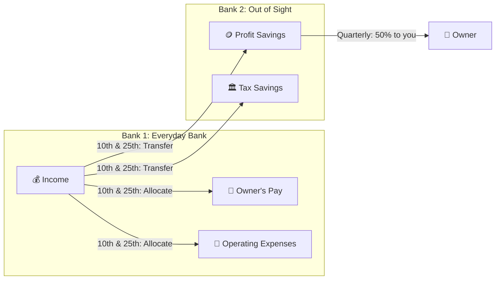
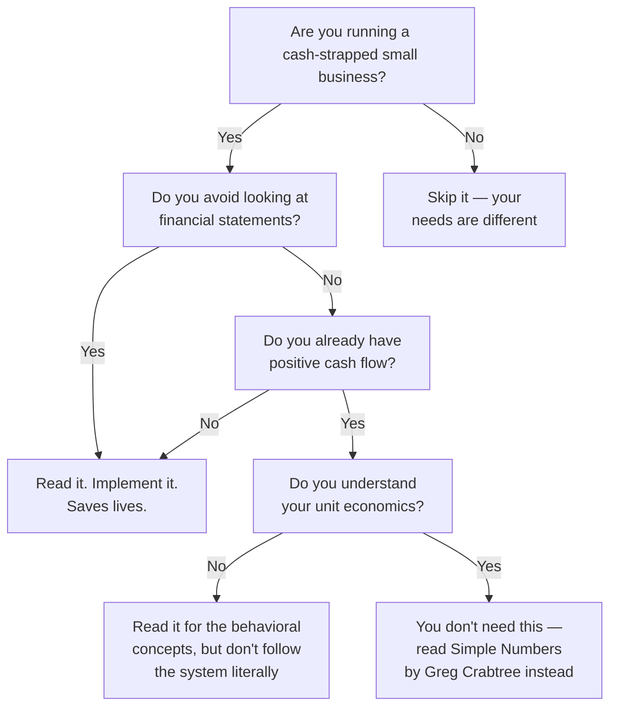

## Introduction

Welcome to BookAtlas. Today: *Profit First: Transform Your Business from
a Cash-Eating Monster to a Money-Making Machine* by Mike Michalowicz.
Published 2014, revised 2017. Portfolio (Penguin Random House). 256 pages.
Over 600,000 businesses have implemented this system. Translated into 13
languages.

This book has a cult following among bootstrapped entrepreneurs. It also
draws sharp criticism from accountants and financial professionals. We're
going to settle that with two voices. On one side, a founder who used
Profit First to rescue a failing agency. On the other, a CFO who thinks
it teaches bad financial habits.

Let's get into it.

---

## The Problem: Cash-Eating Monsters

The book opens with a confession. Mike Michalowicz had built and sold two
multi-million-dollar companies. He was a Wall Street Journal columnist, an
MSNBC business makeover specialist. And he was broke. He had built
"cash-eating monsters" — businesses that consumed every dollar they made
and demanded more.

**Founder:** This is exactly my story. I had an agency doing $800K in
revenue. I was paying myself $35K. I couldn't take a vacation. I couldn't
sleep. The business was eating everything. Profit First fixed it in one
quarter.

**CFO:** That's a powerful story. But let me ask you this: did Profit First
teach you *why* your business was unprofitable? Or did it just force you
to keep less cash in the checking account?

**Founder:** It taught me that I had a spending problem, not a revenue
problem. I thought the answer was more clients. The answer was spending
less on stupid stuff — subscriptions I never used, software we didn't
need, lunches for the team that were really just social events.

**CFO:** Fair. But a business running on hope and adrenaline should fix its
pricing model, not just cap its spending. Profit First treats the symptom,
not the cause.

---

## The Inversion: Sales - Profit = Expenses

The core idea is a single formula change. Traditional accounting says
Sales - Expenses = Profit. Profit First says Sales - Profit = Expenses.

**CFO:** Mathematically, those two formulas are identical. It's a
commutative property of subtraction. The only thing that changes is
psychology.

**Founder:** That's *exactly* the point. The psychology is everything.
When profit is whatever dribbles down after expenses, it's always zero.
When you take it off the top, it exists. I don't care if it's "just
psychology" — it changed my business.

**CFO:** But here's my concern: you're treating the psychology as if it
replaces structural understanding. You made profit happen by shrinking
your available spending. That's not the same as building a business with
healthy margins, good pricing, and sustainable unit economics.

**Founder:** No, but it keeps the lights on while you figure out the rest.
What's the alternative? Keep losing money while you learn about gross
margin?

---

## The Five Accounts: PLACE

Michalowicz proposes a five-account banking system. The Income account
receives all revenue. On the 10th and 25th of each month, you distribute
to four other accounts:

- **P**rofit (at a completely different bank — out of sight)
- **L**abor / Owner's Compensation
- **A**ccount for Tax (at the different bank)
- **C**ost of Operations / OpEx (gets whatever is left)

**Founder:** The separate bank thing is genius. I kept my profit account
at a credit union that didn't have a mobile app. To transfer money out,
I had to physically go there. That friction stopped me from raiding it.
I saved $40K in the first year.

**CFO:** And that worked for you. But do you see the problem?
The system is designed around distrusting yourself. You are not learning
financial discipline. You are outsourcing it to bank account friction.
What happens when you need to make a real financial decision — a hire,
an acquisition, a pivot? The system hasn't built your decision-making
muscle.

**Founder:** Maybe not. But it built my savings. I had six months of
reserves for the first time ever. I could afford to *make* decisions
instead of reacting to overdrafts.

---

## Target Allocation Percentages (TAPs)

Michalowicz provides benchmarks by revenue bracket. A business under $250K
should target 5% profit, 50% owner pay, 15% tax, and 30% operating
expenses. As revenue grows, the percentages shift — profit climbs, owner
pay drops, OpEx expands.

**CFO:** Thirty percent for operating expenses at $200K revenue? That's
$60K. How does a business cover rent, payroll, software, and everything
else on $5K a month? These percentages assume very specific business
models — mostly service businesses with low overhead.

**Founder:** They're starting points. The book says to adjust for your
industry. And the 3% migration rule means you ramp into it gradually.
If your OpEx is currently 90% of revenue, you don't go to 30% next
week. You move 3% per quarter.

**CFO:** And I've seen that fail too. Businesses follow the TAPs blindly
because "Mike said so." They cut their OpEx to 30% and then can't pay
their employees. Then they feel like failures — or blame the system —
when really they should have adapted the percentages to their reality.

**Founder:** That's a user error, not a book error. The Instant Assessment
is the first step for a reason.

---

## What Profit First Gets Right

**Founder:** Let me say what this book does better than any other finance
book I've read. It makes profit *real*. Before Profit First, "profit"
was a number on a QuickBooks report I didn't trust. After, it was
a bank account with $8,000 in it that I could touch. And every quarter,
I took half of that. That check was real. That changed my relationship
with money.

**CFO:** I'll concede that. The book's greatest contribution is making
profit tangible — turning an accounting abstraction into a behavioral
feedback loop. That is genuinely valuable for entrepreneurs who have
never felt financially secure.

**Founder:** It also forced me to cut expenses systematically. I had a
$400/month "CRM consultant" on retainer. I had no idea what he did.
When the OpEx allocation ran short, I looked at every line item and
asked "is this necessary?" Most of the time, the answer was no.
I cut $2,400 a month in the first 90 days.

**CFO:** Okay, that's a real win. But I would argue that a budget review
would have achieved the same result. You didn't need the complex banking
system to ask "do I need this expense?"

**Founder:** But I never looked at my budget. I didn't have one. Profit
First made me look. Sometimes the system *is* the push you need.

---

## What Profit First Gets Wrong

**CFO:** My turn. Here's my biggest problem: Profit First does not teach
you to read financial statements. It actively discourages it. If you
follow the system, you are managing your business by bank balance and
percentages. That works at $200K. It fails at $2 million.

At scale, you need to understand:
- Gross margin trends
- Revenue per employee
- Customer acquisition cost vs. lifetime value
- Cash conversion cycles
- Accrual-based profitability

Profit First does not give you any of this. And because it makes you
feel financially "in control," you may never seek it.

**Founder:** Fair point. But how many entrepreneurs at $200K are looking
at gross margin trends? They're struggling to make payroll. Profit First
gets them to a place where they *can* think about that stuff.

**CFO:** The data says most of them don't. They stay on Profit First
forever. They become professional profit-takers without ever learning
to build a genuinely scalable financial model.

**Founder:** I'll take a profitable $2M business running on Profit First
over a broke $2M business with "real" financial statements. Wouldn't
you?

**CFO:** I'd take a profitable $2M business that understands its unit
economics, knows its margin structure, and can forecast cash needs
six months out. Profit First won't get you there.

---

## The Maintenance Problem

**CFO:** Here's another issue. I've seen dozens of clients who started
Profit First with enthusiasm. They opened seven accounts. They set up
the TAPs. And six months later, they had abandoned the system — leaving
a trail of unused accounts, overdraft fees from missed transfers, and
the feeling that they "failed at finance."

The system requires ongoing discipline. Twice-monthly allocations.
Quarterly reviews. Percentage adjustments. For an entrepreneur who
is already overwhelmed, this is another layer of administration.

**Founder:** I almost quit too. The first few months were brutal.
My income was inconsistent, so the allocations were tiny. But I stuck
with it. After a year, the rhythm was automatic. I couldn't imagine
going back.

**CFO:** And you're in the minority. The Wanderwell Consulting estimate
is that 95% of entrepreneurs do not maintain the system. That's not
a user failure. That's a system design failure. A good system works
when the user is inconsistent. Profit First demands consistency.

**Founder:** Or maybe 95% of entrepreneurs start too big. They try to
jump to their ideal TAPs overnight. The book says to start with 1%
profit. People ignore that. They go straight to 10% and break their
business.

---

## The Verdict: Is It Worth Reading?

**Founder:** If you are a founder who is scared of your bank balance,
who is paying yourself last or not at all, who builds revenue but never
profit — read this book. It will shock your system into health. It
saved my business. It will save yours.

**CFO:** With an important caveat: Profit First is trauma surgery, not
wellness. Use it to stop the bleeding. Then learn real financial
management. Read *Simple Numbers, Straight Talk, Big Profits* by Greg
Crabtree. Read *Financial Intelligence* by Berman and Knight. Work with
a good bookkeeper and a fractional CFO. Don't let Profit First become
your ceiling.

**Founder:** I agree with that. I used Profit First for two years. Then
I hired a CFO. She showed me my labor multiplier was broken. I raised
prices by 30%. I stopped needing the system because my margins were
healthy. But I needed the system to get healthy enough to hear that
advice.

**CFO:** That is the best case for the book I could possibly imagine.
Learn the system. Use it. Then grow beyond it.

---

## Final Thoughts

Profit First is a book for a specific moment in a founder's journey: the
moment of financial crisis. For that moment, it is probably the best
book ever written. It is simple, actionable, and psychologically
shrewd. It turns the abstract concept of "profit" into a concrete
bank balance.

But it is not a complete financial education. It is not a strategy
for scale. It is not a substitute for understanding your margins,
your unit economics, or your cash conversion cycle. It is a crutch,
and crutches are excellent tools for healing — terrible tools for
running a marathon.

Read it. Use it. Outgrow it.

This has been a BookAtlas narration of Profit First by Mike Michalowicz.
Thanks for listening.
