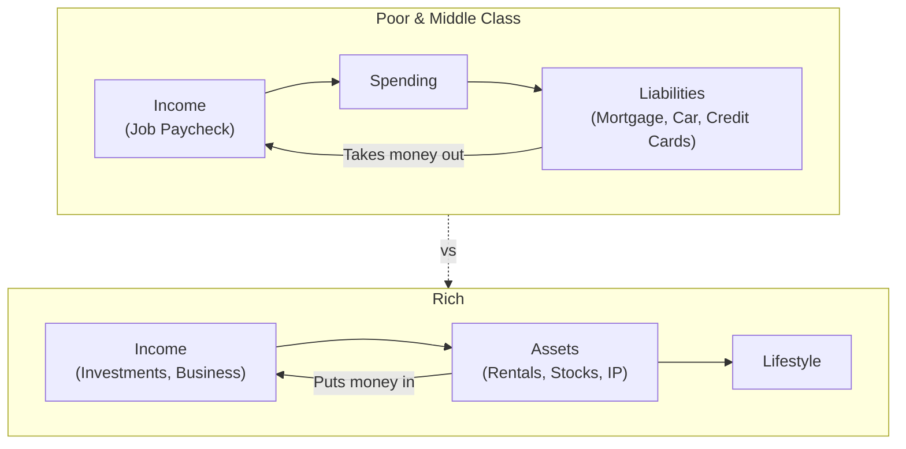
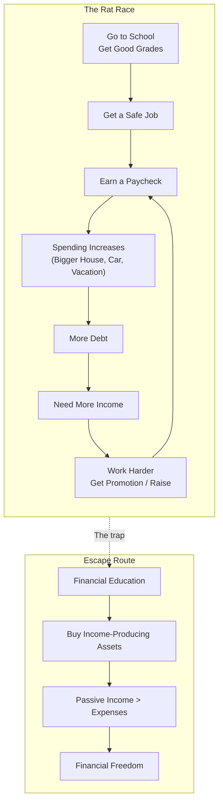
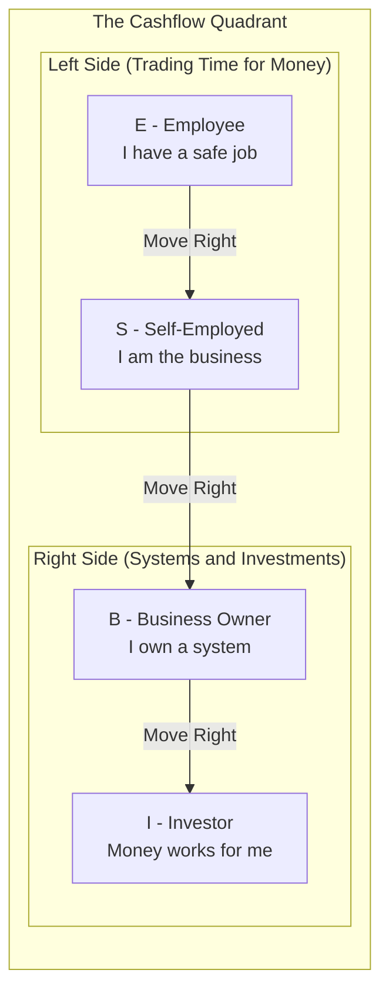
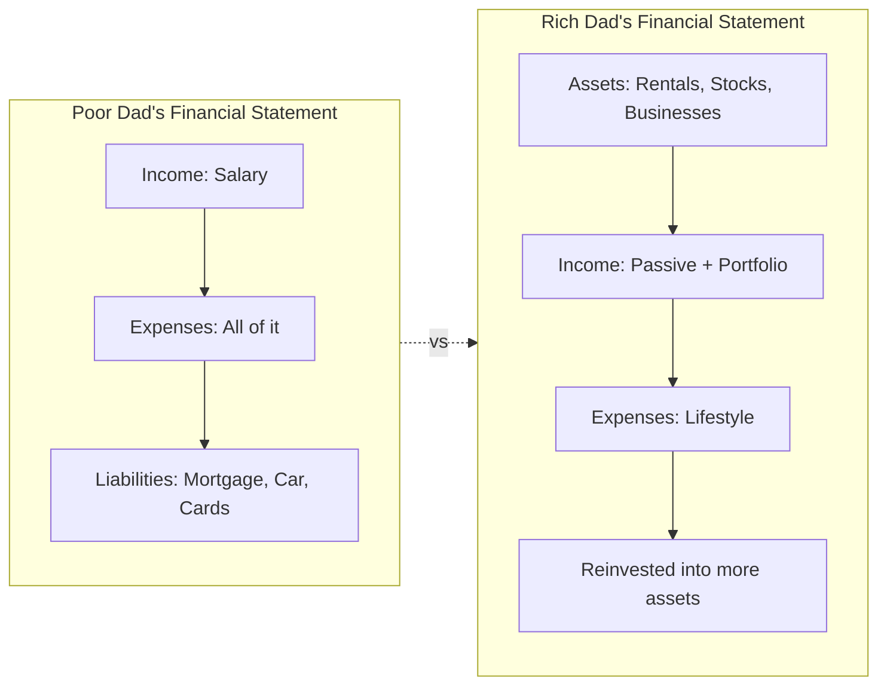
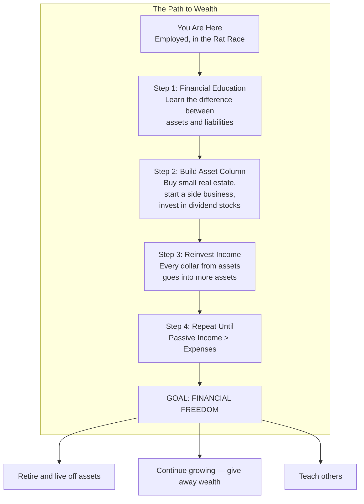
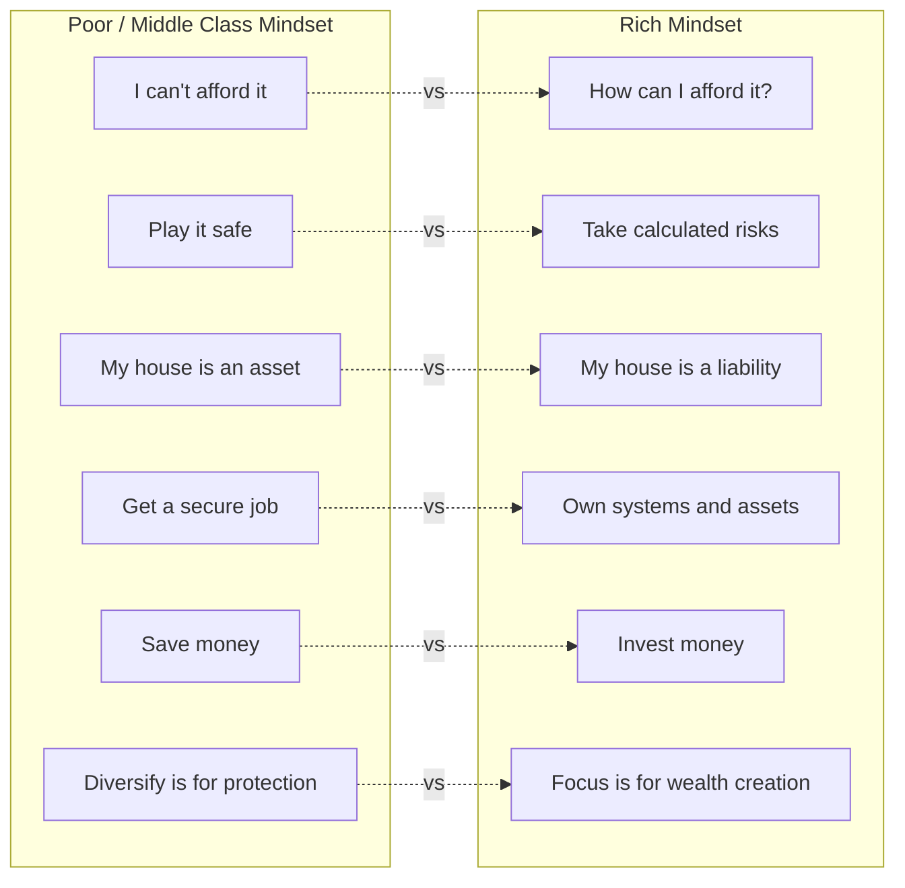
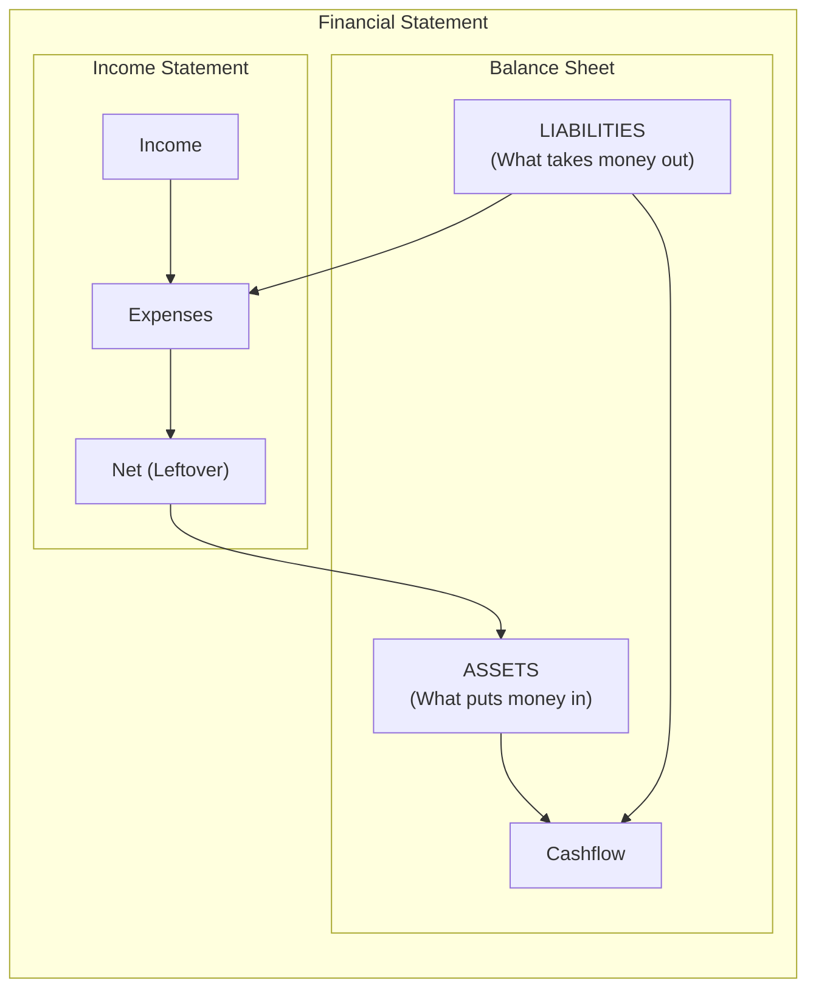

## The Central Distinction: Assets vs Liabilities

The entire book rests on a single framework. Everything else is
elaboration. Kiyosaki's definition:

> **An asset** puts money in your pocket.
> **A liability** takes money out of your pocket.

The house is the centerpiece of the argument. Kiyosaki says most people
call their home an "asset" because it appreciates. But it generates no
income and consumes cash every month (mortgage, taxes, insurance, repairs).
By his definition, it is a liability — even if you sell it for a profit
years later, because during the years you owned it, it drained your
account.

**Critics** point out this is semantic gamesmanship. A primary residence
has non-financial utility (shelter, stability, quality of life). And over
a lifetime, real estate does appreciate for most homeowners. Kiyosaki's
definition is useful as a mental model but misleading as literal advice.

---

## The Rat Race

Kiyosaki's most vivid metaphor: the endless cycle of working for money,
spending it all, and needing more.

The Rat Race is not about how much you earn. It is about how much you
spend. A raise does not solve the problem — it enables more spending.
The only escape is to build a stream of passive income that covers your
expenses, so that your labor becomes optional.

**The irony:** Kiyosaki built his own wealth primarily through book
sales, seminars, and speaking — not through real estate. His famous
real estate portfolio claims remain unverified.

---

## The Cashflow Quadrant (E-S-B-I)

Kiyosaki's most enduring framework: four ways to generate income.

| Quadrant | Description | Income Type | Tax Treatment | Freedom Level |
|----------|-------------|-------------|---------------|---------------|
| **E** (Employee) | Works for someone else | Wages, salary | Taxed first, highest rate | Low — must show up |
| **S** (Self-Employed) | Works for self — owns a job, not a business | Fees, commissions | Taxed first, self-employment tax | Medium — harder to quit |
| **B** (Business Owner) | Owns a system that works without them | Business profits | Spend pre-tax, then tax remainder | High — can leave |
| **I** (Investor) | Money works — buys assets that generate income | Dividends, rent, capital gains | Best tax treatment | Maximum — fully passive |

**Kiyosaki's thesis:** True wealth requires reaching the right side.
The E and S quadrants involve trading time for money. No matter how
much you earn as an employee or self-employed professional, there is
a ceiling — you only have 24 hours a day. The B and I quadrants are
unlimited because you leverage systems and capital.

**Criticisms of the Quadrant:**
- It ignores that most B-quadrant businesses fail (90% of startups)
- It treats employee income as inherently inferior — many wealthy people
  never left the E quadrant (e.g., top executives, hedge fund managers)
- The I quadrant requires capital to enter — the book does not adequately
  address how to get there without already having money
- It implies a moral hierarchy that is not supported by evidence

---

## The Six Lessons

### Lesson 1: The Rich Don't Work for Money

Kiyosaki tells a childhood story: "Rich Dad" offers him and his friend
Mike a job at a convenience store for 10 cents an hour. Kiyosaki is
outraged by the low pay. Rich Dad uses this to teach the first lesson:
stop working for money and instead figure out how to make money work
for you.

The key insight: when you work for a paycheck, you are trading your
most valuable asset (time) for money that someone else decides to give
you. The rich are always looking for opportunities to acquire or create
assets — they don't trade their time, they deploy their capital and
their creativity.

### Lesson 2: Why Teach Financial Literacy?

This chapter introduces the asset/liability distinction. Kiyosaki shows
financial statements side by side:

The poor dad's statement has no asset column — his income goes directly
to expenses and liabilities. The rich dad's statement generates income
from assets that pay for expenses, with the surplus reinvested into
more assets.

Kiyosaki argues that schools train people to be Employees (E quadrant)
by teaching them to work for money. Financial literacy — understanding
how money works — is never taught.

### Lesson 3: Mind Your Own Business

Keep your day job, but start building your asset column. Kiyosaki
recommends:

- **Real estate** — Rental properties that generate monthly cash flow
- **Paper assets** — Stocks, bonds, and notes
- **Businesses** — Ventures that don't require your active presence
- **Intellectual property** — Books, patents, royalties

The goal is to accumulate enough in the asset column that your passive
income exceeds your expenses. At that point, you can retire from the
Rat Race. Kiyosaki calls this "buying your freedom."

### Lesson 4: The History of Taxes and the Power of Corporations

Kiyosaki argues that the tax system is rigged. Employees are taxed at
the highest rates on their gross income, before they can spend anything.
Corporations, by contrast, earn money, spend on business expenses (pre-
tax), pay themselves bonuses and benefits (pre-tax), and only pay tax
on the remainder.

The rich structure their lives as corporations. They own assets inside
corporate entities, pay expenses pre-tax, and use legal deductions
unavailable to employees.

**Criticism:** This advice is either obvious (any CPA knows this) or
dangerous (encouraging people to form corporations to avoid taxes can
lead to IRS penalties if done incorrectly). It also ignores that most
employee benefits (employer 401k match, health insurance, Social
Security) are effectively pre-tax advantages that Kiyosaki dismisses.

### Lesson 5: The Rich Invent Money

This is the most mystical chapter. Kiyosaki argues that financial
intelligence lets you "create" money from nothing — by spotting
undervalued opportunities, structuring creative deals, and leveraging
other people's money and time.

He tells stories of finding real estate deals with no money down,
negotiating creatively, and turning small investments into large returns.
The underlying message: opportunities are everywhere, but only those
with financial education can see them.

**Criticism:** This is the chapter that has caused the most real-world
harm. "No money down" real estate strategies and "infinite returns"
have led countless followers into bad deals, over-leverage, and
bankruptcy. The deals Kiyosaki describes are, at best, unusual and, at
worst, fabricated.

### Lesson 6: Work to Learn — Don't Work for Money

Take jobs that build skills, not wealth. Kiyosaki recommends rotating
through sales, marketing, accounting, management, and leadership roles
— ideally at different companies — to build the complete skill set of an
entrepreneur.

The most valuable skill, according to Kiyosaki, is sales. The ability
to persuade, negotiate, and close deals is more valuable than any degree
or technical certification.

---

## Wealth Building Path

---

## Mindset Differences

---

## The Five Obstacles to Wealth

Kiyosaki identifies five psychological barriers:

1. **Fear** — Fear of losing money. The rich know loss is part of the
   game. Winners are not afraid of losing.
2. **Cynicism** — "It's too risky" or "That won't work." Cynicism is
   the voice of fear dressed up as wisdom.
3. **Laziness** — Not the physical kind, but mental laziness. Saying
   "I can't afford it" is a mental cop-out. Asking "How can I afford it?"
   engages the brain.
4. **Bad habits** — Pay yourself first. Before paying bills, pay your
   asset column. The discipline forces you to find ways to cover bills
   without tapping your investment capital.
5. **Arrogance** — Ego + ignorance. Arrogant people think they know
   everything and stop learning.

---

## The Financial Statement

Kiyosaki uses a simple two-column financial statement throughout the book:

The rich have assets that produce enough income to cover expenses
without working. The poor and middle class have liabilities that drain
their income, forcing them to work continuously.

---

## Chapter-by-Chapter Map

| Chapter | Title | Core Idea |
|---------|-------|-----------|
| Intro | There Is a Golden Rule | The rich teach their kids about money; the poor and middle class do not |
| 1 | The Rich Don't Work for Money | Stop trading time for money; let money work for you |
| 2 | Why Teach Financial Literacy? | Assets put money in; liabilities take money out. Know the difference |
| 3 | Mind Your Own Business | Keep your job but build your asset column simultaneously |
| 4 | The History of Taxes and the Power of Corporations | Corporate structure = better tax treatment |
| 5 | The Rich Invent Money | Financial intelligence creates wealth from nothing |
| 6 | Work to Learn — Don't Work for Money | Skills > salary. Build sales, marketing, and leadership skills |
| 7 | Overcoming Obstacles | Five barriers: fear, cynicism, laziness, bad habits, arrogance |
| 8 | Getting Started | Ten steps to begin the journey: from finding mentors to paying yourself first |
| 9 | Still Want More? | More resources and recommended actions |
| Final | The 20th Anniversary Update | Reflections on how the world has changed since 1997 |
