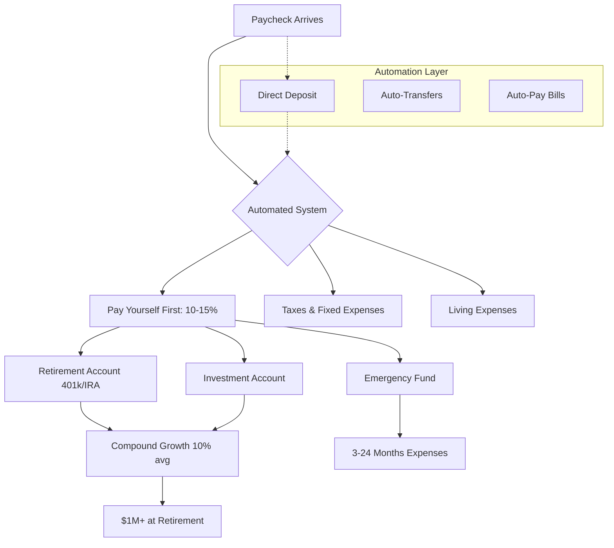
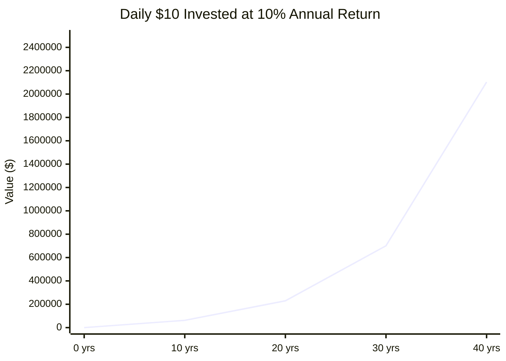
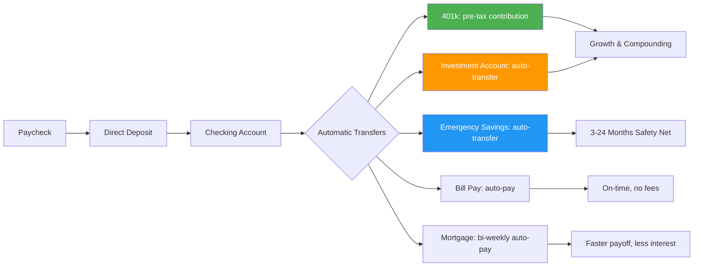
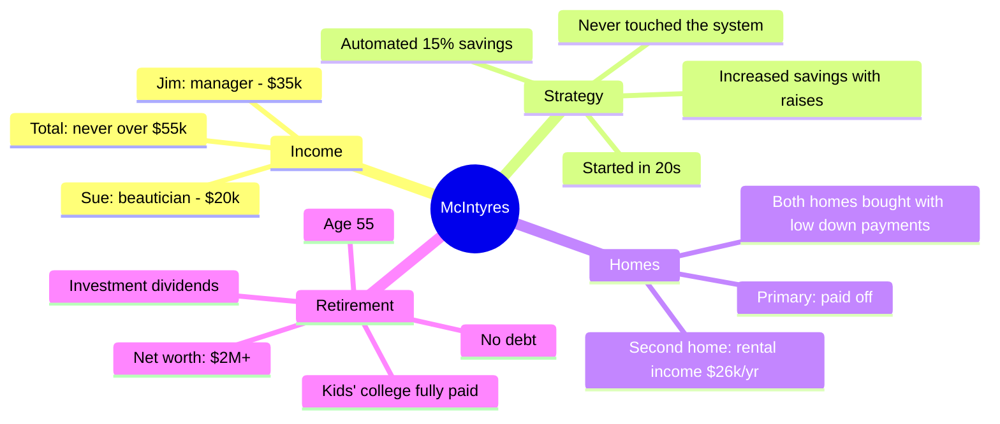
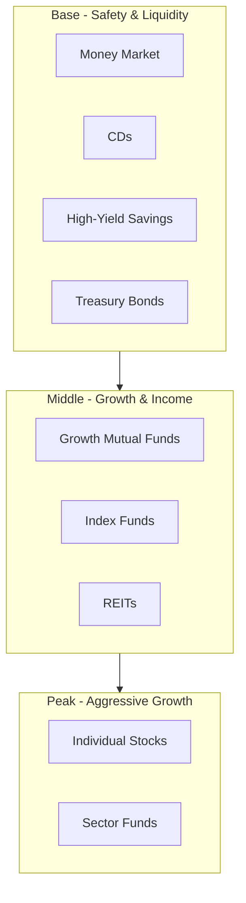
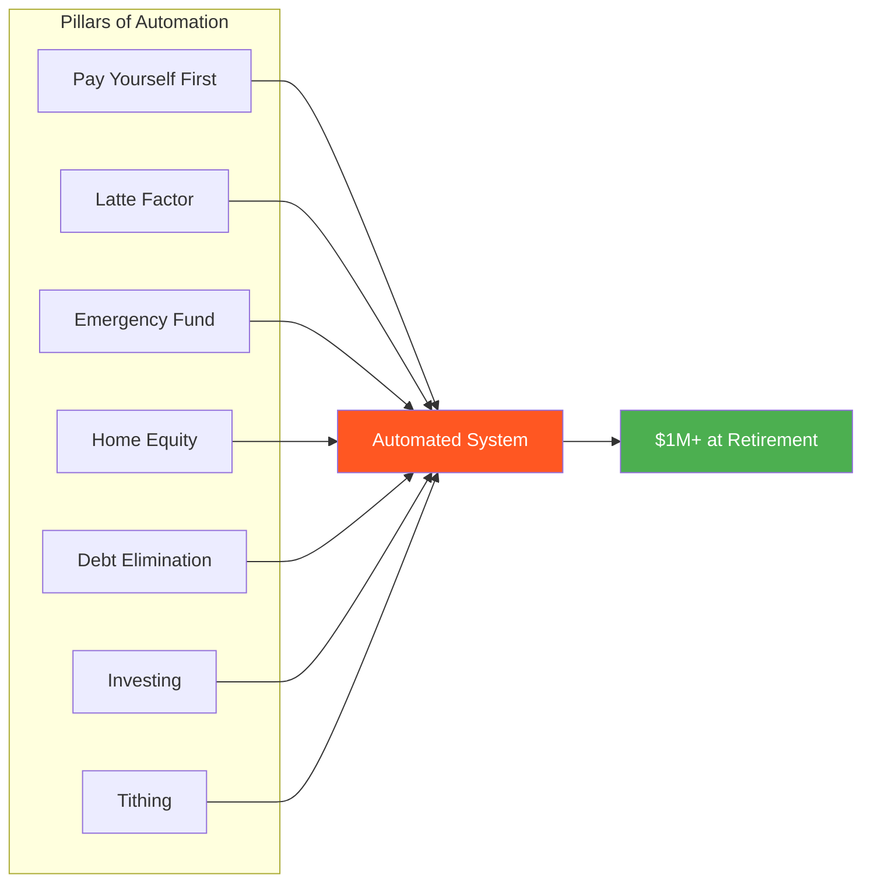

## Deep Dive: The 8-Chapter System

### The Automatic Wealth Flow

### The Latte Factor Math

Bach's central calculation: $10 per day ($3.50 latte + $7 cigarettes — or whatever your personal "lattes" are) invested at 10% annual return grows to approximately $700,000 in 30 years and over $2 million in 40 years. Even $5 per day reaches $350,000 in 30 years and $1 million in 40.

### Chapter-by-Chapter Breakdown

#### Chapter 1: Meeting the Automatic Millionaire

Bach opens with the story that frames the entire book: Jim and Sue McIntyre. He was teaching an investment class at an adult education program when the McIntyres approached him for advice — Jim wanted to retire at 52. Bach was skeptical until he reviewed their finances:

- Combined income: never above $55,000
- Jim: low-level manager at a aerospace parts company
- Sue: beautician
- Net worth at retirement: over $2 million
- Two homes: both mortgage-free
- Two children: college paid in full
- Retirement age: 55

The key lesson Bach learned from them: "How much you earn has almost no bearing on whether or not you can and will build wealth." The McIntyres' secret was a system they set up decades earlier and never touched — automatic contributions of 15% of every paycheck into retirement and investment accounts.

#### Chapter 2: The Latte Factor — Becoming an Automatic Millionaire on Just a Few Dollars a Day

Bach introduces his most famous concept. The Latte Factor is the observation that small, daily expenses — a latte here, a pack of cigarettes there, bottled water, cable channels you don't watch — drain thousands of dollars per year that could be building wealth.

The Latte Factor Challenge:
1. Track every expense for one day
2. Identify at least one "latte" — a small expense that provides little lasting value
3. Calculate the monthly and annual cost
4. Commit to redirecting that money into an automated savings plan

Bach defends the concept against critics who mock it as penny-pinching by arguing that the problem most people have is spending, not earning. The Latte Factor is not about deprivation — it is about awareness and redirection.

Key tables in this chapter:
- **Time Value of Money Chart**: Shows how $1,000 invested at age 20 grows to $56,044 by age 65 (at 10%), versus only $6,727 if you wait until 40.
- **The Latte Factor Math Chart**: Daily savings of $5 → $1.1M in 40 years; $10 → $2.1M; $15 → $3.2M.

#### Chapter 3: Learn to Pay Yourself First

Bach traces this concept to *The Richest Man in Babylon*. The principle is simple: the first person who deserves your money is you. Before paying the landlord, the credit card company, or the utility bill, set aside your savings.

He provides a formula based on your current financial status:

| Status | Savings Rate |
|--------|-------------|
| Middle Class | 5-10% |
| Upper Middle Class | 10-15% |
| Rich | 15-20% |
| Rich enough to retire early | 20%+ |

The mechanism: arrange with your employer to direct-deposit a portion of your paycheck directly into a savings or investment account. If you never see the money, you never miss it.

Bach also introduces pre-tax investing through employer 401(k) plans. By contributing pre-tax, you reduce your taxable income and let the full amount compound. He provides a comparison table showing the dramatic difference between investing $100 pre-tax vs. $70 after-tax (assuming 30% tax bracket).

#### Chapter 4: Now Make It Automatic

This is the core of the book. Bach's argument: you cannot rely on willpower because willpower is unreliable. The solution is to make your entire financial life automatic.

The system should take about an hour to set up. Once it is in place, you never need to think about it again.

#### Chapter 5: Automate for a Rainy Day

Bach emphasizes building an emergency fund before aggressively investing. His recommendation:

- **Minimum**: 3 months of living expenses
- **Ideal**: 6 months
- **Conservative**: Up to 24 months (for self-employed or irregular income)

The method: use your employer's payroll deduction system to automatically divert a portion of each paycheck into a separate savings account. Keep this account at a different bank from your checking account to reduce the temptation to dip into it.

#### Chapter 6: Automatic Debt-Free Homeownership

Bach makes a strong case for homeownership as the cornerstone of wealth building. He claims the average American homeowner is 35+ times wealthier than the average renter. His argument:

- Renting: $1,500/month for 30 years = $540,000 spent, zero equity, still paying rent
- Buying: $1,500/month mortgage = home owned free and clear after 30 years

The Automatic Homeowner System:
1. **Buy with a low down payment** — FHA loans require as little as 3-5% down
2. **Set up bi-weekly mortgage payments** — Instead of 12 monthly payments per year, make 26 half-payments (equivalent to 13 monthly payments). This shaves 7-10 years off a 30-year mortgage
3. **Accelerate automatically** — Set up automatic extra principal payments each month

Bach introduces the **DOLP (Dead On Last Payment) Chart** — a table showing exactly when your mortgage will be paid off under different acceleration scenarios.

#### Chapter 7: The Automatic Debt-Free Lifestyle

Bach tackles credit card and consumer debt. His core message: millionaires don't buy what they can't afford. He cites statistics on average American credit card debt ($8,400 per family, $500 billion total nationally).

The DOLP (Dead On Last Payment) Debt Elimination System:
1. List all debts from smallest balance to largest
2. Pay the minimum on all debts
3. Put every extra dollar toward the smallest debt
4. When the smallest is paid off, roll that payment into the next smallest (the debt snowball)
5. Continue until all debts are dead

Debt consolidation: Bach recommends 0% balance transfer offers or debt consolidation loans to reduce interest rates, but only if you commit to not running up new balances.

#### Chapter 8: Make a Difference with Automatic Tithing

The final chapter shifts from accumulation to giving. Bach argues that generosity is a hallmark of wealthy people and that automatic giving reinforces an abundance mindset.

Steps:
1. Choose a cause or organization you genuinely care about
2. Set up an automatic monthly transfer from your checking account
3. Start small (1-3% of income) and increase over time

Bach writes: "The point of becoming rich is not just to have more money — it's to use your money to make a difference."

### The McIntyre Couple: Full Financial Picture

### Bach's Investment Pyramid

Bach recommends that your asset allocation becomes more conservative as you age. Younger investors should emphasize the base and middle; older investors should shift toward the base.

### The Automatic Millionaire's Seven Pillars

