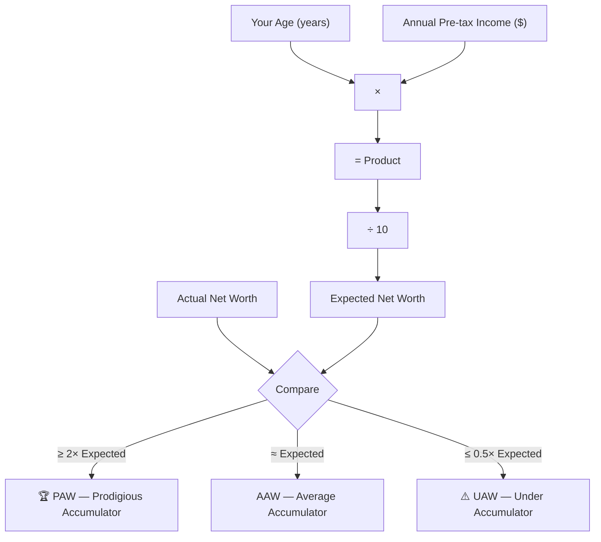
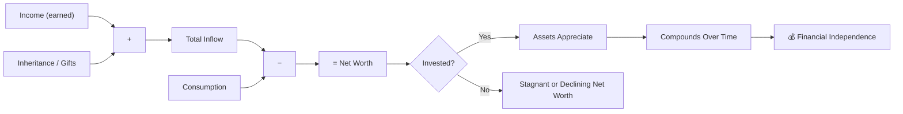
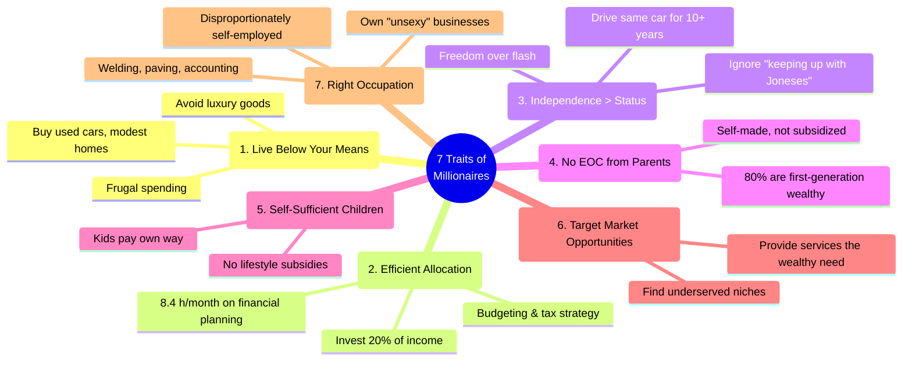
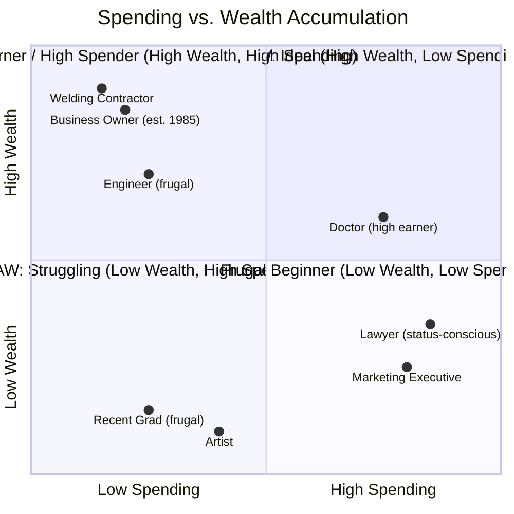

## The Wealth Equation

Stanley and Danko's central diagnostic tool is the Expected Net Worth formula.
It provides a benchmark based on age and income:

**Example:** A 45-year-old earning $120,000/year
should have an expected net worth of (45 × 120,000) ÷ 10 = **$540,000**.
If their actual net worth is $1.08M or more, they are a PAW.
If it is $270k or less, they are a UAW.

> **Important caveat:** The formula overstates expected net worth for people
> under 50 (who have had fewer earning years). The authors recommend deducting
> years spent in advanced education, military service, or disability from age
> when calculating.

---

## The Wealth Equation (Full Form)

Wealth is not what you earn. It is what you keep after spending. The book
drives home that high-income professionals (doctors, lawyers) often have lower
net worth than blue-collar business owners because their consumption rises with
income.

---

## The 7 Traits of Millionaires

### Trait 1: Live Below Your Means

This is the foundation. Stanley's millionaires are not misers — they are
deliberate. They spend on things they value (quality education, good financial
advice) and cut ruthlessly on status signals.

| Expense Category | Typical Millionaire | Average American |
|-----------------|--------------------|-----------------|
| Suit | ~$399 | ~$600+ |
| Shoes | ~$140 | ~$100+ (but more frequent) |
| Car (lifetime max) | ~$29,190 | ~$48,000+ |
| Car as % of Net Worth | < 1% | ~30% |
| Home value as % of NW | < 20% | Often > 50% |

### Trait 2: Efficient Allocation of Time & Money

PAWs spend an average of **8.4 hours per month** on financial planning —
budgeting, investment research, tax strategy. UAWs spend roughly half that.
The correlation between planning time and net worth is significant: PAWs have
6–10× the wealth of UAWs.

### Trait 3: Financial Independence Over Social Status

> "We wear nice watches. They just aren't Rolexes."

The book's millionaires consistently rank financial independence as their top
priority — above prestige, above luxury, above the admiration of neighbors.

### Trait 4: No Economic Outpatient Care

Economic Outpatient Care (EOC) refers to ongoing financial gifts from parents
to adult children. The data shows this backfires:

- Adult children who receive EOC have **57% of the net worth** of those who
  don't, despite having **98% of the income**
- 46% of affluent parents give at least $15,000/year in EOC
- Regular EOC is absorbed into the recipient's perceived income, funding a
  lifestyle they cannot independently maintain

### Trait 5: Self-Sufficient Adult Children

Children of PAWs often report they **never knew** their parents were wealthy
while growing up. Children of UAWs try to emulate their parents'
high-consumption lifestyle.

### Trait 6: Targeting Market Opportunities

The wealthy look for underserved niches. The authors found millionaires in
unexpected industries — welding contracting, pest control, auctioneering —
where competition for clients is less intense and margins are stable.

### Trait 7: Choosing the Right Occupation

Self-employed individuals represent ~20% of the US workforce but ~66% of
millionaires. Business ownership provides tax advantages, equity appreciation,
and income control that salaried jobs rarely match.

---

## Spending vs. Wealth Accumulation Matrix

The sweet spot is the top-left quadrant: **high wealth, low spending**. This is
where PAWs live. The most dangerous zone is the bottom-right: high spending
with low wealth — the classic UAW profile, regardless of income level.

---

## The Millionaire Profile (Statistical Snapshot)

Based on Stanley's surveys of millionaires (net worth $1M–$10M):

| Characteristic | Finding |
|---------------|---------|
| First-generation wealthy | ~80% |
| Self-employed | ~66% |
| Own their home | ~97% |
| Own stocks | ~95% |
| Annual realized income as % of wealth | ~8.2% |
| Annual income tax as % of wealth | ~2% |
| Debt as % of net worth | < 5% |
| Home value as % of net worth | < 20% |
| Never spent >$400 on a suit | >50% |
| Drive American-made cars | Majority (1996 data) |
| Have a written financial plan | Majority |

---

## "Big Hat, No Cattle"

The book's defining metaphor comes from Texas ranching culture. A cowboy wearing
an enormous hat but owning no cattle is all show, no substance. Applied to
wealth: people who drive luxury cars, live in mansions, and wear designer labels
are often the least wealthy. They are financing appearances with debt.

> "Many people who live in expensive homes and drive luxury cars do not actually
> have much wealth. Many people who have a great deal of wealth do not even live
> in upscale neighborhoods."

---

## The Cost of Looking Rich

The book calculates the real cost of status spending. Every dollar spent on
conspicuous consumption is a dollar that cannot compound. At an 8% average
annual return, a $50,000 luxury car costs over $500,000 in forgored wealth
over 30 years. A $1,000 watch costs over $10,000.

The message is not to never spend — it is to spend deliberately on things
that matter, and cut waste on things that only serve to impress others.
